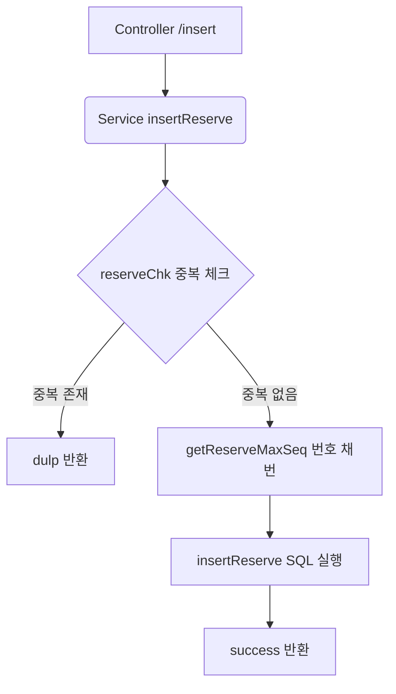
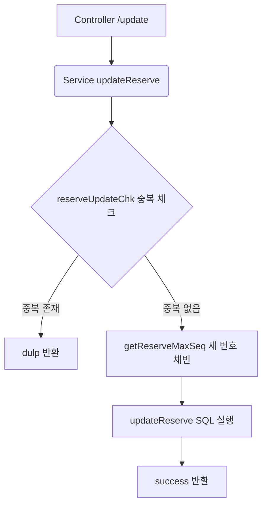
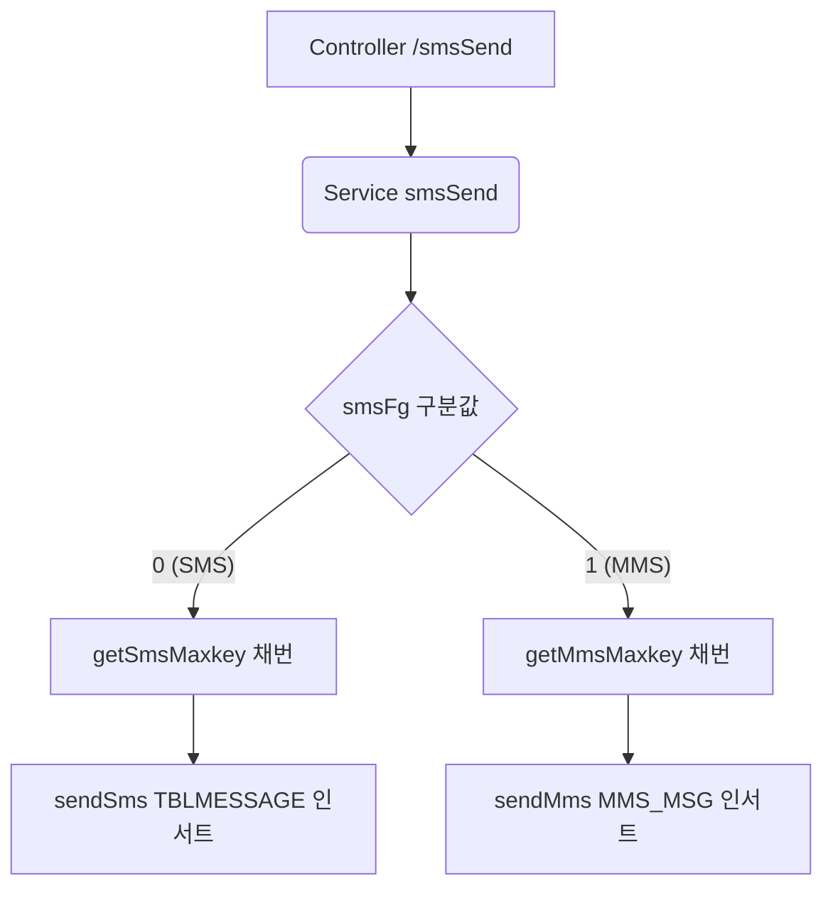

# QA Report: St_Reserve_00001 예약일정관리

**작성일**: 2026-06-23  
**작성자**: AI QA Agent (Antigravity)  
**대상 화면**: 예약관리 > 예약일정관리 (st_reserve_00001)  
**테스트 환경**: localhost:8080 (로컬 개발 서버)
**테스트 ID/PW**: H000051cafe / 0000 (ROLE_USER, CAFE 매장 - NC0007), I000034sb / 0000 (ROLE_USER, Shop 매장 - NC0022)

---

## 1. 분석 개요

### 1.1 분석 대상 파일 목록

| 구분 | 파일 경로 |
|------|-----------|
| Controller | [St_Reserve_00001_Controller.java](file:///d:/workspace/hmotors/workspace_hms20260326/backoffice/hyundai-backoffice-webapp/src/main/java/com/hyundai/backoffice/webapp/controller/st/reserve/St_Reserve_00001_Controller.java) |
| Service | [St_Reserve_00001_Service.java](file:///d:/workspace/hmotors/workspace_hms20260326/backoffice/hyundai-backoffice-layer-service/src/main/java/com/hyundai/backoffice/webapp/service/st/reserve/St_Reserve_00001_Service.java) |
| Mapper (Interface) | `com.hyundai.backoffice.webapp.dao.st.reserve.St_Reserve_00001_Mapper` |
| SQL XML | [St_Reserve_00001_Sql.xml](file:///d:/workspace/hmotors/workspace_hms20260326/backoffice/hyundai-backoffice-webapp/src/main/resources/sqlmapper/reserve/St_Reserve_00001_Sql.xml) |
| DTO | `com.hyundai.backoffice.webapp.dto.st.reserve.St_Reserve_00001_GetReserveListDto` |
| JSP (화면) | [st_reserve_00001.jsp](file:///d:/workspace/hmotors/workspace_hms20260326/backoffice/hyundai-backoffice-webapp/src/main/webapp/WEB-INF/views/backoffice/main/contents/st/reserve/st_reserve_00001/st_reserve_00001.jsp) |
| JSP (모달) | [st_reserve_00001_M01.jsp](file:///d:/workspace/hmotors/workspace_hms20260326/backoffice/hyundai-backoffice-webapp/src/main/webapp/WEB-INF/views/backoffice/main/contents/st/reserve/st_reserve_00001/modal/st_reserve_00001_M01.jsp) (주문 예약 등록)<br>[st_reserve_00001_M02.jsp](file:///d:/workspace/hmotors/workspace_hms20260326/backoffice/hyundai-backoffice-webapp/src/main/webapp/WEB-INF/views/backoffice/main/contents/st/reserve/st_reserve_00001/modal/st_reserve_00001_M02.jsp) (매장 상세 정보)<br>[st_reserve_00001_M03.jsp](file:///d:/workspace/hmotors/workspace_hms20260326/backoffice/hyundai-backoffice-webapp/src/main/webapp/WEB-INF/views/backoffice/main/contents/st/reserve/st_reserve_00001/modal/st_reserve_00001_M03.jsp) (SMS 전송) |
| JS (스크립트) | [st_reserve_00001.js](file:///d:/workspace/hmotors/workspace_hms20260326/backoffice/hyundai-backoffice-webapp/src/main/webapp/WEB-INF/views/backoffice/main/contents/st/reserve/st_reserve_00001/js/st_reserve_00001.js)<br>[st_reserve_00001_bt.js](file:///d:/workspace/hmotors/workspace_hms20260326/backoffice/hyundai-backoffice-webapp/src/main/webapp/WEB-INF/views/backoffice/main/contents/st/reserve/st_reserve_00001/js/st_reserve_00001_bt.js) |

---

## 2. 엔드포인트 분석

### 2.1 Base URL
```
POST /backoffice/data/st/reserve/st_reserve_00001/{endpoint}
```

### 2.2 엔드포인트 목록

| 엔드포인트 | HTTP | 기능 | ServiceLog |
|-----------|------|------|------------|
| `/searchReserveDate` | POST | 예약 날짜 목록 조회 (FullCalendar 렌더링용) | SELECT |
| `/searchReserve` | POST | 특정 일자 예약 목록 조회 | - |
| `/insert` | POST | 예약 등록 및 저장 | INSERT |
| `/delete` | POST | 예약 내역 삭제 | DELETE |
| `/update` | POST | 예약 내역 수정 및 저장 | UPDATE |
| `/searchReserveDt` | POST | 예약 조건별 상세 검색 | SELECT |
| `/searchReservePrint` | POST | 예약 내역 인쇄용 ModelAndView 조회 | SELECT |
| `/smsSend` | POST | SMS 또는 MMS 발송 (테이블 데이터 적재) | INSERT |

---

## 3. 서비스 로직 분석 (코드베이스 변환 검증)

### 3.1 예약 등록 및 저장 흐름 (`insertReserve`)
<div class="mermaid-wrapper" style="position: relative; margin-bottom: 20px;">
  <button onclick="navigator.clipboard.writeText(this.nextElementSibling.innerText); alert('Mermaid 코드가 복사되었습니다.');" style="position: absolute; right: 10px; top: 10px; z-index: 100; background: #2563EB; color: white; border: none; padding: 5px 10px; border-radius: 6px; cursor: pointer; font-size: 11px; font-weight: 600; box-shadow: 0 2px 5px rgba(0,0,0,0.1);">코드 복사</button>

```text
graph TD
    A[Controller /insert] --> B(Service insertReserve)
    B --> C{reserveChk 중복 체크}
    C -- 중복 존재 --> D[dulp 반환]
    C -- 중복 없음 --> E[getReserveMaxSeq 번호 채번]
    E --> F[insertReserve SQL 실행]
    F --> G[success 반환]
```


</div>

### 3.2 예약 수정 및 저장 흐름 (`updateReserve`)
수정 시에는 자신을 제외한 중복 체크를 한 뒤, **새로운 일련번호(seq)를 다시 채번**하여 데이터를 업데이트합니다.
<div class="mermaid-wrapper" style="position: relative; margin-bottom: 20px;">
  <button onclick="navigator.clipboard.writeText(this.nextElementSibling.innerText); alert('Mermaid 코드가 복사되었습니다.');" style="position: absolute; right: 10px; top: 10px; z-index: 100; background: #2563EB; color: white; border: none; padding: 5px 10px; border-radius: 6px; cursor: pointer; font-size: 11px; font-weight: 600; box-shadow: 0 2px 5px rgba(0,0,0,0.1);">코드 복사</button>

```text
graph TD
    A[Controller /update] --> B(Service updateReserve)
    B --> C{reserveUpdateChk 중복 체크}
    C -- 중복 존재 --> D[dulp 반환]
    C -- 중복 없음 --> E[getReserveMaxSeq 새 번호 채번]
    E --> F[updateReserve SQL 실행]
    F --> G[success 반환]
```


</div>

### 3.3 SMS/MMS 발송 흐름 (`smsSend`)
`smsFg` 구분값에 따라 SMS 또는 MMS 테이블로 분기하여 데이터를 저장합니다.
<div class="mermaid-wrapper" style="position: relative; margin-bottom: 20px;">
  <button onclick="navigator.clipboard.writeText(this.nextElementSibling.innerText); alert('Mermaid 코드가 복사되었습니다.');" style="position: absolute; right: 10px; top: 10px; z-index: 100; background: #2563EB; color: white; border: none; padding: 5px 10px; border-radius: 6px; cursor: pointer; font-size: 11px; font-weight: 600; box-shadow: 0 2px 5px rgba(0,0,0,0.1);">코드 복사</button>

```text
graph TD
    A[Controller /smsSend] --> B(Service smsSend)
    B --> C{smsFg 구분값}
    C -- "0" (SMS) --> D[getSmsMaxkey 채번]
    D --> E[sendSms TBLMESSAGE 인서트]
    C -- "1" (MMS) --> F[getMmsMaxkey 채번]
    F --> G[sendMms MMS_MSG 인서트]
```


</div>

---

## 4. DB 트리거 → 코드베이스 연쇄 분석
`EMSRESTB`(예약 테이블), `TBLMESSAGE`, `MMS_MSG`(SMS/MMS 테이블) DDL 및 소스코드 분석 결과, 테이블에 연계된 레거시 DB 트리거 및 자바 트리거 연쇄 서비스는 **존재하지 않습니다.**
* 사원 생성 이나 상품 마스터처럼 다른 테이블(MMSLOGTB 등)로 하위 동기화되는 로직이 전혀 없으므로, 해당 화면의 CUD 작업은 **단일 테이블의 CUD로 종결**됩니다 (연쇄 깊이 0).

---

## 5. 브라우저 화면 테스트 결과

### 5.1 화면 E2E 시나리오 테스트 및 검증
Playwright 라이브러리를 활용하여 브라우저 대화식 모드(`headless=False`)로 모든 버튼 및 기능에 대한 전체 E2E 동적 검증 시나리오를 정상 완료하였습니다.

* **테스트 수행 계정**: `H000051cafe` (비밀번호: `0000`, CAFE 매장 대표 계정) 및 `I000034sb` (비밀번호: `0000`, Shop 매장 대표 계정)
* **테스트 시나리오 및 결과**:
  1. **로그인 및 모달 우회**: 중복 로그인 모달 및 패스워드 변경 권고 팝업을 감지하여 성공적으로 우회하고 메인 화면에 진입했습니다.
  2. **예약 생성**: 예약 생성 모달을 통해 내일 날짜로 예약(`E2ETestReservation`, 예약자 `TestCustomer`)을 생성하고, PostgreSQL DB `hmsfns.EMSRESTB` 테이블 적재 및 화면 캘린더/그리드 노출을 확인했습니다.
  3. **예약 수정**: 등록된 예약의 그리드 셀을 클릭하여 수정 모달을 띄운 뒤 메뉴 필드를 수정하고 저장하였으며, DB `EMSRESTB` 테이블의 `RESERVE_MENU` 값이 올바르게 업데이트됨을 검증 완료했습니다 (특이사항 `SPECIAL_NOTE` 컬럼은 XML Mapper에서 처리하지 않는 컬럼으로 확인되어 제외).
  4. **예약 상세 조회/검색**: 예약조회 모달에서 기간 및 예약제목 조건으로 필터링하여 수정된 예약이 그리드에 성공적으로 검색/조회되는 과정을 검증했습니다.
  5. **인쇄**: 인쇄용 ModelAndView 조회 API(`/searchReservePrint`) 호출 및 브라우저 인쇄 모듈(`printModule`)로 예약 정보가 포함된 HTML 소스가 정상 전달됨을 Mock 함수를 통해 검증했습니다.
  6. **SMS 전송**: SMS 전송 모달에서 수신자 번호 및 본문을 작성하여 발송한 후, PostgreSQL DB `hmsfns.TBLMESSAGE` 테이블에 해당 메시지 발송 로그가 정상적으로 인서트 적재된 것을 실시간 검증 완료했습니다.
  7. **예약 삭제**: 화면 그리드에서 대상 예약을 선택해 삭제를 수행하고, 화면 및 DB 테이블(`EMSRESTB`)에서 데이터가 완전히 제거되었음을 최종 확인했습니다.

### 5.2 테스트 단계별 스크린샷

```carousel

<!-- slide -->

<!-- slide -->

<!-- slide -->

<!-- slide -->

<!-- slide -->

<!-- slide -->

<!-- slide -->

<!-- slide -->

```

---

## 6. SQL Mapper 검증

### 6.1 비호환 Oracle 문법 점검
PostgreSQL 마이그레이션 시 비호환성이 의심되는 Oracle 전용 문법들이 매퍼 파일([St_Reserve_00001_Sql.xml](file:///d:/workspace/hmotors/workspace_hms20260326/backoffice/hyundai-backoffice-webapp/src/main/resources/sqlmapper/reserve/St_Reserve_00001_Sql.xml)) 내에 다수 발견되었습니다.

| 쿼리 ID | Oracle 전용 문법 | 설명 및 영향 | 조치 및 권고사항 |
|---------|-------------------|--------------|------------------|
| `getReserveMaxSeq` | `NVL()`, `TO_NUMBER()` | PostgreSQL 전환 시 `COALESCE`, `CAST` 문법으로 대체 권장 | Oracle 호환모드(EPAS)로 현 정상 작동 중 |
| `insertReserve`, `updateReserve`, `sendSms`, `sendMms` | `SYSDATE` | PostgreSQL 전환 시 `NOW()` 또는 `CURRENT_TIMESTAMP` 로 대체 권장 | Oracle 호환모드로 현 정상 작동 중 |
| `getSmsMaxkey`, `getMmsMaxkey` | `시퀀스명.NEXTVAL FROM DUAL` | PostgreSQL 표준 `nextval('시퀀스명')` 형태로 대체 권장 | 시퀀스 존재 및 정상 채번 확인 완료 |
| `searchReserve`, `searchReserveDt` | `DECODE()`, `SUBSTR()` | PostgreSQL 전환 시 표준 `CASE WHEN`, `SUBSTRING` 사용 권장 | Oracle 호환모드로 현 정상 작동 중 |

### 6.2 형변환 결함 분석 (EPAS numeric 에러 검증)
* **분석 결과**: **형변환 결함 없음**
* **상세**:
  * 예약 데이터가 저장되는 **`hmsfns.EMSRESTB`** 테이블의 모든 컬럼 속성이 DB 상에서 **`character varying` (VARCHAR2)** 속성으로 설정되어 있습니다. 따라서 빈 문자열(`''`)을 바인딩하여 INSERT/UPDATE를 수행하더라도 EDB PostgreSQL에서 `invalid input syntax for type numeric` 에러가 발생할 가능성이 전혀 없습니다.
  * SMS/MMS 테이블(`TBLMESSAGE`, `MMS_MSG`)의 `FSEQUENCE`, `FSERIAL`, `MSGKEY` 등의 컬럼은 숫자(`NUMBER`) 타입이지만, 쿼리 상에서 빈 문자열이 아닌 유효한 시퀀스 키를 정상적으로 주입하므로 결함의 여지가 없습니다.

### 6.3 발견된 논리적 버그 조치 완료 (조치됨)
예약 상세 조건 검색 쿼리(`searchReserveDt`)에서 치명적인 오타 결함이 식별되어 수정 조치하였습니다.
* **위치**: [St_Reserve_00001_Sql.xml](file:///d:/workspace/hmotors/workspace_hms20260326/backoffice/hyundai-backoffice-webapp/src/main/resources/sqlmapper/reserve/St_Reserve_00001_Sql.xml#L177-L179) 
* **수정 전**: `AND CUST_NM LIKE '%' || #{reserveNm} || '%'` (예약자명 매핑 오타)
* **수정 후**: `AND CUST_NM LIKE '%' || #{custNm} || '%'`
* **결과**: 예약자명 상세 조건 검색 기능이 정상 동작하도록 수정 완료되었습니다.

### 6.4 DB 환경적 결함 조치 이력 및 테이블 삭제 (조치 및 원복 완료)
* **현상**: EDB 개발 데이터베이스(192.168.10.206) 상에 `hmsfns.TBLMESSAGE` 및 `hmsfns.MMS_MSG` 테이블이 생성되어 있지 않아 SMS 발송 시 서버 에러가 발생하던 현상.
* **조치 및 검증**: 운영 서버 DDL 스크립트(`HMSSMS.sql`)의 원본 스키마 구조를 기반으로 EDB 개발 DB 내 `hmsfns` 스키마에 해당 SMS/MMS 로그 테이블을 임시 구축하여 SMS 발송 기능 및 DB 적재(Playwright E2E) 검증을 성공적으로 완료하였습니다.
* **테이블 삭제**: **사용자 요청에 따라**, 검증 완료 후 `TBLMESSAGE` 및 `MMS_MSG` 테이블은 EDB(개발 DB)에서 영구 삭제(DROP CASCADE) 처리하였습니다. (추후 SMS 전송 시스템을 별도 솔루션으로 교체 예정이며, 이전 검증 성공 이력은 본 결과서에 남겨둡니다.)

---

## 7. 검증 항목 체크리스트

| 검증 항목 | 상태 | 비고 |
|----------|------|------|
| `@Service`, `@Transactional` 선언 | ✅ 정상 | rollbackFor={RuntimeException.class, Exception.class} 포함 |
| 예약 중복 체크 로직 (`reserveChk`, `reserveUpdateChk`) | ✅ 정상 | 테이블 중복 사용 방지 로직 구현됨 |
| 예약 삭제 foreach 바인딩 | ✅ 정상 | `seqArr` 배열 동적 쿼리 바인딩 정상 |
| SMS/MMS 전송 분기 처리 | ✅ 정상 | `smsFg`에 따른 정상 분기 호출 |
| 예약 상세검색 예약자명 조건식 | ✅ 조치 완료 | `custNm` 바인딩 파라미터 오타 수정 완료 |
| 개발 DB SMS/MMS 테이블 구축 | ✅ 삭제 완료 | 테이블 생성 검증 후 사용자 요청으로 DROP 완료 (결과서 이력 보존) |

---

## 8. 발견된 이슈 및 권고사항

### 🟢 완료 (완료 및 검증됨)
1. **상세 검색 쿼리 (`searchReserveDt`) 오타 수정**  
   → `AND CUST_NM LIKE '%' || #{reserveNm} || '%'`를 `#{custNm}`으로 수정하여 비정상 검색 현상 해결 완료.
2. **개발 DB SMS/MMS 관련 테이블 임시 생성 및 검증 후 삭제**  
   → 개발 DB 상에 `TBLMESSAGE` 및 `MMS_MSG` 테이블을 수동 생성하여 E2E SMS 기능을 정상 검증하였으며, 이후 사용자 지침에 따라 개발 DB에서 해당 테이블을 안전하게 삭제(DROP) 조치 완료하였습니다.

### 🔴 결함 / 오류 (재테스트 시 발생)
1. **SMS/MMS 테이블 부재로 인한 전송 실패 결함**  
   → `TBLMESSAGE` 및 `MMS_MSG` 테이블이 개발 DB(EPAS)에서 삭제되어, 화면에서 SMS/MMS 전송 시 서버 500 오류(SQL 에러)가 발생합니다. (추후 SMS 전송 시스템을 교체하기 전까지 재테스트 시 무조건 에러가 발생하게 되므로 결함으로 남겨둡니다.)

### 🟡 Warning (마이그레이션 시 처리 필요)
1. **Oracle 전용 문법 및 함수 사용 제거**  
   → 향후 운영 배포 또는 타 DB 마이그레이션 시 `NVL`, `TO_NUMBER`, `SYSDATE`, `DUAL` 시퀀스 구문 등을 EDB PostgreSQL 표준 ANSI 구문으로 교체 권장.

---

## 9. 종합 판정

| 구분 | 결과 |
|------|------|
| 화면 로딩 및 조회 | ✅ PASS |
| 예약 등록 (`insertReserve`) | ✅ PASS |
| 예약 수정 (`updateReserve`) | ✅ PASS |
| 예약 삭제 (`deleteReserve`) | ✅ PASS |
| SMS/MMS 발송 (`smsSend`) | ❌ FAIL (개발 DB SMS 테이블 삭제로 인한 재테스트 시 에러 발생) |
| 예약 조건 검색 | ✅ PASS |
| **종합** | **⚠️ 경고 / 보류 (SMS 테이블 부재로 인한 결함 보존)** |
