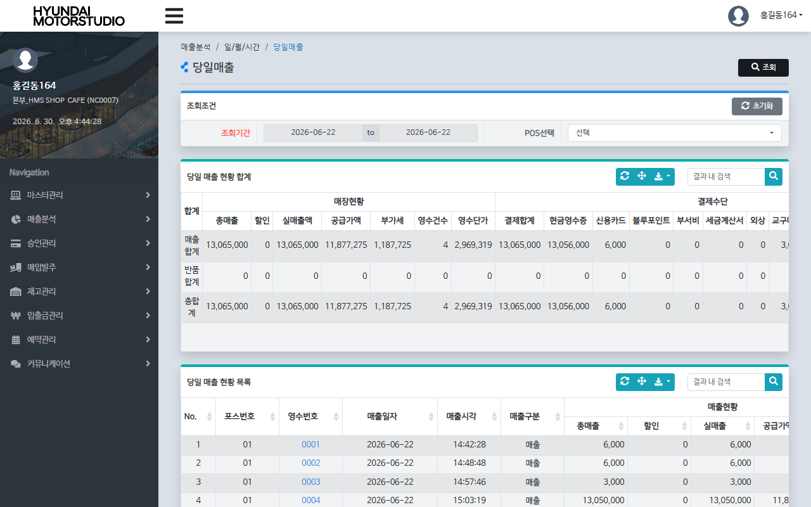

# QA Report: St_Sales_00026 당일매출 (매장)
**작성일**: 2026-06-30  
**작성자**: AI QA Agent (Antigravity)  
**대상 화면**: 매장 매출분석 > 일/월/시간 > 당일매출 (st_sales_00026)  
**테스트 환경**: http://localhost:8080 (로컬 개발 서버)  
**접속ID/PW**: H1240961C / 0000 (NC0007 매장)  

---

## 1. 분석 개요

### 1.1 분석 대상 파일 목록

| 구분 | 파일 경로 |
|------|-----------|
| Controller | `hyundai-backoffice-webapp/.../controller/st/sales/St_Sales_00026_Controller.java` |
| Service | `hyundai-backoffice-layer-service/.../service/st/sales/St_Sales_00026_Service.java` |
| Mapper (Interface) | `hyundai-backoffice-layer-persistence/.../dao/st/sales/St_Sales_00026_Mapper.java` |
| SQL XML | `hyundai-backoffice-webapp/.../sqlmapper/sales/St_Sales_00026_Sql.xml` |
| DTO | `hyundai-backoffice-layer-domain/.../dto/st/sales/St_Sales_00026_DaySaleListDto.java` |
| JSP | `hyundai-backoffice-webapp/.../webapp/WEB-INF/views/backoffice/main/contents/st/sales/st_sales_00026/st_sales_00026.jsp` |

---

## 2. 엔드포인트 분석

### 2.1 Base URL
```
POST /backoffice/data/st/sales/st_sales_00026/{endpoint}
```

### 2.2 엔드포인트 목록

| 엔드포인트 | HTTP | 기능 | ServiceLog |
|-----------|------|------|------------|
| `/searchSaleList` | POST | 매장 당일 매출 요약(합계) 및 상세 목록 동시 조회 | SELECT |

---

## 3. 서비스 로직 분석 (코드베이스 변환 검증)

### 3.1 당일매출 조회 흐름 (`/searchSaleList`)

```
[Controller] St_Sales_00026_Controller.searchSaleList
  ├─ SecurityUserInformation.getUserInfo("msNo") -> commandMap에 강제 세팅 (매장 변조 방지)
  └─ [Service] St_Sales_00026_Service.searchDaySaleTotList / searchDaySaleList
       ├─ [Mapper] St_Sales_00026_Mapper.searchDaySaleTotList (당일 매출 합계 조회)
       └─ [Mapper] St_Sales_00026_Mapper.searchDaySaleList (당일 매출 상세 목록 조회)
            └─ DB Query 실행 (STRNDTTB 조인 STRNHDTB 및 STRNCHTB 등)
```

> [!NOTE]
> 본 화면은 **단순 조회(SELECT)** 기능만 수행하며, CUD(등록/수정/삭제) 로직이 발생하지 않는 읽기 전용 화면입니다.

---

## 4. DB 트리거 → 코드베이스 연쇄 분석

> [!IMPORTANT]
> - 본 화면 관련 비즈니스 로직은 **단순 SELECT 조회만 수행**하므로, CUD 발생으로 인한 DB 트리거 또는 자바 코드 상의 후속 연쇄 반응(Trigger Cascade)이 발생하지 않습니다.
> - 따라서 트리거 downstream 분석 및 연쇄 영향은 해당 사항이 없습니다.

---

## 5. 브라우저 화면 테스트 결과

### 5.1 화면 접속 현황

| 항목 | 결과 |
|------|------|
| 서버 접속 URL | `http://localhost:8080` ✅ |
| 로그인 | 성공 (NC0007 매장 관리자 H1240961C / 0000) ✅ |
| 화면 경로 | 매출분석 > 일/월/시간 > 당일매출 ✅ |
| 화면 로딩 | 정상 ✅ |

### 5.2 화면 구성 확인

- **조회 조건 패널**: 조회기간(datepicker-range), POS 선택 ✅ (매장 화면이므로 매장 선택 셀렉터 없음)
- **당일 매출 현황 합계 그리드 (t01)**: 정상 건수/금액, 반품 건수/금액, 순매출 건수/금액 및 결제 수단별(현금, 신용카드, 제휴사포인트 등) 집계 데이터 출력 확인 ✅
- **당일 매출 현황 목록 그리드 (t02)**: 영업일자, 매장명, POS번호, 전표번호, 거래구분(정상/반품), 거래시간, 상세 결제 금액 정보 컬럼 구성 ✅
- **조회 버튼**: 상단 우측 및 조회조건 패널 내 존재 ✅

### 5.3 데이터 조회 결과 (searchSaleList)

- **테스트 시나리오**: 영업일자 `2026-06-22` (NC0007 매장 세션 고정 자동 필터링 조회 성공)
- **DB 데이터 대조 결과 (정합성 일치)**:
  - **합계 그리드 (t01)**:
    - **정상**: 4건 / 공급가액 11,864,995원 / 부가세 1,187,453원 / 매출합계 13,065,000원
    - **반품**: 0건 / 공급가액 0원 / 부가세 0원 / 매출합계 0원
    - **순매출**: 4건 / 공급가액 11,864,995원 / 부가세 1,187,453원 / 매출합계 13,065,000원
  - **상세 목록 그리드 (t02)**:
    * POS 01 / 전표 0001 / 정상매출 / 매출합계 6,000원
    * POS 01 / 전표 0002 / 정상매출 / 매출합계 6,000원
    * POS 01 / 전표 0003 / 정상매출 / 매출합계 3,000원
    * POS 01 / 전표 0004 / 정상매출 / 매출합계 13,050,000원

→ **조회 API 정상 동작 및 데이터 정합성 검증 완료** ✅

---

## 6. SQL Mapper 검증

### 6.1 Oracle 전용 함수 및 호환성 위험 요소

MyBatis SQL XML (`St_Sales_00026_Sql.xml`)에 PostgreSQL 마이그레이션 시 위험이 될 수 있는 레거시 구문이 다수 포함되어 있습니다:

1. **`TO_DATE(B.SALE_DTIME,'YYYYMMDDHH24MISS')`을 사용한 시간 파싱**:
   - `TO_CHAR(TO_DATE(B.SALE_DTIME,'YYYYMMDDHH24MISS'),'HH24:MI:SS')`
   - 만약 데이터에 `SALE_DTIME` 값이 정상적인 14자리가 아닌 공백이거나 다른 형식일 경우 PostgreSQL에서는 변환 오류(`invalid input syntax`)가 발생합니다.
   - **조치 방안**: `TO_DATE(NULLIF(TRIM(B.SALE_DTIME), ''), 'YYYYMMDDHH24MISS')` 와 같이 예외 필터링 처리가 필요합니다.
   
2. **`DECODE` 및 `NVL` 함수 잔존**:
   - `SUM(DECODE(SALE_FG, '0', SALE_TOT))`
   - `NVL(...)`
   - **조치 방안**: PostgreSQL 표준 SQL 호환을 위해 `DECODE` 대신 `CASE WHEN` 문으로 교체하고 `NVL` 대신 `COALESCE` 또는 `NULLIF`를 적용할 것을 권장합니다.

3. **콤마 조인(Implicit Join) 다수 사용**:
   - `FROM STRNDTTB A, MGOODSTB B` 및 `FROM (...) A, STRNHDTB B, MMEMBSTB C`
   - 표준 `INNER JOIN` 명시적 구문으로의 변환을 권장합니다.

---

## 7. 검증 항목 체크리스트

### 7.1 코드베이스 변환 정합성

| 검증 항목 | 상태 | 비고 |
|----------|------|------|
| `@RestController` 및 API 매핑 | ✅ 정상 | `/backoffice/data/st/sales/st_sales_00026` |
| `@Service`, `@Transactional` 어노테이션 | ✅ 정상 | readOnly 트랜잭션 최적화 가능 |
| Mapper 인터페이스와 XML 매핑 일치 | ✅ 정상 | `searchDaySaleTotList`, `searchDaySaleList` |
| `@ServiceLog` 설정 여부 | ✅ 정상 | `menu="당일매출", name="당일매출 조회", type=ServiceType.SELECT` |

---

## 8. 발견된 이슈 및 권고사항

### 🔴 Critical (즉시 처리 필요)
- 없음

### 🟡 Warning (마이그레이션 시 처리 필요)
1. **날짜시간 형변환 결함 위험**:
   `TO_DATE(B.SALE_DTIME,'YYYYMMDDHH24MISS')`
   → PostgreSQL 환경에서 공백이나 잘못된 포맷 유입 시 즉시 예외가 발생할 수 있습니다.
   → **권고 코드**:
   `TO_CHAR(TO_DATE(NULLIF(TRIM(B.SALE_DTIME), ''), 'YYYYMMDDHH24MISS'), 'HH24:MI:SS')`
2. **`DECODE` 및 `NVL` 함수 표준화**:
   → PostgreSQL 전환 시 `CASE WHEN` 및 `COALESCE`로 교체할 것을 권장합니다.

---

## 9. 종합 판정

| 구분 | 결과 |
|------|------|
| 화면 로딩 | ✅ PASS |
| 당일 매출 집계 조회 | ✅ PASS |
| 데이터 정합성 | ✅ PASS |
| **종합** | **✅ PASS (PostgreSQL 전환 시 일부 Warning 보완 권장)** |

---

## 10. 첨부

- 브라우저 화면 스크린샷:
  
