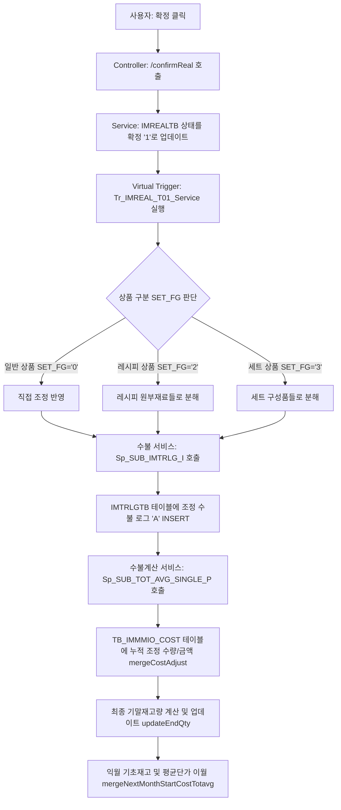

# 매장 재고조정등록 (`st_stock_00001`) 데이터 입력 및 처리 가이드

본 문서는 매장 재고 조정 등록 화면(`st_stock_00001`)에서 발생하는 재고 입력 값의 연산 방식, 화면 사용법, 백엔드 데이터 흐름(Data Flow), 자바 트리거의 연쇄 반응, 관련 데이터베이스 테이블 명세 및 야간 배치의 반영/정리 라이프사이클을 상세히 정리한 가이드라인입니다.

---

## 1. 매장 재고 조정등록 (`st_stock_00001`) UI 가이드

매장 권한(예: 가맹점 매니저 계정 `fnbcafe` / 비밀번호 `0000`)으로 로그인하여 직접 재고 조정 데이터를 입력하고 확정하는 화면입니다.

### 📌 데이터 등록 및 확정 프로세스

1. **로그인 및 화면 이동**
   * 가맹점 매니저 계정(`fnbcafe` / `0000`)으로 로그인합니다.
   * 메뉴 경로: **재고관리 > 조정/폐기/실사 > 조정등록 (`st_stock_00001`)**으로 이동합니다.
   * 조정일자(기본값: 오늘)를 확인하고 **[조회]**를 클릭하여 현재 등록된 조정 목록을 확인합니다.

2. **신규 조정 대상 상품 추가 (모달 팝업)**
   * 화면 상단의 **[등록]** 버튼을 클릭하여 `조정등록` 모달 팝업을 기동합니다.
   * 모달 팝업에서 **조정일자**를 선택하고, 상품 분류 혹은 상품코드/명으로 조정할 대상을 검색합니다.
     > [!TIP]
     > 모달 팝업을 처음 열었을 때는 지연 로딩(`deferUrl`)이 적용되어 있으므로, 팝업 우측 상단의 **[조회]** 버튼을 클릭해야 상품 목록이 노출됩니다.
   * 조정하고자 하는 상품의 체크박스를 선택한 후 하단의 **[선택]** 버튼을 클릭하여 메인 그리드에 추가합니다.

3. **수량 및 사유 입력 (그리드 편집)**
   * 메인 그리드에 추가된 상품들의 **'주문 단위 수량'**(그리드 텍스트 박스)을 입력합니다.
     * 사용자가 수량을 입력(onkeyup/onkeypress 이벤트 작동)하면 자바스크립트 `fn_cal()` 함수를 통해 **'조정 총 수량'**과 **'원가'**가 자동으로 연산되어 그리드에 실시간 표시됩니다.
   * 각 상품행의 **'조정사유'** 드롭다운을 클릭하여 조정 사유를 개별 지정하거나, 상단의 사유 선택 콤보박스 선택 후 **[사유일괄적용]**을 클릭해 일괄 지정합니다.
   * 필요한 경우 비고 텍스트 박스에 상세 내역을 기입합니다.

4. **조정 데이터 저장 (임시 저장)**
   * 저장하려는 상품들의 체크박스를 선택한 후 화면 상단의 **[저장]** 버튼을 클릭합니다.
   * 저장 시 오늘 이전의 과거 날짜로 조정일자가 설정되어 있으면 에러창("날짜를 오늘 혹은 이후 날짜로 설정해주시기 바랍니다.")이 표시되며 저장이 제한됩니다.
   * 정상적으로 저장되면 데이터베이스 `hmsfns.IMREALTB` 테이블에 행이 인서트/업데이트 되며, 처리 구분 필드(`PROC_FG`)는 **`'0'` (미확정)** 상태가 됩니다.

5. **조정 확정**
   * 확정하려는 임시 저장 상품들을 그리드에서 선택한 후 화면 상단의 **[확정]** 버튼을 클릭합니다.
     > [!WARNING]
     > 선택한 상품 중 '주문 단위 수량'이 `0`인 상품이 포함되어 있다면 "주문 단위 수량에 0이 포함되어 있습니다. 제외 혹은 저장 후에 확정해주시기 바랍니다." 알림이 뜨며 확정이 제한됩니다.
   * 확정이 완료되면 `IMREALTB` 테이블의 해당 상품 상태값 `PROC_FG`가 **`'1'` (확정)**로 업데이트되며, 백엔드 자바 가상 트리거를 통한 수불 반영이 시작됩니다.

---

## 2. 조정등록 팝업 모달 상품 조회 대상 조건

조정등록 모달 팝업(`st_stock_00001` 모달)에서 **[조회]** 버튼을 클릭했을 때 상품 목록에 나타나기 위해 만족해야 하는 데이터베이스상 조건입니다. (`St_Stock_00001_Sql.xml` 내 `getAddGoodsList` 쿼리 참조)

* **매장 상품 매핑 필수 (`GD.MS_NO = #{msNo}`)**
  * 매장별 활성화 상품 정보 테이블(`hmsfns.MGOODSTB`)에 해당 매장 코드(`msNo`)로 상품이 매핑되어 등록되어 있어야 합니다.
* **현재 재고 보유 여부와 무관 (Outer Join)**
  * 가맹점 현재고 테이블(`hmsfns.IMCRIOTB`)과 아우터 조인(`(+)`)되어 있어, **재고가 없거나(현재고 0개) 해당 가맹점의 재고 데이터가 생성되지 않은 상품**도 정상적으로 조회 및 선택이 가능합니다. (재고가 없는 경우 현재고는 0으로 나타납니다.)
* **그리드 자동 단위 분해**
  * 조회 시 상품의 입수량(`GD.IN_QTY`) 정보를 기반으로 현재고를 박스 수량(`BOX_QTY`)과 낱개 수량(`EA_QTY`)으로 나누어 반환합니다.
    * 입수량이 `1`인 경우: `BOX_QTY = 0`, `EA_QTY = CUR_QTY`
    * 입수량이 `1`보다 큰 경우: `BOX_QTY = TRUNC(CUR_QTY / IN_QTY)`, `EA_QTY = CUR_QTY - (BOX_QTY * IN_QTY)`

---

## 3. 조정 저장/확정 시 상세 연산 및 데이터 흐름

조정 전표를 저장 및 확정할 때 화면과 데이터베이스에서 일어나는 상세 연산 공식과 데이터의 흐름입니다.

### 3.1 화면 연산 공식 (`st_stock_00001.js` - `fn_cal`)
* 사용자가 '주문 단위 수량' 입력란에 입력한 값을 기준으로 아래와 같이 자동 계산합니다.
* **조정 총 수량 (EA)** = `입력 Box 수량` × `상품 입수량 (inQty)`
* **조정 원가 금액** = `입력 Box 수량` × `상품 입수량 (inQty)` × `ucost (원가)` / `inQty`

### 3.2 저장 처리 흐름 (`POST /updtReal`)
* 자바 서비스 `St_Stock_00001_Service.updtReal()`를 호출하여 `hmsfns.IMREALTB` 테이블에 저장합니다.
* 이때 원장 `IMCRIOTB` 및 `MGOODSTB` 정보를 조회하여 현재고(`CUR_QTY`), 현재고 원가(`CUR_COST`)를 세팅하고 사용자가 입력한 수량으로 **실사수량(`SURVEY_QTY`)**, **실사원가(`SURVEY_COST`)**, **조정수량(`MODIFY_QTY`)**, **조정원가(`MODIFY_COST`)**를 계산하여 기록합니다.

### 3.3 확정 처리 및 트리거 연쇄 반응 (Depth 3)
* 확정 API (`POST /confirmReal`) 호출 시 백엔드 단에서 다음과 같은 가상 트리거 연쇄 반응이 구동됩니다.

<div class="mermaid-wrapper" style="position: relative; margin-bottom: 20px;">
  <button onclick="navigator.clipboard.writeText(this.nextElementSibling.innerText); alert('Mermaid 코드가 복사되었습니다.');" style="position: absolute; right: 10px; top: 10px; z-index: 100; background: #2563EB; color: white; border: none; padding: 5px 10px; border-radius: 6px; cursor: pointer; font-size: 11px; font-weight: 600; box-shadow: 0 2px 5px rgba(0,0,0,0.1);">코드 복사</button>

```text
flowchart TD
    A[사용자: 확정 클릭] --> B[Controller: /confirmReal 호출]
    B --> C[Service: IMREALTB 상태를 확정 '1'로 업데이트]
    C --> D[Virtual Trigger: Tr_IMREAL_T01_Service 실행]
    D --> E{상품 구분 SET_FG 판단}
    E -- 일반 상품 SET_FG='0' --> F[직접 조정 반영]
    E -- 레시피 상품 SET_FG='2' --> G[레시피 원부재료들로 분해]
    E -- 세트 상품 SET_FG='3' --> H[세트 구성품들로 분해]
    F & G & H --> I[수불 서비스: Sp_SUB_IMTRLG_I 호출]
    I --> J[IMTRLGTB 테이블에 조정 수불 로그 'A' INSERT]
    J --> K[수불계산 서비스: Sp_SUB_TOT_AVG_SINGLE_P 호출]
    K --> L[TB_IMMMIO_COST 테이블에 누적 조정 수량/금액 mergeCostAdjust]
    L --> M[최종 기말재고량 계산 및 업데이트 updateEndQty]
    M --> N[익월 기초재고 및 평균단가 이월 mergeNextMonthStartCostTotavg]
```


</div>

#### 📌 세부 단계별 자바 트리거 동작 방식
1. **DB 상태 업데이트 (`confirmReal` Mapper)**
   * `hmsfns.IMREALTB` 테이블의 해당 조정 행의 상태코드가 `PROC_FG = '1'` (확정)로 업데이트되며 확정일시 및 확정자 ID가 기록됩니다.
2. **상태 전환 감지 및 상품 유형별 분해 (`Tr_IMREAL_T01_Service`)**
   * 트리거 서비스는 이전 상태값(`oldProcFg`)이 `'1'`이 아니면서 신규 상태값 (`newProcFg`)이 `'1'`인 경우에만 최초 확정으로 인식하여 구동됩니다 (중복 방지).
   * 상품 구분(`SET_FG`)에 따라 실제 재고 차감 대상 상품코드를 분해합니다.
     * **일반 상품 (`SET_FG = '0'`)**: 입력한 상품 그대로 진행.
     * **레시피 상품 (`SET_FG = '2'`)**: 하위 레시피 원부재료 중 재고 대상(`STOCK_YN = 'Y'`)인 자재들로 분해하여 환산 수량 및 금액 계산.
     * **세트 상품 (`SET_FG = '3'`)**: 세트의 하위 구성품별 구성수량(`setQty`)을 곱해 분해 처리.
   * **의제매입세 공제 원가 조정 (`adjustFictitiousCost`)**: 상품 정보에 의제매입세 대상여부(`fictitiousYn = 'Y'`)인 경우 원가에서 세액분을 차감 조정하여 반영합니다. (공식: `원가 - ROUND((원가 * 6) / 106)`)
3. **수불 거래 이력 기록 (`Sp_SUB_IMTRLG_I_Service` / `IMTRLGTB`)**
   * 최종 분해된 상품코드별로 거래 내역을 `hmsfns.IMTRLGTB` 테이블에 기록합니다. 이때 수불 처리 구분(`PROC_FG`)은 **`'A'` (Adjustment, 조정)**, 처리 여부 `PROC_YN = 'N'` (미처리)으로 등록됩니다.
4. **월별 수불 집계 및 기말재고 갱신 (`Sp_SUB_TOT_AVG_SINGLE_P_Service`)**
   * 해당 월의 단가 정보가 초기화된 상태(`totAvgGoodsCnt > 0`)라면, 월 수불 테이블(`hmsfns.TB_IMMMIO_COST`)에서 해당 월/매장/상품의 누적 조정 수량(`ADJUST_QTY`)과 조정 금액(`ADJUST_COST`)에 조정분을 합산(`mergeCostAdjust`)합니다.
   * 당월 기말재고량(`updateEndQty`) 및 총평균 단가(`updateTotAvgCost`)를 재계산하고, 익월 기초 재고량 및 평균단가로 자동 이월(`mergeNextMonthStartCostTotavg`)합니다.

---

## 4. 백그라운드 배치 처리 및 데이터 정리 (지워지는 시점)

재고 조정 확정이 완료된 데이터는 DB 수불 로그 테이블(`IMTRLGTB`)에 누적되어 존재하며, 이는 야간에 가동되는 배치 서버에 의해 아래와 같이 원장에 최종 반영되고 삭제 정리됩니다.

```
[배치 서버 구동 (DmIMTR01Service)]
  ├─ selectIMTRLGTB : 미처리 데이터(PROC_YN <> 'Y') 1000건씩 벌크 조회
  ├─ [Loop 데이터 처리]
  │    ├─ updateIMCRIOTB : 현재고 테이블(IMCRIOTB)에 조정 수량/원가 누적 합산
  │    ├─ mergeIMDDIOTB  : 일수불 테이블(IMDDIOTB)의 ADJUST_QTY에 조정 수량/원가 누적 합산
  │    └─ mergeIMMMIOTB  : 월수불 테이블(IMMMIOTB)의 ADJUST_QTY 및 기말재고에 수량/원가 누적 합산
  └─ deleteIMTRLGTB : 처리가 완료된 수불 로그 행을 IMTRLGTB 테이블에서 물리 삭제 (DELETE)
```

1. **배치 서비스**: [DmIMTR01Service.java](file:///d:/workspace/hmotors/workspace_hms20260326/batch/batchServer/src/main/java/com/hyundai/batch/service/dm/DmIMTR01Service.java#L57)가 기동되어 `IMTRLGTB`에서 `PROC_YN <> 'Y'` 데이터를 수신합니다.
2. **원장 업데이트**: 루프를 돌며 각 쿼리를 실행해 **현재고 수량**, **일/월별 조정 수불 마스터**의 누계값들을 업데이트합니다.
3. **로그 정리**: 반영이 성공적으로 종료되면, [DmIMTR01_SQL.xml](file:///d:/workspace/hmotors/workspace_hms20260326/batch/batchServer/src/main/resources/mapper/hmsfnb/dm/DmIMTR01_SQL.xml#L321-L325)의 `deleteIMTRLGTB`를 실행하여 해당 수불로그 레코드를 지워버립니다.
4. **결과**: `IMTRLGTB`에서 조정 대기 행이 물리 삭제되므로, 화면에서 다음 조정 등록을 시작할 때 `chkImtrlgtb`에 의해 차단되지 않고 새로운 조정을 진행할 수 있게 됩니다.

---

## 5. 조정 대기 락아웃(Lockout) 메커니즘 분석

조정등록 화면에서 데이터를 등록하려 할 때 `"시스템 상황에 따라 조정 반영이 지연될 수 있습니다. 잠시 후에 다시 시도해 주세요."`라는 경고창이 뜨며 추가 조정을 진행할 수 없게 되는 경우가 있습니다.

### 📌 왜 차단되는가?
1. **스태일 데이터(Stale Data) 방지**:
   * 조정 수량은 `실사재고수량` - `현재고수량`으로 계산됩니다. 하지만 현재고 수량(`IMCRIOTB`)은 확정 즉시 실시간 갱신되는 것이 아니라 **야간에 구동되는 배치 프로그램(`DmIMTR01Service`)에 의해 비동기로 갱신**됩니다.
   * 만약 동일한 날에 배치가 돌기 전에 또 다른 조정을 등록하게 되면, 직전 조정 결과가 아직 반영되지 않은 **과거의 현재고를 로딩**하게 되므로 재고 계산 오류(Double-apply 또는 수량 유실)가 발생하게 됩니다.
2. **2중 등록 제한**:
   * 이를 차단하기 위해 `addGoodsModify` 실행 시 `chkImtrlgtb` Mapper를 구동하여 수불로그 테이블(`IMTRLGTB`) 내에 해당 매장의 **처리 대기 중인 조정 거래내역(`PROC_FG = 'A'`)이 존재하는지 검증**합니다.
   * 단 1건이라도 미처리 로그가 남아 있다면 시스템 안정성을 위해 추가 등록이 원천 차단됩니다.
3. **해제 시점**:
   * 야간 재고 반영 배치(`DmIMTR01`)가 성공적으로 종료되어 `IMTRLGTB`에서 해당 조정 로그가 **물리 삭제(Delete) 처리되는 시점**에 락아웃이 해제됩니다.
   * 로컬 개발 및 QA 테스트 시에는 배치가 자동으로 돌지 않으므로, 테스트 후 다음 테스트를 진행하려면 `IMTRLGTB`에 생성된 데이터를 SQL로 수동 삭제하거나 `cleanup_nc0007.py`와 같은 클린업 스크립트를 구동해주어야 합니다.

---

## 6. 관련 데이터베이스 테이블 명세

### 6.1 실사조정정보 테이블 (`hmsfns.IMREALTB`)
실사 재고 및 조정 내역 전표를 저장하는 임시/확정 마스터 테이블입니다.

| 컬럼명 | 타입 | 설명 |
|--------|------|------|
| `IDX` | `character varying(14)` | 조정순번 (PK, 시퀀스 `IMREALTB_S01` 채번) |
| `MS_NO` | `character varying(15)` | 매장코드 (PK) |
| `GOODS_CD` | `character varying(20)` | 상품코드 (PK) |
| `GRP_CD` | `character varying(10)` | 조정그룹코드 (대분류코드) (PK) |
| `SURVEY_DATE` | `character(8)` | 조정일자 (YYYYMMDD) |
| `CUR_QTY` | `numeric(18,3)` | 현재고 수량 |
| `SURVEY_QTY` | `numeric(18,3)` | 실사재고 수량 |
| `MODIFY_QTY` | `numeric(18,3)` | 조정재고 수량 (실사수량 - 현재고수량) |
| `PROC_FG` | `character(1)` | 처리구분 (`0`: 등록/임시저장, `1`: 확정, `2`: 취소) |
| `REASON_CD` | `character varying(10)` | 조정사유코드 (`MNAMEMTB` 공통코드 `901` 그룹) |

### 6.2 수불원장로그 테이블 (`hmsfns.IMTRLGTB`)
모든 재고 변동 내역이 누적 기록되는 트랜잭션 로그 테이블입니다.

| 컬럼명 | 타입 | 설명 |
|--------|------|------|
| `MS_NO` | `character varying(15)` | 매장코드 (PK) |
| `PROC_DATE` | `character(8)` | 수불일자 (PK, YYYYMMDD) |
| `TRLG_SEQ` | `numeric(5,0)` | 수불순번 (PK) |
| `GOODS_CD` | `character varying(20)` | 상품코드 (PK) |
| `PROC_FG` | `character(1)` | 수불구분 (`A`: 조정, `D`: 폐기, `I`: 입고, `R`: 반품 등) |
| `TRLG_QTY` | `numeric(18,3)` | 변동수량 (조정/폐기 등록 시 입력 수량) |
| `PROC_YN` | `character(1)` | 배치 처리 여부 (`N`: 미처리, `Y`: 처리완료, `E`: 오류) |
| `KEY_BILL_NO` | `character varying(50)` | 전표 연계 키 (`IDX` + `MS_NO` + `GRP_CD` + `GOODS_CD`) |

---

## 7. 트리거 실행 검증 방법 (개발/로컬 테스트 가이드)

트리거 로직이 에러 없이 무사히 완료되어 수불/재고 갱신 단계까지 실행되었는지 확인하는 DB 확인 방법입니다.

* **방법 ①: 수불 거래 이력 테이블 (`hmsfns.IMTRLGTB`) 검증**
  확정 시점에 분해된 상품코드별 조정 이력이 정상 적재되었는지 확인합니다.
  ```sql
  SELECT * 
    FROM hmsfns.IMTRLGTB
   WHERE MS_NO = '매장코드'
     AND PROC_FG = 'A'
     AND KEY_BILL_NO LIKE '조정순번(IDX)%';
  ```
* **방법 ②: 월별 원가 수불 테이블 (`hmsfns.TB_IMMMIO_COST`) 검증**
  ```sql
  SELECT ADJUST_QTY, ADJUST_COST, END_QTY 
    FROM hmsfns.TB_IMMMIO_COST
   WHERE CREATE_MONTH = '대상월(YYYYMM)'
     AND MS_NO = '매장코드'
     AND GOODS_CD = '상품코드';
  ```
* **방법 ③: 톰캣(Tomcat) 서버 콘솔 로그 실시간 모니터링**
  매장에서 확정 버튼을 누른 직후, IDE 콘솔 창 혹은 톰캣 실행 로그(예: `catalina.out` 등)를 확인하여 SQL 실행 흐름을 파악합니다.
  * **Windows PowerShell (실시간 로그 보기)**:
    ```powershell
    # 톰캣 catalina.out 로그 실시간 출력 (마지막 100줄 기준)
    Get-Content -Path "D:\workspace\hmotors\workspace_hms20260326\backoffice\apache-tomcat\logs\catalina.out" -Wait -Tail 100
    ```

---

## 8. 로컬 테스트용 가맹점 클린업 스크립트 (`cleanup_nc0007.py`)

개발 및 로컬 QA 진행 시 백그라운드 배치가 기동되지 않으므로, 재고 조정 확정 테스트를 2회 이상 연속으로 수행하기 위해서는 가맹점(`NC0007`)에 적재된 조정 임시 데이터 및 수불 대기 로그를 수동으로 제거해 주어야 합니다. 

아래는 로컬 EDB 데이터베이스에 직접 접속하여 금일(2026-06-05) 생성된 조정 데이터를 초기화하는 Python 클린업 스크립트의 구현 내용입니다.

```python
import psycopg2

# EDB 데이터베이스 연결 정보 설정 및 접속
conn = psycopg2.connect(
    host='192.168.10.206', 
    port='5432', 
    database='edb', 
    user='hmsfns_was', 
    password='astems3!'
)
cur = conn.cursor()

# 1. IMREALTB에 저장된 금일 조정 임시 및 확정 내역 삭제
cur.execute("DELETE FROM hmsfns.imrealtb WHERE ms_no = 'NC0007' AND survey_date = '20260605'")
deleted_real = cur.rowcount

# 2. IMTRLGTB에 적재된 미처리 조정 수불 로그 내역 삭제 (락아웃 해제)
cur.execute("DELETE FROM hmsfns.imtrlgtb WHERE ms_no = 'NC0007' AND proc_date = '20260605'")
deleted_trlg = cur.rowcount

conn.commit()
print(f"Cleanup finished. Deleted {deleted_real} rows from IMREALTB, {deleted_trlg} rows from IMTRLGTB.")

cur.close()
conn.close()
```

---

## 9. 야간 배치 구동을 모사하는 수동 처리 SQL 가이드 (배치 시뮬레이션)

가맹점 클린업이 아니라, **조정된 재고 데이터가 야간 배치프로그램(`DmIMTR01`)을 통해 실제로 반영 및 누적된 것처럼 시뮬레이션**하고자 할 때 데이터베이스에서 순서대로 실행해야 하는 DML 쿼리 모음입니다.

> [!IMPORTANT]
> **수동 데이터 시뮬레이션 시 주의 사항**
> 1. **`CHAIN_MS_NO` 일치 필수**: 수동으로 `IMREALTB`에 데이터를 직접 INSERT하거나 수정할 경우, `CHAIN_MS_NO`는 반드시 로그인 세션에서 검증하는 매장 정보(예: `NC0007`)와 동일해야 **[조정/실사 현황] (`st_stock_00002`)** 화면에 조회됩니다. (불일치 시 쿼리의 WHERE 조건에 걸려 조회 대상에서 누락됩니다.)
> 2. **INSERT 대상 여부 확인**: 각 단계의 `UPDATE` 문은 해당 상품의 재고 행이 테이블에 이미 존재할 때만 정상 동작합니다. 해당 매장에서 처음 다루는 상품이거나 오늘 첫 트랜잭션이라 데이터 행이 아예 존재하지 않는 상태라면, 반드시 짝을 이루는 **`INSERT` 문을 실행**해 주어야 누락되지 않습니다.
> 3. **파라미터 일치**: 수동 SQL을 실행할 때는 본인의 테스트 대상 매장코드(`MS_NO`), 상품코드(`GOODS_CD`), 그리고 의도한 조정수량(`TRLG_QTY`) 및 조정금액(`TRLG_COST`)을 정확히 변경하여 기입해야 합니다.

* **테스트 가정 조건**:
  - 매장코드(`MS_NO`): `'NC0007'` (가맹점코드)
  - 조정일자(`PROC_DATE`): `'20260605'` (조정일, 월 단위는 `'202606'`)
  - 조정상품(`GOODS_CD`): `'T0000555'`
  - 조정수량(`TRLG_QTY`): `10` (EA)
  - 조정원가(`TRLG_COST`): `15000` (원)

### 1단계: 현재고 (`hmsfns.IMCRIOTB`) 업데이트
확정한 조정 수량 및 조정 원가를 매장의 현재 재고 정보에 합산합니다.
```sql
-- 기존 현재고 데이터가 있는 경우 업데이트
UPDATE hmsfns.IMCRIOTB
   SET CUR_QTY  = CUR_QTY  + 10     -- trlgQty
     , CUR_COST = CUR_COST + 15000  -- trlgCost
 WHERE MS_NO    = 'NC0007'
   AND GOODS_CD = 'T0000555';

-- (만약 최초 등록된 상품이라 현재고 데이터가 없을 경우 INSERT)
-- *주의: CHAIN_MS_NO는 C001 체인의 본사 매장코드인 'NC0002'로 기입합니다.
INSERT INTO hmsfns.IMCRIOTB (MS_NO, GOODS_CD, CHAIN_MS_NO, CUR_QTY, CUR_COST)
VALUES ('NC0007', 'T0000555', 'NC0002', 10, 15000);
```

### 2단계: 일수불 (`hmsfns.IMDDIOTB`) 업데이트
해당 일자의 일수불 내역 중 조정 재고 컬럼(`ADJUST_QTY`, `ADJUST_COST`)에 변동 수량을 누적합니다.
```sql
-- 해당 일자의 일수불 레코드가 이미 존재할 때 업데이트
UPDATE hmsfns.IMDDIOTB
   SET ADJUST_QTY  = ADJUST_QTY  + 10
     , ADJUST_COST = ADJUST_COST + 15000
 WHERE CREATE_DATE = '20260605'
   AND MS_NO       = 'NC0007'
   AND GOODS_CD    = 'T0000555';

-- (해당 일자의 첫 트랜잭션이라 일수불 데이터가 아예 없을 때 INSERT)
-- *주의: CHAIN_MS_NO는 본사 매장코드인 'NC0002'로 기입합니다.
INSERT INTO hmsfns.IMDDIOTB (
    CREATE_DATE, MS_NO, GOODS_CD, CHAIN_MS_NO, 
    PURCH_QTY, PURCH_COST, RETURN_QTY, RETURN_COST, 
    SALE_QTY, SALE_COST, IN_QTY, IN_COST, OUT_QTY, OUT_COST, 
    DISUSE_QTY, DISUSE_COST, ADJUST_QTY, ADJUST_COST, 
    TIN_QTY, TIN_COST, TOUT_QTY, TOUT_COST
) VALUES (
    '20260605', 'NC0007', 'T0000555', 'NC0002',
    0, 0, 0, 0, 0, 0, 0, 0, 0, 0, 
    0, 0, 10, 15000, 
    0, 0, 0, 0
);
```

### 3단계: 월수불 (`hmsfns.IMMMIOTB`) 업데이트
해당 월의 월수불 내역 중 조정 재고 및 기말 재고 컬럼에 합산합니다.
```sql
-- 해당 월의 월수불 레코드가 존재할 때 업데이트
UPDATE hmsfns.IMMMIOTB
   SET ADJUST_QTY  = ADJUST_QTY  + 10
     , ADJUST_COST = ADJUST_COST + 15000
     , END_QTY     = END_QTY     + 10
     , END_COST    = END_COST    + 15000
 WHERE CREATE_MONTH = '202606'
   AND MS_NO        = 'NC0007'
   AND GOODS_CD     = 'T0000555';

-- (해당 월의 데이터가 없을 때 INSERT - 이전월 기말재고가 START로 이월된다고 가정)
-- *주의: CHAIN_MS_NO는 본사 매장코드인 'NC0002'로 기입합니다.
INSERT INTO hmsfns.IMMMIOTB (
    CREATE_MONTH, MS_NO, GOODS_CD, CHAIN_MS_NO, 
    START_QTY, START_COST, PURCH_QTY, PURCH_COST, RETURN_QTY, RETURN_COST, 
    SALE_QTY, SALE_COST, IN_QTY, IN_COST, OUT_QTY, OUT_COST, 
    DISUSE_QTY, DISUSE_COST, ADJUST_QTY, ADJUST_COST, TIN_QTY, TIN_COST, TOUT_QTY, TOUT_COST,
    END_QTY, END_COST
) VALUES (
    '202606', 'NC0007', 'T0000555', 'NC0002',
    50, 75000, -- 이전 월(5월) 이월 기말재고가 기초재고(START)로 바인딩
    0, 0, 0, 0, 0, 0, 0, 0, 0, 0, 0, 0, 
    10, 15000, 0, 0, 0, 0,
    60, 90000  -- 기초 50개 + 조정 10개 = 기말 60개 계산
);
```

### 4단계: 차월 마감 반영 (ON CONFLICT 구문 활용 이월)
만약 당월보다 미래의 차월(예: 7월) 데이터가 시스템에 이미 존재하는 경우, 6월의 조정으로 인해 7월의 기초 및 기말재고 정보도 연동하여 업데이트해 줍니다.
```sql
-- *주의: CHAIN_MS_NO는 본사 매장코드인 'NC0002'로 기입합니다.
INSERT INTO hmsfns.IMMMIOTB (
    CREATE_MONTH, MS_NO, GOODS_CD, CHAIN_MS_NO,
    START_QTY, START_COST, END_QTY, END_COST
) VALUES (
    '202607', 'NC0007', 'T0000555', 'NC0002',
    60, 90000, -- 6월 기말재고 수량/금액
    60, 90000
)
ON CONFLICT (CREATE_MONTH, MS_NO, GOODS_CD) 
DO UPDATE
   SET START_QTY  = EXCLUDED.START_QTY
     , START_COST = EXCLUDED.START_COST
     , END_QTY    = IMMMIOTB.END_QTY  + 10
     , END_COST   = IMMMIOTB.END_COST + 15000;
```

### 5단계: 수불 로그 백업 및 완료 처리 (락 해제)
처리가 완료된 수불 내역을 백업 테이블(`IMTRBKTB`)에 복사한 후 원본 `IMTRLGTB`에서 제거하여 락아웃을 최종 해제합니다.
```sql
-- 1. 백업 테이블(IMTRBKTB)로 이력 복사 (처리여부를 'Y'로 백업)
INSERT INTO hmsfns.IMTRBKTB (
    TRBK_DTIME, MS_NO, PROC_FG, TRBK_SEQ, PROC_DATE, 
    CHAIN_MS_NO, GOODS_CD, TRBK_QTY, TRBK_COST, PROC_YN
)
SELECT TRLG_DTIME, MS_NO, PROC_FG, TRLG_SEQ, PROC_DATE, 
       CHAIN_MS_NO, GOODS_CD, TRLG_QTY, TRLG_COST, 'Y'
  FROM hmsfns.IMTRLGTB
 WHERE MS_NO     = 'NC0007'
   AND PROC_DATE = '20260605'
   AND PROC_FG   = 'A';

-- 2. 실시간 트랜잭션 로그 테이블(IMTRLGTB)에서 원본 내역 삭제
DELETE FROM hmsfns.IMTRLGTB
 WHERE MS_NO     = 'NC0007'
   AND PROC_DATE = '20260605'
   AND PROC_FG   = 'A';
```

> [!TIP]
> 위 SQL 모음을 트랜잭션 블록(`BEGIN;` ... `COMMIT;`)으로 감싸 일괄 처리하면, 백그라운드 배치가 구동되어 당일 데이터를 완결시킨 것과 완전히 동일한 데이터 적재 및 락 해제 상태를 로컬 개발기에서 완벽하게 모사할 수 있습니다.

---

### 9.1 실사 조정 수량의 연산 모순(Anomaly) 및 보정형 시뮬레이션 풀 쿼리

조정등록 화면에서 데이터를 입력하고 확정할 때, 시스템 내부의 수량 처리 규칙으로 인해 발생하는 수량 연산의 모순점을 정리하고, 이에 대응하여 새벽 배치가 돌았을 때의 최종 현재고를 목적에 맞게 강제 보정하는 배치 시뮬레이션 풀 쿼리(트랜잭션 블록) 가이드입니다.

#### ⚠️ 수량 연산 모순 현상 설명
1. **화면 업데이트 규칙**: 전산재고가 `1000`개인 상태에서 실사재고를 `400`개로 조정하여 확정하면, `IMREALTB.MODIFY_QTY`에 차이값(`-600`)이 아닌 **최종 실사 수량 자체(`400`)**가 그대로 업데이트됩니다.
2. **트리거 및 배치 규칙**: 트리거에 의해 수불 로그(`IMTRLGTB.TRLG_QTY`)에도 `400`이 쌓이며, 야간 배치 프로그램(`DmIMTR01`)은 이를 현재고에 **단순 합산(`CUR_QTY = CUR_QTY + TRLG_QTY`)**합니다.
3. **결과 정합성 오류**: 이로 인해 배치가 가동되면 최종 현재고가 `1000 + 400 = 1400`으로 연산되는 오류 상태가 발생합니다. (원래 목적은 최종 재고 `400`개)

따라서 이를 보정하여 최종 현재고가 **`400`개**가 되도록 데이터를 일괄 업데이트하고 수불 로그를 정리하는 시뮬레이션 SQL 블록은 아래와 같습니다.

#### 📌 최종 현재고를 400개로 맞추는 보정형 시뮬레이션 풀 쿼리 (예: 1000개 ➔ 400개 조정)
```sql
BEGIN;

-- 1단계: 현재고를 1000개에서 400개로 차감 업데이트 (-600)
UPDATE hmsfns.IMCRIOTB
   SET CUR_QTY  = CUR_QTY  - 600
     , CUR_COST = CUR_COST - 21000000 -- 원가도 비율에 맞춰 감액
 WHERE MS_NO    = 'NC0007'
   AND GOODS_CD = 'T0000001';

-- 2단계: 일수불 (hmsfns.IMDDIOTB)에 차이값(-600) 누적
UPDATE hmsfns.IMDDIOTB
   SET ADJUST_QTY  = ADJUST_QTY  - 600
     , ADJUST_COST = ADJUST_COST - 21000000
 WHERE CREATE_DATE = '20260605'
   AND MS_NO       = 'NC0007'
   AND GOODS_CD    = 'T0000001';

-- 3단계: 월수불 (hmsfns.IMMMIOTB)에 차이값(-600) 누적 및 기말재고 조정
UPDATE hmsfns.IMMMIOTB
   SET ADJUST_QTY  = ADJUST_QTY  - 600
     , ADJUST_COST = ADJUST_COST - 21000000
     , END_QTY     = END_QTY     - 600
     , END_COST    = END_COST    - 21000000
 WHERE CREATE_MONTH = '202606'
   AND MS_NO        = 'NC0007'
   AND GOODS_CD     = 'T0000001';

-- 4단계: 차월 마감 반영 (7월 데이터 이월 업데이트)
-- (7월 데이터가 없으면 신규 INSERT, 있으면 ON CONFLICT DO UPDATE 구문 작동)
INSERT INTO hmsfns.IMMMIOTB (
    CREATE_MONTH, MS_NO, GOODS_CD, CHAIN_MS_NO,
    START_QTY, START_COST, END_QTY, END_COST
) VALUES (
    '202607', 'NC0007', 'T0000001', 'NC0002',
    (SELECT END_QTY FROM hmsfns.IMMMIOTB WHERE CREATE_MONTH = '202606' AND MS_NO = 'NC0007' AND GOODS_CD = 'T0000001'),
    (SELECT END_COST FROM hmsfns.IMMMIOTB WHERE CREATE_MONTH = '202606' AND MS_NO = 'NC0007' AND GOODS_CD = 'T0000001'),
    (SELECT END_QTY FROM hmsfns.IMMMIOTB WHERE CREATE_MONTH = '202606' AND MS_NO = 'NC0007' AND GOODS_CD = 'T0000001'),
    (SELECT END_COST FROM hmsfns.IMMMIOTB WHERE CREATE_MONTH = '202606' AND MS_NO = 'NC0007' AND GOODS_CD = 'T0000001')
)
ON CONFLICT (CREATE_MONTH, MS_NO, GOODS_CD) 
DO UPDATE
   SET START_QTY  = EXCLUDED.START_QTY
     , START_COST = EXCLUDED.START_COST
     , END_QTY    = IMMMIOTB.END_QTY  - 600
     , END_COST   = IMMMIOTB.END_COST - 21000000;

-- 5단계: 수불 로그 백업 및 처리완료 처리 (락 해제)
-- 1) 백업 테이블(IMTRBKTB)로 이력 복사 (처리여부 'Y'로)
INSERT INTO hmsfns.IMTRBKTB (
    TRBK_DTIME, MS_NO, PROC_FG, TRBK_SEQ, PROC_DATE, 
    CHAIN_MS_NO, GOODS_CD, TRBK_QTY, TRBK_COST, PROC_YN
)
SELECT TRLG_DTIME, MS_NO, PROC_FG, TRLG_SEQ, PROC_DATE, 
       CHAIN_MS_NO, GOODS_CD, TRLG_QTY, TRLG_COST, 'Y'
  FROM hmsfns.IMTRLGTB
 WHERE MS_NO     = 'NC0007'
   AND PROC_DATE = '20260605'
   AND PROC_FG   = 'A'
   AND GOODS_CD  = 'T0000001';

-- 2) 실시간 수불 로그 테이블(IMTRLGTB)에서 원본 내역 삭제
DELETE FROM hmsfns.IMTRLGTB
 WHERE MS_NO     = 'NC0007'
   AND PROC_DATE = '20260605'
   AND PROC_FG   = 'A'
   AND GOODS_CD  = 'T0000001';

COMMIT;
```

---

## 10. 확정 후 재고 현황 및 조정 이력 확인 방법 (UI 및 DB)

### 📌 10.1 UI 화면을 통한 확인

조정등록(`st_stock_00001`) 화면에서 확정한 내역과, 실제 반영된 재고 수량은 아래의 화면에서 확인할 수 있습니다.

#### ① [조정/실사 현황] 화면 (확정된 전표 이력 확인)
* **설명**: 확정(`PROC_FG = '1'`)된 재고 조정 전표와 상세 내역(조정 전 재고, 조정 수량, 사유 등)을 조회하는 화면입니다.
* **매장 권한 메뉴**: `재고관리 > 조정/폐기/실사 > 조정/실사 현황` (`st_stock_00002`)
* **본사 권한 메뉴**: `재고관리 > 조정/폐기/실사 > 조정/실사 현황` (`hq_stock_00006`)

#### ② [재고현황] 화면 (최종 반영된 현재고 수량 확인)
* **설명**: 상품별 최종 현재고 수량을 조회하는 화면입니다. (야간 배치를 통해 원장 `IMCRIOTB`에 반영된 재고 상태를 직접 보여줍니다.)
* **매장 권한 메뉴**: `재고관리 > 재고조회 > 현재고조회` (`st_stock_00007`)

---

### 📌 10.2 DB 테이블을 통한 확인

#### ① `PROC_FG` 상태값의 의미 구분 (두 테이블의 차이점)
* **`hmsfns.IMREALTB` (조정 정보 마스터 테이블)**
  * `PROC_FG` 컬럼은 **`'0'` (임시저장)** 또는 **`'1'` (확정)** 상태만 가집니다. **평생 `'A'`로 바뀌지 않습니다.**
* **`hmsfns.IMTRLGTB` (수불 로그 테이블)**
  * `IMREALTB`에서 확정 처리가 되는 순간 트리거에 의해 생성되는 로그 테이블입니다.
  * 이때 `IMTRLGTB` 테이블의 `PROC_FG` 컬럼값으로 **`'A'` (Adjustment, 조정)**가 들어가 수불 구분을 나타냅니다.

| 구분 | `IMREALTB` (조정전표) | `IMTRLGTB` (수불로그) |
|---|---|---|
| **등록/임시저장** | `PROC_FG = '0'` | (로그 없음) |
| **확정 버튼 클릭 시** | `PROC_FG = '1'` | **`PROC_FG = 'A'`** 레코드 신규 INSERT (미처리 `PROC_YN = 'N'`) |
| **야간 배치 가동 후** | `PROC_FG = '1'` 유지 | 로그 레코드 **물리 삭제(DELETE)** 및 원장(`IMCRIOTB` 등) 누적 반영 |

#### ② 최종 반영된 현재고 조회 (배치 완료 후)
야간 배치(혹은 수동 배치 모사 쿼리)가 정상 실행된 후, 최종적으로 현재 재고가 반영되었는지 DB에서 조회하려면 아래 쿼리를 사용합니다.
```sql
-- 가맹점 현재고 테이블(IMCRIOTB)에서 최종 재고 확인
SELECT CUR_QTY, CUR_COST
  FROM hmsfns.IMCRIOTB
 WHERE MS_NO = '매장코드'
   AND GOODS_CD = '상품코드';
```

---

## 11. 세션 정보 연동 구조 및 체인/본사 매핑 매커니즘

조정/실사 현황 화면(`st_stock_00002`) 등에서 조회를 수행할 때 사용하는 세션 파라미터 `chainMsNo`와 실제 로그인 계정 매장의 관계가 복잡하므로 이에 대한 데이터 매핑 흐름을 상세하게 기술합니다.

### 📌 11.1 로그인 세션 변수의 결정 방식
사용자가 백오피스에 로그인할 때 스프링 시큐리티의 인증 서비스([CustomUserDetailsService](file:///d:/workspace/hmotors/workspace_hms20260326/backoffice/hyundai-backoffice-layer-service/src/main/java/com/hyundai/backoffice/webapp/service/auth/CustomUserDetailsService.java))는 [UserAuth_Sql.xml](file:///d:/workspace/hmotors/workspace_hms20260326/backoffice/hyundai-backoffice-webapp/src/main/resources/sqlmapper/auth/UserAuth_Sql.xml#L29-L84)의 `selectUserInfo` 쿼리를 실행하여 사용자 정보를 로딩합니다.

이때 세션 DTO 객체(`CustomUserDetails`)의 **`chainMsNo`** 필드에는 다음과 같은 서브쿼리 연산 결과가 바인딩됩니다.

```sql
SELECT A.USER_ID AS ID
     /* ... 생략 ... */
     , (SELECT X.MS_NO
          FROM hmsfns.MMEMBSTB X
         WHERE X.CHAIN_HQ_YN = 'Y'
           AND X.CHAIN_NO = (SELECT CHAIN_NO FROM hmsfns.MMEMBSTB WHERE MS_NO = A.MS_NO) 
       ) AS CHAIN_MS_NO
     , A.MS_NO
  FROM hmsfns.MUSERSTB A
 WHERE A.USER_ID = #{userId};
```

#### 🔍 서브쿼리 동작 논리
1. 로그인한 사용자(`A.USER_ID = 'fnbcafe'`)의 매장코드(`A.MS_NO`)인 `'NC0007'`을 기반으로, 가맹점 테이블(`MMEMBSTB`)에서 체인 코드(`CHAIN_NO`)를 조회합니다. (`NC0007` 매장의 체인 코드는 **`'C001'`**로 등록되어 있습니다.)
2. 동일한 체인(`CHAIN_NO = 'C001'`)에 속한 매장들 중 **본사 설정(`CHAIN_HQ_YN = 'Y'`)**이 활성화된 본사 매장의 매장코드(`MS_NO`)를 찾습니다.
3. 데이터베이스 조회 결과, 체인 `'C001'`의 본사 매장은 **`'NC0002'`**입니다.
4. **결과**: `fnbcafe` 계정으로 로그인하더라도, 세션에 담기는 `chainMsNo`는 매장 코드인 `'NC0007'`이 아닌 **본사 매장코드인 `'NC0002'`가 세팅**됩니다.

---

### 📌 11.2 화면 조회 조건 및 데이터 적재 규격의 연계

조정/실사 현황 조회 API([St_Stock_00002_Sql.xml](file:///d:/workspace/hmotors/workspace_hms20260326/backoffice/hyundai-backoffice-webapp/src/main/resources/sqlmapper/stock/St_Stock_00002_Sql.xml#L44-L48))는 조회 조건으로 세션에서 읽어온 `chainMsNo`와 `msNo`를 다음과 같이 대입하여 검증합니다.

```sql
WHERE IM.SURVEY_DATE BETWEEN #{searchFromDate} AND #{searchToDate}
  AND IM.CHAIN_MS_NO = #{chainMsNo} -- 세션의 chainMsNo (값: 'NC0002')
  AND IM.MS_NO       = #{msNo}      -- 세션의 msNo      (값: 'NC0007')
```

따라서 가맹점(`NC0007`)에서 수동 배치 시뮬레이션을 수행하거나 데이터를 직접 수정/적재할 때는, 현황 화면과의 정합성을 위해 반드시 아래와 같이 테이블 데이터를 맞추어야 합니다.

| 테이블명 | 실제 거래 발생점 (`MS_NO`) | 본사 매장 정보 (`CHAIN_MS_NO`) | 설명 |
| :--- | :--- | :--- | :--- |
| **`hmsfns.IMREALTB`** | `'NC0007'` | `'NC0002'` | 가맹점 `'NC0007'`에서 입력했지만, 체인 본사가 `'NC0002'`이므로 두 컬럼이 다르게 적재되어야 현황 화면에서 정상 필터링됩니다. |
| **`hmsfns.IMCRIOTB`** | `'NC0007'` | `'NC0002'` | 현재고 원장 또한 본사와 가맹점 코드가 올바르게 대입되어야 배치 검증 및 재고 합산 시 유실되지 않습니다. |
| **`hmsfns.IMDDIOTB`** | `'NC0007'` | `'NC0002'` | 일수불 집계 데이터 |
| **`hmsfns.IMMMIOTB`** | `'NC0007'` | `'NC0002'` | 월수불 집계 데이터 |

