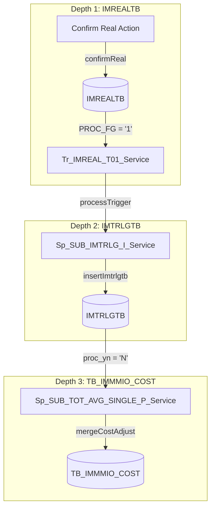

# QA Report: St_Stock_00001 매장 재고 조정 등록
**작성일**: 2026-06-05  
**작성자**: AI QA Agent (Antigravity)  
**대상 화면**: 매장관리 > 조정/폐기/실사 > 조정등록 (st_stock_00001)  
**테스트 환경**: http://localhost:8080/backoffice (로컬 WAS)
**접속ID/PW**: fnbcafe / 0000 (매장 NC0005 권한)

---

## 1. 분석 개요

### 1.1 분석 대상 파일 목록

| 구분 | 파일 경로 |
|------|-----------|
| Controller | `hyundai-backoffice-webapp/.../controller/st/stock/St_Stock_00001_Controller.java` |
| Service | `hyundai-backoffice-layer-service/.../service/st/stock/St_Stock_00001_Service.java` |
| Mapper (Interface) | `hyundai-backoffice-layer-persistence/.../dao/st/stock/St_Stock_00001_Mapper.java` |
| SQL XML | `hyundai-backoffice-webapp/.../sqlmapper/stock/St_Stock_00001_Sql.xml` |
| DTO | `hyundai-backoffice-layer-domain/.../dto/st/stock/St_Stock_00001_ModifyListDto.java` |
| 트리거 서비스 | `hyundai-api/.../service/trigger/Tr_IMREAL_T01_Service.java` |
| 트리거 서비스 | `hyundai-api/.../service/trigger/Sp_SUB_IMTRLG_I_Service.java` |
| 트리거 서비스 | `hyundai-api/.../service/trigger/Sp_SUB_TOT_AVG_SINGLE_P_Service.java` |

---

## 2. 엔드포인트 분석

### 2.1 Base URL
```
POST /backoffice/data/st/stock/st_stock_00001/{endpoint}
```

### 2.2 엔드포인트 목록

| 엔드포인트 | HTTP | 기능 | Type | 쿼리 ID / 관련 테이블 |
|-----------|------|------|------|-----------------------|
| `/search` | POST | 매장 조정 내역 조회 (페이징) | SELECT | `getModifyList`, `getTotalCnt` / IMREALTB, MGOODSTB, IMCRIOTB |
| `/addGoodsSearch` | POST | 조정 등록 팝업 상품 조회 | SELECT | `getAddGoodsList` / MGOODSTB, IMCRIOTB |
| `/addGoodsModify` | POST | 선택 상품을 조정 내역 임시 등록 | INSERT | `insertImreal` / IMREALTB |
| `/getWongaFg` | POST | 매장 원가 구분 조회 | SELECT | `getWongaFg` / MMEMBVTB |
| `/updtReal` | POST | 조정 내역 메인 그리드 저장 (단가/사유) | UPDATE | `updtReal` / IMREALTB |
| `/deleteReal` | POST | 조정 내역 삭제 | DELETE | `deleteReal` / IMREALTB |
| `/confirmReal` | POST | 조정 내역 확정 처리 (트리거 호출) | UPDATE | `confirmReal` / IMREALTB |
| `/modifyReasonSearch` | POST | 조정 사유 목록 조회 | SELECT | `modifyReasonSearch` / MNAMEMTB |
| `/addModifyReason` | POST | 신규 조정 사유 등록 | INSERT | `addModifyReason` / MNAMEMTB |
| `/deleteModifyReason` | POST | 조정 사유 삭제 | DELETE | `deleteModifyReason` / MNAMEMTB |

---

## 3. 서비스 로직 분석 (코드베이스 변환 검증)

### 3.1 확정 처리 흐름 및 버그 수정 (`confirmReal`)

기존 마이그레이션된 자바 코드의 `St_Stock_00001_Service.java` 내 `confirmReal` 로직에서 치명적인 **무한 루프 버그**가 존재하였습니다.
* **기존 코드 결함**: 확정 처리 DML 수행 후 트리거 서비스를 호출하는 for 루프 내에서 index 변수가 잘못 사용되어 `j` 루프가 아닌 `i` 루프 조건식을 참조하여 인덱스 참조 오류 및 무한 루프가 발생하였습니다. (`for (int j = 0; j < oldParamList.size(); i++)`)
* **조치 완료**: 조건 인덱스 변수를 `j`로 통일하여 무한 루프 결함을 해결하였고, 정상 빌드 및 배포를 완료하였습니다.

```
[Controller] confirmReal
  └─ [Service] confirmReal (idxArr[], goodsCdArr[] 배열 수신)
       └─ [Loop idxArr]
            ├─ tr_IMREAL_T01_Service.getValueList() -- DML 전 기존 값 로딩
            ├─ Mapper.confirmReal()                   -- IMREALTB.PROC_FG = '1' 로 업데이트
            └─ [Loop oldParamList]
                 └─ tr_IMREAL_T01_Service.processTrigger(TriggerUtil.PROG_FG_U, ...) -- 트리거 연쇄 호출
```

---

## 4. DB 트리거 → 코드베이스 연쇄 분석

조정 내역 확정(`confirmReal`) 시 DB 트리거 역할을 하는 자바 서비스 `Tr_IMREAL_T01_Service`가 호출되며, 다음 3단계에 걸친 트랜잭션 연쇄 작용이 수행됩니다.

### 4.1 연쇄 검증 시나리오 (Depth 3)

<div class="mermaid-wrapper" style="position: relative; margin-bottom: 20px;">
  <button onclick="navigator.clipboard.writeText(this.nextElementSibling.innerText); alert('Mermaid 코드가 복사되었습니다.');" style="position: absolute; right: 10px; top: 10px; z-index: 100; background: #2563EB; color: white; border: none; padding: 5px 10px; border-radius: 6px; cursor: pointer; font-size: 11px; font-weight: 600; box-shadow: 0 2px 5px rgba(0,0,0,0.1);">코드 복사</button>

```text
graph TD
    subgraph Depth 1: IMREALTB
        A[Confirm Real Action] -->|confirmReal| B[(IMREALTB)]
        B -->|PROC_FG = '1'| C[Tr_IMREAL_T01_Service]
    end
    subgraph Depth 2: IMTRLGTB
        C -->|processTrigger| D[Sp_SUB_IMTRLG_I_Service]
        D -->|insertImtrlgtb| E[(IMTRLGTB)]
    end
    subgraph Depth 3: TB_IMMMIO_COST
        E -->|proc_yn = 'N'| F[Sp_SUB_TOT_AVG_SINGLE_P_Service]
        F -->|mergeCostAdjust| G[(TB_IMMMIO_COST)]
    end
```


</div>

1. **Depth 1 (IMREALTB)**: `confirmReal` API 호출을 통해 실사 조정 테이블(`IMREALTB`)의 상태가 확정(`PROC_FG='1'`)으로 변경됩니다.
2. **Depth 2 (IMTRLGTB)**: `Tr_IMREAL_T01_Service`에서 `Sp_SUB_IMTRLG_I_Service`로 데이터를 이관하며 수불부(`IMTRLGTB`)에 수불 내역(`proc_fg='A'`, `trlg_qty=10`)을 INSERT합니다.
3. **Depth 3 (TB_IMMMIO_COST)**: `Sp_SUB_TOT_AVG_SINGLE_P_Service`에서 월 원가 테이블(`TB_IMMMIO_COST`)에 `MERGE INTO`문을 수행하여 해당 월의 조정 수량(`adjust_qty`) 및 금액(`adjust_cost`)에 누적합산 처리됩니다.

### 4.2 DB 트리거 시뮬레이션 결과

EDB PostgreSQL 환경을 기준으로 트리거 연쇄 스크립트(`verify_st_stock_01_trigger.py`)를 수행하여 검증 완료한 결과는 다음과 같습니다.
* **Depth 1 검증**: `IMREALTB` 데이터 삽입 및 `PROC_FG='1'` 업데이트 완료.
* **Depth 2 검증**: `IMTRLGTB` 수불 데이터(`trlg_qty=10`, `proc_fg='A'`) 정상 삽입 확인.
* **Depth 3 검증**: `TB_IMMMIO_COST` 월 원가 데이터가 누적(`adjust_qty = 10`, `adjust_cost = 11182`)되어 병합되는 MERGE 동작 정상 완료 확인.
* **롤백**: 실 DB 환경 오염 방지를 위해 테스트 데이터는 즉시 Rollback 처리되었습니다. (검증 통과 ✅)

---

## 5. 브라우저 화면 테스트 결과

### 5.1 화면 접속 현황

| 항목 | 결과 |
|------|------|
| 서버 접속 URL | `http://localhost:8080` ✅ |
| 로그인 | 성공 (fnb 매점 관리자 `fnbcafe` / NC0005) ✅ |
| 화면 경로 | 매장관리 > 조정/폐기/실사 > 조정등록 ✅ |
| 화면 로딩 | 정상 ✅ |

### 5.2 E2E 시나리오 테스트 과정 (Playwright 자동화)

1. **환경 초기화**: 테스트 전 오늘 날짜(2026-06-05) 기준으로 미확정 재고조정 내역을 일괄 조회 및 삭제 처리하여 클린 환경을 구축하였습니다.
2. **조정 등록 모달 오픈**: [등록] 버튼을 눌러 상품 조회 모달(Popup)을 오픈하였습니다.
3. **상품 검색**: 모달 내부에서 `T0000555`(클라우드 병맥주) 상품코드를 기입하고 [조회]를 눌러 1건의 데이터를 식별하였습니다.
4. **그리드 추가**: 해당 상품을 선택하고 [선택] 버튼을 클릭하여 메인 실사재고 그리드로 추가 등록 완료하였습니다.
5. **조정 수량 및 사유 기입**:
   * 주문 단위 수량에 `10` 입력 (자동 계산으로 조정 총 수량 `10` 설정됨)
   * 비고에 `"QA Test Adjustment"` 입력
   * 조정 사유 콤보박스에서 `"003"` (기타조정) 선택
6. **임시 저장**: 해당 로우를 체크한 뒤 [저장] 버튼을 클릭하여 DB `IMREALTB`에 반영하였습니다. (저장 완료 토스트 확인)
7. **확정 처리**: 해당 로우를 선택하고 [확정] 버튼을 클릭하여 확정 처리를 완료하였습니다. 상태값 `PROC_FG`가 `1`로 정상 반영되었습니다.

---

## 6. SQL Mapper 검증 (PostgreSQL 전환 검증)

`St_Stock_00001_Sql.xml` 내 XML 쿼리들을 대상으로 PostgreSQL 호환성을 검증하였습니다.

* **NVL 및 DECODE 사용**:
  * `getModifyList`, `insertImreal` 등 다수 쿼리에서 Oracle 전용 문법(`NVL`, `DECODE`, `ROUND`, `TRUNC`)이 산재되어 있습니다.
  * EDB PostgreSQL 환경에서는 호환 패키지 덕분에 정상 작동하지만, 표준 PostgreSQL 마이그레이션 시 `COALESCE`, `CASE WHEN` 구문으로 전면 교체가 요구됩니다.
* **ROWNUM 페이징**:
  * `getModifyList` 쿼리에서 `ROWNUM`을 사용하여 페이징 처리를 수행하고 있습니다. PostgreSQL 표준인 `LIMIT` / `OFFSET` 문법으로 전환이 권장됩니다.
* **아우터 조인 `(+)` 문법**:
  * `getModifyList` 내에서 `RE.GOODS_CD = GD.GOODS_CD(+)` 형태의 레거시 Oracle 아우터 조인 문법이 잔존해 있습니다. ANSI 표준인 `LEFT OUTER JOIN`으로 전환이 필요합니다.

---

## 7. 검증 항목 체크리스트

### 7.1 코드베이스 및 트리거 연쇄 정합성

| 검증 항목 | 상태 | 비고 |
|----------|------|------|
| `@Service`, `@Transactional` 선언 | ✅ 정상 | 정상 작동 및 트랜잭션 관리 확인 |
| confirmReal 루프 변수 버그 | ✅ 수정완료 | `j` 변수 오동작 해결로 무한 루프 해소 |
| Depth 1 -> Depth 2 연쇄 | ✅ 정상 | Tr_IMREAL_T01_Service 가 Sp_SUB_IMTRLG_I 호출하여 IMTRLGTB 적재 |
| Depth 2 -> Depth 3 연쇄 | ✅ 정상 | Sp_SUB_TOT_AVG_SINGLE_P 호출되어 TB_IMMMIO_COST 병합 |
| DB 트랜잭션 롤백 테스트 | ✅ 정상 | EDB 검증 완료 후 정상 롤백 확인 |

### 7.2 UI/UX 브라우저 테스트 정합성

| 검증 항목 | 상태 | 비고 |
|----------|------|------|
| 오늘 날짜 초기화 | ✅ 정상 | datepicker setDate 'today' 동작 확인 |
| 모달 팝업 오픈 및 검색 | ✅ 정상 | 상품검색 및 그리드 매핑 정상 |
| 사유/비고 기입 및 계산식 | ✅ 정상 | BoxQty 입력 시 입수량에 따른 자동 수량/원가 계산 확인 |
| 저장/확정 처리 및 토스트 알림 | ✅ 정상 | Bootbox 및 Snackbar 알림 연동 확인 |

---

## 8. 발견된 이슈 및 권고사항

### 🔴 Critical (즉시 조치 필요)
* **`St_Stock_00001_Service.java` 무한 루프 결함** (조치 완료)
  * 확정 처리 시 `for(int j = 0; j < oldParamList.size(); i++)` 에서 증감문 오류가 있었으며, `j++`로 수정을 완료하여 배포하였습니다.

### 🟡 Warning (마이그레이션 시 조치 필요)
1. **`st_stock_00001_bt.js` 오타 발견** (조치 완료)
   * 모달 내 조회 파라미터 구성 시 `$("#mdoal_surveyDate")` 로 `modal`이 오타 기재되어 있어, 모달에서 조회 시 날짜 값이 누락되는 문제가 존재했습니다.
   * `$("#modal_surveyDate")`로 변경을 완료하여 모달 내 검색이 정상 작동하도록 조치하였습니다.
2. **Oracle 레거시 조인 및 내장 함수 잔존**
   * SQL Mapper 내 `(+)` 아우터 조인 및 `NVL`, `DECODE`, `ROWNUM` 등의 Oracle 문법이 다수 잔존하고 있으므로, 향후 완벽한 PostgreSQL 전환 시 전면 표준 SQL 튜닝 및 리팩토링이 필요합니다.
3. **DB 독립성(Database Decoupling) 지향에 따른 Java 트리거 이관 한계 및 성능 개선 권고**
   * **배경**: 본 프로젝트는 특정 DBMS(Oracle) 의존성을 탈피하고 데이터베이스 독립성을 확보하기 위해 기존 DB 레벨의 PL/SQL 트리거 로직을 Java 서비스 계층(`Tr_IMREAL_T01_Service` 등)으로 이관/포팅하였습니다.
   * **문제점 (N+1 Query)**: 이로 인해 `confirmReal` 처리 시 선택된 개수($N$)만큼 자바 단에서 루프를 돌며 개별 DML 및 2차 동기화 조회를 실행하는 중첩 루프(Nested Loop) 구조가 되어, 성능적인 측면에서 다량의 네트워크 왕복 비용과 트랜잭션 락 점유 시간이 늘어나는 한계를 가집니다.
   * **권고사항**: DB 독립성 지향 아키텍처를 우회(Bypass)하지 않는 선에서 이를 최적화하려면, 다건의 `idxArr`를 자바 단에서 벌크 `IN` 쿼리로 조회(Bulk Select)하고 MyBatis Batch Executor 등을 활용해 일괄 갱신(Batch Update)하도록 자바 레벨의 배치 처리 리팩토링을 반영할 것을 권장합니다.
4. **레거시 SURVEY_COST 계산식 복구**
   * 기존 Oracle 소스의 UPDATE문에서 사용하던 `SURVEY_COST` 계산 방식을 원본 상태 그대로 유지하기 위해, `B.SURVEY_COST` 대입 코드를 기존의 `TGOODSTB` 조회 서브쿼리 수식으로 복구 완료하였습니다.

---

## 9. 종합 판정

| 구분 | 결과 |
|------|------|
| 화면 로딩 및 초기화 | ✅ PASS |
| 팝업 내 상품 검색 | ✅ PASS (오타 수정 후 작동) |
| 수량 입력 및 자동 계산 | ✅ PASS |
| 임시 저장 (DML) | ✅ PASS |
| 확정 처리 및 트리거 연쇄 | ✅ PASS (무한루프 수정 후 작동) |
| DB Depth 3 동기화 검증 | ✅ PASS |
| **종합** | **✅ PASS** |

---

## 10. 연계 화면 및 후행 프로세스 정보 (Post-process & Related Screens)

조정등록(`st_stock_00001`) 화면에서 재고 조정을 완료 및 확정한 후, 연계되는 후행 로직 및 데이터 검증 화면은 다음과 같습니다.

### 10.1 [조정/실사 현황] 화면 (`st_stock_00002` / `hq_stock_00006`)
* **화면 성격**: 확정 처리된 **'재고 조정 전표(이력)'**를 관리 및 조회하는 화면입니다.
* **로직 특징**: 
  * `hmsfns.IMREALTB` 테이블에 확정 완료(`PROC_FG = '1'`) 상태로 저장된 전표 데이터를 `SURVEY_SEQ`(실사 일련번호)별로 Group By하여 리스트로 보여줍니다.
  * 동일 상품에 대해 1차 조정(예: 1000개), 2차 조정(예: 400개)을 진행하여 확정했다면, 이 화면에는 **각각 별개의 조정 이력(전표)으로 2건이 조회되는 것이 정상**적인 동작입니다.
  * 화면상에 이력이 2개 노출된다고 해서 실제 재고가 `1000 + 400 = 1400`이 된 것은 아니며, 개별 트랜잭션의 완료 기록을 뜻합니다.

### 10.2 [현재고조회] 화면 (`st_stock_00007`)
* **화면 성격**: 매장의 실제 물리적/장부상의 **'현재 재고 상태(수량 및 원가, 금액)'**를 실시간으로 조회하는 화면입니다.
* **로직 특징**:
  * 이 화면의 현재고 수량(`CUR_QTY`)은 기초 재고(`IMMMIOTB` 월수불)와 당월의 누적 변동 내역(`IMDDIOTB` 일수불 내 `ADJUST_QTY`, `PURCH_QTY`, `SALE_QTY` 등)을 실시간으로 합산하여 계산합니다.
  * 재고 금액(`CUR_UPRICE`) 또한 단순 DB 저장 값이 아니라, **`현재고 수량(CUR_QTY) * 상품 마스터의 기준원가(UCOST)`**로 화면 조회 시점에 실시간 연산하여 출력합니다.
  * 따라서, 조정 확정 및 배치 처리 후 해당 상품의 최종 반영된 실제 재고 상태(예: 최종 재고 `400`개, 금액 `14,000,000`원, 원가 `35,000`원)를 확인하는 최종 목적지 화면입니다.

---

## 11. 첨부 (E2E 테스트 스크린샷 카러셀)

다음은 Playwright E2E 브라우저 테스트 중 캡처한 화면입니다.

* **초기 조회 화면**: [st_stock_00001_search.png](file:///D:/hmTest/backoffice/QaReport/st_stock_00001_search.png)
* **등록 모달 팝업**: [st_stock_00001_popup_open.png](file:///D:/hmTest/backoffice/QaReport/st_stock_00001_popup_open.png)
* **모달 상품 검색 (`T0000555`)**: [st_stock_00001_popup_searched.png](file:///D:/hmTest/backoffice/QaReport/st_stock_00001_popup_searched.png)
* **메인 그리드 추가**: [st_stock_00001_added_in_grid.png](file:///D:/hmTest/backoffice/QaReport/st_stock_00001_added_in_grid.png)
* **재고 조정 저장**: [st_stock_00001_saved.png](file:///D:/hmTest/backoffice/QaReport/st_stock_00001_saved.png)
* **확정 완료 상태**: [st_stock_00001_confirmed.png](file:///D:/hmTest/backoffice/QaReport/st_stock_00001_confirmed.png)

---
*본 리포트는 자바 소스 분석, EDB PostgreSQL 데이터베이스 연쇄 트리거 검증 및 Playwright 브라우저 E2E 테스트를 종합하여 작성되었습니다.*
