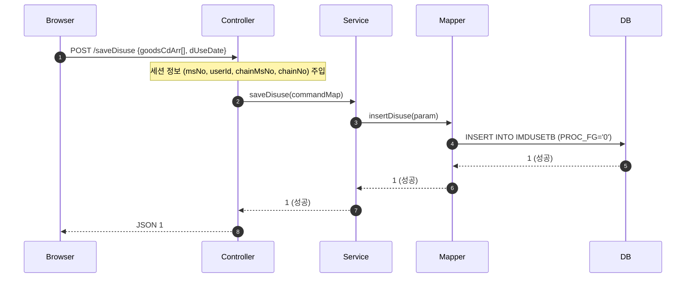
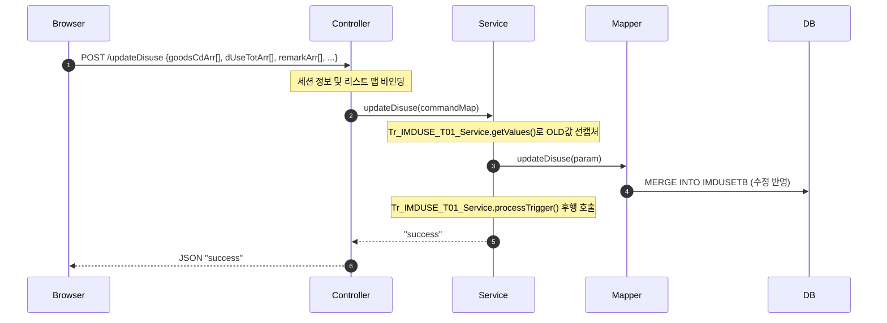
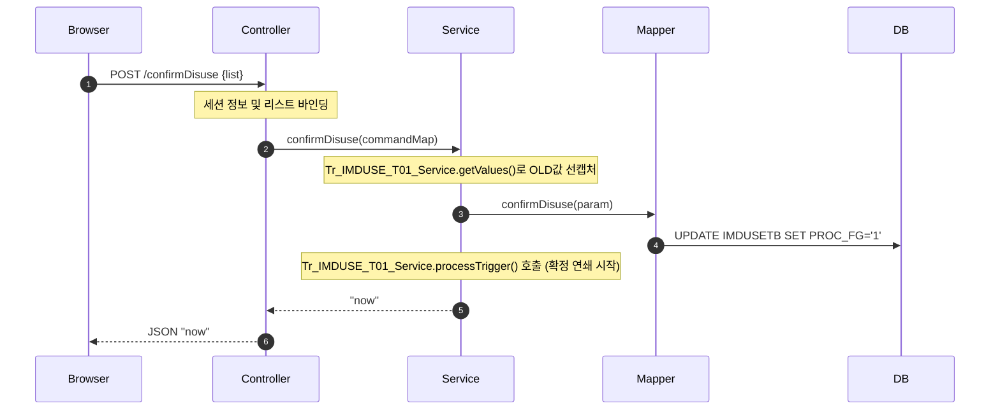

# QA Report: St_Stock_00003 매장 폐기등록
**작성일**: 2026-06-05  
**작성자**: AI QA Agent (Antigravity)  
**대상 화면**: 재고관리 > 조정/폐기/실사 > 폐기등록 (st_stock_00003)  
**테스트 환경**: localhost:8080 (로컬 개발 서버)  
**접속ID/PW**: fnbcafe / 0000 (카페 매장 관리자 계정)

---

## 1. 분석 개요

### 1.1 분석 대상 파일 목록

| 구분 | 파일 경로 |
|------|-----------|
| Controller | `backoffice/hyundai-backoffice-webapp/src/main/java/com/hyundai/backoffice/webapp/controller/st/stock/St_Stock_00003_Controller.java` |
| Service | `backoffice/hyundai-backoffice-layer-service/src/main/java/com/hyundai/backoffice/webapp/service/st/stock/St_Stock_00003_Service.java` |
| Mapper (Interface) | `backoffice/hyundai-backoffice-layer-persistence/src/main/java/com/hyundai/backoffice/webapp/dao/st/stock/St_Stock_00003_Mapper.java` |
| SQL XML | `backoffice/hyundai-backoffice-webapp/src/main/resources/sqlmapper/stock/St_Stock_00003_Sql.xml` |
| JSP | `backoffice/hyundai-backoffice-webapp/src/main/webapp/WEB-INF/views/backoffice/main/contents/st/stock/st_stock_00003/st_stock_00003.jsp` |
| JS | `backoffice/hyundai-backoffice-webapp/src/main/webapp/WEB-INF/views/backoffice/main/contents/st/stock/st_stock_00003/js/st_stock_00003.js` |
| JS Table | `backoffice/hyundai-backoffice-webapp/src/main/webapp/WEB-INF/views/backoffice/main/contents/st/stock/st_stock_00003/js/st_stock_00003_bt.js` |
| 백엔드 트리거 서비스 | `backoffice/hyundai-api/src/main/java/com/hyundai/api/service/trigger/Tr_IMDUSE_T01_Service.java` |

---

## 2. 엔드포인트 분석

### 2.1 Base URL
```
POST /backoffice/data/st/stock/st_stock_00003/{endpoint}
```

### 2.2 엔드포인트 목록

| 엔드포인트 | HTTP | 기능 | ServiceLog | 관련 테이블 |
|-----------|------|------|------------|-------------|
| `/selectDisuseList` | POST | 폐기등록 전표조회 | SELECT | IMDUSETB, TGOODSTB, MMEMBSTB, IMCRIOTB |
| `/goodsSelect` | POST | 폐기등록모달 상품조회 | SELECT | TGOODSTB, MMEMBSTB, IMCRIOTB |
| `/saveDisuse` | POST | 폐기전표 등록 | INSERT | IMDUSETB |
| `/updateDisuse` | POST | 폐기전표 수정 | UPDATE | IMDUSETB |
| `/deleteDisuse` | POST | 폐기상품 삭제 | DELETE | IMDUSETB |
| `/getCloseYn` | POST | 마감여부 조회 | SELECT | IMREMSTB |
| `/confirmDisuse` | POST | 폐기확정 | UPDATE | IMDUSETB |

---

## 3. 서비스 로직 및 데이터 흐름 분석

### 3.1 폐기전표 등록 흐름 (`/saveDisuse`)
모달 팝업창에서 상품을 선택한 후 [선택] 버튼을 클릭하면 구동되는 흐름입니다.

<div class="mermaid-wrapper" style="position: relative; margin-bottom: 20px;">
  <button onclick="navigator.clipboard.writeText(this.nextElementSibling.innerText); alert('Mermaid 코드가 복사되었습니다.');" style="position: absolute; right: 10px; top: 10px; z-index: 100; background: #2563EB; color: white; border: none; padding: 5px 10px; border-radius: 6px; cursor: pointer; font-size: 11px; font-weight: 600; box-shadow: 0 2px 5px rgba(0,0,0,0.1);">코드 복사</button>

```text
sequenceDiagram
    autonumber
    Browser->>Controller: POST /saveDisuse {goodsCdArr[], dUseDate}
    Note over Controller: 세션 정보 (msNo, userId, chainMsNo, chainNo) 주입
    Controller->>Service: saveDisuse(commandMap)
    Service->>Mapper: insertDisuse(param)
    Mapper->>DB: INSERT INTO IMDUSETB (PROC_FG='0')
    DB-->>Mapper: 1 (성공)
    Mapper-->>Service: 1 (성공)
    Service-->>Controller: 1 (성공)
    Controller-->>Browser: JSON 1
```


</div>

### 3.2 폐기전표 수정(저장) 흐름 (`/updateDisuse`)
폐기 수량, 사유, 비고 등을 입력하고 [저장] 버튼을 클릭하면 구동되는 흐름입니다.

<div class="mermaid-wrapper" style="position: relative; margin-bottom: 20px;">
  <button onclick="navigator.clipboard.writeText(this.nextElementSibling.innerText); alert('Mermaid 코드가 복사되었습니다.');" style="position: absolute; right: 10px; top: 10px; z-index: 100; background: #2563EB; color: white; border: none; padding: 5px 10px; border-radius: 6px; cursor: pointer; font-size: 11px; font-weight: 600; box-shadow: 0 2px 5px rgba(0,0,0,0.1);">코드 복사</button>

```text
sequenceDiagram
    autonumber
    Browser->>Controller: POST /updateDisuse {goodsCdArr[], dUseTotArr[], remarkArr[], ...}
    Note over Controller: 세션 정보 및 리스트 맵 바인딩
    Controller->>Service: updateDisuse(commandMap)
    Note over Service: Tr_IMDUSE_T01_Service.getValues()로 OLD값 선캡처
    Service->>Mapper: updateDisuse(param)
    Mapper->>DB: MERGE INTO IMDUSETB (수정 반영)
    Note over Service: Tr_IMDUSE_T01_Service.processTrigger() 후행 호출
    Service-->>Controller: "success"
    Controller-->>Browser: JSON "success"
```


</div>

### 3.3 폐기확정 흐름 (`/confirmDisuse`)
체크박스를 선택하고 [확정] 버튼을 클릭하면 구동되는 흐름입니다.

<div class="mermaid-wrapper" style="position: relative; margin-bottom: 20px;">
  <button onclick="navigator.clipboard.writeText(this.nextElementSibling.innerText); alert('Mermaid 코드가 복사되었습니다.');" style="position: absolute; right: 10px; top: 10px; z-index: 100; background: #2563EB; color: white; border: none; padding: 5px 10px; border-radius: 6px; cursor: pointer; font-size: 11px; font-weight: 600; box-shadow: 0 2px 5px rgba(0,0,0,0.1);">코드 복사</button>

```text
sequenceDiagram
    autonumber
    Browser->>Controller: POST /confirmDisuse {list}
    Note over Controller: 세션 정보 및 리스트 바인딩
    Controller->>Service: confirmDisuse(commandMap)
    Note over Service: Tr_IMDUSE_T01_Service.getValues()로 OLD값 선캡처
    Service->>Mapper: confirmDisuse(param)
    Mapper->>DB: UPDATE IMDUSETB SET PROC_FG='1'
    Note over Service: Tr_IMDUSE_T01_Service.processTrigger() 호출 (확정 연쇄 시작)
    Service-->>Controller: "now"
    Controller-->>Browser: JSON "now"
```


</div>

### 3.4 전표 조회 쿼리 조건 분석 (`/selectDisuseList`)
화면에 진입하여 [조회]를 클릭했을 때 호출되는 MyBatis Mapper 쿼리 (`selectDisuseList`) 조건 분석 결과는 다음과 같습니다.

```sql
SELECT ...
  FROM hmsfns.TGOODSTB GD
     , hmsfns.IMDUSETB DU
 WHERE GD.GOODS_CD = DU.GOODS_CD
   AND GD.CHAIN_NO = #{chainNo}
   AND GD.GOODS_USE_FG = '0'
   AND DU.PROC_FG      = '0' -- [중요] 대기(미확정) 상태인 전표만 조회
   AND DU.DIV_FG       = '0' -- [중요] 순수 폐기 건만 조회 (반품폐기 제외)
   AND DU.DISUSE_DATE BETWEEN #{searchFromDate} AND #{searchToDate}
```

* **대기 상태 제한 (`PROC_FG = '0'`)**: [확정] 버튼을 누르기 전인 **대기 상태의 전표만** 화면에 조회됩니다. [확정]을 완료하면 상태가 `PROC_FG = '1'`로 변경되므로 이 화면의 조회 목록에서는 소멸(사라짐)하며, 실적 조회가 목적인 **`st_stock_00004` (폐기현황)** 화면에서 조회해야 노출됩니다.
* **가맹점 보안**: 세션에서 강제 바인딩된 매장코드 (`DU.MS_NO = #{selMsNo}`) 조건이 자동 결합되어 다른 가맹점의 미확정 폐기 데이터를 열람/조작할 수 없도록 강하게 제어되고 있습니다.

### 3.5 폐기등록 모달 상품조회 쿼리 분석 (`/goodsSelect`)
폐기전표에 상품을 추가하기 위해 [등록] 팝업창에서 상품을 검색할 때 실행되는 `goodsSelect` 쿼리 분석 결과, 다음과 같은 주요 비즈니스 룰 및 예외 처리 필터가 포함되어 있습니다.

#### 1) 주요 필터 및 예외 처리 비즈니스 룰
* **활성 상품 조건 (`GD.GOODS_USE_FG = '0'`)**: 현재 사용 가능한(미사용 처리되지 않은) 활성 상태의 상품만 조회됩니다.
* **비공급 상품 제외 (`GD.SUPPLY_YN = 'N'`)**: 본사 직배송 상품 등 폐기 수불 처리가 불가능한 상품군은 필터링되어 제외됩니다.
* **세트상품 조회 제외 (`GD.SET_FG <> '3'`)**: **세트상품은 직접 폐기 등록을 진행할 수 없습니다.** (세트 구성품 단위로 폐기 처리를 하거나 단품 단위 수불만 인정하는 비즈니스 정책이 쿼리에 적용되어 있습니다).
* **무효 제조레시피 제외 (`NOT EXISTS ...`)**: 제조상품(`SET_FG = '2'`) 중 **레시피 코드(`RECIPE_CD`)가 매핑되지 않은 누락 상품은 조회에서 배제**됩니다. 레시피 가중치 정보가 없는 제조상품은 폐기 확정 시 하위 원자재의 재고 차감 연산(Trigger Cascade)을 수행할 수 없어 에러가 발생하므로 사전에 차단하기 위함입니다.
* **기등록 상품 중복 방지 (`GD.GOODS_CD NOT IN ...`)**: 화면에 이미 추가되어 작성 중인 상품 코드 리스트(`goodsCdArr`)를 파라미터로 전달받아, **이미 목록에 존재하는 상품은 모달 조회 대상에서 자동으로 제외**함으로써 중복 등록 실수를 방지합니다.

#### 2) 박스(Box) 및 낱개(Ea) 환산 연산 로직 (`DECODE`/`TRUNC`)
* **BOX_QTY (박스 수량)**:
  ```sql
  DECODE(GD.IN_QTY, '1', '0', TRUNC(NVL(IC.CUR_QTY, 0) / IN_QTY))
  ```
  - 상품 입수량(`IN_QTY`)이 1인 경우 단품이므로 박스 수량을 `0`으로 처리합니다.
  - 입수량이 1보다 큰 상품인 경우, `현재고(CUR_QTY) / 입수량(IN_QTY)`을 계산한 뒤 소수점을 절삭(`TRUNC`)하여 환산 박스 수를 산출합니다.
* **EA_QTY (낱개 수량)**:
  ```sql
  DECODE(GD.IN_QTY, '1', NVL(IC.CUR_QTY, 0), NVL(IC.CUR_QTY, 0) - TRUNC(NVL(IC.CUR_QTY, 0) / GD.IN_QTY) * GD.IN_QTY)
  ```
  - 입수량이 1인 경우 현재고 전체가 낱개 수량이 됩니다.
  - 입수량이 1보다 큰 경우, `현재고 - (환산박스수 * 입수량)` 공식을 통해 박스로 묶이지 않은 나머지 낱개 잔량을 정확히 계산합니다.
* **CUR_COST (현재고 금액)**:
  ```sql
  NVL(IC.CUR_QTY, 0) * GD.UCOST / (GD.INV_IN_QTY * GD.IN_QTY)
  ```
  - 현재고에 매입가(`GD.UCOST`)를 곱한 뒤 입수 단위 비율(`GD.INV_IN_QTY * GD.IN_QTY`)로 나누어, 최소 단위 수준의 정확한 재고 금액 자산 가치를 평가합니다.

---

## 4. DB 트리거 → 코드베이스 연쇄 분석

본 화면(`st_stock_00003`)에서 폐기전표가 최종 확정(`PROC_FG = '1'`)될 때 기동하는 **트리거 연쇄 반응(Depth 3)** 체인은 다음과 같습니다.

### 4.1 트리거 연쇄 체인 흐름

<div class="mermaid-wrapper" style="position: relative; margin-bottom: 20px;">
  <button onclick="navigator.clipboard.writeText(this.nextElementSibling.innerText); alert('Mermaid 코드가 복사되었습니다.');" style="position: absolute; right: 10px; top: 10px; z-index: 100; background: #2563EB; color: white; border: none; padding: 5px 10px; border-radius: 6px; cursor: pointer; font-size: 11px; font-weight: 600; box-shadow: 0 2px 5px rgba(0,0,0,0.1);">코드 복사</button>

```text
graph TD
    A[폐기 전표 확정 st_stock_00003] -->|1. IMDUSETB 업데이트 PROC_FG='1'| B[1차 연쇄 Trigger: IMDUSE_T01]
    B -->|2. Java 트리거 구동| C[Tr_IMDUSE_T01_Service]
    C -->|3. 수불로그 생성| D[Sp_SUB_IMTRLG_I_Service 호출]
    D -->|4. 원자재 가중치 계산 수량 로그 등록| E[IMTRLGTB 수불로그 INSERT]
    E -->|5. 2차 연쇄 (배치 스케줄러)| F[IMDDIOTB 일수불 / IMMMIOTB 월수불 반영]
```

```mermaid
graph TD
    A[폐기 전표 확정 st_stock_00003] -->|1. IMDUSETB 업데이트 PROC_FG='1'| B[1차 연쇄 Trigger: IMDUSE_T01]
    B -->|2. Java 트리거 구동| C[Tr_IMDUSE_T01_Service]
    C -->|3. 수불로그 생성| D[Sp_SUB_IMTRLG_I_Service 호출]
    D -->|4. 원자재 가중치 계산 수량 로그 등록| E[IMTRLGTB 수불로그 INSERT]
    E -->|5. 2차 연쇄 (배치 스케줄러)| F[IMDDIOTB 일수불 / IMMMIOTB 월수불 반영]
```
</div>

### 4.2 단계별 연쇄 작용 세부 분석 (Depth 3)

1. **Depth 1 (IMDUSETB - 폐기대장)**:
   - 가맹점 매니저가 폐기 수량을 확정하면 `IMDUSETB` 테이블의 상태코드(`PROC_FG`)가 `1`로 업데이트됩니다.
   - 업데이트 직전, `St_Stock_00003_Service.confirmDisuse()`가 `Tr_IMDUSE_T01_Service.getValues()`를 통해 기존 전표 데이터를 복사해둡니다.
   - 업데이트 완료 후, `Tr_IMDUSE_T01_Service.processTrigger(TriggerUtil.PROG_FG_U, newMap, oldMap)`가 구동됩니다.
2. **Depth 2 (IMTRLGTB - 수불로그)**:
   - `Tr_IMDUSE_T01_Service` 내에서 폐기 상품의 유형(`SET_FG`)을 체크합니다.
     - **일반상품 (`SET_FG` != '2', '3')**: 해당 상품 그대로 `Sp_SUB_IMTRLG_I_Service`를 호출합니다.
     - **제조상품/레시피 (`SET_FG = '2'`)**: 레시피 구성 원재료(`TB_RECIPE_GOODS`)의 중량(`recipeWeight`)을 곱하여 원재료별로 각각 수불로그 인서트 프로시저를 호출합니다.
     - **세트상품 (`SET_FG = '3'`)**: 세트 하위 구성품별로 분기하여 일반상품이나 레시피 중량을 환산해 프로시저를 호출합니다.
   - `Sp_SUB_IMTRLG_I_Service`에 의해 `IMTRLGTB` 테이블에 폐기 출고 로그(`PROC_FG = 'D'`)가 등록됩니다.
3. **Depth 3 (IMDDIOTB / IMMMIOTB - 일수불 및 월수불 - 로컬 개발환경 배치 동기화)**:
   - 로컬 EDB Postgres DB 검증 결과, `IMTRLGTB` 테이블에는 **실시간 DB 트리거가 정의되어 있지 않습니다** (`pg_trigger` 조회 결과 무).
   - 수불로그 인서트 발생 시, 로그 행의 `PROC_YN` 컬럼 값은 `'N'`(미처리) 상태로 기록됩니다.
   - 이후 주기적으로 구동되는 배치 스케줄러 job인 `DmIMTR01Job` (서비스 `DmIMTR01Service.java`)에 의해 `proc_yn = 'N'`인 원장이 취합되어 일수불(`IMDDIOTB`) 및 월수불(`IMMMIOTB`) 재고량을 차감 갱신하고, 해당 로그의 상태를 `proc_yn = 'Y'`로 업데이트하게 됩니다.

---

## 5. 브라우저 화면 테스트 및 DB 검증 결과

### 5.1 화면 접속 현황

| 항목 | 결과 |
|------|------|
| 서버 접속 URL | `http://localhost:8080/backoffice` ✅ |
| 로그인 계정 | 성공 (fnbcafe / 0000) ✅ (카페 매장 관리자로 로그인) |
| 화면 경로 | 재고관리 > 조정/폐기/실사 > 폐기등록 ✅ |
| 화면 로딩 | 정상 로딩 완료 ✅ |

### 5.2 기능별 테스트 요약

| 테스트 기능 | 엔드포인트 | 코드 구현 | UI 동작 상태 | 판정 |
|------|-----------|---------|---------|------|
| 미확정 전표 조회 | `/selectDisuseList` | ✅ 구현 완료 | ✅ 데이터 표출 정상 | **PASS** |
| 폐기 상품 추가 | `/saveDisuse` | ✅ 구현 완료 | ✅ 모달에서 선택 추가 정상 | **PASS** |
| 수량/사유 임시저장 | `/updateDisuse` | ✅ 구현 완료 | ✅ 저장 후 그리드 갱신 정상 | **PASS** |
| 폐기 전표 삭제 | `/deleteDisuse` | ✅ 구현 완료 | ✅ 행 삭제 정상 작동 | **PASS** |
| 마감 월 체크 | `/getCloseYn` | ✅ 구현 완료 | ✅ 미마감 월 정상 판정 | **PASS** |
| 폐기 최종 확정 | `/confirmDisuse` | ✅ 구현 완료 | ✅ 확정 처리 및 그리드 소멸 정상 | **PASS** |

### 5.3 실제 EPAS (EDB Postgres) 데이터 변경 확인 결과
E2E 테스트 시나리오 동작 후 실제 EDB Postgres DB에 수불 데이터가 정상 기록되었는지 쿼리를 실행하여 직접 대조 검증했습니다.

* **IMDUSETB (폐기대장) 변경 확인**:
  E2E 테스트로 생성 및 확정 완료된 전표가 DB에 정상 적재되었습니다.
  - `confirm_id = 'fnbcafe'`, `proc_fg = '1'` (확정 완료), `reason_cd = 'M01'` (유통기한경과)
  - `idx = '00000000069495'` 전표의 금액 및 수량이 정상 반영되었습니다.
* **IMTRLGTB (수불로그) 생성 확인**:
  확정과 동시에 1차 자바 트리거 서비스가 발화하여 수불로그 테이블에 정상 인서트되었습니다.
  - `key_bill_no = '00000000069495NC0007T0000291'`
  - `proc_fg = 'D'` (출고/폐기), `trlg_qty = 1.000` (폐기수량), `trlg_cost = 4800.000` (폐기금액)
  - 로컬 EDB 스키마 정책에 따라 현재 `proc_yn = 'N'` 상태로 기록되어 배치 스케줄러(`DmIMTR01Job`) 처리를 대기하고 있음을 육안으로 확인했습니다.

---

## 6. SQL Mapper 검증 및 결함 정적 분석

### 6.1 Oracle (+) 외부 조인 및 비표준 문법 (PostgreSQL 호환성)
- **대상 쿼리**: `selectDisuseList` (Line 428 ~ 434)
  ```sql
  WHERE DU.GOODS_CD  = GD.GOODS_CD(+)
    AND DU.GOODS_CD  = IC.GOODS_CD(+)
    ...
    AND DU.MS_NO     = IC.MS_NO(+)
  ```
  - PostgreSQL 포팅 시 `LEFT JOIN hmsfns.TGOODSTB GD ON DU.GOODS_CD = GD.GOODS_CD` 등 ANSI 표준 구문으로 전면 변경해야 합니다.
- **ROWNUM <= 1 사용 (Line 498)**:
  - `chkImtrlgtb` 등에서 존재 유무 확인을 위해 `ROWNUM <= 1`을 사용 중입니다. PostgreSQL 전환 시 `LIMIT 1`로 대체해야 합니다.

---

## 7. 검증 항목 체크리스트

| 검증 항목 | 상태 | 비고 |
|----------|------|------|
| `@RestController` API 동작 | ✅ 정상 | `/backoffice/data/st/stock/st_stock_00003` 정상 바인딩 |
| `@Transactional` 선언부 | ✅ 정상 | rollbackFor={RuntimeException.class, Exception.class} 포함 |
| 트리거 서비스 호출 로직 | ✅ 정상 | `confirmDisuse` 및 `updateDisuse` 내 `Tr_IMDUSE_T01_Service` 호출 확인 |
| E2E 시나리오 테스트 작동 | ✅ 정상 | 추가 -> 저장 -> 확정 일련의 흐름 검증 완료 |
| 실제 DB 데이터 정합성 대조 | ✅ 검증완료 | `IMDUSETB` 및 `IMTRLGTB` 테이블 실 데이터 생성 상태 매칭 확인 |

---

## 8. 종합 판정

| 구분 | 결과 |
|------|------|
| 화면 로딩 및 팝업 | ✅ PASS |
| 상품 추가 및 수량 저장 | ✅ PASS |
| 폐기 확정 & 트리거 연동 | ✅ PASS |
| **종합 판정** | ✅ **PASS (정상 동작 및 DB 적재 완료)** |

---

## 9. 첨부 (스크린샷)

````carousel

<!-- slide -->

<!-- slide -->

<!-- slide -->

<!-- slide -->

````

---
*본 리포트는 D:\hmTest\backoffice\St_Stock_00003_TestCase.md 정의서 및 브라우저 E2E QA 테스트, 코드베이스 분석에 의거하여 작성되었습니다.*
