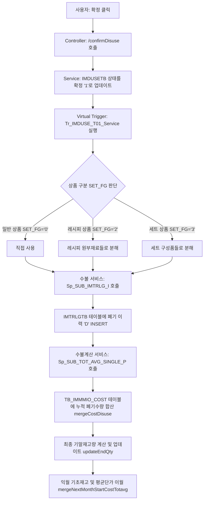

# 매장 폐기현황(st_stock_00004) 데이터 입력 가이드

`st_stock_00004` (매장 폐기현황) 화면은 조회 전용 화면으로, 데이터를 직접 등록할 수 없습니다. 
이 화면에서 데이터를 조회하기 위해서는 아래 화면을 통해 폐기 데이터를 먼저 등록해야 합니다.

---

## 1. 매장 폐기등록 (`st_stock_00003`)
매장 권한(예: 계정 `fnbcafe` / 비밀번호 `0000`)으로 로그인하여 직접 폐기 데이터를 입력하는 화면입니다.

### 📌 데이터 등록 방법
1. **로그인 및 화면 이동**
   - 가맹점 매니저 계정(`fnbcafe` / `0000`)으로 로그인합니다.
   - 메뉴 경로: **재고관리 > 매장 폐기등록 (`st_stock_00003`)**으로 이동합니다.
   - **주의**: 폐기등록 팝업(모달)을 처음 열었을 때는 지연 로딩(`deferUrl`)이 적용되어 있으므로, 팝업 우측 상단의 **[조회]** 버튼을 직접 클릭해야 상품 목록이 노출됩니다.

2. **신규 폐기 데이터 등록**
   - 화면 우측 상단의 **[등록]** 버튼을 클릭하여 `폐기등록` 모달 팝업을 엽니다.
   - 팝업에서 **폐기일자**를 선택하고, 상품 정보를 검색합니다.
   - 폐기할 상품을 체크한 뒤 하단의 **[선택]** 버튼을 클릭하여 그리드에 추가합니다.

3. **수량 입력 및 저장**
   - 그리드에 추가된 상품들의 **폐기수량**, **폐기사유** 등을 입력합니다.
   - 상단의 **[저장]** 버튼을 클릭하여 임시 저장합니다. (이때 테이블 `hmsfns.IMDUSETB`에 데이터가 생성되며 `PROC_FG` 상태는 '미확정(0)' 상태가 됩니다.)

4. **폐기 확정**
   - 입력한 폐기 내역을 확정하기 위해 **[확정]** 버튼을 클릭합니다.
   - 확정이 완료되면 `PROC_FG` 상태가 '확정(1)' 상태로 변경되며, 재고 갱신 가상 트리거가 동작하게 됩니다.

---

## 2. 본사 폐기처리 (`hq_stock_00007`)
본사 권한 계정으로 로그인하여 본사 측면에서 가맹점의 폐기 내역을 등록/수정/삭제/확정 처리할 수 있는 화면입니다.

### 📌 데이터 등록 방법
1. **로그인 및 화면 이동**
   - 본사 권한 계정으로 로그인합니다.
   - 메뉴 경로: **재고관리 > 본사 폐기처리 (`hq_stock_00007`)**로 이동합니다.
2. **동일한 방식으로 등록**
   - 매장 폐기등록과 유사하게 조회 후 **[등록]** 버튼을 통해 상품을 선택하고 수량을 입력하여 저장 및 확정할 수 있습니다.

---

## 3. 관련 테이블 정보
* **테이블명**: `hmsfns.IMDUSETB` (폐기 마스터 및 상세 정보 테이블)
* **주요 상태 값 (`PROC_FG`)**:
  - `0`: 미확정 (저장 상태, 폐기현황에 노출되지 않음)
  - `1`: 확정 (확정 완료 상태, 폐기현황에 노출됨)

---

## 4. 폐기등록 팝업 (`st_stock_00003` 모달) 상품 조회 대상 조건
폐기등록 모달 팝업에서 **[조회]** 버튼을 클릭했을 때 상품 목록에 나타나기 위해 만족해야 하는 데이터베이스상 조건입니다.

* **상품 사용 상태 (`GOODS_USE_FG = '0'`)**
  - 상품 마스터 테이블(`hmsfns.TGOODSTB`)에서 해당 상품의 사용 여부가 **'사용(0)'** 상태여야 합니다.
* **사입 상품 제외 (`SUPPLY_YN = 'N'`)**
  - 사입 구분(`SUPPLY_YN`)이 **'N'**인 일반 상품만 조회 가능합니다.
* **세트 상품 제외 (`SET_FG <> '3'`)**
  - 세트 구성 마스터 형태인 세트 상품(`SET_FG = '3'`)은 폐기 대상에서 제외됩니다.
* **레시피 상품 제약 (`SET_FG = '2'`)**
  - 레시피 상품의 경우, 레시피 코드(`RECIPE_CD`)가 정상 등록되어 있어야 합니다. 레시피 코드가 비어 있는 레시피 상품은 제외됩니다.
* **분류 코드 매핑**
  - 상품의 대/중/소 분류 코드(`LCLASS_CD`, `MCLASS_CD`, `SCLASS_CD`)가 체인 분류 관리 테이블에 정상 매핑되어 있어야 합니다.
* **그리드 중복 방지**
  - 이미 폐기등록 화면 그리드(대기열)에 추가되어 있는 상품 코드는 팝업 조회 결과에서 제외됩니다.
* **현재 재고 보유 여부와 무관 (Outer Join)**
  - 가맹점 월 재고 테이블(`hmsfns.IMCRIOTB`)과 아우터 조인(`(+)`)되어 있어, **재고가 없거나(현재고 0개) 해당 가맹점의 재고 데이터가 생성되지 않은 상품**도 팝업에서 정상적으로 조회됩니다. (재고가 없어도 조회/선택이 가능하며, 현재고는 0으로 나타납니다.)

---

## 5. 폐기 확정 시 데이터 흐름 및 로직

폐기등록 화면(`st_stock_00003`)에서 **[확정]** 버튼을 클릭하면 백엔드 및 DB 단에서 다음과 같은 수불 업데이트가 진행됩니다.

<div class="mermaid-wrapper" style="position: relative; margin-bottom: 20px;">
  <button onclick="navigator.clipboard.writeText(this.nextElementSibling.innerText); alert('Mermaid 코드가 복사되었습니다.');" style="position: absolute; right: 10px; top: 10px; z-index: 100; background: #2563EB; color: white; border: none; padding: 5px 10px; border-radius: 6px; cursor: pointer; font-size: 11px; font-weight: 600; box-shadow: 0 2px 5px rgba(0,0,0,0.1);">코드 복사</button>

```text
graph TD
    A[사용자: 확정 클릭] --> B[Controller: /confirmDisuse 호출]
    B --> C[Service: IMDUSETB 상태를 확정 '1'로 업데이트]
    C --> D[Virtual Trigger: Tr_IMDUSE_T01_Service 실행]
    D --> E{상품 구분 SET_FG 판단}
    E -- 일반 상품 SET_FG='0' --> F[직접 사용]
    E -- 레시피 상품 SET_FG='2' --> G[레시피 원부재료들로 분해]
    E -- 세트 상품 SET_FG='3' --> H[세트 구성품들로 분해]
    F & G & H --> I[수불 서비스: Sp_SUB_IMTRLG_I 호출]
    I --> J[IMTRLGTB 테이블에 폐기 이력 'D' INSERT]
    J --> K[수불계산 서비스: Sp_SUB_TOT_AVG_SINGLE_P 호출]
    K --> L[TB_IMMMIO_COST 테이블에 누적 폐기수량 합산 mergeCostDisuse]
    L --> M[최종 기말재고량 계산 및 업데이트 updateEndQty]
    M --> N[익월 기초재고 및 평균단가 이월 mergeNextMonthStartCostTotavg]
```


</div>

### 📌 세부 데이터 처리 흐름
1. **DB 상태 업데이트 (`IMDUSETB`)**
   - 선택된 폐기 항목의 상태코드가 `PROC_FG = '1'` (확정)로 업데이트되며 확정일시 및 확정자 ID가 기록됩니다.
2. **가상 트리거 작동 및 상품 유형별 분해 (`Tr_IMDUSE_T01_Service`)**
   - 상품 구분(`SET_FG`)에 따라 재고 차감 대상 상품코드를 분해합니다.
     - **일반 상품 (`SET_FG = '0'`)**: 입력한 상품 그대로 폐기 처리 진행.
     - **레시피 상품 (`SET_FG = '2'`)**: 하위 레시피 원부재료 중 재고 대상(`STOCK_YN = 'Y'`)인 자재들로 분해하여 환산 수량 및 금액 계산.
     - **세트 상품 (`SET_FG = '3'`)**: 세트의 하위 구성품별로 수량을 곱해 분해 처리.
3. **수불 거래 이력 기록 (`Sp_SUB_IMTRLG_I_Service` / `IMTRLGTB`)**
   - 최종 분해된 상품코드별로 거래 내역을 `hmsfns.IMTRLGTB` 테이블에 기록합니다. 이때 수불 처리 구분(`PROC_FG`)은 **`'D'` (Disuse, 폐기)**로 등록됩니다.
4. **월별 수불 집계 및 기말재고 갱신 (`Sp_SUB_TOT_AVG_SINGLE_P_Service`)**
   - **폐기수량 누적**: 월 수불 테이블(`hmsfns.TB_IMMMIO_COST`)에서 해당 월/매장/상품의 누적 폐기 수량(`DISUSE_QTY`)과 폐기 금액(`DISUSE_COST`)에 방금 확정한 폐기 내역을 합산합니다.
   - **기말 재고량 계산 (`updateEndQty`)**: 
     아래의 재고 계산 공식에 따라 기말재고 수량(`END_QTY`)을 재계산하고 업데이트합니다.
     ```text
     기말재고(END_QTY) = 기초재고 + 입고량(구매, 이동입고 등) - 출고량(매출, 이동출고, 폐기 등)
     ```
   - **익월 이월 (`mergeNextMonthStartCostTotavg`)**: 당월의 계산된 기말 재고 수량과 단가가 다음 달의 **기초 재고 및 기초 단가**로 자동 이월됩니다.

---

## 6. 재고가 0인 상품의 폐기 및 예외 처리
* **음수 재고 허용**:
  시스템은 재고가 0인 상품에 대한 폐기 확정 시 별도의 잔량 체크나 경고/차단을 수행하지 않습니다.
* **수량 계산 결과**:
  재고가 0인 상태에서 수량을 입력하고 확정하면 기말재고 계산식에 따라 해당 상품의 기말재고 수량(`END_QTY`)은 **마이너스(음수) 재고**로 기록됩니다.
* **이월 처리**:
  마이너스로 계산된 기말재고는 다음 달 수불 테이블의 **기초 재고(`START_QTY`)로 그대로 이월**됩니다.

---

## 7. 폐기등록(`st_stock_00003`)과 폐기현황(`st_stock_00004`)의 상관관계

매장 폐기등록 화면에서 데이터를 처리했을 때 폐기현황 화면에 나타나는 연결 메커니즘입니다.

1. **동일 테이블 참조**:
   - `st_stock_00004` (폐기현황) 화면은 `st_stock_00003` (폐기등록) 화면과 동일하게 **`hmsfns.IMDUSETB` 테이블을 조회**합니다.
2. **확정 필터 (`PROC_FG = '1'`)**:
   - 폐기현황 조회 쿼리에는 `AND IM.PROC_FG = '1'` 조건이 포함되어 있습니다. 따라서 폐기등록 화면에서 **[저장]만 한 상태(미확정, '0')에서는 나타나지 않으며**, **[확정] 버튼을 누르는 즉시 현황 화면에 조회**됩니다.
3. **재고 수량 무관**:
   - 폐기현황 조회 쿼리는 현재 매장의 실재고 테이블(`IMCRIOTB` 등)을 참조하지 않고 `IMDUSETB`에 담긴 폐기 이력만을 기반으로 집계합니다.
   - 따라서 **재고가 0이거나 마이너스인 상태에서 폐기를 확정했더라도 폐기현황 화면에는 정상적으로 등록한 폐기 내역이 표시**됩니다.

---

## 8. 트리거 실행 검증 방법
트리거 로직이 에러 없이 무사히 완료되어 수불/재고 갱신 단계까지 실행되었는지 확인하는 DB 확인 방법입니다.

* **방법 ①: 수불 거래 이력 테이블 (`hmsfns.IMTRLGTB`) 검증**
  확정 시점에 분해된 상품코드별 폐기 이력이 정상 적재되었는지 확인합니다.
  ```sql
  SELECT * 
    FROM hmsfns.IMTRLGTB
   WHERE MS_NO = '매장코드'
     AND PROC_FG = 'D'
     AND KEY_BILL_NO = '폐기순번(IDX) + 매장코드 + 상품코드';
  ```
* **방법 ②: 월별 수불 테이블 (`hmsfns.TB_IMMMIO_COST`) 검증**
  ```sql
  SELECT DISUSE_QTY, END_QTY 
    FROM hmsfns.TB_IMMMIO_COST
   WHERE CREATE_MONTH = '대상월(YYYYMM)'
     AND MS_NO = '매장코드'
     AND GOODS_CD = '상품코드';
  ```
* **방법 ③: 톰캣(Tomcat) 서버 콘솔 로그 검증 (개발/로컬 테스트 시)**
  확정 시점에 백엔드 서버 콘솔에 출력되는 MyBatis SQL 실행 로그 흐름을 통해 트리거의 성공/실패 여부를 가장 직관적으로 확인할 수 있습니다.
  - **로그 확인 방법**: 
    매장에서 확정 버튼을 누른 직후, IDE 콘솔 창 혹은 톰캣 실행 로그(예: `catalina.out` 등)를 확인합니다.
  - **로그 모니터링 및 검색 명령어**:
    * **Windows PowerShell (실시간 로그 보기)**:
      ```powershell
      # 톰캣 catalina.out 로그 실시간 출력 (마지막 100줄 기준)
      Get-Content -Path "D:\workspace\hmsfnb\apache-tomcat-9.0.104\logs\catalina.out" -Wait -Tail 100
      
      # 특정 키워드(예: 수불 이력 등록) 실시간 필터링
      Get-Content -Path "D:\workspace\hmsfnb\apache-tomcat-9.0.104\logs\catalina.out" -Wait | Select-String "insertImtrlgtb"
      ```
    * **Linux / macOS Bash (실시간 로그 보기)**:
      ```bash
      # 실시간 로그 출력
      tail -f logs/catalina.out
      
      # 특정 키워드 실시간 필터링
      tail -f logs/catalina.out | grep -i "insertImtrlgtb"
      ```
  - **정상 작동 시의 핵심 로그 흐름**:
    1. `Tr_IMDUSE_T01_Mapper - "selectValues"`: 업데이트 전 폐기 정보 조회
    2. `St_Stock_00003_Mapper - confirmDisuse`: `IMDUSETB` 테이블 상태값 `'0' -> '1'` 업데이트 쿼리 실행
    3. `Tr_IMDUSE_T01_Mapper - "selectValues"`: 업데이트 후 바뀐 상태 체크 (상태 전이 감지)
    4. `Sp_SUB_IMTRLG_I_Mapper - "insertImtrlgtb"`: 수불 거래 이력 테이블(`IMTRLGTB`) 인서트 쿼리 실행
    - **주의**: 이 흐름 도중 `ERROR`, `Exception` 로그가 찍히거나 `Rollback`이 수행되면 트리거 작동 실패 및 트랜잭션 취소를 의미합니다.

---

## 9. 트리거 중복 실행 방지 메커니즘
동일 폐기 건에 대해 재고가 중복해서 여러 번 차감되는 오류를 방지하기 위해 2중 안전 장치가 구현되어 있습니다.

1. **DB 업데이트 제한 (SQL 조건)**:
   - 확정 쿼리에서 오직 `PROC_FG = '0'` (미확정) 상태인 Row만 `'1'`로 변경하므로, 이미 확정된 Row에 대해서는 쿼리가 아무 영향도 주지 못합니다.
2. **트리거 상태 전환 감지 (Java 조건)**:
   - 트리거 실행부(`Tr_IMDUSE_T01_Service`) 내에서 이전 상태값(`oldProcFg`)이 `'1'`이 아니면서 신규 상태값(`newProcFg`)이 `'1'`인 경우에만 비즈니스 로직을 태우도록 구현되어 있습니다.
   ```java
   if ("1".equals(newProcFg) && !"1".equals(oldProcFg)) {
       // 최초 확정(0 -> 1) 시에만 실행
   }
   ```

---

## 10. 월 수불 및 실재고 반영 시점 (재고 반영 배치 DmIMTR01)
폐기등록 화면에서 확정을 완료하면 실시간으로 수불 거래 이력(`IMTRLGTB`)까지는 바로 등록되지만, 실제 가맹점의 **현재고(`IMCRIOTB`)**, **일수불(`IMDDIOTB`)**, **월수불(`IMMMIOTB`)** 테이블에 수량이 실질적으로 차감 반영되는 것은 **주기적으로 작동하는 재고 반영 배치 프로그램(`DmIMTR01`)**이 실행될 때입니다.

* **배치 실행 및 반영 시점**:
  - 시스템에 설정된 Quartz 스케줄러에 의해 주기적(예: 수 분 간격 또는 배치 스케줄 지정 시간)으로 자동 실행됩니다.
* **배치 작동 데이터 흐름**:
  1. 배치 프로세스가 실행되면 `IMTRLGTB` 테이블에서 처리 대기 중인 트랜잭션 데이터를 셀렉트합니다.
  2. 폐기 구분(`PROC_FG = 'D'`)에 해당하는 수량만큼 가맹점 현재고 테이블(`hmsfns.IMCRIOTB`)의 수량을 차감 업데이트(`updateIMCRIOTB`)합니다. (이때 기존 재고가 0이었다면 음수로 갱신됩니다.)
  3. 일수불(`IMDDIOTB`) 및 월수불(`IMMMIOTB`) 테이블의 수량도 함께 업데이트합니다.
  4. 처리가 완료된 수불 데이터는 백업 테이블(`IMTRBKTB`)에 기록한 뒤, 원본 `IMTRLGTB` 테이블에서는 **삭제(Delete)** 처리합니다.
* **총평균단가 마스터 누락 시의 예외**:
  - 만약 해당 월의 총평균단가 마스터 데이터(`hmsfns.TB_TOT_AVG_COST`) 개수가 `0`건인 경우, 실시간 총평균원가 계산(`Sp_SUB_TOT_AVG_SINGLE_P`) 단계는 생략(Bypass)되며, 이 경우에도 거래 이력(`IMTRLGTB`)이 정상 생성되어 있으므로 배치가 돌 때 현재고(`IMCRIOTB`)는 정상 차감 처리됩니다.

---
