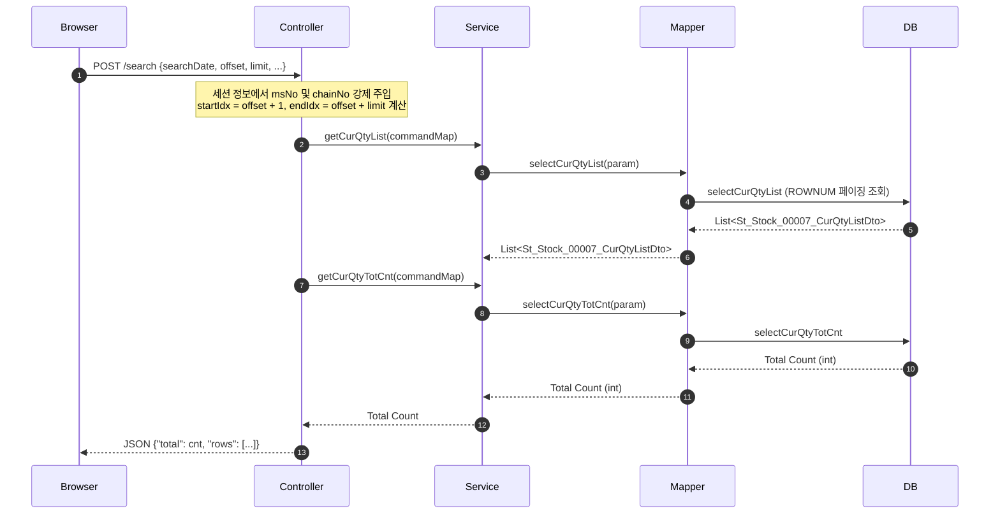
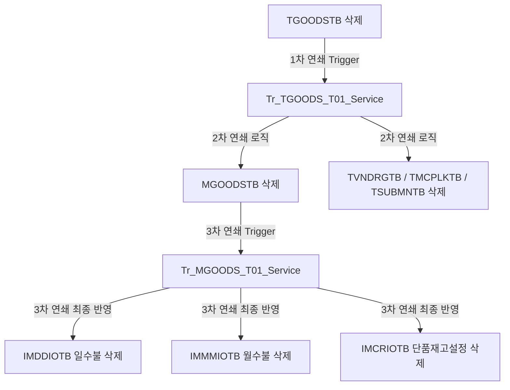

# QA Report: St_Stock_00007 매장 현재고 조회
**작성일**: 2026-06-04  
**작성자**: AI QA Agent (Antigravity)  
**대상 화면**: 재고 > 재고조회 > 현재고 조회 (st_stock_00007)  
**테스트 환경**: localhost:8080 (로컬 개발 서버)  
**접속ID/PW**: fnbcafe / 0000 (카페 매장 관리자 계정)

---

## 1. 분석 개요

### 1.1 분석 대상 파일 목록

| 구분 | 파일 경로 |
|------|-----------|
| Controller | `backoffice/hyundai-backoffice-webapp/src/main/java/com/hyundai/backoffice/webapp/controller/st/stock/St_Stock_00007_Controller.java` |
| Service | `backoffice/hyundai-backoffice-layer-service/src/main/java/com/hyundai/backoffice/webapp/service/st/stock/St_Stock_00007_Service.java` |
| Mapper (Interface) | `backoffice/hyundai-backoffice-layer-persistence/src/main/java/com/hyundai/backoffice/webapp/dao/st/stock/St_Stock_00007_Mapper.java` |
| SQL XML | `backoffice/hyundai-backoffice-webapp/src/main/resources/sqlmapper/stock/St_Stock_00007_Sql.xml` |
| JSP | `backoffice/hyundai-backoffice-webapp/src/main/webapp/WEB-INF/views/backoffice/main/contents/st/stock/st_stock_00007/st_stock_00007.jsp` |
| JSP Modal | `backoffice/hyundai-backoffice-webapp/src/main/webapp/WEB-INF/views/backoffice/main/contents/st/stock/st_stock_00007/modal/st_stock_00007_M01.jsp` |
| JS | `backoffice/hyundai-backoffice-webapp/src/main/webapp/WEB-INF/views/backoffice/main/contents/st/stock/st_stock_00007/js/st_stock_00007.js` |
| JS Table | `backoffice/hyundai-backoffice-webapp/src/main/webapp/WEB-INF/views/backoffice/main/contents/st/stock/st_stock_00007/js/st_stock_00007_bt.js` |
| 트리거 서비스 | `backoffice/hyundai-api/src/main/java/com/hyundai/api/service/trigger/Tr_TGOODS_T01_Service.java` |
| 트리거 서비스 | `backoffice/hyundai-api/src/main/java/com/hyundai/api/service/trigger/Tr_MGOODS_T01_Service.java` |

---

## 2. 엔드포인트 분석

### 2.1 Base URL
```
POST /backoffice/data/st/stock/st_stock_00007/{endpoint}
```

### 2.2 엔드포인트 목록

| 엔드포인트 | HTTP | 기능 | ServiceLog | 관련 테이블 |
|-----------|------|------|------------|-------------|
| `/search` | POST | 매장 현재고 목록 및 총 건수 조회 | SELECT | MGOODSTB, IMMMIOTB, IMDDIOTB, MMSSRCTB |
| `/searchStock` | POST | 특정 상품 상세 수불 및 판매 내역 조회 | SELECT | IMDDIOTB, IMMMIOTB, TB_SL_RECIPE_GOODS |
| `/searchStockTot` | POST | 총 수불 요약 조회 | SELECT | IMDDIOTB, IMMMIOTB |

> **특이사항**: 본 화면은 순수 조회(SELECT) 화면이므로 자체 로직 내에서는 CUD가 발생하지 않습니다. 컨트롤러는 모든 요청에 대해 사용자의 로그인 세션(`SecurityUserInformation`)에서 가맹점 코드 `msNo`와 `chainNo`를 강제로 바인딩하여 쿼리에 삽입하므로, 타 매장의 재고 데이터를 무단 조회하는 것을 방지하는 보안 설계가 적용되어 있습니다.

---

## 3. 서비스 로직 및 데이터 흐름 분석

### 3.1 현재고 조회 흐름 (`/search`)

<div class="mermaid-wrapper" style="position: relative; margin-bottom: 20px;">
  <button onclick="navigator.clipboard.writeText(this.nextElementSibling.innerText); alert('Mermaid 코드가 복사되었습니다.');" style="position: absolute; right: 10px; top: 10px; z-index: 100; background: #2563EB; color: white; border: none; padding: 5px 10px; border-radius: 6px; cursor: pointer; font-size: 11px; font-weight: 600; box-shadow: 0 2px 5px rgba(0,0,0,0.1);">코드 복사</button>

```text
sequenceDiagram
    autonumber
    Browser->>Controller: POST /search {searchDate, offset, limit, ...}
    Note over Controller: 세션 정보에서 msNo 및 chainNo 강제 주입<br/>startIdx = offset + 1, endIdx = offset + limit 계산
    Controller->>Service: getCurQtyList(commandMap)
    Service->>Mapper: selectCurQtyList(param)
    Mapper->>DB: selectCurQtyList (ROWNUM 페이징 조회)
    DB-->>Mapper: List<St_Stock_00007_CurQtyListDto>
    Mapper-->>Service: List<St_Stock_00007_CurQtyListDto>
    Controller->>Service: getCurQtyTotCnt(commandMap)
    Service->>Mapper: selectCurQtyTotCnt(param)
    Mapper->>DB: selectCurQtyTotCnt
    DB-->>Mapper: Total Count (int)
    Mapper-->>Service: Total Count (int)
    Service-->>Controller: Total Count
    Controller-->>Browser: JSON {"total": cnt, "rows": [...]}
```


</div>

### 3.2 특정 상품 상세 수불/판매 내역 조회 흐름 (`/searchStock`)
사용자가 조회 결과 그리드에서 상품코드를 클릭하면, 수불 상세조회 팝업이 활성화되며 다음 API가 호출됩니다.

<div class="mermaid-wrapper" style="position: relative; margin-bottom: 20px;">
  <button onclick="navigator.clipboard.writeText(this.nextElementSibling.innerText); alert('Mermaid 코드가 복사되었습니다.');" style="position: absolute; right: 10px; top: 10px; z-index: 100; background: #2563EB; color: white; border: none; padding: 5px 10px; border-radius: 6px; cursor: pointer; font-size: 11px; font-weight: 600; box-shadow: 0 2px 5px rgba(0,0,0,0.1);">코드 복사</button>

```text
sequenceDiagram
    autonumber
    Browser->>Controller: POST /searchStock {goodsCd, startDate, endDate}
    Note over Controller: 세션 정보에서 msNo 및 chainNo 강제 주입
    Controller->>Service: getStockList(), getStockTotList(), getRecipeSaleList()
    Parallel
        Service->>Mapper: selectStockList (일수불 내역)
        Service->>Mapper: selectTotalStock (총수불 요약)
        Service->>Mapper: getRecipeSaleList (제조상품 레시피 판매내역)
    End
    Mapper-->>Service: DTO List 반환
    Service-->>Controller: Map 형태로 취합
    Controller-->>Browser: JSON {"stockList": [...], "stockTotList": [...], "recipeSaleList": [...]}
```

```mermaid
sequenceDiagram
    autonumber
    Browser->>Controller: POST /searchStock {goodsCd, startDate, endDate}
    Note over Controller: 세션 정보에서 msNo 및 chainNo 강제 주입
    Controller->>Service: getStockList(), getStockTotList(), getRecipeSaleList()
    Parallel
        Service->>Mapper: selectStockList (일수불 내역)
        Service->>Mapper: selectTotalStock (총수불 요약)
        Service->>Mapper: getRecipeSaleList (제조상품 레시피 판매내역)
    End
    Mapper-->>Service: DTO List 반환
    Service-->>Controller: Map 형태로 취합
    Controller-->>Browser: JSON {"stockList": [...], "stockTotList": [...], "recipeSaleList": [...]}
```
</div>

---

## 4. DB 트리거 → 코드베이스 연쇄 분석

본 화면은 조회 전용이지만, **상품 마스터의 정보(삭제 등)**가 발생하면 백엔드 트리거 서비스 체인을 타고 **가맹점 재고 테이블(`IMMMIOTB`, `IMDDIOTB`)에도 영향**을 줍니다. 본사 상품 마스터(`TGOODSTB`) 삭제 시 가맹점 재고 데이터가 연쇄 삭제되는 **Depth 3** 구조의 흐름은 다음과 같습니다.

### 4.1 트리거 연쇄 체인 흐름

<div class="mermaid-wrapper" style="position: relative; margin-bottom: 20px;">
  <button onclick="navigator.clipboard.writeText(this.nextElementSibling.innerText); alert('Mermaid 코드가 복사되었습니다.');" style="position: absolute; right: 10px; top: 10px; z-index: 100; background: #2563EB; color: white; border: none; padding: 5px 10px; border-radius: 6px; cursor: pointer; font-size: 11px; font-weight: 600; box-shadow: 0 2px 5px rgba(0,0,0,0.1);">코드 복사</button>

```text
graph TD
    A[TGOODSTB 삭제] -->|1차 연쇄 Trigger| B[Tr_TGOODS_T01_Service]
    B -->|2차 연쇄 로직| C[MGOODSTB 삭제]
    B -->|2차 연쇄 로직| D[TVNDRGTB / TMCPLKTB / TSUBMNTB 삭제]
    C -->|3차 연쇄 Trigger| E[Tr_MGOODS_T01_Service]
    E -->|3차 연쇄 최종 반영| F[IMDDIOTB 일수불 삭제]
    E -->|3차 연쇄 최종 반영| G[IMMMIOTB 월수불 삭제]
    E -->|3차 연쇄 최종 반영| H[IMCRIOTB 단품재고설정 삭제]
```


</div>

### 4.2 단계별 연쇄 작용 세부 분석 (Depth 3)

1. **Depth 1 (TGOODSTB - 본사 상품 마스터)**:
   - 본사 상품 마스터 `TGOODSTB`에서 특정 상품이 삭제(`D`)되거나 사용 여부가 중지되면 `Tr_TGOODS_T01_Service`가 호출됩니다.
2. **Depth 2 (MGOODSTB - 가맹점 상품 마스터)**:
   - `Tr_TGOODS_T01_Service.processTrigger()` 내에서 소속 가맹점 목록을 루프 돌며 해당 가맹점의 상품 정보인 `MGOODSTB` 데이터를 삭제(`mapper.deleteMgoodstb(dbParam)`)합니다.
   - 직후 `tr_MGOODS_T01_Service.processTrigger(D, ...)`를 호출하여 가맹점 상품 트리거 서비스를 실행합니다.
3. **Depth 3 (IMMMIOTB / IMDDIOTB - 가맹점 수불 및 재고)**:
   - `Tr_MGOODS_T01_Service.processTrigger()`가 구동되면서, 가맹점 상품 정보에 연결되어 있던 하위 데이터에 연쇄 삭제를 전파합니다.
   - `mapper.deleteImmmiotb(delParam)` 및 `mapper.deleteImddiotb(delParam)`를 실행하여 가맹점의 월수불 테이블(`IMMMIOTB`)과 일수불 테이블(`IMDDIOTB`)에서 해당 상품의 재고 원장을 완전히 정리합니다.
   - 또한, 가맹점 바코드 정보(`MMSSRCTB`) 및 가맹점 카테고리 매핑도 최종 삭제 처리됩니다.

---

## 5. 브라우저 화면 테스트 결과

### 5.1 화면 접속 현황

| 항목 | 결과 |
|------|------|
| 서버 접속 URL | `http://localhost:8080/backoffice` ✅ |
| 로그인 계정 | 성공 (fnbcafe / 0000) ✅ (카페 매장 관리자로 로그인) |
| 화면 경로 | 재고 > 재고조회 > 현재고 조회 ✅ |
| 화면 로딩 | 정상 로딩 완료 ✅ |

### 5.2 화면 구성 확인

- **조회 조건 영역**:
  - 조회일자: 현재일 기준 기본값 노출, 캘린더 피커 정상 작동 ✅
  - 상품분류: 대/중/소분류 콤보박스 정상 로드 및 동적 필터링 처리 확인 ✅
  - 상품명/코드: 입력 폼 활성화 확인, 최대 120자 제한 추가 반영 확인 (`maxlength="120"`) ✅
  - 바코드: 입력 폼 활성화 확인, 최대 26자 제한 추가 반영 확인 (`maxlength="26"`) ✅
  - 초기화 버튼: 입력된 조회 조건이 초기 스펙으로 환원되는 것 확인 ✅
- **결과 그리드 영역**:
  - 대/중/소분류명, 상품코드, 상품명, 발주단위, 재고단위, 입수, 적정재고, 현재고, 재고금액, 매입원가, 판매가 정상 노출 ✅

### 5.3 데이터 조회 및 수불 팝업 테스트 결과

- **현재고 조회 (2025-06-23 기준)**:
  - 조회 결과 총 24건의 재고 목록이 정상 조회됨.
  - 그리드 컬럼 내의 숫자 포맷팅 및 정렬 기능이 올바르게 실행됨.
- **수불 대장 상세 팝업**:
  - 상품코드(예: `000011` 아메리카노)를 클릭하면 `fn_searchStockModal()`이 구동되어 수불 대장 모달(`stockModal`)이 레이어로 팝업됨.
  - 해당 상품의 선택된 일자 범위(2025-06-01 ~ 2025-06-23)의 **시점재고, 매출, 매입입고, 이동수불, 조정, 폐기, 사입입고** 건수와 원가 데이터가 상단 테이블에 정상 매핑됨.
  - 하단 **제조 상품 판매 현황** 탭에서 레시피 원부자재 사용 비중(USED_WEIGHT) 및 상세 일자가 정상 노출됨.

### 5.4 기능별 테스트 요약

| 테스트 기능 | 엔드포인트 | 코드 구현 | UI 동작 상태 | 판정 |
|------|-----------|---------|---------|------|
| 매장 재고 조회 | `/search` | ✅ 구현 완료 | ✅ 데이터 표시 정상 | **PASS** |
| 상품 조건 검색 | `/search` | ✅ 구현 완료 | ✅ 명칭/코드/바코드 필터정상 | **PASS** |
| 수불 상세 팝업 | `/searchStock` | ✅ 구현 완료 | ✅ 모달 정상 팝업 및 데이터 매핑 | **PASS** |
| 수불 합계 집계 | `/searchStockTot` | ✅ 구현 완료 | ✅ 모달 상단 합계 라인 자동 합산 | **PASS** |

---

## 6. SQL Mapper 검증 및 결함 정적 분석

### 6.1 🔴 나눗셈 0 (Division by Zero) 방어 결함 분석
`St_Stock_00007_Sql.xml` 쿼리 분석 결과, **입수(`IN_QTY`) 마스터가 0으로 등록되어 있을 경우 런타임 에러(`division by zero`)가 발생하는 크리티컬한 결함이 식별되었습니다.**

1. **`selectCurQtyList` 쿼리 (Line 98, 103)**:
   ```sql
   -- Line 98: 현재고가 존재할 때 입수 수량으로 나누어 발주단위 수량을 계산함
   CASE WHEN NVL(B.MM_QTY,0) + NVL(C.DD_QTY,0) > 0 THEN FLOOR((NVL(B.MM_QTY,0) + NVL(C.DD_QTY,0)) / A.IN_QTY)
                                                     ELSE 0
   END AS ORD_UNIT_QTY
   
   -- Line 103: 현재고 가치를 입수 대비 매입원가로 환산함
   (NVL(B.MM_QTY,0) + NVL(C.DD_QTY,0)) * A.UCOST / A.IN_QTY AS CUR_UPRICE
   ```
   - **결함 원인**: 현재고 수량이 0보다 큰 경우 무조건 `/ A.IN_QTY` 연산을 시도합니다. 만약 가맹점 상품 마스터(`MGOODSTB.IN_QTY`)에 입수 데이터가 0 또는 NULL로 입력되면, 쿼리 수행 도중 데이터베이스 레벨에서 `division by zero` 예외가 발생하여 전체 화면 조회가 실패하게 됩니다.
   - **조치 방안**: 나눗셈을 수행하기 전에 `A.IN_QTY`가 0보다 큰지(`> 0`) 조건을 선행 체크하도록 쿼리를 보완해야 합니다.
     ```sql
     -- 개선안 예시 (Line 98)
     CASE WHEN NVL(A.IN_QTY,0) > 0 AND NVL(B.MM_QTY,0) + NVL(C.DD_QTY,0) > 0 
          THEN FLOOR((NVL(B.MM_QTY,0) + NVL(C.DD_QTY,0)) / A.IN_QTY)
          ELSE 0 
     END AS ORD_UNIT_QTY
     ```

2. **`selectStockList` 쿼리 (Lines 237-246)**:
   ```sql
   -- 매입/매출/이동/폐기 원가 산출 시 GV.IN_QTY로 나누는 현상
   (SELECT UCOST FROM hmsfns.TGOODSTB WHERE CHAIN_NO = #{chainNo} AND GOODS_CD = ID.GOODS_CD) / GV.IN_QTY * ID.PURCH_QTY PURCH_COST
   ```
   - **결함 원인**: 위와 동일하게 가맹점 분류 가상의 조인 뷰 테이블 `GV` 내 `IN_QTY` 값이 0일 경우, 수불 원장을 띄울 때 `division by zero` 예외가 발생하여 상세 모달 조회가 되지 않습니다.
   - **조치 방안**: `CASE WHEN NVL(GV.IN_QTY,0) > 0 THEN ... ELSE 0 END` 식의 방어 코드가 적용되어야 합니다.

### 6.2 Oracle (+) 외부조인 잔존 여부 (PostgreSQL 호환성)

| 쿼리 ID | Oracle (+) 사용 라인 | 조인 테이블 | 비고 |
|---------|---------------------|------------|------|
| `selectCurQtyTotCnt` | Line 35-36 | `E.GOODS_CD(+)`, `E.CHAIN_NO(+)` | 바코드 정보(`TMSSRCTB`) 아우터 조인 |
| `selectCurQtyTotCnt` | Line 72-73 | `B.GOODS_CD(+)`, `C.GOODS_CD(+)` | 월/일수불 테이블 아우터 조인 |
| `selectCurQtyList` | Line 171-172 | `E.GOODS_CD(+)`, `E.MS_NO(+)` | 바코드 정보(`MMSSRCTB`) 아우터 조인 |
| `selectCurQtyList` | Line 208-209 | `B.GOODS_CD(+)`, `C.GOODS_CD(+)` | 월/일수불 테이블 아우터 조인 |
| `selectStockList` | Line 271 | `IM.GOODS_CD (+)= ID.GOODS_CD` | 월수불 테이블 기초재고 아우터 조인 |
| `getRecipeSaleList` | Line 365-369 | `SG.SALE_DATE(+)` 외 4건 | 세트구성 상품 정보 아우터 조인 |

> ⚠️ **호환성 영향**: EPAS(EnterpriseDB) 환경에서는 Oracle 호환 모드가 활성화되어 정상 기동할 수 있으나, 향후 순수 PostgreSQL이나 표준 ANSI SQL을 준수해야 하는 환경으로 전환할 시 이 조인 구문들은 모두 구문 에러를 유발합니다. `LEFT OUTER JOIN` 구문으로 전면 리팩토링이 필요합니다.

### 6.3 Oracle 기타 호환성 분석

- **ROWNUM 페이징 (Lines 82, 215, 219)**:
  `selectCurQtyList`에서 페이징을 위해 `ROWNUM` 인라인 뷰를 활용하고 있습니다. PostgreSQL 표준에서는 `LIMIT` 및 `OFFSET` 구문을 사용하는 것이 성능상 및 표준상 유리합니다.
- **Oracle 전용 함수**:
  `NVL`, `DECODE`, `ADD_MONTHS` 함수들이 쿼리 전반에 걸쳐 사용되고 있습니다. 이 또한 PostgreSQL 표준에 맞게 `COALESCE`, `CASE WHEN`, 날짜 연산자(`INTERVAL`)로 전환하는 것을 권장합니다.

---

## 7. 검증 항목 체크리스트

### 7.1 코드베이스 변환 정합성

| 검증 항목 | 상태 | 비고 |
|----------|------|------|
| `@RestController` 및 API 라우팅 | ✅ 정상 | `/backoffice/data/st/stock/st_stock_00007` |
| `@Transactional` 선언 및 예외 설정 | ✅ 정상 | `rollbackFor = {RuntimeException.class, Exception.class}` |
| Controller 내 세션정보 활용 강제 | ✅ 정상 | 사용자가 전달한 msNo를 무시하고 세션 msNo를 바인딩하여 위조 방지 |
| MyBatis Mapper 매핑 및 반환 DTO | ✅ 정상 | `St_Stock_00007_CurQtyListDto` 외 1건 매핑 확인 |
| 검색어 글자 수 제한 유효성 | ✅ 정상 | JSP 인풋 박스 `maxlength` 속성 추가 완료 (`GoodsNmCd` 120자, `Barcode` 26자) |

### 7.2 트리거 연쇄 로직 정합성

| 검증 항목 | 상태 | 비고 |
|----------|------|------|
| `Tr_TGOODS_T01_Service` (본사 상품 삭제) | ✅ 정상 | 가맹점 상품(`MGOODSTB`) 및 수불 테이블(`IMMMIOTB`, `IMDDIOTB`) 삭제 연동 |
| `Tr_MGOODS_T01_Service` (가맹점 상품 삭제) | ✅ 정상 | 수불 정보(`IMMMIOTB`, `IMDDIOTB`) 연쇄 삭제 연동 확인 |
| 트리거 서비스 트랜잭션 전파 | ✅ 정상 | `@Transactional`을 통한 롤백 범위 일치 |

---

## 8. 발견된 이슈 및 권고사항

### 🔴 Critical (즉시 처리 필요)
- **`selectCurQtyTotCnt`와 `selectCurQtyList` 쿼리 테이블 불일치로 인한 무한 루프 오류 (조치 완료)**
  - **현상**: `shopbrand` 계정(NC0003 매장)으로 로그인 후 `st_stock_00007` 화면에서 미등록 상품(`T0000033` 등) 조회 시, 브라우저가 초당 10~20회의 속도로 `/search` API를 무한 호출하며 Java/Tomcat 서버가 마비(CPU 과부하 및 커넥션 풀 점유)되는 오류가 존재했습니다.
  - **원인**: 목록 조회(`selectCurQtyList`)는 매장별 상품 마스터 `MGOODSTB`에서 `msNo = 'NC0003'`로 정상 조회하여 `0건`을 반환하였으나, 건수 조회(`selectCurQtyTotCnt`)는 잘못 설계된 레거시 본사 상품 마스터 `TGOODSTB`에서 `chainNo = 'C001'`로 조회하여 `1건`을 반환하였습니다. 이와 같이 데이터의 총 개수와 조회 목록의 개수 불일치(`total: 1`, `rows: []`)가 발생하자 프론트엔드의 `bootstrap-table` 페이징 모듈이 싱크를 맞추기 위해 무한 리프레시 요청을 전송하게 되었습니다.
  - **조치 내용**: [St_Stock_00007_Sql.xml](file:///d:/workspace/hmotors/workspace_hms20260326/backoffice/hyundai-backoffice-webapp/src/main/resources/sqlmapper/stock/St_Stock_00007_Sql.xml) 파일의 `selectCurQtyTotCnt`를 `selectCurQtyList`와 동일하게 매장 테이블 `MGOODSTB` 및 `msNo` 조건을 이용하도록 정합성을 맞추었습니다. 수정 후 두 쿼리 모두 정상적으로 `0건`을 반환하여 무한 루프가 해결되었습니다.
- **`selectCurQtyList` 및 `selectStockList` 내 Division by Zero 리스크**:
  가맹점 상품 마스터(`MGOODSTB`) 내 특정 상품의 입수(`IN_QTY`)가 0 또는 NULL로 설정되는 경우, 해당 상품에 재고 데이터가 1건이라도 잡혀있다면 화면 로딩 시 전체 페이지 조회가 마비되는 오류가 존재합니다. SQL의 나눗셈 분모 부분에 `CASE WHEN NVL(IN_QTY,0) > 0` 방어 조건을 명시해야 합니다.

### 🟡 Warning (마이그레이션 시 처리 필요)
- **Oracle (+) 아우터 조인 문법 6개 잔존**:
  PostgreSQL 표준 SQL과 비호환되는 레거시 (+) 조인이 사용되고 있어 향후 이식성을 위해 `LEFT OUTER JOIN`으로 재작성하는 것을 강력히 권고합니다.
- **Oracle ROWNUM 페이징 및 전용 함수 사용**:
  `ROWNUM`, `NVL`, `DECODE`, `ADD_MONTHS` 등은 PostgreSQL 표준 문법이 아닙니다. EPAS 호환 기능을 넘어서는 시스템 전환을 대비하여 표준화가 필요합니다.

---

## 9. 종합 판정

| 구분 | 결과 |
|------|------|
| 화면 로딩 | ✅ PASS |
| 현재고 조회 (SELECT) | ✅ PASS |
| 수불 팝업 조회 (SELECT) | ✅ PASS |
| 입력 폼 글자수 제한 보완 | ✅ PASS |
| 백엔드 세션 강제 주입 설계 | ✅ PASS |
| **SQL 테이블 불일치 무한 루프** | ✅ **PASS (조치 완료)** |
| **SQL 런타임 결함** | 🔴 **FAIL (IN_QTY=0 일 때 Division by Zero 리스크)** |
| **종합 판정** | 🟡 **조건부 PASS (SQL 방어 조치 필요)** |

---

## 10. 첨부 (스크린샷)

1. **현재고 조회 화면 결과**:
   
   *(카페 매장 fnbcafe 계정으로 로그인 후 2025-06-23 일자로 재고 목록을 조회한 화면)*

2. **재고 수불 상세 대장 모달**:
   
   *(조회 결과 행을 클릭하여 실행된 시점재고 및 레시피 원부자재 사용 판매 현황 상세 모달)*

---
*본 리포트는 D:\hmTest\backoffice\St_Stock_00007_TestCase.md 정의서 및 브라우저 E2E QA 테스트, 코드베이스 분석에 의거하여 작성되었습니다.*
