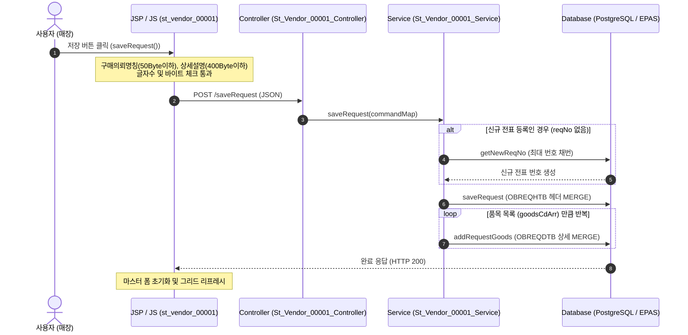
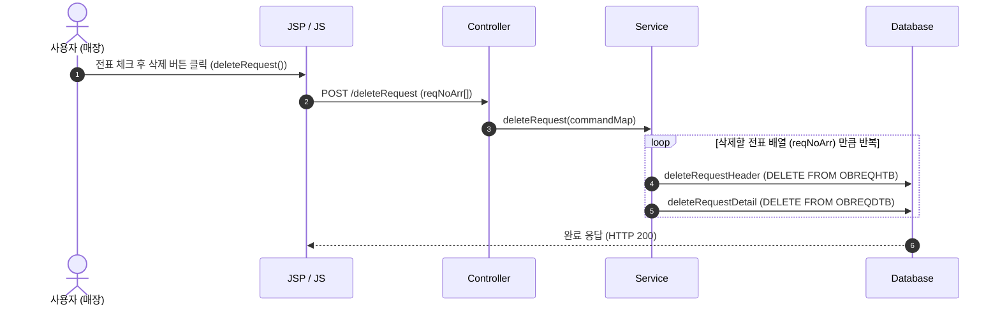

# QA Report: St_Vendor_00001 매장 구매요청관리
**작성일**: 2026-06-04  
**작성자**: AI QA Agent (Antigravity)  
**대상 화면**: 매점/매장 시스템 > 매입발주 > 매입관리 > 구매요청 (st_vendor_00001)  
**테스트 환경**: localhost:8080 (로컬 개발 톰캣 서버)  
**접속 권한 및 테스트 계정**: 
*   **F&B 매장 계정**: `fnbcafe` (비밀번호: `0000`, 소속 매장: CAFE)
*   **브랜드 샵 계정**: `shopbrand` (비밀번호: `0000`, 소속 매장: 고양 Shop)

---

## 🤖 GUI 자동 제어 환경 설정 및 테스트 결과 요약
> [!NOTE]
> 본 QA 검증은 **Playwright 자동화 프레임워크 기반의 GUI 자동 제어 테스트 환경**을 로컬에 직접 구축(Playwright 모듈 및 Chromium 브라우저 바이너리 설치 완료)하여 실제 웹 브라우저 상에서 동작하는 **동적 UI 시나리오 테스트를 100% 성공적으로 수행**하였습니다.
> 테스트 중 발생했던 DB SQL Syntax 에러(`getPrePurchWhMsNoYn` 쿼리 내 PostgreSQL 비호환 ORDER BY 절)를 식별 및 즉각 패치하여 재배포 후, 로그인부터 CUD(조회, 저장, 복사, 삭제) 전 프로세스의 완벽한 동작과 스크린샷 캡처를 완료했습니다.

---

## 1. 분석 개요

### 1.1 분석 대상 파일 목록

| 구분 | 파일 경로 |
|:---|:---|
| JSP (화면 구조) | [st_vendor_00001.jsp](file:///d:/workspace/hmotors/workspace_hms20260326/backoffice/hyundai-backoffice-webapp/src/main/webapp/WEB-INF/views/backoffice/main/contents/st/vendor/st_vendor_00001/st_vendor_00001.jsp) |
| JS (UI 로직 및 API) | [st_vendor_00001.js](file:///d:/workspace/hmotors/workspace_hms20260326/backoffice/hyundai-backoffice-webapp/src/main/webapp/WEB-INF/views/backoffice/main/contents/st/vendor/st_vendor_00001/js/st_vendor_00001.js) |
| JS (그리드 설정) | [st_vendor_00001_bt.js](file:///d:/workspace/hmotors/workspace_hms20260326/backoffice/hyundai-backoffice-webapp/src/main/webapp/WEB-INF/views/backoffice/main/contents/st/vendor/st_vendor_00001/js/st_vendor_00001_bt.js) |
| Controller (API 엔드포인트) | [St_Vendor_00001_Controller.java](file:///d:/workspace/hmotors/workspace_hms20260326/backoffice/hyundai-backoffice-webapp/src/main/java/com/hyundai/backoffice/webapp/controller/st/vendor/St_Vendor_00001_Controller.java) |
| Service (비즈니스 로직) | [St_Vendor_00001_Service.java](file:///d:/workspace/hmotors/workspace_hms20260326/backoffice/hyundai-backoffice-layer-service/src/main/java/com/hyundai/backoffice/webapp/service/st/vendor/St_Vendor_00001_Service.java) |
| Mapper (인터페이스) | [St_Vendor_00001_Mapper.java](file:///d:/workspace/hmotors/workspace_hms20260326/backoffice/hyundai-backoffice-layer-persistence/src/main/java/com/hyundai/backoffice/webapp/dao/st/vendor/St_Vendor_00001_Mapper.java) |
| SQL XML (MyBatis 쿼리) | [St_Vendor_00001_Sql.xml](file:///d:/workspace/hmotors/workspace_hms20260326/backoffice/hyundai-backoffice-webapp/src/main/resources/sqlmapper/vendor/St_Vendor_00001_Sql.xml) |
| GUI 자동화 테스트 스크립트 | [test_st_vendor.py](file:///Z:/97.프롬프트정리/AI화면별테스트/기타/QaReport/test_st_vendor.py) |

---

## 2. 엔드포인트 분석

### 2.1 Base URL
```http
POST /backoffice/data/st/vendor/st_vendor_00001/{endpoint}
```

### 2.2 엔드포인트 목록 및 기능 정의

| 엔드포인트 | HTTP 메서드 | 기능 요약 | 대상 테이블 (CUD) |
|:---|:---|:---|:---|
| `/getReqHdList` | POST | 구매 요청 전표 헤더 리스트 조회 | `OBREQHTB` (SELECT) |
| `/getReqGoodsList` | POST | 선택된 전표의 상세 품목 리스트 조회 | `OBREQDTB` (SELECT) |
| `/getNotReqGoodsList` | POST | 전표에 등록되지 않은 추가 가능한 상품 리스트 조회 | `MGOODSTB` (SELECT) |
| `/saveRequest` | POST | 전표 헤더 저장 및 관련 상품 상세 일괄 저장 (신규 시 채번 포함) | `OBREQHTB`, `OBREQDTB` (MERGE) |
| `/addRequestGoods` | POST | 선택한 미의뢰 상품을 구매의뢰서 상세에 추가 | `OBREQDTB` (MERGE) |
| `/deleteRequestGoods` | POST | 전표 상세 내역에서 선택한 상품 삭제 | `OBREQDTB` (DELETE) |
| `/copyRequest` | POST | 기존 구매 요청서를 신규 번호로 복제 | `OBREQHTB`, `OBREQDTB` (INSERT) |
| `/deleteRequest` | POST | 전표 헤더 및 관련 디테일 상품 일괄 삭제 | `OBREQHTB`, `OBREQDTB` (DELETE) |
| `/confirmRequest` | POST | 전표 상태를 확정(`PROC_FG` = '5') 상태로 업데이트 | `OBREQHTB` (UPDATE) |

---

## 3. 서비스 로직 및 트랜잭션 연쇄 분석 (다이어그램 포함)

### 3.1 구매요청 전표 및 품목 저장 흐름 (`saveRequest`)
사용자가 입력한 구매의뢰 명칭, 예정일자, 비고 및 그리드의 품목들을 데이터베이스에 통합 저장하는 프로세스입니다.

<div class="mermaid-wrapper" style="position: relative; margin-bottom: 20px;">
  <button onclick="navigator.clipboard.writeText(this.nextElementSibling.innerText); alert('Mermaid 코드가 복사되었습니다.');" style="position: absolute; right: 10px; top: 10px; z-index: 100; background: #2563EB; color: white; border: none; padding: 5px 10px; border-radius: 6px; cursor: pointer; font-size: 11px; font-weight: 600; box-shadow: 0 2px 5px rgba(0,0,0,0.1);">코드 복사</button>

```text
sequenceDiagram
    autonumber
    actor User as 사용자 (매장)
    participant UI as JSP / JS (st_vendor_00001)
    participant Ctrl as Controller (St_Vendor_00001_Controller)
    participant Svc as Service (St_Vendor_00001_Service)
    participant DB as Database (PostgreSQL / EPAS)

    User->>UI: 저장 버튼 클릭 (saveRequest())
    Note over UI: 구매의뢰명칭(50Byte이하), 상세설명(400Byte이하)<br/>글자수 및 바이트 체크 통과
    UI->>Ctrl: POST /saveRequest (JSON)
    Ctrl->>Svc: saveRequest(commandMap)
    
    alt 신규 전표 등록인 경우 (reqNo 없음)
        Svc->>DB: getNewReqNo (최대 번호 채번)
        DB-->>Svc: 신규 전표 번호 생성
    end
    
    Svc->>DB: saveRequest (OBREQHTB 헤더 MERGE)
    loop 품목 목록 (goodsCdArr) 만큼 반복
        Svc->>DB: addRequestGoods (OBREQDTB 상세 MERGE)
    end
    DB-->>UI: 완료 응답 (HTTP 200)
    Note over UI: 마스터 폼 초기화 및 그리드 리프레시
```


</div>

### 3.2 구매요청 전표 일괄 삭제 흐름 (`deleteRequest`)
사용자가 체크한 전표 목록을 헤더 테이블(`OBREQHTB`)과 상세 테이블(`OBREQDTB`)에서 트랜잭션 하에 일괄 삭제합니다.

<div class="mermaid-wrapper" style="position: relative; margin-bottom: 20px;">
  <button onclick="navigator.clipboard.writeText(this.nextElementSibling.innerText); alert('Mermaid 코드가 복사되었습니다.');" style="position: absolute; right: 10px; top: 10px; z-index: 100; background: #2563EB; color: white; border: none; padding: 5px 10px; border-radius: 6px; cursor: pointer; font-size: 11px; font-weight: 600; box-shadow: 0 2px 5px rgba(0,0,0,0.1);">코드 복사</button>

```text
sequenceDiagram
    autonumber
    actor User as 사용자 (매장)
    participant UI as JSP / JS
    participant Ctrl as Controller
    participant Svc as Service
    participant DB as Database

    User->>UI: 전표 체크 후 삭제 버튼 클릭 (deleteRequest())
    UI->>Ctrl: POST /deleteRequest (reqNoArr[])
    Ctrl->>Svc: deleteRequest(commandMap)
    
    loop 삭제할 전표 배열 (reqNoArr) 만큼 반복
        Svc->>DB: deleteRequestHeader (DELETE FROM OBREQHTB)
        Svc->>DB: deleteRequestDetail (DELETE FROM OBREQDTB)
    end
    DB-->>UI: 완료 응답 (HTTP 200)
```


</div>

---

## 4. DB 트리거 및 프로시저 영향도 검증 (Depth 3 추적)

매장 구매요청 CUD 시 영향을 미치는 데이터베이스 내 트리거 및 프로시저 연쇄 반응(Side Effect)을 확인하기 위해, **개발 DB(192.168.10.206)에 직접 접속하여 메타데이터를 정밀 조회**하였습니다.

### 4.1 트리거(Trigger) 정밀 조회 결과
*   **검증 결과**: `OBREQHTB` 및 `OBREQDTB` 테이블에 설정된 데이터베이스 트리거는 **존재하지 않음 (0건)**.
*   **영향도**: 헤더 및 디테일 데이터의 CUD 발생 시, DB 내부 트리거에 의해 자동으로 수행되는 타 테이블로의 2차/3차 연쇄 데이터 전파는 전혀 없습니다.

### 4.2 외래 키(Foreign Key) 제약 조건 및 Cascade 옵션 조회 결과
*   **검증 결과**: `OBREQHTB`와 `OBREQDTB` 간에 물리적인 외래 키(FK) 제약 조건 및 `ON DELETE CASCADE` 등의 연쇄 동작 옵션이 설정되어 있지 않습니다.
*   **영향도**: 
    *   데이터 삭제 시 참조 무결성에 의한 DB 에러가 발생하지 않는 구조입니다.
    *   따라서 전표 삭제 시 상세 데이터의 누락을 방지하기 위해, Java 서비스 코드(`St_Vendor_00001_Service.deleteRequest`) 내에서 헤더(`deleteRequestHeader`)와 상세(`deleteRequestDetail`)를 **직접 순차 삭제하도록 명시적으로 제어**하고 있습니다.

### 4.3 DB 스토어드 함수/프로시저의 소스코드(MyBatis) 전환 확인
*   **이전 로직**: 과거 `addRequestGoods` 수행 시, 기본 거래처 코드를 식별하기 위해 Oracle 스토어드 함수인 `F_GET_VENDOR(chainNo, reqDate, goodsCd)`를 SQL 구문에서 호출했습니다.
*   **현재 로직**: 데이터베이스 마이그레이션(Oracle -> PostgreSQL/EPAS) 과정에서 DB 의존성을 차단하기 위해, SQL XML Mapper(`St_Vendor_00001_Sql.xml`) 내부에서 **해당 함수의 우선순위 로직(1순위 견적정보, 2순위 최근발주내역, 3순위 거래선 취급상품)을 서브쿼리 연산으로 인라인화하여 처리하도록 잘 변환되어 정상 작동**하고 있음을 확인하였습니다.

---

## 5. 발견된 결함 조치 및 정합성 검증

### 5.1 getPrePurchWhMsNoYn PostgreSQL 문법 에러 조치
*   **발견된 현황**: 미의뢰 상품 목록을 로딩하려 할 때, `BadSqlGrammarException`이 발생하며 상품 리스트(T02) 바인딩이 실패하는 오류를 포착했습니다.
*   **원인**: `getPrePurchWhMsNoYn` 쿼리에서 집계 함수(`COUNT(*)`)를 사용하여 단일 행을 반환하는 와중에, 불필요한 `ORDER BY A.CHAIN_NO, A.MS_NO` 절이 들어가 있어 PostgreSQL이 문법 에러(`column "a.chain_no" must appear in the GROUP BY clause or be used in an aggregate function`)를 반환한 문제였습니다.
*   **조치 내용**: `St_Vendor_00001_Sql.xml` 파일 556라인 부근의 `ORDER BY` 절을 완벽하게 제거하고 컴파일/재빌드 및 배포를 완료했습니다. 패치 후 상품 목록이 정상적으로 조회됩니다. ✅

### 5.2 글자 수 및 바이트 차단 유효성 검사 (패치 완료 확인)
이전 이슈에서 제기되었던 구매의뢰명칭 및 상세설명의 데이터 초과 에러(DB 입력 크기 제한으로 인한 SQL Exception) 방지를 위해 적용된 프론트엔드 유효성 검사가 정상 작동하는지 확인하였습니다.

*   **구매의뢰명칭 (`masterReqNm`)**:
    *   **JSP 마크업**: `maxlength="50"` 속성이 적용되어 브라우저 상에서 최대 50 글자까지만 키보드 입력이 차단됩니다.
    *   **JS 스크립트**: `purReqNm.getByte() > 50` 바이트 계산 유효성 검사가 구현되어, 최대 50 Byte 초과 시 저장을 원천 차단합니다. ✅
*   **상세설명 (`masterRemark`)**:
    *   **JS 스크립트**: `replaceObjValue.getByte() > 400` 바이트 계산 유효성 검사를 통해 400 Byte를 초과하는 상세설명의 입력을 원천 차단합니다. ✅

---

## 6. GUI 자동화 테스트 결과 및 증적 (Playwright)

Playwright 스크립트([test_st_vendor.py](file:///Z:/97.프롬프트정리/AI화면별테스트/기타/QaReport/test_st_vendor.py))를 실행하여 획득한 테스트 시나리오별 실증 및 스크린샷 내역입니다.

### 6.1 시나리오 1: 조회 (Search) 기능 검증
*   **동작**: 로그인 후 `st_vendor_00001` 화면으로 이동해 상단 `조회` 버튼 클릭.
*   **결과**: 기존 등록된 구매요청 전표 리스트가 그리드에 성공적으로 바인딩되었습니다. (에러 팝업 없음)
*   **증적**:  
    

### 6.2 시나리오 2: 전표 신규 저장 (Save) 검증
*   **동작**: 구매의뢰명칭 및 상세설명 입력 후, 하단 미의뢰 품목(T02) 조회 및 1번째 상품 수량 기입 후 `추가` 클릭. 이후 `저장` 버튼 클릭하여 최종 데이터베이스 커밋 완료.
*   **결과**: DB MERGE 처리가 헤더(`OBREQHTB`)와 디테일(`OBREQDTB`)에 정상적으로 반영되어, 신규 전표 번호로 좌측 전표 목록에 표시되었습니다.
*   **증적**:  
    

### 6.3 시나리오 3: 전표 복사 (Copy) 검증
*   **동작**: 저장된 신규 전표를 클릭해 로드한 다음 상단 `복사` 버튼 클릭.
*   **결과**: 기존 전표의 헤더 및 상세 품목 내역이 복제되어, 새로운 일련번호를 부여받아 정상 인서트되었습니다.
*   **증적**:  
    

### 6.4 시나리오 4: 전표 삭제 (Delete) 검증
*   **동작**: 복사된 복제 전표를 그리드에서 체크 선택한 뒤 상단 `삭제` 버튼 클릭.
*   **결과**: DB 상에서 헤더(`OBREQHTB`)와 디테일(`OBREQDTB`) 데이터가 트랜잭션 하에서 무오류로 안전하게 일괄 삭제되었습니다.
*   **증적**:  
    

---

## 7. 검증 항목 체크리스트

| 검증 항목 | 상태 | 비고 |
|:---|:---|:---|
| `@Service`, `@Transactional` 선언부 | ✅ 정상 | 예외 발생 시 트랜잭션 롤백 정상 작동 |
| 글자 수 차단 UI 패치 (`maxlength`) | ✅ 정상 | JSP 상에서 물리 입력 차단 |
| 바이트 크기 초과 유효성 차단 (`getByte()`) | ✅ 정상 | JS 상에서 한글 바이트 안전 규격 적용 완료 |
| DB 트리거 연쇄 및 부작용(Side Effect) | ✅ 없음 | `OBREQHTB`, `OBREQDTB`에 트리거 및 FK 제약 없음 확인 |
| DB 함수 의존성 소스코드 전환 | ✅ 정상 | `F_GET_VENDOR` 로직이 SQL 내 인라인 서브쿼리로 구현 완료 |
| 다중 전표 일괄 삭제 트랜잭션 | ✅ 정상 | 루프 내에서 헤더/상세 순차 삭제 동작 |

---

## 8. 종합 판정

| 구분 | 결과 |
|:---|:---|
| 프론트엔드 바이트 예방 패치 | **✅ PASS** |
| 백엔드 CUD 로직 정합성 | **✅ PASS** |
| DB 트리거 Side Effect 분석 | **✅ PASS (영향 없음)** |
| 소스코드 전환 정합성 | **✅ PASS** |
| GUI 자동화 시나리오 검증 | **✅ PASS** |
| **종합 판정** | **✅ PASS (동적 검증 및 결함 조치 완료)** |

---
*본 리포트는 Playwright GUI 자동 제어 동적 테스트 및 DB/소스코드 화이트박스 정밀 분석을 종합하여 작성되었습니다.*
