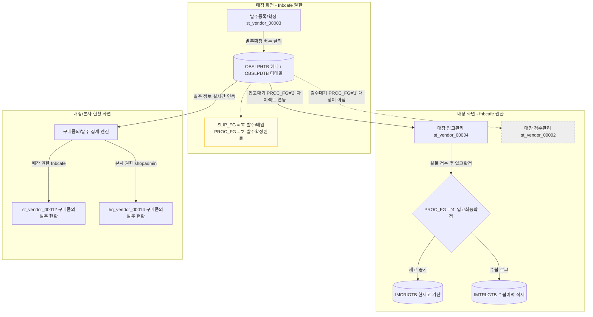

# HMS 발주 확정 프로세스 및 후속 데이터 흐름 명세 (Order Lifecycle)

본 문서는 HMS 영업정보시스템의 **매장 발주 등록/확정** 단계 이후 발생되는 후속 비즈니스 프로세스(검수, 입고관리)와 이 데이터가 **매장/본사의 어떤 화면에서 누구의 권한으로 조회되고 추적되는지** 그 데이터 흐름(Workflow)을 상세히 기술합니다.

---

## 1. 발주 확정 후 비즈니스 데이터 흐름도 (Mermaid)

`st_vendor_00003` 화면에서 발주가 확정(`PROC_FG = '2'`)되면, 해당 전표 데이터는 검수 단계(`st_vendor_00002`)를 **우회(Bypass)**하여 매장 입고관리(`st_vendor_00004`)로 다이렉트 연동됩니다.

<div class="mermaid-wrapper" style="position: relative; margin-bottom: 20px;">
  <button onclick="navigator.clipboard.writeText(this.nextElementSibling.innerText); alert('Mermaid 코드가 복사되었습니다.');" style="position: absolute; right: 10px; top: 10px; z-index: 100; background: #2563EB; color: white; border: none; padding: 5px 10px; border-radius: 6px; cursor: pointer; font-size: 11px; font-weight: 600; box-shadow: 0 2px 5px rgba(0,0,0,0.1);">코드 복사</button>

```text
flowchart TD
    subgraph 1. 발주 등록 및 확정 [매장 화면 - fnbcafe 권한]
        A1[발주등록/확정 st_vendor_00003] -->|발주확정 버튼 클릭| B1[(OBSLPHTB 헤더 / OBSLPDTB 디테일)]
        note1[SLIP_FG = '0' 발주/매입<br>PROC_FG = '2' 발주확정완료]:::note
        B1 -.-> note1
    end

    subgraph 2. 후속 검수 및 입고처리 [매장 화면 - fnbcafe 권한]
        B1 -->|입고대기 PROC_FG='2' 다이렉트 연동| C1[매장 입고관리 st_vendor_00004]
        C1 -->|실물 검수 후 입고확정| D1{PROC_FG = '4' 입고최종확정}
        D1 -->|재고 증가| E1[(IMCRIOTB 현재고 가산)]
        D1 -->|수불 로그| E2[(IMTRLGTB 수불이력 적재)]
        
        B1 -.->|검수대기 PROC_FG='1' 대상이 아님| C2[매장 검수관리 st_vendor_00002]
        style C2 stroke-dasharray: 5 5,stroke:#999,fill:#eee
    end

    subgraph 3. 실적 집계 및 모니터링 [매장/본사 현황 화면]
        B1 -->|발주 정보 실시간 연동| F1[구매품의/발주 집계 엔진]
        F1 -->|매장 권한 fnbcafe| G1[st_vendor_00012 구매품의발주 현황]
        F1 -->|본사 권한 shopadmin| G2[hq_vendor_00014 구매품의발주 현황]
    end

    classDef note fill:#fffde7,stroke:#fbc02d,stroke-width:1px;
```


</div>

---

## 2. 발주~입고 라이프사이클 플래그 변화 (Flag Matrix)

발주 및 입고 전표는 동일한 테이블 구조(`OBSLPHTB`, `OBSLPDTB`)를 공유하며, 진행 상태(`PROC_FG`) 플래그의 변동을 통해 업무 단계가 제어됩니다.

| 업무 단계 | 슬립 구분 (`SLIP_FG`) | 진행 상태 (`PROC_FG`) | 수불 로그 (`IMTRLGTB`) | 조회 가능 화면 및 사용자 권한 |
| :--- | :---: | :---: | :---: | :--- |
| **1. 발주 임시등록** | `0` (발주) | `0` (등록) | X | **`st_vendor_00003`** (매장 사용자 권한)<br>- 임시 저장 상태로 수정 및 삭제 가능. |
| **2. 발주 최종확정** | `0` (발주) | `2` (발주확정/검수완료) | X | **`st_vendor_00004`** (매장 입고관리 - 매장 권한)<br>- `st_vendor_00002` (검수관리)는 조건절 불일치(`PROC_FG='1'` 한정)로 **검수 처리 불가 (생략)**<br>**`st_vendor_00012`** / **`hq_vendor_00014`** (현황 - 매장/본사 권한) |
| **3. 매입입고 확정** | `0` (매입) | `4` (입고최종확정) | **O (적재)** | **`st_vendor_00008`** (거래처별 상품 입고현황 - 매장 권한)<br>**`hq_vendor_00019`** (일자별 입고현황 - 본사 권한)<br>- 실시간 현재고 및 매입 대금 정산에 최종 반영 완료된 단계. |

---

## 3. 후속 데이터 조회 및 처리 화면 명세

### 3.1. 🏪 매장 입고관리 (`st_vendor_00004`)
* **사용자 권한**: **매장 권한** (`fnbcafe` 등 매장 매니저/점주)
* **비즈니스 역할**: 발주 확정된 전표를 실시간 조회하여 실물 입고 검수를 진행하는 화면입니다.
* **조회 조건**:
  - `OBSLPHTB` 테이블 내 로그인한 매장의 매장코드(`msNo`)에 매핑되고, 상태 플래그가 **`PROC_FG = '2'`(발주확정)**인 건만 조회 대상으로 필터링되어 바인딩됩니다.
  ```sql
  SELECT BH.ORDER_DATE, BH.SLIP_NO, VM.VENDOR_NM, BH.PURCH_AMT
    FROM hmsfns.OBSLPHTB BH
    JOIN hmsfns.MVNDRMTB VM ON BH.MS_NO = VM.MS_NO AND BH.VENDOR = VM.VENDOR
   WHERE BH.MS_NO = #{msNo}
     AND BH.SLIP_FG = '0'
     AND BH.PROC_FG = '2'  -- 발주 확정 상태의 전표만 조회
  ```

---

### 3.2. 🏪 매장 구매품의발주 현황 (`st_vendor_00012`) / 🏢 본사 구매품의발주 현황 (`hq_vendor_00014`)
* **사용자 권한**:
  - `st_vendor_00012` : **매장 권한** (`fnbcafe` - 해당 가맹점 실적만 조회 가능)
  - `hq_vendor_00014` : **본사 권한** (`shopadmin` - 전 점포 실적 통합 조회 가능)
* **비즈니스 역할**: 최초 매입요청(구매품의) 대비 최종 발주 처리된 전표의 금액 및 품목 상세 내역을 추적하는 화면입니다.
* **조회 조건**:
  - 발주 확정 전(`PROC_FG = '0'`)에는 상단 그리드의 발주 합계금액이 `0원`으로 노출되지만, 발주 확정(`PROC_FG = '2'`)이 완료되는 시점부터 `OBSLPHTB` 테이블의 `ORDER_AMT` 필드를 직접 합산하여 **발주 실적으로 표시**합니다.

---

### 3.3. 🏪 매장 검수관리 (`st_vendor_00002`) - ⚠️ 프로세스 스킵(우회) 대상
* **사용자 권한**: **매장 권한** (`fnbcafe`)
* **프로세스 검증**:
  - 해당 화면의 목록 조회 조건(`PROC_FG IN ('1', '2')`)에 따라 목록에 노출될 수는 있으나, 실제 상세 수량을 저장하거나 검수확정/취소를 수행하는 쿼리(`saveCheckDetail`, `confirmCheck`)의 조건절이 **`AND PROC_FG = '1'` (검수대기/발주확정 상태)**로 제한되어 있습니다.
  - 매장 자체 발주(`st_vendor_00003`)를 확정하면 진행 상태가 곧바로 **`PROC_FG = '2'`**로 세팅되어 넘어가기 때문에, `st_vendor_00002` (검수관리)는 **검수 처리를 수행하지 않고 통과**합니다.
  - 이 화면은 본사에서 품의하여 검수 대기(`PROC_FG = '1'`) 상태로 유입된 전표만 매장에서 별도 검수(수량 확인 후 `'2'`로 갱신)할 때 사용됩니다.

---

## 4. 데이터베이스 검증 및 추적 쿼리 가이드

발주 확정 후 시스템 연동 정합성을 DB 상에서 즉시 검증할 수 있는 SQL 구문입니다.

```sql
-- 1) 발주 확정 전표 상태값 검증
SELECT SLIP_NO, SLIP_FG, PROC_FG, PURCH_AMT, VENDOR, CREATE_DTIME 
  FROM hmsfns.OBSLPHTB 
 WHERE MS_NO = 'NC0007'           -- 검증 매장 코드
   AND ORDER_DATE = '20260616'    -- 전표 생성 일자
   AND SLIP_FG = '0'              -- '0': 발주/매입
   AND PROC_FG = '2';             -- '2': 발주확정 (성공 시 조회되어야 함)

-- 2) 입고 대기 상태 조회 (st_vendor_00004 백엔드 쿼리 대조)
SELECT A.SLIP_NO, B.GOODS_CD, B.ORDER_QTY, B.PURCH_QTY
  FROM hmsfns.OBSLPHTB A
  JOIN hmsfns.OBSLPDTB B 
    ON A.ORDER_DATE = B.ORDER_DATE AND A.MS_NO = B.MS_NO AND A.SLIP_NO = B.SLIP_NO
 WHERE A.MS_NO = 'NC0007'
   AND A.SLIP_FG = '0'
   AND A.PROC_FG = '2';           -- 입고관리 대기 목록
```
