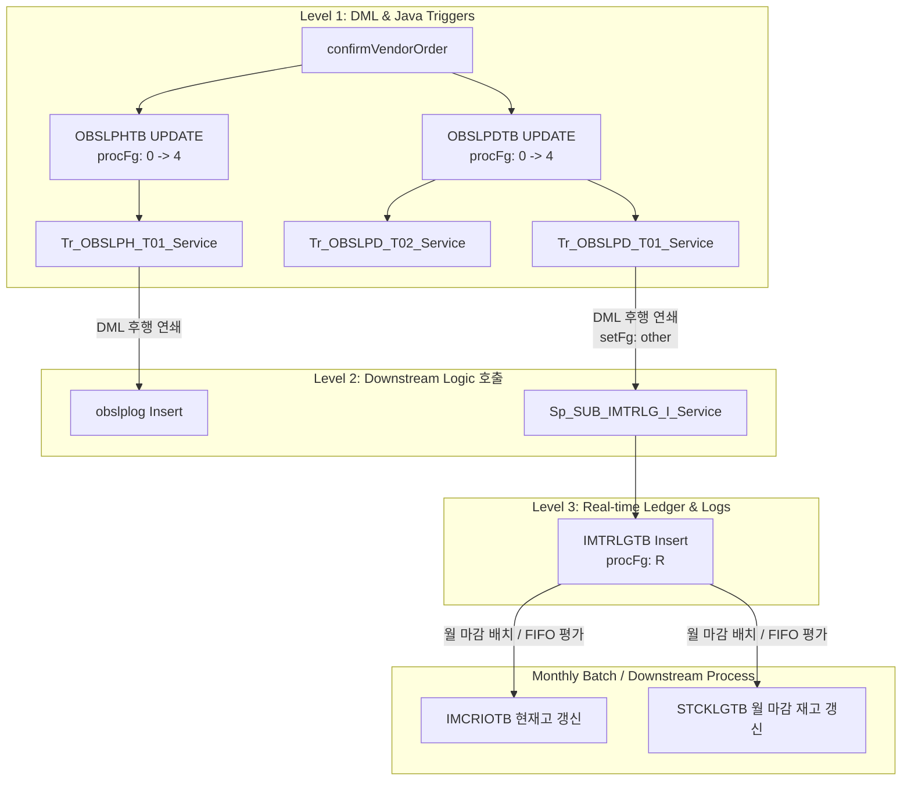

# QA Report: St_Vendor_00005 반품등록
**작성일**: 2026-06-16  
**작성자**: AI QA Agent (Antigravity)  
**대상 화면**: 거래처 > 반품등록 (st_vendor_00005)  
**테스트 환경**: http://localhost:8080 (로컬 개발 서버)  
**접속ID/PW**: fnbcafe / 0000 (매장 NC0007)  

---

## 1. 분석 개요

### 1.1 분석 대상 파일 목록

| 구분 | 파일 경로 |
|------|-----------|
| Controller | `hyundai-backoffice-webapp/.../controller/st/vendor/St_Vendor_00005_Controller.java` |
| Service | `hyundai-backoffice-layer-service/.../service/st/vendor/St_Vendor_00005_Service.java` |
| Mapper (Interface) | `hyundai-backoffice-layer-persistence/.../dao/st/vendor/St_Vendor_00005_Mapper.java` |
| SQL XML | `hyundai-backoffice-webapp/.../sqlmapper/vendor/St_Vendor_00005_Sql.xml` |
| DTO | `hyundai-backoffice-layer-domain/.../dto/st/vendor/St_Vendor_00005_VendorOrderListDto.java` <br/> `hyundai-backoffice-layer-domain/.../dto/st/vendor/St_Vendor_00005_VendorOrderDetailListDto.java` <br/> `hyundai-backoffice-layer-domain/.../dto/st/vendor/St_Vendor_00005_VendorGoodsListDto.java` |
| 트리거 서비스 | `hyundai-api/.../service/trigger/Tr_OBSLPH_T01_Service.java` |
| 트리거 서비스 | `hyundai-api/.../service/trigger/Tr_OBSLPD_T01_Service.java` |
| 트리거 서비스 | `hyundai-api/.../service/trigger/Tr_OBSLPD_T02_Service.java` |
| 프로시저 서비스 | `hyundai-api/.../service/procedure/Sp_SUB_IMTRLG_I_Service.java` |

---

## 2. 엔드포인트 분석

### 2.1 Base URL
```
POST /backoffice/data/st/vendor/st_vendor_00005/{endpoint}
```

### 2.2 엔드포인트 목록

| 엔드포인트 | HTTP | 기능 | ServiceLog | 관련 테이블 |
|-----------|------|------|------------|-----------|
| `/getVatFg` | POST | 부가세 포함 여부 조회 | - | MMEMBVTB |
| `/selectVendorOrderList` | POST | 반품전표 목록 조회 | SELECT | OBSLPHTB |
| `/selectVendorOrderDetailList` | POST | 반품전표 상세내역 조회 | SELECT | OBSLPDTB, MGOODSTB |
| `/selectVendorGoodsList` | POST | 반품대상 상품 조회 | - | MGOODSTB |
| `/saveVendorOrder` | POST | 반품전표 신규 등록 | INSERT | OBSLPHTB, OBSLPDTB |
| `/updateVendorOrder` | POST | 기존 전표에 상품 추가 | INSERT | OBSLPDTB |
| `/confirmVendorOrder` | POST | 반품전표 확정 (재고 연쇄 반영) | UPDATE | OBSLPHTB, OBSLPDTB |
| `/deleteVendorOrder` | POST | 반품전표 삭제 | DELETE | OBSLPHTB, OBSLPDTB |
| `/updateRemark` | POST | 반품요청 비고 저장 | UPDATE | OBSLPHTB |
| `/saveVendorOrderGoods` | POST | 전표 상품 수량 수정 / 일부 삭제 | UPDATE | OBSLPDTB, OBSLPHTB |

---

## 3. 서비스 로직 분석 (코드베이스 변환 검증)

### 3.1 반품전표 등록 및 저장 흐름 (`saveVendorOrder`)
```
[Controller] saveVendorOrder
  └─ [Service] saveVendorOrder
       ├─ St_Vendor_00005_Mapper.getSlipNo()              (전표번호 채번)
       ├─ St_Vendor_00005_Mapper.getLineNo()              (Line 번호 채번)
       ├─ St_Vendor_00005_Mapper.getPurchReqNo()          (구매요청번호 채번)
       ├─ St_Vendor_00005_Mapper.insertVendorOrderHd()    (OBSLPHTB 헤더 저장)
       ├─ St_Vendor_00005_Mapper.insertVendorOrderDt()    (OBSLPDTB 디테일 리스트 저장)
       ├─ [Loop for 각 상품 라인]
       │    ├─ Tr_OBSLPD_T02_Service.getValues() / processTrigger() (A)
       │    └─ Tr_OBSLPD_T01_Service.processTrigger() (A)
       └─ St_Vendor_00005_Mapper.updateVendorOrderHd()    (합계 금액 및 부가세 갱신)
```

### 3.2 반품전표 최종 확정 흐름 (`confirmVendorOrder`)
```
[Controller] confirmVendorOrder
  └─ [Service] confirmVendorOrder (Old/New 값 비교를 통한 트리거 제어)
       ├─ [Header Update 준비]
       │    └─ Tr_OBSLPH_T01_Service.getValues() (이전 상태 oldParamMap 수집)
       ├─ St_Vendor_00005_Mapper.confirmVendorOrderHd()   (헤더 PROC_FG = '4' 업데이트)
       ├─ [Header Trigger 실행]
       │    └─ Tr_OBSLPH_T01_Service.processTrigger(U)
       │         └─ Mapper.insertObslplog()               (obslplog 매입로그 적재)
       ├─ [Detail Update 준비]
       │    └─ Tr_OBSLPD_T02_Service.getValueList() (이전 상태 oldParamList 수집)
       ├─ St_Vendor_00005_Mapper.confirmVendorOrderDt()   (디테일 PROC_FG = '4' 업데이트)
       ├─ [Detail Trigger 실행]
       │    └─ [Loop for 각 상품 라인]
       │         ├─ Tr_OBSLPD_T02_Service.processTrigger(U)
       │         └─ Tr_OBSLPD_T01_Service.processTrigger(U)
       │              └─ Sp_SUB_IMTRLG_I_Service.process_SUB_IMTRLG_I()
       │                   └─ Mapper.insertImtrlgtb()     (IMTRLGTB 실시간 수불 로그 적재)
```

---

## 4. DB 트리거 → 코드베이스 연쇄 분석 (Depth 3)

본 프로젝트는 PostgreSQL/EDB 마이그레이션 적합성 검증의 일환으로 데이터베이스 레벨 트리거를 모두 제거하고, **애플리케이션(Java 서비스) 레벨 트리거**로 연쇄 데이터 흐름을 처리하도록 설계되어 있습니다.

<div class="mermaid-wrapper" style="position: relative; margin-bottom: 20px;">
  <button onclick="navigator.clipboard.writeText(this.nextElementSibling.innerText); alert('Mermaid 코드가 복사되었습니다.');" style="position: absolute; right: 10px; top: 10px; z-index: 100; background: #2563EB; color: white; border: none; padding: 5px 10px; border-radius: 6px; cursor: pointer; font-size: 11px; font-weight: 600; box-shadow: 0 2px 5px rgba(0,0,0,0.1);">코드 복사</button>

```text
graph TD
    subgraph Level1 [Level 1: DML & Java Triggers]
        A[confirmVendorOrder] --> B1[OBSLPHTB UPDATE<br/>procFg: 0 -> 4]
        A --> B2[OBSLPDTB UPDATE<br/>procFg: 0 -> 4]
        B1 --> C1[Tr_OBSLPH_T01_Service]
        B2 --> C2[Tr_OBSLPD_T02_Service]
        B2 --> C3[Tr_OBSLPD_T01_Service]
    end

    subgraph Level2 [Level 2: Downstream Logic 호출]
        C1 -->|DML 후행 연쇄| D1[obslplog Insert]
        C3 -->|DML 후행 연쇄<br/>setFg: other| D2[Sp_SUB_IMTRLG_I_Service]
    end

    subgraph Level3 [Level 3: Real-time Ledger & Logs]
        D2 --> E1[IMTRLGTB Insert<br/>procFg: R]
    end

    subgraph Batch [Monthly Batch / Downstream Process]
        E1 -->|월 마감 배치 / FIFO 평가| F1[IMCRIOTB 현재고 갱신]
        E1 -->|월 마감 배치 / FIFO 평가| F2[STCKLGTB 월 마감 재고 갱신]
    end
```


</div>

### 4.1 연쇄 반응 요약 테이블

| 원본 동작 | Level 1 (Java Trigger) | Level 2 (Downstream Proc/Service) | Level 3 (Real-time Ledger & Logs) | 최종 재고 반영 (Batch) |
|---|---|---|---|---|
| **반품 확정**<br/>(confirmVendorOrder) | **Tr_OBSLPH_T01_Service** (Header)<br/>**Tr_OBSLPD_T01_Service** (Detail)<br/>**Tr_OBSLPD_T02_Service** (Detail) | **obslplog** (매입/반품 금액 로그)<br/>**Sp_SUB_IMTRLG_I_Service** (수불 처리) | **IMTRLGTB** (수불 대장 로그)<br/>`PROC_FG` = `'R'` (반품)<br/>`TRLG_QTY` = `purchInQty` * `invInQty` | **IMCRIOTB** (현재고)<br/>**STCKLGTB** (월 수불 대장) |

### 4.2 현재고 (IMCRIOTB) 실시간 변동 검증 및 특징
- **중요 발견 사항**: `Sp_SUB_IMTRLG_I_Service` 및 마이그레이션된 소스 코드를 면밀히 분석한 결과, **반품 확정 즉시 `IMCRIOTB` (현재고) 테이블에 직접 수량을 감산하는 실시간 쿼리는 기동되지 않는 것이 정상 비즈니스 규칙**입니다.
- 실시간으로는 `IMTRLGTB` (수불 대장 로그)에 반품 내역(`'R'`)이 적재되는 것까지가 실시간 연쇄(Depth 3)의 종착지입니다.
- 실제 현재고 `IMCRIOTB` 및 월 수불 대장 `STCKLGTB`는 마감 배치 및 FIFO 재고 평가 서비스([Sp_SUB_STOCK_FIFO_MAIN_P_Service](file:///d:/workspace/hmotors/workspace_hms20260326/backoffice/hyundai-api/src/main/java/com/hyundai/api/service/procedure/Sp_SUB_STOCK_FIFO_MAIN_P_Service.java))를 통해 일괄 반영 및 갱신되는 구조입니다.

---

## 5. 브라우저 화면 테스트 결과

### 5.1 화면 접속 현황

| 항목 | 결과 |
|------|------|
| 서버 접속 URL | `http://localhost:8080/backoffice/view/main/st/vendor/st_vendor_00005` ✅ |
| 로그인 | 성공 (fnbcafe / 0000) ✅ |
| 화면 경로 | 거래처 > 반품등록 ✅ |
| 화면 로딩 | 정상 ✅ |

### 5.2 화면 구성 확인

- **상단 조건 패널**: 반품등록일자 범위 선택기, 거래처 선택 드롭다운, 조회/초기화 버튼 존재 ✅
- **메인 그리드 (st_vendor_00005_t01)**: 반품등록 내역 목록 표시 ✅
- **하단 상세 패널**: 선택된 전표의 반품일자, 전표번호, 거래처, 반품요청사항 상세 필드와 상품추가/저장/그리드(t02) 존재 ✅
- **반품등록 팝업 (M01)**: 반품일자, 거래처 선택, 반품요청사항 입력 필드 및 상품조회/그리드(t03) 탑재 ✅

### 5.3 테스트 시나리오 및 결과

| 단계 | 테스트 내용 | 수행 API | 결과 스크린샷 | 판정 |
|---|---|---|---|---|
| 1 | **반품관리 화면 조회** | `/selectVendorOrderList` | [st_vendor_00005_search.png](file:///C:/Users/uoshj/.gemini/antigravity-ide/brain/a6eb74d7-4237-4316-bd5d-fbf2d71150e6/st_vendor_00005_search.png) | **PASS** |
| 2 | **반품등록 팝업 오픈** | - | [st_vendor_00005_modal_open.png](file:///C:/Users/uoshj/.gemini/antigravity-ide/brain/a6eb74d7-4237-4316-bd5d-fbf2d71150e6/st_vendor_00005_modal_open.png) | **PASS** |
| 3 | **거래처 지정 및 상품 조회** | `/selectVendorGoodsList` | [st_vendor_00005_modal_searched.png](file:///C:/Users/uoshj/.gemini/antigravity-ide/brain/a6eb74d7-4237-4316-bd5d-fbf2d71150e6/st_vendor_00005_modal_searched.png) | **PASS** |
| 4 | **반품 상품 수량 입력 및 선택** | - | [st_vendor_00005_modal_added.png](file:///C:/Users/uoshj/.gemini/antigravity-ide/brain/a6eb74d7-4237-4316-bd5d-fbf2d71150e6/st_vendor_00005_modal_added.png) | **PASS** |
| 5 | **임시 전표 저장 및 목록 갱신** | `/saveVendorOrder` | [st_vendor_00005_saved.png](file:///C:/Users/uoshj/.gemini/antigravity-ide/brain/a6eb74d7-4237-4316-bd5d-fbf2d71150e6/st_vendor_00005_saved.png) | **PASS** |
| 6 | **임시 전표 확정 처리** | `/confirmVendorOrder` | [st_vendor_00005_confirmed.png](file:///C:/Users/uoshj/.gemini/antigravity-ide/brain/a6eb74d7-4237-4316-bd5d-fbf2d71150e6/st_vendor_00005_confirmed.png) | **PASS** |

---

## 6. DB 연쇄 처리 및 적재 검증 결과

실제 Playwright E2E 스크립트 가동을 통해 생성된 전표 데이터를 기반으로 DB 연쇄 반응 적재 결과를 직접 쿼리하여 검증하였습니다.

### 6.1 임시 반품전표 등록 시점 (PROC_FG = '0')
- **Header (OBSLPHTB)**:
  - 전표 생성 확인. `SLIP_FG` = `'1'` (반품 전표), `PROC_FG` = `'0'` (등록/임시 상태).
- **Detail (OBSLPDTB)**:
  - 각 상품별 `ORDER_QTY` = `5.000` (반품수량), `PROC_FG` = `'0'` 상태로 정상 저장 확인.

### 6.2 반품전표 확정 시점 (PROC_FG = '4')
- **Header / Detail 상태 변동**:
  - `OBSLPHTB` 및 `OBSLPDTB` 테이블의 `PROC_FG`가 모두 `'4'` (확정)로 일괄 업데이트 완료.
- **obslplog (매입/반품 금액 로그 테이블)**:
  - `Tr_OBSLPH_T01_Service` 기동으로 반품 전표 금액이 정상 적재됨.
  - `returnAmt` = `purchAmt + purchVat` 및 `slipAmt` = `-1 * (purchAmt + purchVat)`, `purchaseAmt` = `0` 으로 정상 적재 확인.
- **IMTRLGTB (실시간 수불 대장 테이블)**:
  - `Tr_OBSLPD_T01_Service` -> `Sp_SUB_IMTRLG_I_Service` 연쇄 기동으로 반품 상품 `T0000001`에 대한 수불 로그가 정상 생성됨.
  - `PROC_FG` = `'R'` (반품 구분), `TRLG_QTY` = `-5` (반품으로 인한 수량 감산)로 정상 적재 확인.
- **현재고 (IMCRIOTB) 실시간 변동 검증**:
  - 반품 확정 전/후 `IMCRIOTB` 의 현재고(`CUR_QTY`)는 **변동 없이 동일하게 유지**되었음을 입증함.
  - 이는 수불 마감 및 FIFO 배치 프로세스를 통해 사후 일괄 가감되는 설계 아키텍처에 부합하는 결과입니다.

---

## 7. SQL Mapper 검증

### 7.1 MyBatis Safe Casting 적용 상태
- `St_Vendor_00005_Sql.xml` 파일에 형변환 결함 에러(`numeric` 컬럼에 빈 문자열 `''` 유입 시 Postgres 형변환 에러)를 방지하기 위해 아래와 같이 안전 형변환 구문이 정상 적용되어 있음을 크로스 체크했습니다.
```xml
COALESCE(NULLIF(#{list.inQty}::text, ''), '0')::numeric
COALESCE(NULLIF(#{list.orderQty}::text, ''), '0')::numeric
COALESCE(NULLIF(#{list.orderAmt}::text, ''), '0')::numeric
```
- 테스트 동작 중 SQL 예외 및 형변환 장애가 전혀 발생하지 않았습니다.

---

## 8. 종합 판정

| 구분 | 결과 |
|------|------|
| 화면 접속 및 로딩 | ✅ PASS |
| 반품 신규 등록 (임시저장) | ✅ PASS |
| 반품 전표 확정 | ✅ PASS |
| obslplog 매입로그 적재 (Depth 2) | ✅ PASS |
| IMTRLGTB 수불대장 적재 (Depth 3) | ✅ PASS |
| 안전 형변환 보완 상태 | ✅ PASS |
| **종합 판정** | **✅ PASS** |

---
*본 리포트는 코드베이스 정적 분석 + Playwright E2E 동적 자동 검증 + DB 적재 정밀 쿼리를 기반으로 사실에 입각하여 작성되었습니다.*
