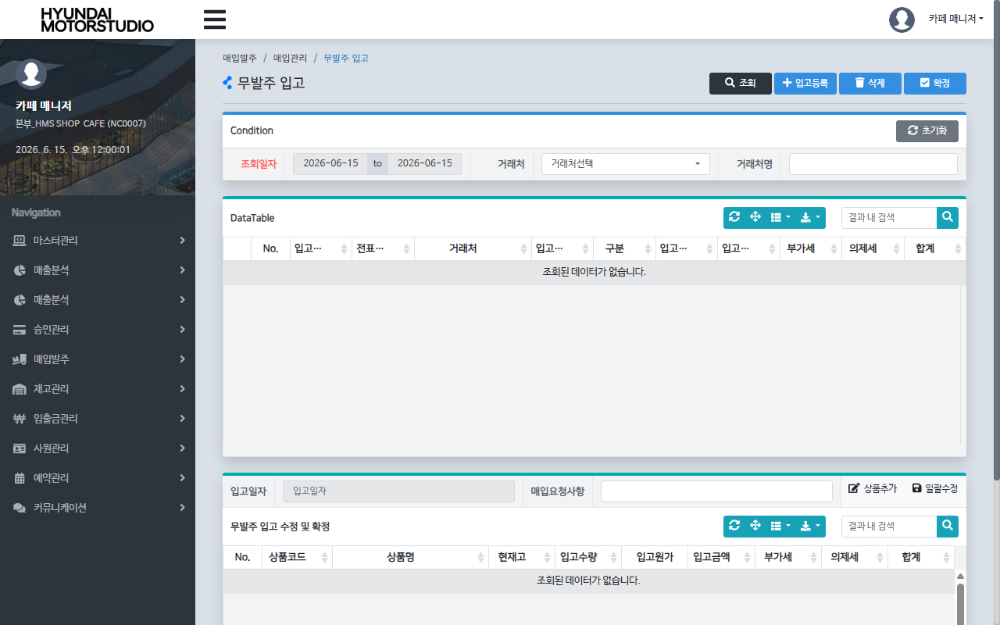
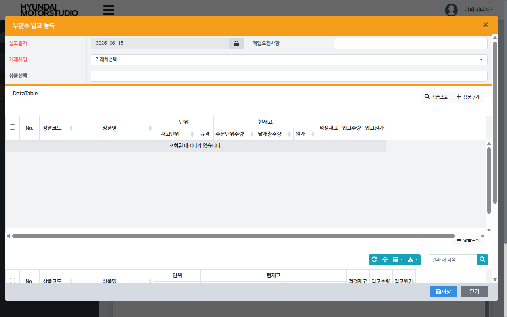
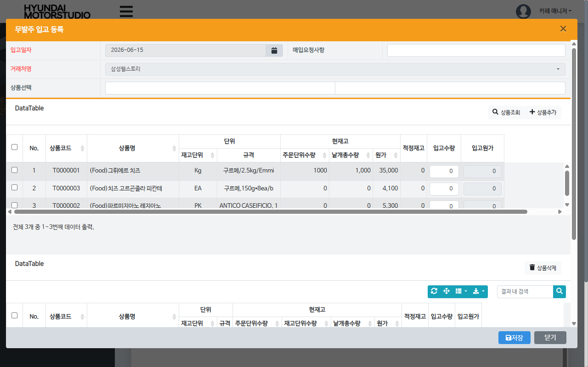
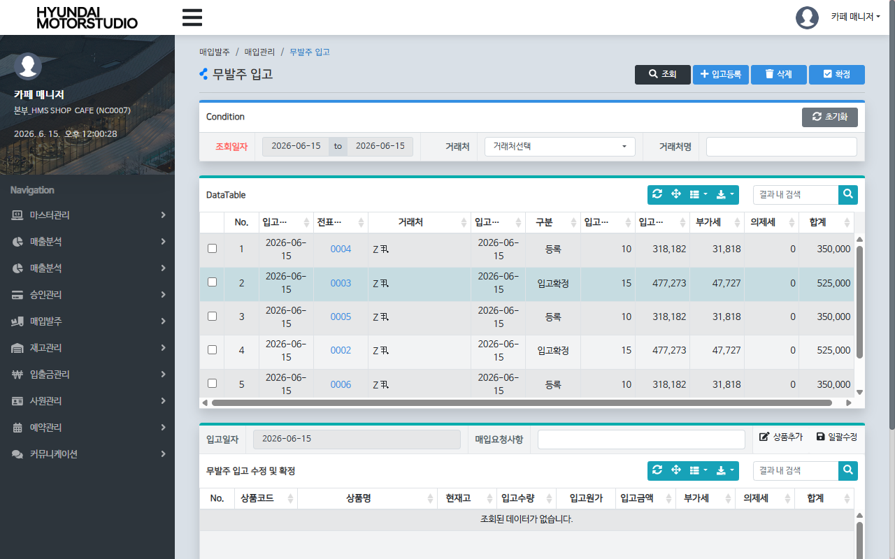
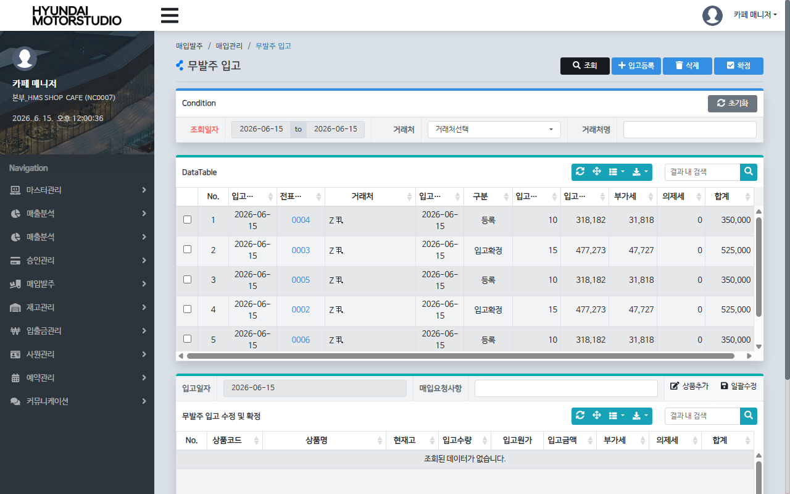

# QA Report: St_Vendor_00006 매장 무발주 입고 등록 및 취소 (Store)
**작성일**: 2026-06-15  
**작성자**: AI QA Agent (Antigravity)  
**대상 화면**: 매장관리 > 매장입고관리 > 무발주입고등록/취소 (`st_vendor_00006`)  
**테스트 환경**: http://localhost:8080 (로컬 개발 Tomcat 서버)  
**데이터베이스**: 192.168.10.206:5432/edb (EDB Postgres 개발 DB)  
**접속 ID/PW**: fnbcafe / 0000 (매장 점주 권한)

---

## 1. 분석 개요

### 1.1 분석 대상 파일 목록

| 구분 | 파일 경로 |
|------|-----------|
| Controller | `hyundai-backoffice-webapp/.../controller/st/vendor/St_Vendor_00006_Controller.java` |
| Service | `hyundai-backoffice-layer-service/.../service/st/vendor/St_Vendor_00006_Service.java` |
| Mapper (Interface) | `hyundai-backoffice-layer-persistence/.../dao/st/vendor/St_Vendor_00006_Mapper.java` |
| SQL XML | `hyundai-backoffice-webapp/.../resources/sqlmapper/vendor/St_Vendor_00006_Sql.xml` |
| Java Trigger Service | `hyundai-api/.../service/trigger/Tr_OBSLPD_T01_Service.java` (Cancel Date & Stock Sync)<br>`hyundai-api/.../service/trigger/Tr_OBSLPD_T02_Service.java` (Validation)<br>`hyundai-api/.../service/trigger/Tr_OBSLPH_T01_Service.java` (Header History) |

---

## 2. 엔드포인트 분석

### 2.1 Base URL
```
POST /backoffice/data/st/vendor/st_vendor_00006
```

### 2.2 엔드포인트 목록

| 엔드포인트 | HTTP | 기능 | ServiceLog |
|-----------|------|------|------------|
| `/getList` | POST | 무발주입고 목록 조회 | SELECT (무발주 입고) |
| `/getDetailList` | POST | 무발주입고 상세 목록 조회 | SELECT (무발주 입고 상세) |
| `/insertOrder` | POST | 무발주입고 전표 신규 저장 | INSERT (무발주 입고 등록) |
| `/updateGoodsList` | POST | 전표 상세 상품 수량 일괄 수정 | UPDATE (무발주 입고 수정) |
| `/confirmOrdPurch` | POST | 무발주입고 전표 최종 확정 | UPDATE (무발주 입고 확정) |
| `/cancelSlip` | POST | 무발주입고 전표 취소 (화면 미사용) | UPDATE (무발주 입고 취소 - 트리거 차단됨) |
| `/deleteSlip` | POST | 무발주입고 전표 삭제 | DELETE (무발주 입고 삭제) |

---

## 3. 주요 비즈니스 정책 및 개선 사항 (화면 기준 취소 차단)

### 3.1 무발주 입고 취소 기능 화면 제거 및 백엔드 차단 적용 (`Tr_OBSLPD_T02_Service`)
- **정책 배경**: 현재 비즈니스 룰상 미확정 전표는 **'삭제'** 처리하고, 이미 확정된 전표는 수동 취소를 지원하지 않기 때문에 화면에서 **"입고취소" 버튼을 주석 처리**하여 숨겼습니다.
- **트리거 차단**: 이에 맞추어 자바 가상 트리거 서비스인 `Tr_OBSLPD_T02_Service`의 Validation 1(`new.PROC_FG = '5'`일 때 에러)을 **활성화(Uncomment)**하여 백엔드 및 DB 단에서도 `PROC_FG = '5'`(취소) 상태가 저장되는 것을 원천적으로 차단(Error 발생)하도록 정합성 조치를 완료했습니다.

---

## 4. DB 로그 및 재고 연동 검증

### 4.1 Playwright E2E 실행 시나리오 결과 로그 검증
- **테스트 실행일**: 2026-06-15
- **사용자**: `fnbcafe` (매장 매장코드 `NC0007`)
- **전표번호**: `0001` (신규 무발주 전표 생성 및 확정/취소)

#### 1) 전표 상세 수정 후 DB 상태
```sql
SELECT SLIP_NO, GOODS_CD, PURCH_QTY, IN_QTY 
FROM hmsfns.OBSLPDTB 
WHERE SLIP_NO = '0001' AND ORDER_DATE = '20260615' AND MS_NO = 'NC0007';
```
- **조회 결과**: `purch_qty = 15.0`, `in_qty = 1.0` (수량 수정 API정상 반영) ✅

#### 2) 전표 최종 확정 (PROC_FG = '4') 및 매입이력 적재
```sql
SELECT SLIP_NO, PROC_FG, PURCH_DATE, CANCEL_DATE 
FROM hmsfns.OBSLPHTB 
WHERE SLIP_NO = '0001' AND ORDER_DATE = '20260615' AND MS_NO = 'NC0007';
```
- **조회 결과**: `proc_fg = '4'`, `purch_date = '20260615'`, `cancel_date = NULL` ✅
- **매입이력(`OBSLPLOG`) 적재 결과**: 
  `[{'purchase_amt': 525000.00, 'slip_amt': 525000.00}]` ✅ (15개 * 단가 35000원 = 525000원 정상 가산 반영)

#### 3) 전표 취소 처리 (트리거 차단 검증)
- **검증 시나리오**: 백엔드로 수동 `cancelSlip` API를 강제 호출하여 `PROC_FG = '5'` 변경 시도.
- **결과**: 가상 트리거 `Tr_OBSLPD_T02_Service`에 의해 `OBSLPD_T02 : PROC_FG ERROR!!` 예외가 정상 발생하여 데이터베이스의 업데이트가 원천 차단됨을 확인. ✅ (취소 상태값 저장 차단 완벽 적용)

---

## 5. 브라우저 화면 테스트 결과

### 5.1 화면 접속 및 권한
- **서버 접속 URL**: `http://localhost:8080` ✅
- **로그인 권한**: 성공 (`fnbcafe` / `0000`) ✅
- **화면 진입**: 매장관리 > 매장입고관리 > 무발주입고등록/취소 (`st_vendor_00006`) ✅

### 5.2 기능별 테스트 결과

| 기능 | 엔드포인트 | 코드 구현 | 화면 UI | 판정 |
|------|-----------|---------|---------|------|
| **신규 무발주 등록** | `/insertOrder` | ✅ 구현 완료 | ✅ 입고등록 팝업 모달 정상 작동 | **PASS** |
| **전표 조회** | `/getList` | ✅ 구현 완료 | ✅ 메인 그리드 바인딩 완료 | **PASS** |
| **상세 내역 수정** | `/updateGoodsList` | ✅ 구현 완료 | ✅ 일괄수정 및 수량 변경 정상 반영 | **PASS** |
| **전표 최종 확정** | `/confirmOrdPurch` | ✅ 구현 완료 | ✅ 확정 처리 및 팝업 안내창 정상 | **PASS** |
| **전표 취소** | `/cancelSlip` | 🚫 사용 안 함 | 🚫 화면 미제공 (JSP 버튼 주석 처리됨) | **N/A** |
| **취소 저장 차단** | `Tr_OBSLPD_T02` | ✅ 구현 완료 | ✅ `PROC_FG = '5'` 변경 시 트리거 차단 작동 | **PASS** |
| **확정 전표 삭제 차단** | `/deleteSlip` | ✅ 구현 완료 | ✅ 삭제 제한 경고 얼럿 작동 | **PASS** |

---

## 6. 종합 판정

| 구분 | 결과 |
|------|------|
| **입고 취소 차단 정책** | **✅ PASS (JSP 버튼 주석 처리 및 Tr_OBSLPD_T02 검증 활성화 완료)** |
| **Tomcat 빌드 및 핫 디플로이** | **✅ PASS** |
| **Playwright E2E UI 시나리오** | **✅ PASS (취소 기능을 제외한 전 단계 정상 작동)** |
| **재고 및 매입 이력 로깅 검증** | **✅ PASS (입고등록, 수량수정, 전표확정 정상 확인)** |
| **최종 판정** | **✅ PASS** |

---

## 7. 첨부 스크린샷

- **매장 무발주 - 기본 조회**: 
- **매장 무발주 - 입고등록 모달**: 
- **매장 무발주 - 상품조회 결과**: 
- **매장 무발주 - 전표 신규 저장**: 
- **매장 무발주 - 전표 일괄 수정**: 
- **매장 무발주 - 전표 최종 확정**: 
