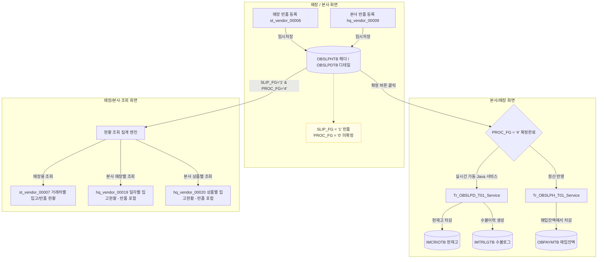

# HMS 반품 프로세스 및 반품 데이터 흐름 명세 (Return Lifecycle)

본 문서는 HMS 영업정보시스템의 **반품 등록, 본사 반품 확정**에 이르는 반품 비즈니스 프로세스와 확정된 반품 데이터가 **재고 및 거래처별 현황 화면에 어떻게 반영되고 집계되는지** 그 세부적인 흐름(Workflow)을 기술합니다.

---

## 1. 반품 비즈니스 데이터 흐름도 (Mermaid)

반품 프로세스는 매장에서 반품을 등록(임시저장)하고 본사(또는 최종 권한)에서 확정하면, 실시간으로 해당 매장의 현재고를 차감하고 반품 금액을 정산 및 수불 로그에 반영합니다.

<div class="mermaid-wrapper" style="position: relative; margin-bottom: 20px;">
  <button onclick="navigator.clipboard.writeText(this.nextElementSibling.innerText); alert('Mermaid 코드가 복사되었습니다.');" style="position: absolute; right: 10px; top: 10px; z-index: 100; background: #2563EB; color: white; border: none; padding: 5px 10px; border-radius: 6px; cursor: pointer; font-size: 11px; font-weight: 600; box-shadow: 0 2px 5px rgba(0,0,0,0.1);">코드 복사</button>

```text
flowchart TD
    subgraph 1. 반품 등록 단계 [매장 / 본사 화면]
        A1[매장 반품 등록 st_vendor_00006] -->|임시저장| B1[(OBSLPHTB 헤더 / OBSLPDTB 디테일)]
        A2[본사 반품 등록 hq_vendor_00009] -->|임시저장| B1
        note1[SLIP_FG = '1' 반품<br>PROC_FG = '0' 미확정]:::note
        B1 -.-> note1
    end

    subgraph 2. 반품 승인 및 최종 확정 [본사/매장 화면]
        B1 -->|확정 버튼 클릭| C1{PROC_FG = '4' 확정완료}
        C1 -->|실시간 가동 Java 서비스| D1[Tr_OBSLPD_T01_Service]
        D1 -->|현재고 차감| E1[(IMCRIOTB 현재고)]
        D1 -->|수불이력 생성| E2[(IMTRLGTB 수불로그)]
        C1 -->|정산 반영| D2[Tr_OBSLPH_T01_Service]
        D2 -->|매입잔액에서 차감| E3[(OBPAYMTB 매입잔액)]
    end

    subgraph 3. 반품/매입 현황 조회 [매장/본사 조회 화면]
        B1 -->|SLIP_FG='1' & PROC_FG='4'| F1[현황 조회 집계 엔진]
        F1 -->|매장용 조회| G1[st_vendor_00007 거래처별 입고/반품 현황]
        F1 -->|본사 매장별 조회| G2[hq_vendor_00019 일자별 입고현황 - 반품 포함]
        F1 -->|본사 상품별 조회| G3[hq_vendor_00020 상품별 입고현황 - 반품 포함]
    end

    classDef note fill:#fffde7,stroke:#fbc02d,stroke-width:1px;
```


</div>

---

## 2. 반품 관련 핵심 테이블 및 컬럼 명세

반품 처리는 매입 입고 테이블(`OBSLPHTB`, `OBSLPDTB`)을 공통으로 사용하며, 구분 플래그를 통해 구분됩니다.

| 테이블명 | 물리 테이블 명칭 | 반품 업무 시 역할 | 핵심 컬럼 |
| :--- | :--- | :--- | :--- |
| **매입/반품 헤더** | `hmsfns.OBSLPHTB` | 반품 전표의 기본 정보 (매장, 반품 거래처, 반품일자 등) | `SLIP_NO` (전표번호), `SLIP_FG` (`1`: 반품), `PROC_FG` (`4`: 확정) |
| **매입/반품 디테일**| `hmsfns.OBSLPDTB` | 반품된 상품 코드, 수량, 반품 금액(단가/공급가/부가세) | `GOODS_CD` (상품코드), `PURCH_QTY` (반품수량), `PURCH_AMT` (반품금액) |
| **실시간 현재고** | `hmsfns.IMCRIOTB` | 매장별 상품의 실시간 현재고 관리 (확정 시 차감) | `CUR_QTY` (현재고 수량) |
| **수불 로그 이력** | `hmsfns.IMTRLGTB` | 재고 입출고 원인 분석용 로그 (수불이력 적재) | `KEY_BILL_NO` (전표 키), `IO_QTY` (출고 수량) |
| **거래처 마스터** | `hmsfns.MVNDRMTB` | 거래처 정보 조인용 마스터 | `VENDOR` (거래처코드), `VENDOR_NM` (거래처명) |

---

## 3. 반품 라이프사이클 플래그 변화 (Flag Matrix)

| 업무 단계 | 슬립 구분 (`SLIP_FG`) | 진행 상태 (`PROC_FG`) | 수불 로그 (`IMTRLGTB`) | 설명 |
| :--- | :---: | :---: | :---: | :--- |
| **1. 반품 임시등록** | `1` (반품) | `0` (미확정) | X | 매장 혹은 본사에서 반품 내역을 가안으로 작성해 저장한 상태 (수정/삭제 가능, 재고 영향 없음) |
| **2. 반품 최종확정** | `1` (반품) | `4` (확정완료) | **O (생성)** | **최종 확정 상태**. 현재고가 즉시 차감되며, 수불 이력이 적재되고 현황 화면에 조회됩니다. |

---

## 4. 확정된 반품 데이터 조회 및 확인 방법

최종 확정(`SLIP_FG = '1'`, `PROC_FG = '4'`)된 반품 데이터를 확인하는 방법은 크게 **화면 조회**와 **DB Direct Query** 두 가지로 나뉩니다.

### 4.1. 🏪 매장용: 거래처별 입고/반품 현황 (`st_vendor_00007`)
매장 점주가 기간별로 거래처에 반품한 실적을 입고 실적과 대조하는 화면입니다.

* **화면 확인**:
  1. **조회**: 지정한 조회 기간 내에 확정된 매입액(`SLIP_FG = '0'`)과 반품액(`SLIP_FG = '1'`)을 거래처별로 합산하여 조회합니다.
  2. **매입-반품 정산**: `SUM_AMT` 컬럼을 통해 **[매입액 - 반품액]**의 순합계 금액을 한눈에 확인할 수 있습니다.
  3. **상세 팝업**: 거래처명을 더블클릭하면 팝업 모달이 열려 **반품된 세부 상품코드와 반품 수량(`CANCEL_PURCH_QTY`), 반품 총액**을 상세 조회할 수 있습니다.
* **조회 SQL 구조**:
  ```sql
  SELECT A.VENDOR, B.VENDOR_NM,
         SUM(DECODE(A.SLIP_FG, '0', A.PURCH_AMT, 0)) AS PURCH_AMT,        -- 매입 합계
         SUM(DECODE(A.SLIP_FG, '1', A.PURCH_AMT, 0)) AS CANCEL_AMT,       -- 반품 합계
         SUM(DECODE(A.SLIP_FG, '0', A.PURCH_AMT, 0)) - SUM(DECODE(A.SLIP_FG, '1', A.PURCH_AMT, 0)) AS SUM_AMT -- 순합계
    FROM hmsfns.OBSLPHTB A
    JOIN hmsfns.MVNDRMTB B ON A.MS_NO = B.MS_NO AND A.VENDOR = B.VENDOR
   WHERE A.MS_NO = #{msNo}
     AND A.PURCH_DATE BETWEEN #{searchFromDate} AND #{searchEndDate}
     AND A.PROC_FG = '4'  -- 확정 전표만 대상
   GROUP BY A.VENDOR, B.VENDOR_NM;
  ```

---

### 4.2. 🏢 본사용: 매장반품 등록 및 조회 현황 (`hq_vendor_00009`)
본사 관리자 및 MD가 각 점포에서 반품 요청 후 확정한 내역을 기간별, 가맹점별로 통합 관리하는 화면입니다.

* **화면 확인**:
  - `PROC_FG`를 '확정'으로 지정해 조회하면, 확정 완료된 가맹점들의 반품 리스트가 나타납니다.
  - 리스트에서 특정 전표를 선택하면 하단 그리드에서 어떤 상품이 몇 개 반품 처리되었는지 바로 대조가 가능합니다.

---

### 4.3. 🗄️ 데이터베이스 직접 쿼리 검증 (DB Verification)

반품 확정이 정확히 일어났는지 DB 상에서 즉시 검증하는 3단계 쿼리 셋입니다. (E2E 테스트 시 동일 활용)

#### Step 1) 반품 전표 상태 및 확정 플래그 확인
반품 전표가 확정 플래그(`PROC_FG = '4'`)를 갖고 있고, 반품 처리일자(`PURCH_DATE`)가 정상적으로 마킹되었는지 확인합니다.
```sql
SELECT SLIP_NO, SLIP_FG, PROC_FG, PURCH_DATE, PURCH_AMT, CREATE_DTIME 
  FROM hmsfns.OBSLPHTB 
 WHERE MS_NO = 'NC0007'           -- 대상 매장 코드
   AND SLIP_FG = '1'              -- '1'은 반품 전표
   AND ORDER_DATE = '20260616'    -- 반품 전표 일자
 ORDER BY CREATE_DTIME DESC LIMIT 5;
```

#### Step 2) 매장 상품 현재고 차감 확인
반품 처리한 수량만큼 매장의 실시간 현재고(`IMCRIOTB.CUR_QTY`)가 정상적으로 감산되었는지 확인합니다.
```sql
SELECT GOODS_CD, CUR_QTY 
  FROM hmsfns.IMCRIOTB 
 WHERE MS_NO = 'NC0007' 
   AND GOODS_CD = #{goodsCd};  -- 반품 처리한 상품 코드
```

#### Step 3) 수불 로그(IMTRLGTB) 적재 여부 확인
재고 감소에 대한 실시간 수불 로그가 정상 적재되었는지 확인합니다.
```sql
SELECT KEY_BILL_NO, GOODS_CD, IO_QTY, IO_FG, CREATE_DTIME 
  FROM hmsfns.IMTRLGTB 
 WHERE KEY_BILL_NO LIKE '20260616NC0007%' -- 전표 키 접두어
   AND GOODS_CD = #{goodsCd};
```

---

## 5. 핵심 비즈니스 정책 특이사항

1. **반품 취소 처리의 제한 (`st_vendor_00006` / `hq_vendor_00009`)**:
   - 현재 비즈니스 룰상 확정되지 않은 반품 전표는 **'삭제(DELETE)'**해야 하며, 이미 **최종 확정된 반품은 수동으로 '취소'할 수 없습니다.**
   - 이에 따라 화면의 "입고취소/반품취소" 버튼은 화면(JSP)상에서 숨김 처리되어 있으며, 백엔드 트리거(`Tr_OBSLPD_T02_Service`)를 통해 반품 취소 시도(`PROC_FG = '5'`) 시 예외를 발생시키도록 정합성 장치가 구축되어 있습니다.
