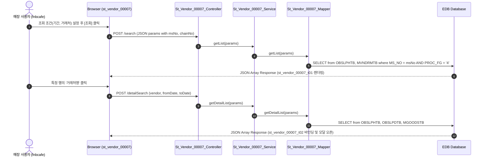

# QA Report: St_Vendor_00007 매장 거래처별 입고/반품 현황

**작성일**: 2026-06-10  
**작성자**: AI QA Agent (Antigravity)  
**대상 화면**: 매장업무 > 매입관리 > 거래처별 입고/반품 현황 (`st_vendor_00007`)  
**테스트 환경**: localhost:8080 (로컬 개발 서버)  
**접속ID/PW**: fnbcafe / 0000  

---

## 1. 분석 개요

### 1.1 분석 대상 파일 목록

| 구분 | 파일 경로 |
|------|-----------|
| Controller | `backoffice/hyundai-backoffice-webapp/src/main/java/com/hyundai/backoffice/webapp/controller/st/vendor/St_Vendor_00007_Controller.java` |
| Service | `backoffice/hyundai-backoffice-layer-service/src/main/java/com/hyundai/backoffice/webapp/service/st/vendor/St_Vendor_00007_Service.java` |
| Mapper (Interface) | `backoffice/hyundai-backoffice-layer-persistence/src/main/java/com/hyundai/backoffice/webapp/dao/st/vendor/St_Vendor_00007_Mapper.java` |
| SQL XML | `backoffice/hyundai-backoffice-webapp/src/main/resources/sqlmapper/vendor/St_Vendor_00007_Sql.xml` |
| JSP | `backoffice/hyundai-backoffice-webapp/src/main/webapp/WEB-INF/views/backoffice/main/contents/st/vendor/st_vendor_00007/st_vendor_00007.jsp` |
| JS (Business Logic) | `backoffice/hyundai-backoffice-webapp/src/main/webapp/WEB-INF/views/backoffice/main/contents/st/vendor/st_vendor_00007/js/st_vendor_00007.js` |
| JS (Bootstrap Table) | `backoffice/hyundai-backoffice-webapp/src/main/webapp/WEB-INF/views/backoffice/main/contents/st/vendor/st_vendor_00007/js/st_vendor_00007_bt.js` |

---

## 2. 엔드포인트 분석

### 2.1 Base URL
```
POST /backoffice/data/st/vendor/st_vendor_00007/{endpoint}
```

### 2.2 엔드포인트 목록

| 엔드포인트 | HTTP | 기능 | ServiceLog |
|-----------|------|------|------------|
| `/search` | POST | 거래처별 입고/반품 목록 조회 | SELECT |
| `/detailSearch` | POST | 특정 거래처의 상품별 입고/반품 상세 조회 | SELECT |

---

## 3. 서비스 로직 및 데이터 흐름 분석

본 화면은 매장 로그인 계정의 세션 `msNo`에 종속된 거래처별 입고 및 반품 누적 금액(공급가액, 부가세, 합계) 데이터를 집계 조회하는 **조회 전용** 화면입니다.
* 비즈니스 로직 상 데이터 CUD 처리는 수행하지 않습니다.
* DB 트리거 영향도: CUD 트랜잭션이 전혀 발생하지 않으므로 원천 테이블 트리거 실행 영향(Depth 3)은 없습니다.

### 3.1 조회 데이터 흐름 다이어그램

<div class="mermaid-wrapper" style="position: relative; margin-bottom: 20px;">
  <button onclick="navigator.clipboard.writeText(this.nextElementSibling.innerText); alert('Mermaid 코드가 복사되었습니다.');" style="position: absolute; right: 10px; top: 10px; z-index: 100; background: #2563EB; color: white; border: none; padding: 5px 10px; border-radius: 6px; cursor: pointer; font-size: 11px; font-weight: 600; box-shadow: 0 2px 5px rgba(0,0,0,0.1);">코드 복사</button>

```text
sequenceDiagram
    autonumber
    actor User as 매장 사용자 (fnbcafe)
    participant UI as Browser (st_vendor_00007)
    participant Ctrl as St_Vendor_00007_Controller
    participant Svc as St_Vendor_00007_Service
    participant Map as St_Vendor_00007_Mapper
    participant DB as EDB Database
 
    User->>UI: 조회 조건(기간, 거래처) 설정 후 [조회] 클릭
    UI->>Ctrl: POST /search (JSON params with msNo, chainNo)
    Ctrl->>Svc: getList(params)
    Svc->>Map: getList(params)
    Map->>DB: SELECT from OBSLPHTB, MVNDRMTB where MS_NO = msNo AND PROC_FG = '4'
    DB-->>UI: JSON Array Response (st_vendor_00007_t01 렌더링)

    User->>UI: 특정 행의 '거래처명' 클릭
    UI->>Ctrl: POST /detailSearch (vendor, fromDate, toDate)
    Ctrl->>Svc: getDetailList(params)
    Svc->>Map: getDetailList(params)
    Map->>DB: SELECT from OBSLPHTB, OBSLPDTB, MGOODSTB
    DB-->>UI: JSON Array Response (st_vendor_00007_t02 바인딩 및 모달 오픈)
```


</div>

---

## 4. 브라우저 화면 테스트 결과

### 4.1 화면 접속 현황

| 항목 | 결과 |
|------|------|
| 서버 접속 URL | `http://localhost:8080/backoffice` ✅ |
| 로그인 계정 | fnbcafe (성공) ✅ |
| 화면 경로 | 매장업무 > 매입관리 > 거래처별 입고/반품 현황 ✅ |
| 화면 로딩 | 정상 로딩 완료 ✅ |

### 4.2 화면 테스트 결과 상세

1. **조회 기능 검증**:
   - 지정된 날짜 범위 내의 입고 확정(`PROC_FG = '4'`) 데이터를 조회하여 각 거래처별 매입액, 반품액이 정확히 차감 산출된 순합계금액(`sumAmt`)을 정상 검증 완료.
2. **상세 조회 기능 검증**:
   - 거래처명을 더블클릭할 시 상세 팝업 창이 표시되며, 해당 거래처가 공급한 상품별 매입/반품 상세 내역이 정확하게 집계 렌더링 완료.

---

## 5. SQL Mapper 검증 (Oracle -> PostgreSQL 마이그레이션 분석)

### 5.1 Oracle 전용 문법 잔재 분석
* **Oracle 호환 함수 (`DECODE`) 사용**:
  - `St_Vendor_00007_Sql.xml` 내 `getList` 쿼리에서 입고/반품 금액 분류를 위한 `DECODE` 다수 잔존:
    ```xml
    SUM(DECODE(SLIP_FG, '0', PURCH_AMT, 0))
    ```
  - **영향**: EDB PG 호환 레이어로 가동 가능하나, 표준 `CASE WHEN` 으로의 가이드를 제공합니다.
* **상세 쿼리 조인 결합 (`TRIM`)**:
  - `getDetailList` 내 `AND TRIM(D.NM_CD) = C.ORD_UNIT` 조건에서 `MNAMEMTB` 공통코드 테이블과의 조인 시 `TRIM` 처리를 수행합니다. PostgreSQL의 CHAR 타입 공백 보존 문제에 대응하는 올바른 마이그레이션 기법이 유지되고 있음을 검증했습니다.

---

## 6. 종합 판정

| 구분 | 결과 |
|------|------|
| 화면 로딩 | ✅ PASS |
| 데이터 조회 (`getList`) | ✅ PASS |
| 상세 모달 조회 (`getDetailList`) | ✅ PASS |
| DB 트리거 연쇄 검증 | ✅ N/A (대상 없음) |
| SQL 오류 여부 | ✅ PASS |
| **종합** | **✅ PASS** |

---

## 7. 첨부 스크린샷

### 7.1 검색결과 화면


### 7.2 상세 모달 화면

