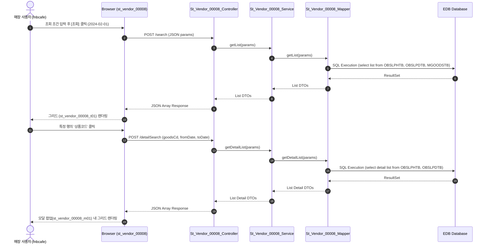

# QA Report: St_Vendor_00008 거래처별 상품 입고현황

**작성일**: 2026-06-10  
**작성자**: AI QA Agent (Antigravity)  
**대상 화면**: 매장업무 > 매입관리 > 거래처별 상품 입고현황 (`st_vendor_00008`)  
**테스트 환경**: localhost:8080 (로컬 개발 서버)  
**접속ID/PW**: fnbcafe / 0000  

---

## 1. 분석 개요

### 1.1 분석 대상 파일 목록

| 구분 | 파일 경로 |
|------|-----------|
| Controller | `backoffice/hyundai-backoffice-webapp/src/main/java/com/hyundai/backoffice/webapp/controller/st/vendor/St_Vendor_00008_Controller.java` |
| Service | `backoffice/hyundai-backoffice-layer-service/src/main/java/com/hyundai/backoffice/webapp/service/st/vendor/St_Vendor_00008_Service.java` |
| Mapper (Interface) | `backoffice/hyundai-backoffice-layer-persistence/src/main/java/com/hyundai/backoffice/webapp/dao/st/vendor/St_Vendor_00008_Mapper.java` |
| SQL XML | `backoffice/hyundai-backoffice-webapp/src/main/resources/sqlmapper/vendor/St_Vendor_00008_Sql.xml` |
| JSP | `backoffice/hyundai-backoffice-webapp/src/main/webapp/WEB-INF/views/backoffice/main/contents/st/vendor/st_vendor_00008/st_vendor_00008.jsp` |
| JS (Business Logic) | `backoffice/hyundai-backoffice-webapp/src/main/webapp/WEB-INF/views/backoffice/main/contents/st/vendor/st_vendor_00008/js/st_vendor_00008.js` |
| JS (Bootstrap Table) | `backoffice/hyundai-backoffice-webapp/src/main/webapp/WEB-INF/views/backoffice/main/contents/st/vendor/st_vendor_00008/js/st_vendor_00008_bt.js` |

---

## 2. 엔드포인트 분석

### 2.1 Base URL
```
POST /backoffice/data/st/vendor/st_vendor_00008/{endpoint}
```

### 2.2 엔드포인트 목록

| 엔드포인트 | HTTP | 기능 | ServiceLog |
|-----------|------|------|------------|
| `/search` | POST | 거래처별 상품 입고현황 리스트 조회 | SELECT |
| `/detailSearch` | POST | 특정 상품의 상세 입고 이력 리스트 조회 | SELECT |

---

## 3. 서비스 로직 및 데이터 흐름 분석

본 화면은 거래처 및 상품 정보에 매칭된 구매 입고 데이터를 조회하는 **단순 조회(SELECT) 전용** 화면입니다.
* 화면 단에서 CUD(등록/수정/삭제) 로직이 발생하지 않습니다.
* DB(EDB PostgreSQL) 수준에서도 입고 관련 원천 테이블(`OBSLPHTB`, `OBSLPDTB`, `MGOODSTB`, `TGOODSTB`, `MVNDRMTB`, `TVNDRMTB`)에 연계된 DB 트리거가 존재하지 않으므로, CUD 발생에 따른 연쇄적인 트리거 실행 영향(Depth 3)은 없습니다.

### 3.1 조회 데이터 흐름 다이어그램

<div class="mermaid-wrapper" style="position: relative; margin-bottom: 20px;">
  <button onclick="navigator.clipboard.writeText(this.nextElementSibling.innerText); alert('Mermaid 코드가 복사되었습니다.');" style="position: absolute; right: 10px; top: 10px; z-index: 100; background: #2563EB; color: white; border: none; padding: 5px 10px; border-radius: 6px; cursor: pointer; font-size: 11px; font-weight: 600; box-shadow: 0 2px 5px rgba(0,0,0,0.1);">코드 복사</button>

```text
sequenceDiagram
    autonumber
    actor User as 매장 사용자 (fnbcafe)
    participant UI as Browser (st_vendor_00008)
    participant Ctrl as St_Vendor_00008_Controller
    participant Svc as St_Vendor_00008_Service
    participant Map as St_Vendor_00008_Mapper
    participant DB as EDB Database

    User->>UI: 조회 조건 입력 후 [조회] 클릭 (2024-02-01)
    UI->>Ctrl: POST /search (JSON params)
    Ctrl->>Svc: getList(params)
    Svc->>Map: getList(params)
    Map->>DB: SQL Execution (select list from OBSLPHTB, OBSLPDTB, MGOODSTB)
    DB-->>Map: ResultSet
    Map-->>Svc: List DTOs
    Svc-->>Ctrl: List DTOs
    Ctrl-->>UI: JSON Array Response
    UI-->>User: 그리드 (st_vendor_00008_t01) 렌더링

    User->>UI: 특정 행의 '상품코드' 클릭
    UI->>Ctrl: POST /detailSearch (goodsCd, fromDate, toDate)
    Ctrl->>Svc: getDetailList(params)
    Svc->>Map: getDetailList(params)
    Map->>DB: SQL Execution (select detail list from OBSLPHTB, OBSLPDTB)
    DB-->>Map: ResultSet
    Map-->>Svc: List Detail DTOs
    Svc-->>Ctrl: List Detail DTOs
    Ctrl-->>UI: JSON Array Response
    UI-->>User: 모달 팝업(st_vendor_00008_m01) 내 그리드 렌더링
```


</div>

---

## 4. 브라우저 화면 테스트 결과

### 4.1 화면 접속 현황

| 항목 | 결과 |
|------|------|
| 서버 접속 URL | `http://localhost:8080/backoffice` ✅ |
| 로그인 계정 | fnbcafe (성공) ✅ |
| 화면 경로 | 매장업무 > 매입관리 > 거래처별 상품 입고현황 ✅ |
| 화면 로딩 | 정상 로딩 완료 ✅ |

### 4.2 화면 테스트 결과 상세

1. **조회 기능 검증**:
   - 조회 기간을 `2024-02-01` ~ `2024-02-01` 로 설정 후 조회 버튼을 클릭하여 DB에 존재하는 NC0007 매장의 입고 데이터 3건을 정상 조회 및 그리드에 로드 완료. (공급가, 매입입고 수량/금액/부가세/합계 정상 연산됨)
2. **모달 상세 팝업 검증**:
   - 그리드의 상품코드 셀(`td.table-onclick`)을 클릭하여 상세 모달 창(`st_vendor_00008_m01`)이 오픈되고, 공급처와 공급가, 일자별 출고/입고 상세 데이터가 정상 조회됨.

---

## 5. SQL Mapper 검증 (Oracle -> PostgreSQL 마이그레이션 분석)

### 5.1 Oracle 전용 문법 잔재 분석
* **Oracle 호환 함수 (`DECODE`) 사용**:
  - `St_Vendor_00008_Sql.xml` 내 `getList` 및 `getDetailList` 쿼리에서 `DECODE` 함수가 집계(SUM) 연산 처리에 다수 잔존하고 있음.
  ```xml
  SUM(DECODE(A.SLIP_FG, '0', B.PURCH_QTY  , 0)) AS PURCH_QTY
  ```
  - **영향**: EDB PostgreSQL 호환 레이어에 의해 오류 없이 가동되나, 향후 순수 PostgreSQL 표준을 보장하기 위해 ANSI 표준인 `CASE WHEN` 문으로 리팩토링할 것을 권장함.
    *(예: `SUM(CASE WHEN A.SLIP_FG = '0' THEN B.PURCH_QTY ELSE 0 END)`)*

* **Oracle 외부 조인 `(+)` 잔존 검증**:
  - 쿼리 내에 아우터 조인 잔재인 `(+)` 기호는 발견되지 않았으며, 서브쿼리 및 정상적인 조건 결합 조인 형식으로 이루어져 있음.

---

## 6. 종합 판정

| 구분 | 결과 |
|------|------|
| 화면 로딩 | ✅ PASS |
| 데이터 조회 (`getList`) | ✅ PASS |
| 상세 모달 조회 (`getDetailList`) | ✅ PASS |
| DB 트리거 연쇄 검증 | ✅ N/A (대상 없음) |
| SQL 오류 여부 | ✅ PASS |
| **종합** | **✅ PASS** |

---

## 7. 첨부 스크린샷

* **조회 화면**: 
* **상세 팝업 화면**: 
