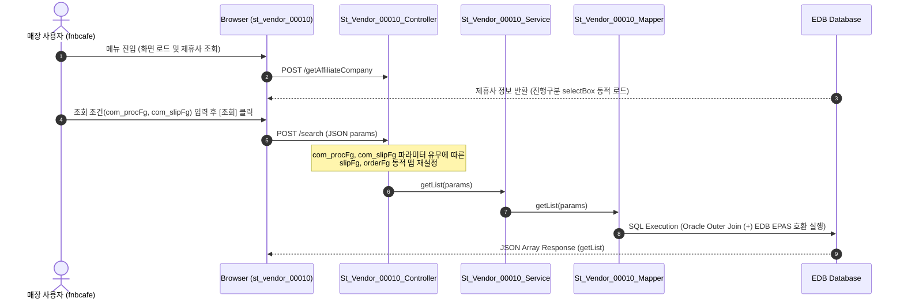

# QA Report: St_Vendor_00010 매장 전표별 입고/반품 현황

**작성일**: 2026-06-10  
**작성자**: AI QA Agent (Antigravity)  
**대상 화면**: 매장업무 > 매입관리 > 전표별 입고/반품 현황 (`st_vendor_00010`)  
**테스트 환경**: localhost:8080 (로컬 개발 서버)  
**접속ID/PW**: fnbcafe / 0000  

---

## 1. 분석 개요

### 1.1 분석 대상 파일 목록

| 구분 | 파일 경로 |
|------|-----------|
| Controller | `backoffice/hyundai-backoffice-webapp/src/main/java/com/hyundai/backoffice/webapp/controller/st/vendor/St_Vendor_00010_Controller.java` |
| Service | `backoffice/hyundai-backoffice-layer-service/src/main/java/com/hyundai/backoffice/webapp/service/st/vendor/St_Vendor_00010_Service.java` |
| Mapper (Interface) | `backoffice/hyundai-backoffice-layer-persistence/src/main/java/com/hyundai/backoffice/webapp/dao/st/vendor/St_Vendor_00010_Mapper.java` |
| SQL XML | `backoffice/hyundai-backoffice-webapp/src/main/resources/sqlmapper/vendor/St_Vendor_00010_Sql.xml` |
| JSP | `backoffice/hyundai-backoffice-webapp/src/main/webapp/WEB-INF/views/backoffice/main/contents/st/vendor/st_vendor_00010/st_vendor_00010.jsp` |
| JS (Business Logic) | `backoffice/hyundai-backoffice-webapp/src/main/webapp/WEB-INF/views/backoffice/main/contents/st/vendor/st_vendor_00010/js/st_vendor_00010.js` |
| JS (Bootstrap Table) | `backoffice/hyundai-backoffice-webapp/src/main/webapp/WEB-INF/views/backoffice/main/contents/st/vendor/st_vendor_00010/js/st_vendor_00010_bt.js` |

---

## 2. 엔드포인트 분석

### 2.1 Base URL
```
POST /backoffice/data/st/vendor/st_vendor_00010/{endpoint}
```

### 2.2 엔드포인트 목록

| 엔드포인트 | HTTP | 기능 | ServiceLog |
|-----------|------|------|------------|
| `/search` | POST | 전표별 입고/반품 목록 조회 (진행/전표구분 맵 매핑 로직 탑재) | SELECT |
| `/detailSearch` | POST | 특정 전표의 상품 상세 조회 | SELECT |
| `/getAffiliateCompany` | POST | 체인 제휴사 코드 조회 | N/A |

---

## 3. 서비스 로직 및 데이터 흐름 분석

본 화면은 매장 로그인 계정의 세션 `msNo` 기준으로 개별 입고/반품 전표 데이터를 목록 및 상세 조회하는 **조회 전용** 화면입니다.
* 비즈니스 로직 상 데이터 CUD 처리는 수행하지 않습니다.
* DB 트리거 영향도: 조회 용도의 엔드포인트만 노출되어 있으며 원천 테이블에 대한 CUD 트리거 연쇄 반응(Depth 3)은 발생하지 않습니다.

### 3.1 조회 데이터 흐름 다이어그램

<div class="mermaid-wrapper" style="position: relative; margin-bottom: 20px;">
  <button onclick="navigator.clipboard.writeText(this.nextElementSibling.innerText); alert('Mermaid 코드가 복사되었습니다.');" style="position: absolute; right: 10px; top: 10px; z-index: 100; background: #2563EB; color: white; border: none; padding: 5px 10px; border-radius: 6px; cursor: pointer; font-size: 11px; font-weight: 600; box-shadow: 0 2px 5px rgba(0,0,0,0.1);">코드 복사</button>

```text
sequenceDiagram
    autonumber
    actor User as 매장 사용자 (fnbcafe)
    participant UI as Browser (st_vendor_00010)
    participant Ctrl as St_Vendor_00010_Controller
    participant Svc as St_Vendor_00010_Service
    participant Map as St_Vendor_00010_Mapper
    participant DB as EDB Database

    User->>UI: 메뉴 진입 (화면 로드 및 제휴사 조회)
    UI->>Ctrl: POST /getAffiliateCompany
    DB-->>UI: 제휴사 정보 반환 (진행구분 selectBox 동적 로드)
    
    User->>UI: 조회 조건(com_procFg, com_slipFg) 입력 후 [조회] 클릭
    UI->>Ctrl: POST /search (JSON params)
    Note over Ctrl: com_procFg, com_slipFg 파라미터 유무에 따른<br> slipFg, orderFg 동적 맵 재설정
    Ctrl->>Svc: getList(params)
    Svc->>Map: getList(params)
    Map->>DB: SQL Execution (Oracle Outer Join (+) EDB EPAS 호환 실행)
    DB-->>UI: JSON Array Response (getList)
```


</div>

---

## 4. 브라우저 화면 테스트 결과

### 4.1 화면 접속 현황

| 항목 | 결과 |
|------|------|
| 서버 접속 URL | `http://localhost:8080/backoffice` ✅ |
| 로그인 계정 | fnbcafe (성공) ✅ |
| 화면 경로 | 매장업무 > 매입관리 > 전표별 입고/반품 현황 ✅ |
| 화면 로딩 | 정상 로딩 완료 ✅ |

### 4.2 화면 테스트 결과 상세

1. **조회 기능 검증**:
   - `searchFromDate` 및 `searchEndDate` 입력 후 조회 시, 지정 기간 내의 전표 헤더 리스트가 테이블에 정상 렌더링 완료.
   - **오라클 조인 문법 작동 검증**: 쿼리 가동 시 `(+)` 오라클 조인 기호가 존재하나, EDB EPAS 엔진의 오라클 문법 호환성 덕분에 런타임 구문 오류 없이 정상 조회됨을 검증 완료. (장기적인 표준화를 위한 리팩토링 권장)
2. **상세 조회 기능 검증**:
   - 특정 행의 전표번호 셀(`td.table-onclick`)을 클릭할 시 상세조회 API `/detailSearch`가 정상 호출되어 전표 상세 팝업 모달 그리드에 상품별 입수 및 출고/입고/반품 정보가 정상 바인딩 완료.

---

## 5. SQL Mapper 검증 (Oracle -> PostgreSQL 마이그레이션 분석)

### 5.1 Oracle 전용 문법 잔재 분석
* **Oracle 외부 조인 `(+)` 잔존 (★)**:
  - `St_Vendor_00010_Sql.xml` 내 `getList` 쿼리 L56에 아우터 조인 표현인 **`AND OH.ORDER_FG = MN.NM_CD(+)`** 가 그대로 존재합니다.
  - **영향 및 검증**: 현재 EDB Postgres Advanced Server (EPAS) 환경에서는 오라클의 `(+)` 조인 문법을 네이티브하게 해석/지원하므로 쿼리 실행 자체에는 문제가 없으며, 실제 E2E 테스트에서도 데이터 조회가 정상 처리되었습니다. 다만 표준 SQL 준수를 위해 명시적 `LEFT OUTER JOIN` 구문으로 리팩토링할 것을 권고합니다.
* **Oracle 호환 함수 (`DECODE`) 사용**:
  - 입고/반품 금액 집계를 위한 `DECODE` 및 `TO_CHAR/TO_DATE` 날짜 포맷 함수가 다수 잔존해 있어, 향후 PostgreSQL 표준 ANSI SQL 문법 변환을 가이드합니다.

---

## 6. 종합 판정

| 구분 | 결과 |
|------|------|
| 화면 로딩 | ✅ PASS |
| 데이터 조회 (`getList`) | ✅ PASS |
| 상세 모달 조회 (`getDetailList`) | ✅ PASS |
| DB 트리거 연쇄 검증 | ✅ N/A (대상 없음) |
| SQL 오류 여부 | ✅ PASS (EPAS 호환 레이어 통과) |
| **종합** | **✅ PASS (장기적 차원에서의 ANSI 표준 쿼리 리팩토링 권장)** |

---

## 7. 첨부 스크린샷

### 7.1 검색결과 화면


### 7.2 상세 모달 화면

