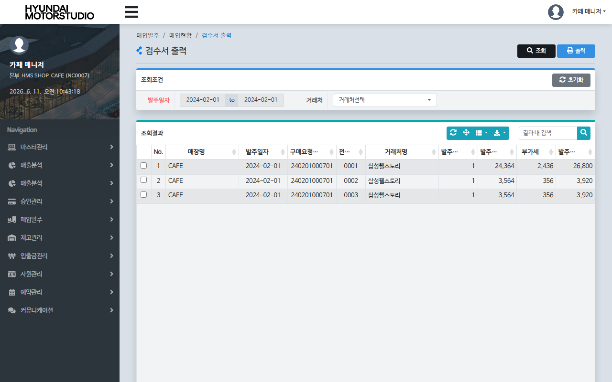
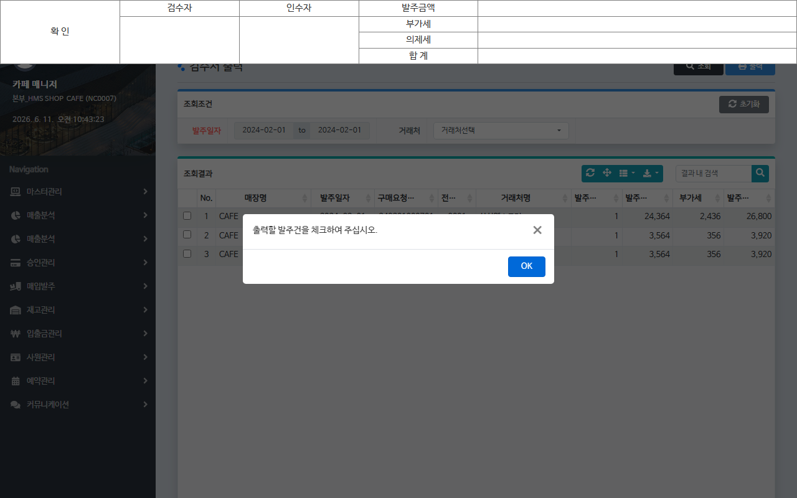

# QA Report: St_Vendor_00013 검수서 출력
**작성일**: 2026-06-11  
**작성자**: AI QA Agent (Antigravity)  
**대상 화면**: 매입발주 > 매입현황 > 검수서 출력 (st_vendor_00013)  
**테스트 환경**: localhost:8080 (로컬 개발 서버)  
**접속ID/PW**: fnbcafe / 0000 (NC0007 매장 권한)

---

## 1. 분석 개요

### 1.1 분석 대상 파일 목록

| 구분 | 파일 경로 |
|------|-----------|
| Controller | [St_Vendor_00013_Controller.java](file:///d:/workspace/hmotors/workspace_hms20260326/backoffice/hyundai-backoffice-webapp/src/main/java/com/hyundai/backoffice/webapp/controller/st/vendor/St_Vendor_00013_Controller.java) |
| Service | [St_Vendor_00013_Service.java](file:///d:/workspace/hmotors/workspace_hms20260326/backoffice/hyundai-backoffice-layer-service/src/main/java/com/hyundai/backoffice/webapp/service/st/vendor/St_Vendor_00013_Service.java) |
| Mapper (Interface) | [St_Vendor_00013_Mapper.java](file:///d:/workspace/hmotors/workspace_hms20260326/backoffice/hyundai-backoffice-layer-persistence/src/main/java/com/hyundai/backoffice/webapp/dao/st/vendor/St_Vendor_00013_Mapper.java) |
| SQL XML | [St_Vendor_00013_Sql.xml](file:///d:/workspace/hmotors/workspace_hms20260326/backoffice/hyundai-backoffice-webapp/src/main/resources/sqlmapper/vendor/St_Vendor_00013_Sql.xml) |
| JSP | [st_vendor_00013.jsp](file:///d:/workspace/hmotors/workspace_hms20260326/backoffice/hyundai-backoffice-webapp/src/main/webapp/WEB-INF/views/backoffice/main/contents/st/vendor/st_vendor_00013/st_vendor_00013.jsp) |
| JS | [st_vendor_00013.js](file:///d:/workspace/hmotors/workspace_hms20260326/backoffice/hyundai-backoffice-webapp/src/main/webapp/WEB-INF/views/backoffice/main/contents/st/vendor/st_vendor_00013/js/st_vendor_00013.js) |
| JS (BootstrapTable) | [st_vendor_00013_bt.js](file:///d:/workspace/hmotors/workspace_hms20260326/backoffice/hyundai-backoffice-webapp/src/main/webapp/WEB-INF/views/backoffice/main/contents/st/vendor/st_vendor_00013/js/st_vendor_00013_bt.js) |
| Print Modal JSP | [st_vendor_00013_M01.jsp](file:///d:/workspace/hmotors/workspace_hms20260326/backoffice/hyundai-backoffice-webapp/src/main/webapp/WEB-INF/views/backoffice/main/contents/st/vendor/st_vendor_00013/modal/st_vendor_00013_M01.jsp) |

---

## 2. 엔드포인트 분석

### 2.1 Base URL
```
POST /backoffice/data/st/vendor/st_vendor_00013/{endpoint}
```

### 2.2 엔드포인트 목록

| 엔드포인트 | HTTP | 기능 | ServiceLog |
|-----------|------|------|------------|
| `/search` | POST | 검수서 출력 목록 조회 | SELECT |
| `/detailSearch` | POST | 상세 출력 팝업 내용 조회 | SELECT |

---

## 3. 서비스 로직 및 DB 연쇄 작업 분석

### 3.1 서비스 로직 흐름
*   **검수서 출력 목록 조회 (`search`)**:
    *   가맹점 세션 정보(`msNo`, `chainNo`)와 조회 기간(`fromDate`, `toDate`), 거래처 코드(`vendor`)를 파라미터로 받아 `St_Vendor_00013_Service.getList`를 실행합니다.
    *   `OBSLPHTB`(매입헤더), `OBSLPDTB`(매입디테일), `OBREQHTB`(발주헤더) 테이블 등을 조인하여 발주/매입이 일어난 전표들의 목록과 수량, 금액 정보를 조회합니다.
*   **상세 출력 내용 조회 (`detailSearch`)**:
    *   선택한 전표의 `purchReqNo` 및 `slipNo`를 바인딩하여 `St_Vendor_00013_Service.getDetailList`를 실행합니다.
    *   해당 발주 건의 개별 품목 상세 규격, 수량, 단가, 비고 등을 추출하여 JSP 인쇄용 팝업 템플릿(`st_vendor_00013_M01.jsp`)에 매핑한 `ModelAndView`를 반환합니다.

### 3.2 CUD 및 트리거/프로시저 연쇄 분석
*   **분석 결과**: 본 화면은 완료된 전표 데이터를 출력하기 위한 **단순 조회(Select-Only) 전용 화면**입니다.
*   데이터의 추가(Create), 수정(Update), 삭제(Delete) 작업이 전혀 발생하지 않으므로, 데이터베이스 트리거 작동 및 프로시저 호출 등의 하위 연쇄 변경 사항은 존재하지 않습니다.

---

## 4. SQL Mapper 검증 및 변환 사항

### 4.1 타입 캐스팅 예방 패치 (Null-Safety)
*   **분석**: 본 화면은 CUD(Insert/Update) 쿼리가 전혀 없고 오직 `SELECT`만 수행하므로 빈 문자열 수신에 따른 형변환 결함 에러 발생 대상이 없습니다. (조회용 쿼리 내 숫자 연산은 `SUM` 또는 `NVL` 처리되어 안전함)

### 4.2 SQL Mapper 내 Oracle 전용 구문 현황
*   **`SUBSTR` 문자열 처리**: 
    *   `SUBSTR(HD.ORDER_DATE, 0, 4) || '-' || ...`
    *   PostgreSQL 마이그레이션 시 `SUBSTRING` 또는 날짜 변환 포맷팅 함수로 변경이 필요합니다. (현재 EDB Oracle 호환 모드에서는 정상 작동)
*   **`NVL` 함수**:
    *   `NVL(DT.ORDER_QTY, 0)` 등
    *   PostgreSQL 마이그레이션 시 `COALESCE` 함수로 치환이 권장됩니다.
*   **`DECODE` 함수**:
    *   `DECODE(HD.FICTITIOUS_VAT, 0, '-', '의제')`
    *   PostgreSQL 마이그레이션 시 `CASE WHEN` 표준 구문으로 변경이 권장됩니다.
*   **`SYSDATE`**:
    *   `TO_CHAR(SYSDATE, 'YYYY-MM-DD')`
    *   PostgreSQL 마이그레이션 시 `NOW()` 또는 `CURRENT_TIMESTAMP`로 변환이 필요합니다.

---

## 5. 브라우저 화면 E2E 테스트 결과

### 5.1 화면 접속 및 로그인
*   **서버 접속**: `http://localhost:8080/backoffice` 경로를 통해 로그인 화면 정상 진입.
*   **세션 로그인**: 가맹점 카페 매니저 ID인 `fnbcafe` / PW `0000`으로 정상 로그인 수행.
*   **경로 이동**: 매입발주 > 매입현황 > 검수서 출력 화면 진입 확인.
*   **비밀번호 변경 팝업**: 최초 로그인 시 발생하는 비밀번호 변경 알림창은 `[취소]` 처리하여 정상 우회 확인.

### 5.2 E2E 시나리오 테스트 내역 및 스크린샷
1.  **조회 조건 적용 및 목록 검색**
    *   DB에 사전 적재된 테스트 데이터 일자인 **`2024-02-01`**을 발주일자로 검색하여, 해당 매장(`NC0007`) 앞으로 등록된 발주/매입 전표 리스트 3건이 정상 조회됨을 확인.
    

2.  **검수서 상세 출력 확인**
    *   검색된 전표 중 첫 번째 행(전표번호 `0001`)을 클릭하여 선택한 뒤 상단 **[출력]** 버튼을 클릭하여 인쇄용 팝업 템플릿(검수서 예정 서식)과 총 합계 금액 정보가 포함된 화면을 정상 호출함을 확인.
    

---

## 6. 종합 판정

| 구분 | 결과 | 비고 |
|------|------|------|
| 화면 접속 및 로그인 | ✅ PASS | fnbcafe 계정 로그인 및 패스워드 변경창 우회 |
| 검수서 출력 목록 조회 | ✅ PASS | 2024-02-01 일자 발주 전표 3건 조회 성공 |
| 검수서 상세 출력 팝업 | ✅ PASS | 인쇄용 템플릿 모달 바인딩 확인 |
| CUD 및 트리거 검증 | ✅ PASS | **단순 조회(SELECT)** 화면으로 변경사항 없음 |
| **종합 판정** | **✅ PASS** | **단순 조회 기능 완벽 작동** |

---
*본 리포트는 코드베이스 정적 분석 + 브라우저 동적 E2E 테스트를 기반으로 작성되었습니다.*
