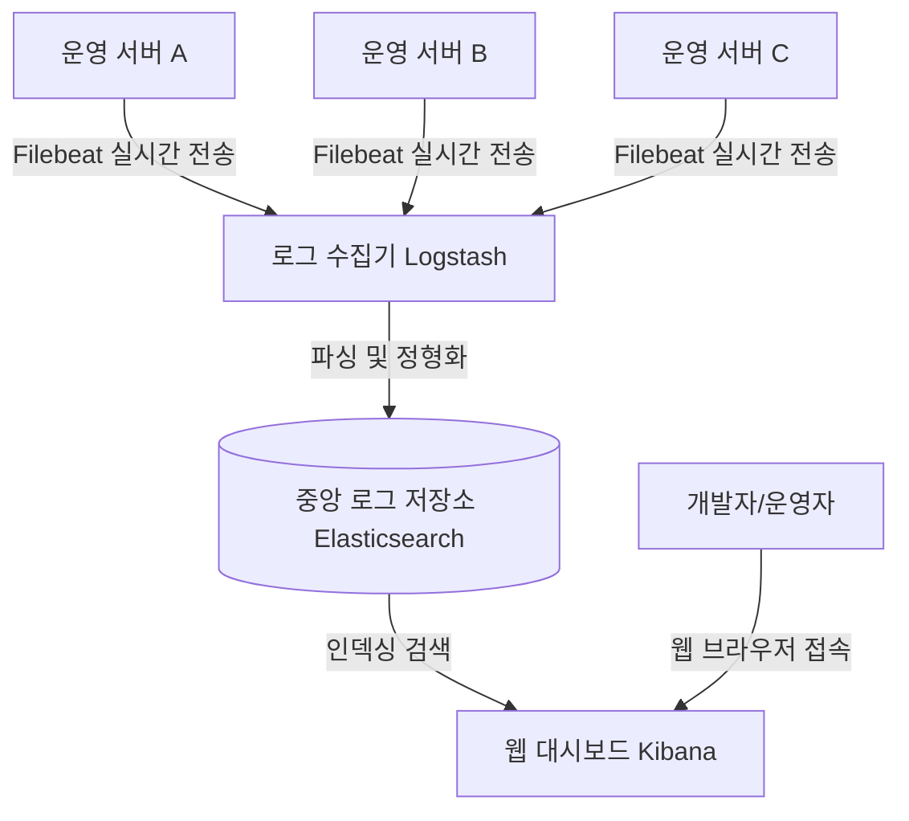

# 실무 개발자의 로그 관리 및 검색 결과 문서화 가이드

본 가이드는 실무 개발 현장에서 터미널 검색 결과를 어떻게 활용하고 관리하는지, 그리고 대형 프로젝트 운영 서버 환경에서 로그 데이터를 문서화하고 모니터링 시스템을 통해 어떻게 영구 관리 및 협업하는지 기술한 실무 교육 가이드북입니다.

---

## 1. 터미널 검색 결과 활용의 2가지 경로

현업 개발자들은 검색 결과를 **"일회성 확인"**과 **"보존 및 공유(문서화)"** 두 가지 형태로 구분하여 사용합니다.

```text
                     [터미널 검색 수행]
                             │
              ┌──────────────┴──────────────┐
     (일회성 디버깅)                (보고/공유/백업)
              │                             │
    [화면 바로 출력 (80%)]        [파일로 저장 (20%)]
    - 에러 라인 즉시 수정         - 리다이렉션 기호 (> , >>) 사용
    - 마우스 드래그 임시 복사      - 지라(Jira) 이슈 등록 / 메신저 전송
```

### 1.1 터미널 창에 바로 출력하는 경우 (80%의 일상 업무)
* **목적**: 로컬 개발 중 에러 해결, 코드 작성 도중 단순 위치 검색.
* **특징**: 터미널에서 `Ctrl + C`로 일시적으로 메모장에 붙여놓거나, 줄 번호를 보고 소스 코드로 즉시 이동한 뒤 수정하면 목적이 달성되므로 별도의 파일 저장 없이 창을 닫아 종료합니다.

### 1.2 파일로 만들어 보존하는 경우 (20%의 공식 협업)
* **목적**: 장애 전후 로그 아카이빙, 보안 감사 제출용 증적 확보, 대량 로그 분석 및 엑셀 2차 가공.
* **특징**: 리다이렉션 기호를 사용하여 실행 결과 텍스트 자체를 로컬 디스크 파일로 저장합니다.

---

## 2. 검색 결과의 파일 변환(Redirection) 실무 명령어

검색 결과를 텍스트(`.txt`, `.log`) 또는 CSV 파일 형식으로 즉시 추출하여 저장하는 명령어 조합 예제입니다.

### 2.1 덮어쓰기 저장 (`>`)
파일이 없으면 새로 만들고, 기존 파일이 존재하면 내용을 모조리 지우고 새로운 검색 결과로 덮어씁니다.
```powershell
# 예시: 로그에서 'ORA-' (오라클 에러) 단어가 매칭된 줄만 추려서 새 보고서 파일로 저장
# Windows PowerShell
Select-String -Path "app.log" -Pattern "ORA-" | Out-File -FilePath "ora_report.txt" -Encoding utf8

# Linux/Unix
grep "ORA-" app.log > ora_report.txt
```

### 2.2 누적 이어붙이기 (`>>`)
기존 파일의 아랫부분에 검색 결과 데이터를 덧붙여 누적합니다. 실시간 로그 백업이나 일자별 작업 누적 보고서 작성 시 사용됩니다.
```bash
# 예시: 기존 에러 보고서 파일 끝에 오늘 발생한 'FATAL' 로그를 이어서 덧붙임
# Windows CMD
findstr "FATAL" today.log >> fatal_accumulated.txt

# Linux/Unix
grep "FATAL" today.log >> fatal_accumulated.txt
```

---

## 3. 현업 협업 도구와의 로그 연계 및 관리

문서화된 로그 파일은 팀원 간 협업을 위해 사내 도구들과 유기적으로 결합하여 관리됩니다.

### 3.1 이슈 트래커 (Jira, Redmine 등) 티켓 첨부
* **협업 시나리오**: QA 팀이나 고객으로부터 오류가 보고되었을 때, 개발자는 해당 시간대의 터미널 로그 파일을 추출하여 **Jira 티켓에 첨부**합니다.
* **이유**: 로그를 채팅창에 줄글로 복사하면 형식이 깨지거나 양이 너무 길어 가독성이 훼손되므로, 깔끔하게 정돈된 `.txt` 또는 `.log` 파일 형태로 첨부하여 이슈의 재현성과 신뢰성을 확보합니다.

### 3.2 사내 위키 (Notion, Confluence 등) 지식 자산화
* **협업 시나리오**: 평소 자주 일어나는 트러블슈팅(예: DB 커넥션 풀 부족 장애 대처법) 로그 검색 과정과 그에 맞는 해결 명령어 템플릿을 문서에 고정 기록해 둡니다.
* **이유**: 추후 동일 장애 발생 시, 매번 새로 명령어를 찾아헤매지 않고 문서를 열어 즉시 복사-붙여넣기로 해결할 수 있는 **운영 매뉴얼(Runbook)**을 구축하기 위함입니다.

---

## 4. 엔터프라이즈 운영 환경의 통합 로그 모니터링 시스템

상용 웹 서비스 환경에서는 수십 대 이상의 분산된 서버의 로그를 터미널에서 수동으로 하나씩 뒤질 수 없기 때문에, 다음과 같은 **중앙 집중식 통합 로그 분석 시스템**을 표준으로 채택합니다.



### 4.1 ELK / EFK 스택
* **Elasticsearch (데이터베이스)**: 대량의 텍스트 로그를 실시간으로 인덱싱하여 밀리초 단위로 초고속 텍스트 검색을 지원하는 데이터 엔지니어링 허브입니다.
* **Logstash / Fluentd (수집기)**: 각 서버의 로그 텍스트를 수집하고, 날짜, 에러 등급, 서버 호스트명 등으로 예쁘게 쪼개어 정제(Parsing)한 후 데이터베이스에 꽂아 넣습니다.
* **Kibana (웹 대시보드)**: 개발자가 터미널을 켜지 않고 **웹 브라우저 상에서 구글 검색을 하듯 로그를 다각도로 조회 및 정렬**할 수 있는 관리자 화면입니다.

### 4.2 APM (Application Performance Monitoring) 도구
* **종류**: Jennifer(제니퍼), WhaTap(와탭), Datadog(데이터독), New Relic 등.
* **기능**: 단순 텍스트 수집을 넘어, 사용자가 브라우저에서 버튼을 누른 시점부터 백엔드 자바 컨트롤러, 서비스 레이어, 그리고 DB 쿼리 실행기까지의 **호출 흐름(Transaction Trace)을 시각화**하여 에러 발생 원인 코드 라인을 실시간으로 클릭 추적하게 해 줍니다.
