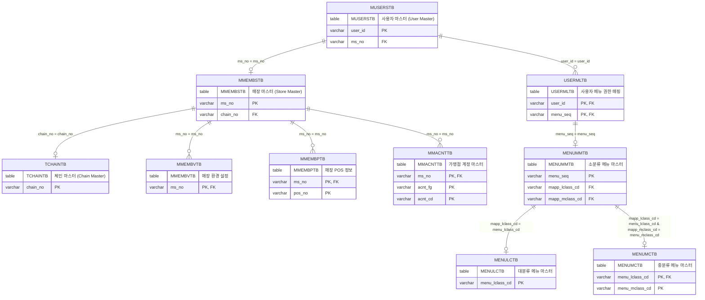

# 사용자 정보 연계 테이블 데이터 정합성 가이드

본 가이드는 현대 백오피스 시스템에서 사용자 로그인, 권한 부여, 그리고 매장 화면 진입 및 기능 작동에 필수적인 **사용자 정보 관련 테이블 간의 데이터 정합성 요건**을 정리합니다. 

로컬 개발 환경 구축이나 신규 가맹점/사용자 계정 생성 시 데이터 누락으로 인해 NullPointerException(NPE)이나 오동작이 발생하는 것을 방지하기 위해 작성되었습니다.

---

## 1. 사용자 정보 연계 구조 (ERD)

로그인 사용자 정보(`MUSERSTB`)를 중심으로 매장, 체인, 메뉴 권한 및 기초 설정 테이블들이 아래와 같이 상호 연결되어 있습니다.

<div class="mermaid-wrapper" style="position: relative; margin-bottom: 20px;">
  <button onclick="navigator.clipboard.writeText(this.nextElementSibling.innerText); alert('Mermaid 코드가 복사되었습니다.');" style="position: absolute; right: 10px; top: 10px; z-index: 100; background: #2563EB; color: white; border: none; padding: 5px 10px; border-radius: 6px; cursor: pointer; font-size: 11px; font-weight: 600; box-shadow: 0 2px 5px rgba(0,0,0,0.1);">코드 복사</button>

```text
erDiagram
    MUSERSTB {
        table MUSERSTB "사용자 마스터 (User Master)"
        varchar user_id "PK"
        varchar ms_no "FK"
    }
    MMEMBSTB {
        table MMEMBSTB "매장 마스터 (Store Master)"
        varchar ms_no "PK"
        varchar chain_no "FK"
    }
    TCHAINTB {
        table TCHAINTB "체인 마스터 (Chain Master)"
        varchar chain_no "PK"
    }
    USERMLTB {
        table USERMLTB "사용자 메뉴 권한 매핑"
        varchar user_id "PK, FK"
        varchar menu_seq "PK, FK"
    }
    MENUMMTB {
        table MENUMMTB "소분류 메뉴 마스터"
        varchar menu_seq "PK"
        varchar mapp_lclass_cd "FK"
        varchar mapp_mclass_cd "FK"
    }
    MENULCTB {
        table MENULCTB "대분류 메뉴 마스터"
        varchar menu_lclass_cd "PK"
    }
    MENUMCTB {
        table MENUMCTB "중분류 메뉴 마스터"
        varchar menu_lclass_cd "PK, FK"
        varchar menu_mclass_cd "PK"
    }
    MMEMBVTB {
        table MMEMBVTB "매장 환경 설정"
        varchar ms_no "PK, FK"
    }
    MMEMBPTB {
        table MMEMBPTB "매장 POS 정보"
        varchar ms_no "PK, FK"
        varchar pos_no "PK"
    }
    MMACNTTB {
        table MMACNTTB "가맹점 계정 마스터"
        varchar ms_no "PK, FK"
        varchar acnt_fg "PK"
        varchar acnt_cd "PK"
    }

    MUSERSTB ||--o| MMEMBSTB : "ms_no = ms_no"
    MMEMBSTB ||--o| TCHAINTB : "chain_no = chain_no"
    MUSERSTB ||--o{ USERMLTB : "user_id = user_id"
    USERMLTB ||--o| MENUMMTB : "menu_seq = menu_seq"
    MENUMMTB ||--o| MENULCTB : "mapp_lclass_cd = menu_lclass_cd"
    MENUMMTB ||--o| MENUMCTB : "mapp_lclass_cd = menu_lclass_cd & mapp_mclass_cd = menu_mclass_cd"
    MMEMBSTB ||--o{ MMEMBVTB : "ms_no = ms_no"
    MMEMBSTB ||--o{ MMEMBPTB : "ms_no = ms_no"
    MMEMBSTB ||--o{ MMACNTTB : "ms_no = ms_no"
```


</div>

---

## 2. 연계 테이블 상세 설명 (Table Glossary)

| 테이블명 | 테이블 영문명 / 국문명 | 주요 역할 및 기능 설명 |
| :--- | :--- | :--- |
| **`MUSERSTB`** | User Master Table / 사용자 마스터 | 로그인 계정 정보(ID, 패스워드 해시, 계정 상태), 사용자 유형, 매장 코드(`MS_NO`), 권한 역할(`ACCT_ROLE`, 사원 ID)을 관리하는 핵심 사용자 테이블 |
| **`MMEMBSTB`** | Store/Member Master Table / 매장 마스터 | 각 매장의 매장코드(`MS_NO`), 매장명, 소속 체인코드(`CHAIN_NO`), 체인본사여부(`CHAIN_HQ_YN`), 개점/사용여부 등 오프라인 점포 마스터를 정의하는 테이블 |
| **`TCHAINTB`** | Chain Master Table / 체인 마스터 | 백오피스 전체 가맹 체인 그룹번호(`CHAIN_NO`)와 체인명을 등록하고 관리하는 체인 최상위 마스터 테이블 |
| **`USERMLTB`** | User Menu Mapping / 사용자 메뉴 권한 | 특정 사용자 ID가 시스템 메뉴 트리 중 어떤 화면(소분류 메뉴 일련번호 `MENU_SEQ`)에 접근할 권한이 있는지 정의하는 권한 매핑 테이블 |
| **`MENUMMTB`** | Menu Master Table / 메뉴 마스터 (소분류) | 개별 메뉴 화면의 명칭, 접근 레벨, JSP 파일명, 실제 백오피스 뷰 경로, 사이드바 정렬 순서 등을 정의하는 소분류 화면 마스터 테이블 |
| **`MENULCTB`** | L-Class Menu Master / 대분류 메뉴 | 메뉴 트리의 최상위 대분류 코드(예: `0017` 입출금관리)와 사이드바 명칭 및 아이콘을 정의하는 테이블 |
| **`MENUMCTB`** | M-Class Menu Master / 중분류 메뉴 | 대분류 하위에 매핑되는 중분류 메뉴 코드(예: `0001` 시재관리)와 중분류 명칭을 정의하는 테이블 |
| **`MMEMBVTB`** | Store Environment Table / 매장 환경 설정 | 매장 마스터에 연계되어 매장별 가상 여신 한도(`CREDIT_LIMIT`), 영업/마감 여부 등 프로그램 작동 옵션을 제어하는 매장 세부 설정 테이블 |
| **`MMEMBPTB`** | Store POS Terminal / 매장 POS 단말 | 매장 내부에서 구동되는 개별 POS 단말 번호(`POS_NO`), 단말 명칭, 단말 IP 주소 및 활성화 여부를 관리하는 POS 단말 마스터 테이블 |
| **`MMACNTTB`** | Store Account Master / 가맹점 계정 마스터 | 매장 사용자가 현금 시재 입출금 등록(`st_cash_00001` 등) 시 화면의 계정 콤보박스에 출력되는 계정코드(`ACNT_CD`) 및 계정명(`ACNT_NM`)을 가맹점별로 관리하는 테이블 |

---

## 3. 영역별 테이블 스펙 및 데이터 입력 템플릿 (SQL)

### 2.1 사용자 마스터 테이블 (`MUSERSTB`)
시스템 로그인과 기본 정보를 보관하는 핵심 테이블입니다.

* **주요 정합성 체크포인트**:
  * `USER_ID`는 고유해야 합니다.
  * `PASSWD`는 스프링 시큐리티 호환을 위해 **BCrypt 단방향 해시**로 암호화되어야 합니다.
  * 계정의 활성화 상태(`ACCT_ENABLE = 'Y'`), 잠금 여부(`ACCT_LOCK = 'N'`), 만료 여부(`ACCT_EXPIRE = 'N'`), 패스워드 만료 여부(`PW_EXPIRE = 'N'`)가 설정되어야 로그인이 가능합니다.
  * 매장 사용자의 경우 `SYSTEM_TYPE`은 `'ST'`, `MS_NO`에는 유효한 매장코드가 들어가야 합니다.

* **INSERT SQL 템플릿**:
  ```sql
  INSERT INTO hmsfns.MUSERSTB (
      USER_ID, PASSWD, USER_NM, USER_TYPE, MS_NO, 
      EMP_ID, EMP_NO, ACCT_ROLE, ACCT_LOCK, ACCT_EXPIRE, 
      ACCT_ENABLE, PW_EXPIRE, SYSTEM_TYPE, CREATE_DTIME, CREATE_ID
  ) VALUES (
      'I000034b', 
      '$2a$10$uJZY4u/YPOGVTb/QYpvQ/OGpS9CkmFUWFKLomdmSrCOsPZWWQEg6i', -- '1' 해시값
      '홍길동78', 
      '002', -- 002: 매장 사용자
      'NC0021', -- 소속 매장 코드
      '0006', -- 사원 ID
      '0006', -- 사원 번호
      'ROLE_USER', 
      'N', 
      'N', 
      'Y', -- 활성화 필수
      'Y', 
      'ST', -- ST: 매장 시스템
      TO_CHAR(SYSDATE, 'YYYYMMDDHH24MISS'), 
      'SYSTEM'
  );
  ```

---

### 2.2 매장 마스터 및 체인 테이블 (`MMEMBSTB`, `TCHAINTB`)
로그인 세션에서 `chainNo`, `chainNm`, `msNm` 등을 조회하고 화면 전환을 처리하기 위한 기반 마스터 정보입니다. 이 테이블에 정보가 없으면 세션 정보 획득 실패로 NPE가 유발됩니다.

* **주요 정합성 체크포인트**:
  * `MUSERSTB.MS_NO`에 설정된 모든 코드가 `MMEMBSTB.MS_NO`에 물리적으로 존재해야 합니다.
  * 각 체인별로 **본사 매장 레코드(즉, `CHAIN_HQ_YN = 'Y'`인 레코드)**가 최소 1개 이상 존재해야만 `CHAIN_MS_NO`를 서브쿼리로 가져오는 로그인 단계가 정상 처리됩니다.
  * 매장 마스터의 `CHAIN_NO`는 `TCHAINTB`에 반드시 존재해야 합니다.

* **INSERT SQL 템플릿**:
  ```sql
  -- 1) 체인 마스터 등록
  INSERT INTO hmsfns.TCHAINTB (CHAIN_NO, CHAIN_NM, AFFILIATE_COMPANY, PLACE) 
  VALUES ('C001', '본부_HMS SHOP', '현대', '서울');

  -- 2) 가맹점 매장 마스터 등록
  INSERT INTO hmsfns.MMEMBSTB (
      MS_NO, MS_NM, CHAIN_NO, CHAIN_HQ_YN, USE_YN, OPEN_FG, BANK_CD, ZIP_NO, BILL_ADDR, TAX_TYPE
  ) VALUES (
      'NC0021', 
      '고양2 Shop', 
      'C001', -- 소속 체인코드
      'N', -- 가맹점구분 (본부인 경우 'Y')
      'Y', -- 사용여부 필수
      '2', -- 개점구분 필수
      ' ', -- 필수 제약조건 공백 채움
      '10390', 
      '현대모터스튜디오||경기도 일산서구 킨텍스로 217-6', 
      '1'
  );
  ```

---

### 2.3 메뉴 권한 테이블 (`USERMLTB`, `MENUMMTB`, `MENULCTB`, `MENUMCTB`)
사용자가 정상 로그인한 뒤 사이드바 아코디언 메뉴와 실제 화면 URL에 접근할 수 있도록 하는 권한 정합성 정보입니다.

* **주요 정합성 체크포인트**:
  * 사용자의 로그인 ID(`USER_ID`)와 접근해야 하는 화면의 `MENU_SEQ` 정보가 `USERMLTB`에 매핑되어야 합니다.
  * 매핑된 `MENU_SEQ`에 해당하는 레코드가 대분류(`MENULCTB`), 중분류(`MENUMCTB`), 소분류 메뉴 마스터(`MENUMMTB`)에 온전한 부모-자식 트리 형태로 존재해야 사이드바가 렌더링되고 접근 차단(Access Denied)을 방지합니다.

* **INSERT SQL 템플릿**:
  ```sql
  -- 1) 대분류 등록
  INSERT INTO hmsfns.MENULCTB (MENU_LCLASS_CD, MENU_LCLASS_NM, LCLASS_PERIOD, MENU_TYPE) 
  VALUES ('0017', '입출금관리', 17, 'ST');

  -- 2) 중분류 등록
  INSERT INTO hmsfns.MENUMCTB (MENU_LCLASS_CD, MENU_MCLASS_CD, MENU_MCLASS_NM, MCLASS_PERIOD, MENU_TYPE) 
  VALUES ('0017', '0001', '입출금관리', 1, 'ST');

  -- 3) 메뉴 마스터(소분류) 등록
  INSERT INTO hmsfns.MENUMMTB (
      MENU_SEQ, MENU_NM, MENU_LEVEL, MAPP_LCLASS_CD, MAPP_MCLASS_CD, MENU_PERIOD, VIEW_PATH, VIEW_FILE
  ) VALUES (
      '000175', 
      '입출금내역등록', 
      '3', 
      '0017', 
      '0001', 
      1, 
      '/WEB-INF/views/backoffice/main/contents/st/cash/st_cash_00001', 
      'st_cash_00001.jsp'
  );

  -- 4) 사용자 권한 맵핑 등록
  INSERT INTO hmsfns.USERMLTB (USER_ID, MENU_SEQ, FAVORITES_YN, EVENT_ROLE) 
  VALUES ('I000034b', '000175', 'N', 'ROLE_USER');
  ```

---

### 2.4 매장 구동을 위한 필수 환경설정 테이블 (`MMEMBVTB`, `MMEMBPTB`, `MMACNTTB`)
화면 구동 이후, 매장 내부 비즈니스 로직(POS 통신, 시재/계정 조회 등)에 참조되는 테이블입니다.

* **주요 정합성 체크포인트**:
  * 매장 현금 시재 조회/등록 시, 가맹점 계정 마스터(`MMACNTTB`)에 해당 매장 코드의 레코드가 없으면 원장과 inner join하는 화면에서 내역이 나타나지 않습니다.

* **INSERT SQL 템플릿**:
  ```sql
  -- 1) 매장 환경설정 기본값 등록 (NC0021 매장용)
  INSERT INTO hmsfns.MMEMBVTB (MS_NO, CREDIT_LIMIT, OPEN_FG) 
  VALUES ('NC0021', 5000000, '2');

  -- 2) 매장 POS 정보 기본값 등록 (NC0021 매장의 01번 포스 등록)
  INSERT INTO hmsfns.MMEMBPTB (MS_NO, POS_NO, MAC_ADD_IP, ORDER_YN) 
  VALUES ('NC0021', '01', '127.0.0.1', 'Y');

  -- 3) 매장 지출 계정코드 목록 등록 (현금시재등록 화면 조회 및 저장을 위해 필수)
  INSERT INTO hmsfns.MMACNTTB (
      MS_NO, ACNT_FG, ACNT_CD, ACNT_NM, CREATE_FG, CREATE_DTIME, CREATE_ID, LAST_DTIME, LAST_ID, USE_YN
  ) VALUES 
  ('NC0021', '0', '01', '기타입금', '1', TO_CHAR(SYSDATE, 'YYYYMMDDHH24MISS'), 'SYSTEM', TO_CHAR(SYSDATE, 'YYYYMMDDHH24MISS'), 'SYSTEM', 'Y'),
  ('NC0021', '1', '01', '기타출금', '1', TO_CHAR(SYSDATE, 'YYYYMMDDHH24MISS'), 'SYSTEM', TO_CHAR(SYSDATE, 'YYYYMMDDHH24MISS'), 'SYSTEM', 'Y');
  ```

---

## 3. 정합성 깨진 데이터 자가 복구 스크립트 (PL/pgSQL)

로컬 개발 환경에서 테스트 사용자는 있으나 매장 정보가 누락되어 발생하는 오류를 한 번에 자동 수정(복구)해 주는 스크립트입니다. 이미 완벽하게 작동하는 **`NC0003` (고양 Shop)**의 설정들을 누락된 대상 매장에 자동으로 복사해 줍니다.

```sql
DO $$
DECLARE
    missing_ms RECORD;
    src_ms_code VARCHAR := 'NC0003'; -- 복사 원본 (완전한 매장 데이터)
BEGIN
    -- 1. MUSERSTB에 등록되어 있으나 MMEMBSTB 매장 마스터에는 누락된 매장 조회
    FOR missing_ms IN 
        SELECT DISTINCT MS_NO 
        FROM hmsfns.MUSERSTB 
        WHERE MS_NO NOT IN (SELECT MS_NO FROM hmsfns.MMEMBSTB) 
          AND MS_NO IS NOT NULL
    LOOP
        RAISE NOTICE '누락 매장 복구 시작: %', missing_ms.MS_NO;
        
        -- 1. MMEMBSTB (매장 마스터 복사)
        INSERT INTO hmsfns.MMEMBSTB (
            MS_NO, MS_NM, MS_ENG_NM, CHAIN_NO, CHAIN_HQ_YN, CHAIN_AREA, BIZ_NO, BS_TYPE, BS_KIND, 
            MASTER_NM, TEL_NO, HP_NO, EMG_NO, FAX_NO, HOMEPAGE, ZIP_NO, BILL_ADDR, ADDRESS, 
            ADDRESS_BUNJI, BANK_CD, ACCT_CD, ACCT_NM, USE_YN, HEAD_MSG, TAIL_MSG, OPEN_FG, 
            OPEN_DATE, CLOSE_DATE, SHOP_TYPE, TAX_TYPE, CREATE_DTIME, CREATE_ID, LAST_DTIME, 
            LAST_ID, EXCEL_SHOP_CODE, ERP_CD, ERP_VAT_CD, COMM_RATE, SHOP_SALES_AREA, D_SHOP_CODE, 
            SHOP_LC_CD, SHOP_MC_CD, SHOP_SC_CD, MASTER_ENG_NM, ENG_ADDRESS, SHOP_WH_YN, 
            WORK_APPR_YN, SHOP_BRAND_CD, MPOINT_RATE, IF_BIZ_CD, IF_SHOP_CD, IF_RESERVE_AMT, 
            IF_RETURN_RESERVE_AMT, IF_BLUE_JOS_NO, PRE_PURCH_WH_MS_NO
        )
        SELECT 
            missing_ms.MS_NO, '임시매장_' || missing_ms.MS_NO, MS_ENG_NM, CHAIN_NO, CHAIN_HQ_YN, CHAIN_AREA, BIZ_NO, BS_TYPE, BS_KIND, 
            MASTER_NM, TEL_NO, HP_NO, EMG_NO, FAX_NO, HOMEPAGE, ZIP_NO, BILL_ADDR, ADDRESS, 
            ADDRESS_BUNJI, BANK_CD, ACCT_CD, ACCT_NM, USE_YN, HEAD_MSG, TAIL_MSG, OPEN_FG, 
            OPEN_DATE, CLOSE_DATE, SHOP_TYPE, TAX_TYPE, CREATE_DTIME, CREATE_ID, LAST_DTIME, 
            LAST_ID, EXCEL_SHOP_CODE, ERP_CD, ERP_VAT_CD, COMM_RATE, SHOP_SALES_AREA, D_SHOP_CODE, 
            SHOP_LC_CD, SHOP_MC_CD, SHOP_SC_CD, MASTER_ENG_NM, ENG_ADDRESS, SHOP_WH_YN, 
            WORK_APPR_YN, SHOP_BRAND_CD, MPOINT_RATE, IF_BIZ_CD, IF_SHOP_CD, IF_RESERVE_AMT, 
            IF_RETURN_RESERVE_AMT, IF_BLUE_JOS_NO, PRE_PURCH_WH_MS_NO
        FROM hmsfns.MMEMBSTB
        WHERE MS_NO = src_ms_code;

        -- 2. MMEMBVTB (환경설정 복사)
        INSERT INTO hmsfns.MMEMBVTB
        SELECT missing_ms.MS_NO, CREDIT_LIMIT, OPEN_FG, PRE_PURCH_LIMIT_AMT, LIMIT_LAST_DATE, 
               LAST_CLOSING_MONTH, FORCE_VAN_YN, VAN_TID, FORCE_CALC_DIV_YN, ST_CLOSE_LIMIT_YN, 
               CREATE_DTIME, CREATE_ID, LAST_DTIME, LAST_ID
        FROM hmsfns.MMEMBVTB
        WHERE MS_NO = src_ms_code;

        -- 3. MMEMBPTB (POS 터미널 정보 복사)
        INSERT INTO hmsfns.MMEMBPTB
        SELECT missing_ms.MS_NO, POS_NO, MAC_ADD_IP, ORDER_YN, USE_YN, MEMO, CREATE_DTIME, 
               CREATE_ID, LAST_DTIME, LAST_ID, MS_POS_NM, POS_FG, IP_ADDR, D_POS_NO
        FROM hmsfns.MMEMBPTB
        WHERE MS_NO = src_ms_code;

        -- 4. MMACNTTB (계정 코드 복사)
        INSERT INTO hmsfns.MMACNTTB
        SELECT missing_ms.MS_NO, ACNT_FG, ACNT_CD, ACNT_NM, CREATE_FG, CREATE_DTIME, 
               CREATE_ID, LAST_DTIME, LAST_ID, USE_YN
        FROM hmsfns.MMACNTTB
        WHERE MS_NO = src_ms_code;

        RAISE NOTICE '누락 매장 복구 완료: %', missing_ms.MS_NO;
    END LOOP;
END $$;
```

---

## 4. 정합성 검증 쿼리 (Data Integrity Audit Queries)

다음 SQL 쿼리를 실행하여 현재 데이터베이스의 사용자 정합성 상태를 주기적으로 감사하고 모니터링할 수 있습니다.

### 4.1 매장 정보가 유실된 사용자 조회 (NPE 위험 계정)
```sql
SELECT USER_ID, USER_NM, MS_NO, SYSTEM_TYPE 
FROM hmsfns.MUSERSTB 
WHERE MS_NO NOT IN (SELECT MS_NO FROM hmsfns.MMEMBSTB)
  AND MS_NO IS NOT NULL;
```
* *해석*: 결과 행이 조회된다면 해당 사용자 ID로 로그인 시 `chainNo`가 null이 되어 NPE 오류가 유발됩니다. (결과가 **0건**이어야 안전함)

### 4.2 체인 정보가 존재하지 않는 매장 조회
```sql
SELECT MS_NO, MS_NM, CHAIN_NO 
FROM hmsfns.MMEMBSTB 
WHERE CHAIN_NO NOT IN (SELECT CHAIN_NO FROM hmsfns.TCHAINTB);
```
* *해석*: 매장의 체인 코드가 체인 마스터 테이블에 매핑되지 않은 경우입니다. (결과가 **0건**이어야 안전함)

### 4.3 체인 내에 본사(HQ) 매장이 지정되지 않은 체인 조회
```sql
SELECT CHAIN_NO, CHAIN_NM 
FROM hmsfns.TCHAINTB C 
WHERE NOT EXISTS (
    SELECT 1 
    FROM hmsfns.MMEMBSTB M 
    WHERE M.CHAIN_NO = C.CHAIN_NO 
      AND M.CHAIN_HQ_YN = 'Y'
);
```
* *해석*: 로그인 시 체인별 본사 매장코드(`CHAIN_MS_NO`) 조회를 대입하는 데 실패하게 됩니다. (결과가 **0건**이어야 안전함)

### 4.4 메뉴 권한이 매핑되었으나 실제 메뉴 마스터에는 없는 비정상 권한 조회
```sql
SELECT USER_ID, MENU_SEQ 
FROM hmsfns.USERMLTB 
WHERE MENU_SEQ NOT IN (SELECT MENU_SEQ FROM hmsfns.MENUMMTB);
```
* *해석*: 사용자 권한 is 있으나 실제 메뉴 정보가 삭제된 찌꺼기 권한 목록입니다. (결과가 **0건**이어야 안전함)
