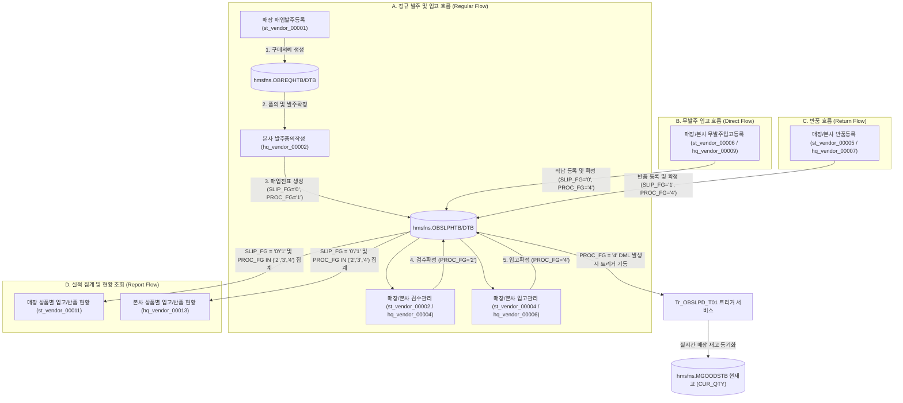

# HMS 매입 및 입고/반품 모듈 데이터 흐름 가이드 (Purchasing & Receiving/Return Data Flow Guide)

**작성일**: 2026-06-30  
**작성자**: AI QA Agent (Antigravity)  

HMS의 매입발주 및 입고/반품 관리 체계는 **정규 발주 및 입고 흐름(Regular Flow)**, **무발주 입고 흐름(Direct Flow)**, 그리고 **반품 흐름(Return Flow)**의 세 가지 핵심 경로로 나뉩니다. 이 경로들을 통해 수집된 트랜잭션 데이터는 공통 매입 테이블인 `hmsfns.OBSLPHTB`(매입전표 헤더)와 `hmsfns.OBSLPDTB`(매입전표 상세)에 적재되며, 최종적으로 상품별 입고/반품 현황 조회 화면(`st_vendor_00011`, `hq_vendor_00013`)의 원천 데이터가 됩니다.

---

## 1. 매입 및 입고/반품 데이터 흐름 아키텍처

<div class="mermaid-wrapper" style="position: relative; margin-bottom: 20px;">
  <button onclick="navigator.clipboard.writeText(this.nextElementSibling.innerText); alert('Mermaid 코드가 복사되었습니다.');" style="position: absolute; right: 10px; top: 10px; z-index: 100; background: #2563EB; color: white; border: none; padding: 5px 10px; border-radius: 6px; cursor: pointer; font-size: 11px; font-weight: 600; box-shadow: 0 2px 5px rgba(0,0,0,0.1);">코드 복사</button>

```text
flowchart TD
    subgraph A ["A. 정규 발주 및 입고 흐름 (Regular Flow)"]
        ST_ORD["매장 매입발주등록 (st_vendor_00001)"] -->|1. 구매의뢰 생성| DB_REQ[("hmsfns.OBREQHTB/DTB")]
        DB_REQ -->|2. 품의 및 발주확정| HQ_PROV["본사 발주품의작성 (hq_vendor_00002)"]
        HQ_PROV -->|"3. 매입전표 생성 (SLIP_FG='0', PROC_FG='1')"| DB_SLIP[("hmsfns.OBSLPHTB/DTB")]
        DB_SLIP --> ST_CHECK["매장/본사 검수관리 (st_vendor_00002 / hq_vendor_00004)"]
        ST_CHECK -->|"4. 검수확정 (PROC_FG='2')"| DB_SLIP
        DB_SLIP --> ST_IN["매장/본사 입고관리 (st_vendor_00004 / hq_vendor_00006)"]
        ST_IN -->|"5. 입고확정 (PROC_FG='4')"| DB_SLIP
    end

    subgraph B ["B. 무발주 입고 흐름 (Direct Flow)"]
        ST_DIR_IN["매장/본사 무발주입고등록 (st_vendor_00006 / hq_vendor_00009)"] -->|"직납 등록 및 확정 (SLIP_FG='0', PROC_FG='4')"| DB_SLIP
    end

    subgraph C ["C. 반품 흐름 (Return Flow)"]
        ST_RET["매장/본사 반품등록 (st_vendor_00005 / hq_vendor_00007)"] -->|"반품 등록 및 확정 (SLIP_FG='1', PROC_FG='4')"| DB_SLIP
    end

    subgraph D ["D. 실적 집계 및 현황 조회 (Report Flow)"]
        DB_SLIP -->|"SLIP_FG = '0'/'1' 및 PROC_FG IN ('2','3','4') 집계"| ST_REP_11["매장 상품별 입고/반품 현황 (st_vendor_00011)"]
        DB_SLIP -->|"SLIP_FG = '0'/'1' 및 PROC_FG IN ('2','3','4') 집계"| HQ_REP_13["본사 상품별 입고/반품 현황 (hq_vendor_00013)"]
    end

    %% Trigger & Stock Sync
    DB_SLIP -->|"PROC_FG = '4' DML 발생시 트리거 기동"| TRG["Tr_OBSLPD_T01 트리거 서비스"]
    TRG -->|"실시간 매장 재고 동기화"| DB_STOCK[("hmsfns.MGOODSTB 현재고 (CUR_QTY)")]
```


</div>

---

## 2. 모듈 및 상태값 연계 정보

### 2.1 전표 구분 (`SLIP_FG`)
* **`0`**: 입고 (Receiving) — 구매, 직납 등 협력업체로부터의 매입 실적.
* **`1`**: 반품 (Return) — 협력업체로의 반제품, 불량 등 반품 실적.

### 2.2 전표 진행상태 (`PROC_FG`)
* **`0`**: 임시저장
* **`1`**: 발주확정 / 반품등록 (검수대기)
* **`2`**: 검수확정 / 반품승인
* **`3`**: 배송확정
* **`4`**: 입고확정 / 반품확정 (재고 수불 완료 단계)

---

## 3. 세부 데이터 연계 비즈니스 시나리오

### 3.1 정규 발주/입고 경로 (Regular Flow)
1. **발주요청**: 매장에서 `st_vendor_00001`을 통해 본사로 구매의뢰(`OBREQHTB`/`OBREQDTB`)를 작성 및 전송합니다.
2. **발주품의**: 본사 관리자가 `hq_vendor_00002`에서 품의 확정 및 발주 처리를 진행하면, 시스템이 내부적으로 매입전표 테이블(`OBSLPHTB`/`OBSLPDTB`)에 `SLIP_FG = '0'`, `PROC_FG = '1'`(발주확정/검수대기) 상태의 전표를 신규 생성합니다.
3. **검수처리**: 매장에 상품이 도착하면 `st_vendor_00002`(또는 본사 `hq_vendor_00004`)를 통해 검수 수량을 저장하고 확정하여 `PROC_FG = '2'`(검수확정) 상태로 변경합니다.
4. **입고확정**: 최종적으로 `st_vendor_00004`(또는 본사 `hq_vendor_00006`)에서 입고 확정을 처리하면 `PROC_FG = '4'`(입고확정) 상태가 되며, **`Tr_OBSLPD_T01` 트리거 서비스**를 통해 가맹점 상품 테이블(`MGOODSTB`)의 현재고(`CUR_QTY`)를 증가시킵니다.

### 3.2 무발주 직납 경로 (Direct Flow)
1. **등록/확정**: 매장(`st_vendor_00006`) 또는 본사(`hq_vendor_00009`)에서 발주 없이 거래처 직납 상품을 바로 수동 등록하여 확정합니다.
2. **결과**: `OBSLPHTB` 테이블에 `SLIP_FG = '0'`, `PROC_FG = '4'`(입고확정) 상태로 즉시 적재되어 실시간 재고 반영 및 입고 실적으로 집계됩니다.

### 3.3 반품 경로 (Return Flow)
1. **반품등록**: 매장(`st_vendor_00005`) 또는 본사(`hq_vendor_00007`)에서 반품할 상품과 수량을 등록하여 반품 확정을 수행합니다.
2. **결과**: `OBSLPHTB` 테이블에 `SLIP_FG = '1'`, `PROC_FG = '4'`(반품확정) 상태로 즉시 적재되며, 재고 수불 연동을 통해 해당 가맹점 상품 마스터(`MGOODSTB`)의 재고 수량이 차감됩니다.

---

## 4. `st_vendor_00011` / `hq_vendor_00013`에서의 실적 집계 규칙

* 두 현황 화면은 위의 **3가지 경로**를 거쳐 최종 정합이 완료된 `OBSLPHTB`(OH) 및 `OBSLPDTB`(OD) 데이터를 기반으로 실적을 산출합니다.
* **조회 대상 기준**: `OH.PURCH_DATE`(입고/확정일자)가 사용자의 검색 기간 범위 내에 속하고, `OH.PROC_FG IN ('2', '3', '4')` 범위인 유효 전표만 집계 대상에 포함됩니다.
* **필드별 집계 수식**:
  * **거래처출고 (협력업체 발송분)**: `SLIP_FG = '0'`(입고) 전표 전체에 대해 수량(`SUPPLY_QTY`) 및 금액(`SUPPLY_AMT`)을 합산합니다.
  * **최종입고 (매장 최종 인수분)**: `SLIP_FG = '0'`(입고) 이면서 `PROC_FG = '4'`(입고확정)인 데이터만 선별하여 수량(`PURCH_QTY`) 및 금액(`PURCH_AMT`)을 합산합니다.
  * **반품 (매장 반품분)**: `SLIP_FG = '1'`(반품) 전표 전체에 대해 수량(`RETURN_QTY` = `PURCH_QTY`) 및 금액(`RETURN_AMT` = `PURCH_AMT`)을 합산합니다.
* **그리드 연동**: 집계된 결과를 상품코드(`GOODS_CD`) 단위로 `GROUP BY`하여 목록 그리드(Table 1)에 바인딩하고, 상품명 클릭 시 해당 상품의 일자별 상세 확정 원장 데이터를 상세 모달 창(Table 2)으로 조회합니다.
