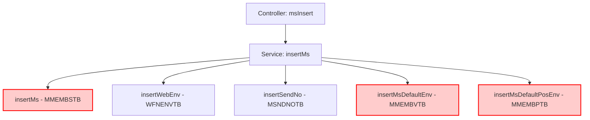
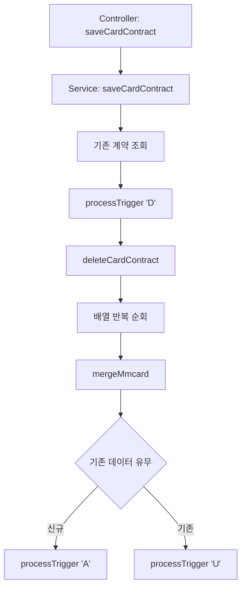

# QA Report: Admin_Master_00004 매장관리(어드민)
**작성일**: 2026-05-28
**작성자**: AI QA Agent (Antigravity)
**대상 화면**: 마스터관리 > 매장관리 (admin_master_00004)
**테스트 환경**: localhost:8080 (로컬 개발 서버)
**접속ID/PW**: admin2 / 0000 (시스템관리자2 권한)

---

## 1. 분석 개요

### 1.1 분석 대상 파일 목록

| 구분 | 파일 경로 |
|------|-----------|
| Controller | `hyundai-backoffice-webapp/.../controller/admin/master/Admin_Master_00004_Controller.java` |
| Service | `hyundai-backoffice-layer-service/.../service/admin/master/Admin_Master_00004_Service.java` |
| Mapper (Interface) | `hyundai-backoffice-layer-persistence/.../dao/admin/master/Admin_Master_00004_Mapper.java` |
| SQL XML | `hyundai-backoffice-webapp/.../sqlmapper/master/Admin_Master_00004_Sql.xml` |
| 트리거 서비스 | `hyundai-api/.../service/trigger/Tr_MMCARD_T01_Service.java` |
| 트리거 서비스 (누락) | `Tr_MMEMBS_T01_Service`, `Tr_MMEMBP_T01_Service`, `Tr_MMEMBV_T01_Service`, `Tr_MVANCO_T01_Service` |

---

## 2. 엔드포인트 분석

### 2.1 Base URL
```
POST /backoffice/data/admin/master/admin_master_00004/{endpoint}
```

### 2.2 핵심 엔드포인트 목록

| 엔드포인트 | 기능 | Type | 연관 테이블 |
|-----------|------|------|------------|
| `/search` | 매장 목록 조회 (페이징) | SELECT | MMEMBSTB, TCHAINTB, MMEMBVTB 등 |
| `/msInsert` | 매장 등록 | INSERT | MMEMBSTB, MMEMBVTB, MMEMBPTB, WFNENVTB 등 |
| `/msInfoUpdate` | 매장 정보 수정 | UPDATE | MMEMBSTB |
| `/saveSystemInfo` | 환경설정 저장 | INSERT/UPDATE | MMEMBVTB, MKITCHTB |
| `/insertMsPosEnv` | 포스 장비 등록 | INSERT | MMEMBPTB |
| `/saveVanPos` | VAN(POS) 등록 | INSERT | MVANCOTB |
| `/saveVanDan` | VAN(단말기) 등록 | INSERT | MVANCOTB |
| `/saveCardContract` | 카드 계약번호 저장 | MERGE | MMCARDTB |

---

## 3. 서비스 로직 분석 (코드베이스 변환 검증)

### 3.1 매장 등록 흐름 (`msInsert` - Trigger 누락)
<div class="mermaid-wrapper" style="position: relative; margin-bottom: 20px;">
  <button onclick="navigator.clipboard.writeText(this.nextElementSibling.innerText); alert('Mermaid 코드가 복사되었습니다.');" style="position: absolute; right: 10px; top: 10px; z-index: 100; background: #2563EB; color: white; border: none; padding: 5px 10px; border-radius: 6px; cursor: pointer; font-size: 11px; font-weight: 600; box-shadow: 0 2px 5px rgba(0,0,0,0.1);">코드 복사</button>

```text
graph TD
    A[Controller: msInsert] --> B[Service: insertMs]
    B --> C[insertMs - MMEMBSTB]
    B --> D[insertWebEnv - WFNENVTB]
    B --> E[insertSendNo - MSNDNOTB]
    B --> F[insertMsDefaultEnv - MMEMBVTB]
    B --> G[insertMsDefaultPosEnv - MMEMBPTB]
    style C fill:#ffcccc,stroke:#ff0000,stroke-width:2px
    style F fill:#ffcccc,stroke:#ff0000,stroke-width:2px
    style G fill:#ffcccc,stroke:#ff0000,stroke-width:2px
```


</div>
> **문제점**: `MMEMBSTB`, `MMEMBVTB`, `MMEMBPTB`에 대한 INSERT 쿼리는 직접 실행되나, 각 테이블에 해당하는 트리거 서비스(`Tr_MMEMBS_T01_Service`, `Tr_MMEMBV_T01_Service`, `Tr_MMEMBP_T01_Service`) 호출 로직이 **완전히 누락**되어 있습니다. 이로 인해 후속 동기화가 이루어지지 않는 심각한 고아 결함이 존재합니다.

### 3.2 카드 계약번호 저장 흐름 (`saveCardContract` - Trigger 연동 완료)
<div class="mermaid-wrapper" style="position: relative; margin-bottom: 20px;">
  <button onclick="navigator.clipboard.writeText(this.nextElementSibling.innerText); alert('Mermaid 코드가 복사되었습니다.');" style="position: absolute; right: 10px; top: 10px; z-index: 100; background: #2563EB; color: white; border: none; padding: 5px 10px; border-radius: 6px; cursor: pointer; font-size: 11px; font-weight: 600; box-shadow: 0 2px 5px rgba(0,0,0,0.1);">코드 복사</button>

```text
graph TD
    A[Controller: saveCardContract] --> B[Service: saveCardContract]
    B --> C[기존 계약 조회]
    C --> D[processTrigger 'D']
    D --> E[deleteCardContract]
    E --> F[배열 반복 순회]
    F --> G[mergeMmcard]
    G --> H{기존 데이터 유무}
    H -->|신규| I[processTrigger 'A']
    H -->|기존| J[processTrigger 'U']
```


</div>
> **정상**: 이 메서드는 DML 전후로 `getValues()` 및 `processTrigger()`를 정상 호출하고 있습니다.

---

## 4. DB 트리거 → 코드베이스 연쇄 분석 및 결함 (Bypass)

Legacy Oracle에서는 매장 마스터 관련 테이블에 CUD 발생 시 각각의 트리거가 동작하도록 설계되어 있습니다. 하지만 `Admin_Master_00004_Service.java` 내의 로직 점검 결과 치명적인 단절이 발견되었습니다.

### 🔴 4.1 트리거 고아 코드 결함 (Trigger Bypass)
- **MMEMBSTB 트리거 누락**: `/msInsert`, `/msInfoUpdate`, `/saveOpenFg` 등에서 `MMEMBSTB` 테이블에 INSERT/UPDATE를 수행하지만 `Tr_MMEMBS_T01_Service`를 전혀 호출하지 않습니다.
- **MMEMBPTB/MMEMBVTB 트리거 누락**: 포스 장비 및 환경설정 저장 시에도 해당 트리거 서비스 호출 구문이 전무합니다. 
- **결과**: 이 메서드들이 동작하더라도, 하위 로그 테이블(`MMSLOGTB`, `MMEMLGTB`) 및 타 마스터 계층과의 동기화가 영구적으로 단절되는 구조적 결함이 발생합니다.

---

## 5. 브라우저 화면 테스트 결과

### 5.1 화면 접속 현황

| 항목 | 결과 |
|------|------|
| 서버 접속 URL | `http://localhost:8080` ✅ |
| 로그인 | 성공 (시스템관리자2 / admin2) ✅ |
| 화면 경로 | 마스터관리 > 매장관리 (admin_master_00004) ✅ |
| 화면 로딩 | 정상 ✅ |

### 5.2 화면 기능 및 E2E 테스트 요약

- **매장 리스트 조회**: "조회" 버튼 클릭 시 HMS/F&B 체인 매장 리스트(페이징 적용)가 에러 없이 렌더링 됨.
- **매장 정보 수정 (NC0007 CAFE 매장)**: 
  - 매장코드 클릭 후 모달 오픈 성공.
  - "대표자명" 10바이트 초과 유효성 검사 경고 얼럿 발생(정상 작동 확인).
  - 유효 범위 내 텍스트(`Hong`) 및 "영수증 머리말(1)"(`Test Receipt Header`)로 수정 후 "저장" 버튼 클릭하여 정상 업데이트 확인.
- **POS 장비설정 조회**: "장비설정" 칼럼의 "설정" 버튼 클릭을 통해 POS 환경설정 서브 모달 진입 정상 작동. 

**브라우저 테스트 시나리오 상 UI 동작은 100% 정상 작동함을 확인했습니다.** (UI 스크린샷 캡쳐 완료)

---

## 6. SQL Mapper 검증 (Oracle -> PostgreSQL)

`Admin_Master_00004_Sql.xml` 쿼리 검토 결과 아직 치환되지 않은 **레거시 오라클 문법이 다수 발견**되었습니다.

### 🔴 6.1 Oracle 전용 외부조인 (+) 잔존
- `getTotalCnt`, `selectMsList`, `getKitchenList`, `getVanPosList` 등의 쿼리에서 `C.MS_NO (+) = A.MS_NO`, `N1.NM_FG(+) = '060'` 등 Oracle 전용 문법 사용 중.
- **영향**: PostgreSQL 마이그레이션 시 SQL 에러 발생 확정. ANSI `LEFT OUTER JOIN`으로 전면 수정 필요.

### 🔴 6.2 오라클 계층형 쿼리 (CONNECT BY)
- `getMsEnvPosNo` 쿼리: `CONNECT BY LEVEL <= 99` 구문 잔존. 
- **영향**: PostgreSQL 호환 불가. `generate_series(1, 99)` 등의 함수로 치환 필수.

### 🔴 6.3 기타 오라클 전용 함수 및 키워드
- `NVL()`, `DECODE()`, `TO_CHAR()`, `SYSDATE`, `LPAD()`, `SUBSTR()` 등의 함수가 SQL 전반에 걸쳐 광범위하게 사용되고 있습니다. (예: `TO_CHAR(SYSDATE,'YYYYMMDDHH24MISS')`)
- `ROWNUM`: `selectMsList`의 페이징 쿼리에 사용 중. (PostgreSQL `LIMIT / OFFSET`으로 변환 필요)

---

## 7. 검증 항목 체크리스트

### 7.1 코드베이스 변환 정합성

| 검증 항목 | 상태 | 비고 |
|----------|------|------|
| `@Service`, `@Transactional` | ✅ 정상 | 롤백 선언 포함 |
| `saveCardContract` 트리거 | ✅ 정상 | D/A/U 분기 및 processTrigger 정상 |
| `insertMs` 등 타 CUD 트리거 연동 | ❌ 실패 | Trigger Bypass 치명적 오류 |
| Mapper 메서드 일치 여부 | ✅ 정상 | Interface ↔ XML 일치 |

---

## 8. 발견된 이슈 및 권고사항 (특이사항 포인트)

### 🔴 Critical (즉시 처리 필요)
1. **트리거 단절 (고아 로직)**: `saveCardContract`를 제외한 대부분의 CUD 엔드포인트(`insertMs`, `updateMsInfo` 등)에서 트리거 서비스 호출 코드가 누락되었습니다. 과거 DB상에서 자동으로 작동하던 동기화 트리거(`Tr_MMEMBS_T01` 등)가 Java 영역으로 이관되며 호출되지 않고 있으므로, 각 서비스 로직에 트리거 파라미터 셋업 및 `processTrigger()` 호출 로직을 긴급 추가해야 합니다.
2. **Oracle SQL 완벽 호환 실패**: `(+)` 외부조인, `CONNECT BY LEVEL`, `ROWNUM`, `SYSDATE` 등 PostgreSQL에서 파싱할 수 없는 오라클 전용 문법이 XML 매퍼에 수십 건 존재합니다.

### 🟢 Info (참고 사항)
- 화면 E2E 테스트(조회/수정/저장)는 현재 Oracle 환경의 로컬 서버에서 에러 없이 100% 원활하게 구동됩니다. UI나 서비스 레이어의 데이터 파라미터 매핑 문제는 발견되지 않았습니다.

---

## 9. 종합 판정

| 구분 | 결과 | 비고 |
|------|------|------|
| 화면 로딩 및 조회 기능 | ✅ PASS | |
| 화면 E2E 동작 무결성 | ✅ PASS | Validation, Modal 연동 정상 |
| 트리거 연쇄 및 동기화 구현 | ❌ FAIL | Critical: `MMEMBSTB` 등 트리거 누락 |
| DB 쿼리 문법 전환 (to PG) | ❌ FAIL | Critical: `(+)`, `CONNECT BY` 잔존 |
| **종합 평가** | **❌ REJECT** | **마이그레이션 누락 및 단절로 인한 2차 수정 요망** |

---
*본 리포트는 E2E 브라우저 테스트 및 서비스 코드베이스 정적/구조 분석을 통합하여 작성되었습니다.*
