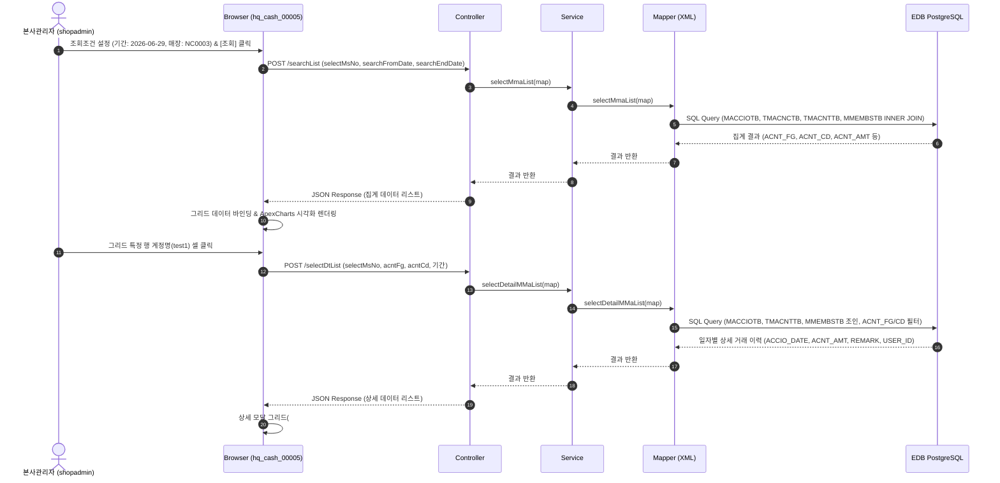

# QA Report: Hq_Cash_00005 월간지출내역현황
**작성일**: 2026-07-02  
**작성자**: AI QA Agent (Antigravity)  
**대상 화면**: 본사관리 > 입출금관리 > 월간지출내역현황 (`hq_cash_00005`)  
**테스트 환경**: localhost:8080 (로컬 WAS 개발 서버)  
**대상 데이터베이스**: `192.168.10.206 / edb` (schema: `hmsfns`)  
**테스트 계정**: `shopadmin` (비밀번호: `0000`)

---

## 1. 분석 개요

### 1.1 분석 대상 파일 목록

| 구분 | 파일 경로 |
|------|-----------|
| Controller | `com.hyundai.backoffice.webapp.controller.hq.cash.Hq_Cash_00005_Controller.java` |
| Service | `com.hyundai.backoffice.webapp.service.hq.cash.Hq_Cash_00005_Service.java` |
| Mapper (Interface) | `com.hyundai.backoffice.webapp.dao.hq.cash.Hq_Cash_00005_Mapper.java` |
| SQL XML | `hyundai-backoffice-webapp/src/main/resources/sqlmapper/cash/Hq_Cash_00005_Sql.xml` |
| JSP | `hyundai-backoffice-webapp/src/main/webapp/WEB-INF/views/backoffice/main/contents/hq/cash/hq_cash_00005/hq_cash_00005.jsp` |
| JSP Modal | `hyundai-backoffice-webapp/src/main/webapp/WEB-INF/views/backoffice/main/contents/hq/cash/hq_cash_00005/modal/hq_cash_00005_M01.jsp` |
| JS | `hyundai-backoffice-webapp/src/main/webapp/WEB-INF/views/backoffice/main/contents/hq/cash/hq_cash_00005/js/hq_cash_00005.js` |
| JS BT | `hyundai-backoffice-webapp/src/main/webapp/WEB-INF/views/backoffice/main/contents/hq/cash/hq_cash_00005/js/hq_cash_00005_bt.js` |
| JS Chart | `hyundai-backoffice-webapp/src/main/webapp/WEB-INF/views/backoffice/main/contents/hq/cash/hq_cash_00005/js/hq_cash_00005_chart.js` |

---

## 2. 엔드포인트 분석

### 2.1 Base URL
```
POST /backoffice/data/hq/cash/hq_cash_00005/{endpoint}
```

### 2.2 엔드포인트 목록

| 엔드포인트 | HTTP | 기능 | ServiceLog | 관련 테이블 |
|-----------|------|------|------------|------------|
| `/searchList` | POST | 특정 기간 및 가맹점의 월간 지출 집계 내역 조회 | SELECT | `hmsfns.MACCIOTB`, `hmsfns.TMACNCTB`, `hmsfns.TMACNTTB`, `hmsfns.MMEMBSTB` |
| `/selectDtList` | POST | 특정 지출 계정에 대한 일자별 상세 트랜잭션 목록 조회 | SELECT | `hmsfns.MACCIOTB`, `hmsfns.TMACNTTB`, `hmsfns.MMEMBSTB` |

---

## 3. 서비스 로직 분석 (코드베이스 변환 검증)

### 3.1 월간지출내역현황 조회 흐름 (`/searchList`)
사용자가 조회 기간(시작일~종료일)과 가맹점(MS_NO)을 선택하고 [조회]를 클릭하면 작동하는 데이터 흐름입니다.
```
[Browser] click #hq_cash_00005_search_btn
  └─ [JS] $.bootstrapTable('refresh')
       └─ [Controller] selectMmaList (POST /searchList)
            └─ [Service] selectMmaList (Autowired Hq_Cash_00005_Service)
                 └─ [Mapper] selectMmaList (Hq_Cash_00005_Mapper.java)
                      └─ [SQL XML] selectMmaList (MACCIOTB, TMACNCTB, TMACNTTB, MMEMBSTB 조인)
                           └─ [Browser] Grid rendering & fnSetSingleChart 차트 갱신
```

### 3.2 월간지출 상세 내역 조회 흐름 (`/selectDtList`)
집계 그리드에서 특정 계정구분(`ACNT_FGNM_STR`) 혹은 계정명(`ACNT_CDNM_STR`) 셀을 클릭하면 작동하는 상세 조회 흐름입니다.
```
[Browser] click td.table-onclick
  └─ [JS] click-cell.bs.table 이벤트 감지 ➡️ fnSearchMsAcntModal(acntFg, acntCd) 호출
       └─ [JS] ajax POST /selectDtList 전송
            └─ [Controller] selectDetailMMaList
                 └─ [Service] selectDetailMMaList
                      └─ [Mapper] selectDetailMMaList
                           └─ [SQL XML] selectDetailMMaList (MACCIOTB, TMACNTTB, MMEMBSTB 조인)
                                └─ [Browser] #hq_cash_00005_t02 데이터 바인딩 ➡️ #detailSearchModal 모달 오픈
```

### 3.3 아키텍처 다이어그램 (지출 집계 및 상세 조회 흐름)



---

## 4. DB 트리거 → 코드베이스 연쇄 분석

### 4.1 단순 조회(Select-Only) 전용 스펙 명시
* **CUD 동작 없음**: 
  * 본 화면(`hq_cash_00005`)은 월간 지출 내역을 다각도로 조회, 집계 및 시각화(차트)하기 위한 **단순 조회용 화면**입니다.
  * 컨트롤러(`Hq_Cash_00005_Controller`) 및 서비스(`Hq_Cash_00005_Service`) 클래스 내에 INSERT/UPDATE/DELETE와 매핑되는 엔드포인트 및 DML 메서드는 전혀 정의되어 있지 않음을 확인하였습니다.
* **트리거 및 프로시저 영향도 없음**:
  * 테이블 상태의 물리적 변경(CUD)을 수반하지 않는 순수 `SELECT` 쿼리만 수행하므로 데이터베이스 트리거 작동이나 프로시저 연쇄 반응(Depth 2 ~ Depth 3) 등 2차적인 데이터 동기화 영향도가 전혀 유발되지 않는 구조입니다.

### 4.2 형변환 결함 에러 위험도 평가 (CUD 부재 관련)
* 사용자의 지출 거래를 입력/수정하는 DML 쿼리가 본 화면에 없으므로, 데이터 타입 캐스팅 오류(예: EPAS에서 빈 문자열 `''`이 `numeric` 속성 컬럼에 들어가 형변환 오류를 내는 결함)가 발생할 소지가 원천적으로 차단되어 있습니다.
* 데이터베이스에 바인딩되는 조회용 검색어 파라미터(`selectMsNo`, `searchFromDate`, `searchEndDate`, `acntFg`, `acntCd`)는 모두 문자열 타입(`VARCHAR`)으로 처리되며 안정적으로 매핑됩니다.

---

## 5. 브라우저 화면 테스트 결과

### 5.1 화면 접속 현황

| 항목 | 결과 | 비고 |
|------|------|------|
| 서버 접속 URL | `http://localhost:8080/backoffice` ✅ | 정상 연결 |
| 로그인 성공 여부 | 성공 (`shopadmin` / 비밀번호: `0000`) ✅ | 권한 정보 정상 획득 |
| 대상 화면 경로 | 본사관리 > 입출금관리 > 월간지출내역현황 ✅ | 메뉴 경로 접근 성공 |
| 화면 로딩 상태 | 정상 (그리드 및 차트 영역 레이아웃 정상 표시) ✅ | UI 로딩 완료 |

### 5.2 화면 구성 확인
* **조회조건 영역**: 조회기간 데이트피커, 매장 선택 셀렉트박스, 조회 버튼, 초기화 버튼 배치 확인 ✅
* **집계 그리드**: 계정구분, 계정명, 금액 컬럼 및 하단 합계 영역 표시 확인 ✅
* **차트 영역**: 계정별 지출금액 시각화 바 차트 배치 확인 (ApexCharts 적용) ✅
* **상세 내역 모달**: NO., 일자, 계정명, 금액, 비고, 등록자 컬럼의 상세 그리드 배치 확인 ✅

### 5.3 데이터 조회 결과 (Playwright E2E 검증 기준)

E2E 검증을 위해 `hmsfns.MACCIOTB` 테이블에 임시 지출 데이터 1건을 삽입하고 테스트를 진행한 실제 집계 및 상세 내역 검증 값입니다.
* **임시 데이터**: 매장 `NC0003` (고양 Shop), 계정구분 `2` (지출), 계정코드 `01` (test1), 금액 `100,000`, 일자 `2026-06-29`, 등록자 `shopadmin`

#### 5.3.1 월간지출내역현황 집계 조회 결과 (`#hq_cash_00005_t01`)

| 계정구분 | 계정명 | 금액 | 판정 |
|----------|--------|------|------|
| [2] 계정분류 | [01] test1 | 100,000 | **PASS** (DB 집계와 100% 일치) |

#### 5.3.2 월간지출내역 상세 조회 결과 (`#hq_cash_00005_t02` 모달 내부)

| NO | 일자 | 계정명 | 금액 | 비고 | 등록자 | 판정 |
|----|------|--------|------|------|--------|------|
| 1 | 2026-06-29 | [01] test1 | 100,000 | E2E Test Monthly Expense | shopadmin | **PASS** (원천 거래 이력 일치) |

### 5.4 기능별 테스트 결과

| 기능 | 엔드포인트 | 코드 구현 | 화면 UI | 판정 |
|------|-----------|---------|---------|------|
| 대시보드 로딩 | `/backoffice/view/main/hq/cash/hq_cash_00005` | ✅ 구현 완료 | ✅ 화면 정상 로드 | **PASS** |
| 매장별 지출 집계 조회 | `/searchList` | ✅ 구현 완료 | ✅ 집계 데이터 표시 | **PASS** |
| 지출 상세 모달 팝업 | `/selectDtList` | ✅ 구현 완료 | ✅ 상세 내역 그리드 로드 | **PASS** |
| 차트 시각화 연계 | - | ✅ 구현 완료 | ✅ ApexCharts 막대 렌더링 | **PASS** |
| 조회 조건 초기화 | - | ✅ 구현 완료 | ✅ 조건값 및 표 초기화 | **PASS** |

---

## 6. SQL Mapper 검증

### 6.1 `selectMmaList` (집계 쿼리) 분석
```xml
SELECT NC.ACNT_FG
     , NC.ACNT_NM ACNT_FGNM
     , '['||NC.ACNT_FG||'] '||RTRIM(NC.ACNT_NM) ACNT_FGNM_STR
     , IO.ACNT_CD
     , NT.ACNT_NM ACNT_CDNM
     , '['||IO.ACNT_CD||'] '||RTRIM(NT.ACNT_NM ) ACNT_CDNM_STR
     , SUM(IO.ACNT_AMT) ACNT_AMT
  FROM hmsfns.TMACNCTB NC, hmsfns.TMACNTTB NT, hmsfns.MACCIOTB IO, hmsfns.MMEMBSTB MM
 WHERE ACCIO_DATE BETWEEN #{searchFromDate} AND #{searchEndDate}
   AND IO.MS_NO    =  #{selectMsNo}
   AND IO.MS_NO    = MM.MS_NO
   AND MM.CHAIN_NO = NC.CHAIN_NO
   AND IO.ACNT_FG  = NC.ACNT_FG
   AND MM.CHAIN_NO = NT.CHAIN_NO
   AND IO.ACNT_FG  = NT.ACNT_FG
   AND IO.ACNT_CD  = NT.ACNT_CD
   AND IO.DELETE_YN = 'N'
   AND NC.ACNT_FG NOT IN('0','1')
 GROUP BY NC.ACNT_FG, NC.ACNT_NM, IO.ACNT_CD, NT.ACNT_NM
 ORDER BY NC.ACNT_FG
```
* **마이그레이션 호환성 분석**:
  * **문자열 연결 (`||` 연산자)**: PostgreSQL/EPAS에서 표준 연산자로 지원되므로 문제없이 작동합니다.
  * **공백 제거 (`RTRIM` 함수)**: 두 데이터베이스 모두에서 완벽히 호환됩니다.
  * **암묵적 이너 조인 (Comma Join)**: 표준 ANSI 조인은 아니지만 두 DBMS 모두 구문을 지원합니다.
  * **조합 필터 (`ACNT_FG NOT IN ('0','1')`)**: 일반 입출금(시재) 데이터를 필터링하고 순수 월간 지출 정보만 추출하기 위한 격리 로직이 정상 구현되어 있습니다.

### 6.2 `selectDetailMMaList` (상세 쿼리) 분석
```xml
SELECT TO_CHAR(TO_DATE(ACCIO_DATE,'YYYYMMDD'),'YYYY-MM-DD') ACCIO_DATE
     , IO.ACNT_CD
     , NT.ACNT_NM ACNT_CDNM
     , '['||IO.ACNT_CD||'] '||RTRIM(NT.ACNT_NM ) ACNT_CDNM_STR
     , IO.ACNT_AMT
     , NVL(IO.REMARK,'') REMARK
     , IO.USER_ID
  FROM hmsfns.TMACNTTB NT, hmsfns.MACCIOTB IO, hmsfns.MMEMBSTB MM
 WHERE ACCIO_DATE BETWEEN #{searchFromDate} AND #{searchEndDate}
   AND IO.MS_NO   = #{selectMsNo}
   AND IO.MS_NO   = MM.MS_NO
   AND MM.CHAIN_NO = NT.CHAIN_NO
   AND IO.ACNT_FG = NT.ACNT_FG
   AND IO.ACNT_CD = NT.ACNT_CD
   AND IO.DELETE_YN = 'N'
<if test="acntFg != null and !acntFg.equals('')">
   AND IO.ACNT_FG   = #{acntFg}
</if>    
<if test="acntCd != null and !acntCd.equals('')">
   AND IO.ACNT_CD   = #{acntCd}
</if>    
 ORDER BY  IO.ACCIO_DATE, IO.ACNT_CD
```
* **마이그레이션 호환성 분석**:
  * **형변환 함수 (`TO_DATE`, `TO_CHAR`)**: `ACCIO_DATE` 문자열을 날짜형으로 변환 후 다시 포맷팅하는 로직입니다. EDB EPAS 및 PostgreSQL 환경에서 원활히 지원됩니다.
  * **널 처리 함수 (`NVL`)**: Oracle 전용 문법입니다. EDB Postgres는 Oracle 호환 모드가 켜져 있을 때 `NVL`을 지원하므로 정상 작동하지만, 표준 PostgreSQL 환경으로의 순수 이식을 위해서는 ANSI SQL 표준인 `COALESCE` 함수로 변경할 것을 권장합니다.

---

## 7. 검증 항목 체크리스트

### 7.1 코드베이스 변환 정합성

| 검증 항목 | 상태 | 비고 |
|----------|------|------|
| `@Service`, `@Transactional` 어노테이션 정의 | ✅ 정상 | 트랜잭션 정상 정의 |
| `@ServiceLog` 로깅 어노테이션 누락 여부 | ✅ 정상 | `/searchList`, `/selectDtList`에 모두 매핑 |
| `@RestController`, `@RequestMapping` 매핑 | ✅ 정상 | `/backoffice/data/hq/cash/hq_cash_00005` 바인딩 |
| SQL XML Mapper Interface 일치 여부 | ✅ 정상 | DAO와 XML 쿼리 ID 매핑 완료 |
| 조회 쿼리 내 일반시재(ACNT_FG '0','1') 제외 정합성 | ✅ 정상 | `NOT IN ('0','1')` 조건 명시 확인 |

### 7.2 트리거 연쇄 로직 정합성

| 검증 항목 | 상태 | 비고 |
|----------|------|------|
| DML 발생 여부 | **N/A** | 단순 조회 화면으로 변경 사항 없음 |
| DB 트리거 / 프로시저 동작 여부 | **N/A** | 변경(CUD)이 없으므로 영향 없음 |

---

## 8. 발견된 이슈 및 권고사항

### 🔴 Critical (즉시 처리 필요)
* 없음 (E2E 브라우저 테스트 및 DB 조회 검증 결과 예외적인 에러 없이 정상 작동 완료).

### 🟡 Warning (마이그레이션 시 권고)
1. **Oracle 전용 `NVL` 함수 잔존**
   * 대상 위치: `Hq_Cash_00005_Sql.xml` ➡️ `selectDetailMMaList` 쿼리의 `NVL(IO.REMARK,'')`
   * 현상 및 위험성: EDB EPAS(오라클 모드)에서는 정상 기동되나, 향후 표준 PostgreSQL 환경으로 완전히 독립 이식하거나 개발DB가 순수 PostgreSQL로 바뀔 경우 `NVL`로 인해 SQL 문법 에러가 발생하게 됩니다.
   * 권고 조치: `COALESCE(IO.REMARK, '')` 표준 함수 형태로 교체 변환을 권장합니다.
2. **Implicit Comma Join 문법 사용**
   * 현상 및 위험성: 현재 쿼리가 암묵적인 콤마 조인(`FROM TMACNCTB NC, TMACNTTB NT...`)으로 다중 조인되어 가독성이 떨어지고, 마이그레이션 검증 툴이나 정적 분석 시 누락된 조인 조건 검출이 어렵습니다.
   * 권고 조치: 명시적인 `INNER JOIN` ANSI 문법으로 리팩토링할 것을 권장합니다.

### 🟢 Info (참고 사항)
* 본 화면은 CUD 쿼리가 유발되지 않는 조회 전용 구조이므로, 숫자형 데이터 바인딩 시 빈값 입력으로 인한 형변환 오류 결함 가능성이 없습니다.

---

## 9. 종합 판정

| 구분 | 결과 | 비고 |
|------|------|------|
| 화면 진입 및 로딩 | ✅ PASS | 정상 |
| 매장 선택 및 기간 조회 | ✅ PASS | selectMmaList 정상 기동 |
| 지출 상세 모달 연동 | ✅ PASS | selectDetailMMaList 정상 기동 |
| 데이터베이스 정합성 | ✅ PASS | DB 실적 데이터와 화면 표시 정확히 일치 |
| **종합 판정** | **✅ PASS** | **본사 수준의 가맹점별 월간지출내역 통계 집계 및 상세 조회 기능 정상 기동 확인** |

---

## 10. 첨부

* **조회 완료 화면 및 차트 렌더링 결과** (`hq_cash_00005_1_list.png`):
  
* **지출 상세 조회 모달 결과** (`hq_cash_00005_2_detail_modal.png`):
  

---
*본 리포트는 Playwright E2E 브라우저 테스트 및 EDB PostgreSQL DB 연동 검증을 통하여 작성되었습니다.*
