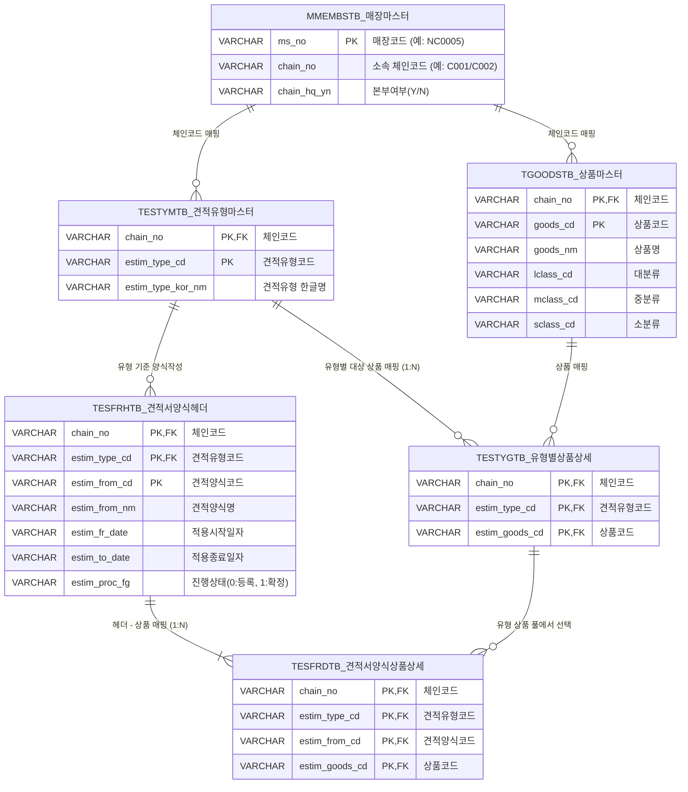

# [HQ] 견적서 양식 작성 (Hq_Esti_00002) 선행 데이터 구성 가이드

본 문서는 `hq_esti_00002` (견적서양식작성) 화면에서 견적 대상 상품군을 정상 조회하고 견적서 양식을 작성하기 위한 선행 마스터 데이터 구성 방법 및 테이블 간의 유기적인 관계를 설명합니다.

---

## 1. 선행 데이터 구성 문제 원인 및 해결 방법

### 1.1 원인 분석
* **매장/사용자 현황**: DB 상의 모든 매장과 사용자 계정(예: `fnbadmin`)은 **`C001` 체인**에 매핑되어 있습니다.
* **마스터 데이터 분배**: 
  - `C001` 체인: 상품 마스터(`TGOODSTB`) 데이터가 **23개**만 등록되어 있어 견적 대상 테스트 상품이 부족합니다.
  - `C002` 체인: 상품 마스터 데이터가 **556개** 등록되어 있고 기존에 생성된 견적서 정보가 풍부합니다.
* **결과**: `fnbadmin`으로 로그인 시 기본 상태에서는 `C001` 체인의 데이터만 보이기 때문에 상품 및 견적서 유형 목록이 빈약하거나 노출되지 않습니다.

### 1.2 해결 방안 (매장 체인 변경 SQL)
`fnbadmin` 계정이 속한 매장(`NC0005`)의 체인을 임시로 `C002`로 변경해 주면, 추가적인 데이터 가공 없이 556개의 상품 마스터 데이터와 연동하여 정상 테스트가 가능합니다.

> [!TIP]
> **체인 변경 SQL (C001 ➡️ C002)**
> ```sql
> -- fnbadmin의 매장(NC0005) 체인을 C002(본사)로 변경
> UPDATE hmsfns.MMEMBSTB 
>    SET chain_no = 'C002'
>      , chain_hq_yn = 'Y' 
>  WHERE ms_no = 'NC0005';
> ```

> [!IMPORTANT]
> **원상 복구 SQL (C002 ➡️ C001)**
> 테스트 검증이 끝난 후에는 원래 상태인 `C001` 체인으로 원상복구 해줍니다.
> ```sql
> UPDATE hmsfns.MMEMBSTB 
>    SET chain_no = 'C001'
>      , chain_hq_yn = 'N' 
>  WHERE ms_no = 'NC0005';
> ```

### 1.3 선행 견적 마스터 데이터 연동 (TESTYMTB / TESTYGTB)
* **원인**: 상품 마스터(`TGOODSTB`)만 `C001` 체인에 존재하고, **견적유형 마스터(`TESTYMTB`)와 해당 유형별 상품 상세 매핑(`TESTYGTB`)** 데이터가 없을 경우에도 상품 조회 시 결과가 `0`건으로 노출됩니다. (양식에 추가할 수 있는 후보 상품은 이 매핑 관계를 기준으로 조인해 오기 때문입니다.)
* **해결 방안**:
  * `hq_esti_00001` (견적유형마스터) 화면에서 견적유형을 생성하고 대상 상품군을 사전에 매핑 등록해야 합니다.
  * 또는 DB 직접 가공 시 아래와 같이 `TESTYMTB`와 `TESTYGTB` 데이터를 `C002`에서 `C001`로 복사해 줍니다.
  ```sql
  -- 1. 견적유형 마스터 복사
  INSERT INTO hmsfns.TESTYMTB (chain_no, estim_type_cd, estim_type_kor_nm, estim_type_eng_nm, estim_type_etc_nm, estim_bigo, ins_dtime, ins_id, upd_dtime, upd_id)
  SELECT 'C001', estim_type_cd, estim_type_kor_nm, estim_type_eng_nm, estim_type_etc_nm, estim_bigo, ins_dtime, ins_id, upd_dtime, upd_id
    FROM hmsfns.TESTYMTB src
   WHERE src.chain_no = 'C002'
     AND NOT EXISTS (SELECT 1 FROM hmsfns.TESTYMTB tgt WHERE tgt.chain_no = 'C001' AND tgt.estim_type_cd = src.estim_type_cd);

  -- 2. 견적유형별 상품 매핑 데이터 복사
  INSERT INTO hmsfns.TESTYGTB (chain_no, estim_type_cd, estim_goods_cd, ins_dtime, ins_id, upd_dtime, upd_id)
  SELECT 'C001', estim_type_cd, estim_goods_cd, ins_dtime, ins_id, upd_dtime, upd_id
    FROM hmsfns.TESTYGTB src
   WHERE src.chain_no = 'C002'
     AND NOT EXISTS (SELECT 1 FROM hmsfns.TESTYGTB tgt WHERE tgt.chain_no = 'C001' AND tgt.estim_type_cd = src.estim_type_cd AND tgt.estim_goods_cd = src.estim_goods_cd);
  ```

---

## 2. 테이블 관계 스키마 (ERD)

견적서 양식을 작성하기 위해 필요한 매장, 상품 마스터 및 견적 테이블들의 물리적 조인 관계는 다음과 같습니다.



---

## 3. 화면 내 데이터 흐름 및 가공 로직

`hq_esti_00002` 화면에서 동작하는 핵심 쿼리 및 데이터의 가공 프로세스는 다음과 같습니다.

### 3.1 견적유형 목록 렌더링
* 로그인 세션의 `chain_no` 값을 기반으로 드롭박스 목록을 바인딩합니다.
* **동작 쿼리** (`CommonModule_GoodsClass_Sql.xml` - `selectEstimTypeList`):
  ```sql
  SELECT ESTIM_TYPE_CD
       , ESTIM_TYPE_KOR_NM  AS ESTIM_TYPE_NM
    FROM hmsfns.TESTYMTB
   WHERE CHAIN_NO = #{chainNo};
  ```

### 3.2 견적서 양식 신규 등록 (저장)
* 우측 입력 폼에 양식 명칭과 적용 기간 등을 채워 넣고 저장하면 `TESFRHTB` 테이블에 신규 등록 상태(`ESTIM_PROC_FG = '0'`)로 데이터가 적재됩니다.
* **동작 쿼리** (`Hq_Esti_00002_Sql.xml` - `insertEstiFormMaster`):
  ```sql
  INSERT INTO hmsfns.TESFRHTB (
      CHAIN_NO, ESTIM_TYPE_CD, ESTIM_FROM_CD, ESTIM_FROM_NM, 
      ESTIM_FR_DATE, ESTIM_TO_DATE, ESTIM_PROC_FG, INS_DTIME, INS_ID
  ) VALUES (
      #{chainNo}, #{estimTypeCd}, #{estimFromCd}, #{estimFromNm},
      #{estimFrDate}, #{estimToDate}, '0', TO_CHAR(SYSDATE, 'YYYYMMDDHH24MISS'), #{userId}
  );
  ```

### 3.3 양식에 견적 대상 상품 바인딩 (추가)
* 좌측 상품 풀에서 선택하여 추가하면, 해당 양식에 속한 견적 대상 품목으로 등록됩니다. 이 상품군은 `hq_esti_00001`에서 사전에 바인딩해 놓은 해당 견적유형의 상품 풀(`TESTYGTB`)에서 조회해 옵니다.
* **동작 쿼리** (`Hq_Esti_00002_Sql.xml` - `insertEstiFormGoods`):
  ```sql
  INSERT INTO hmsfns.TESFRDTB (
      CHAIN_NO, ESTIM_TYPE_CD, ESTIM_FROM_CD, ESTIM_GOODS_CD, INS_DTIME, INS_ID
  ) VALUES (
      #{chainNo}, #{estimTypeCd}, #{estimFromCd}, #{goodsCd}, TO_CHAR(SYSDATE, 'YYYYMMDDHH24MISS'), #{userId}
  );
  ```
