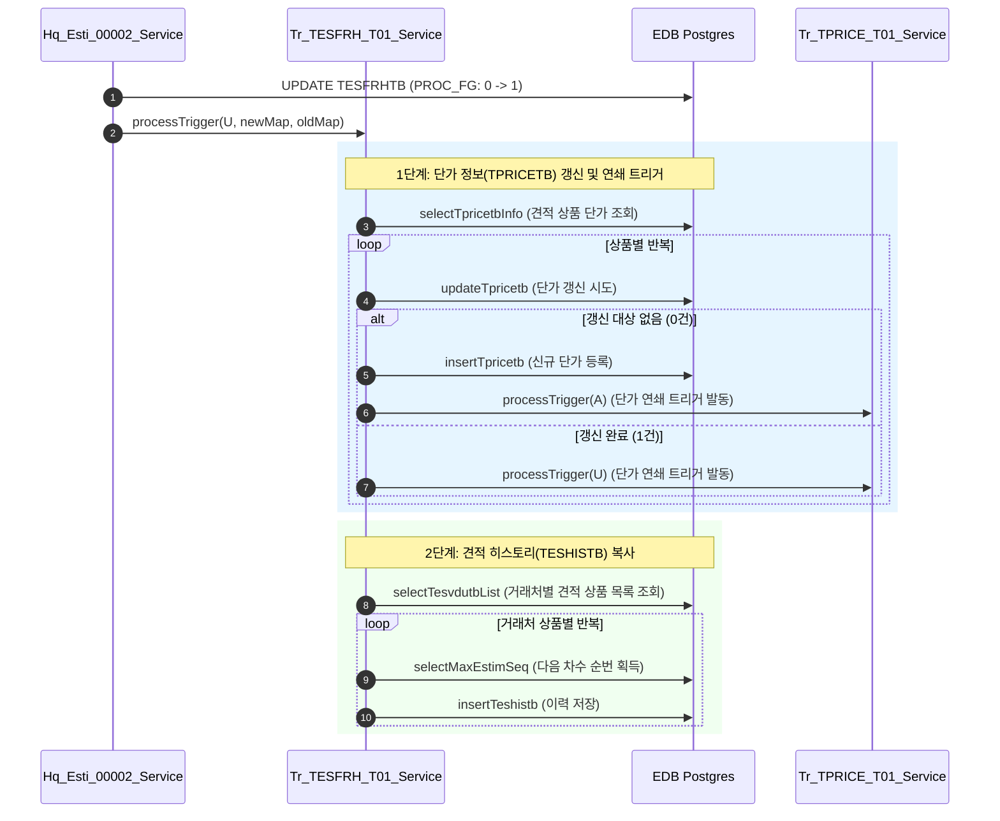
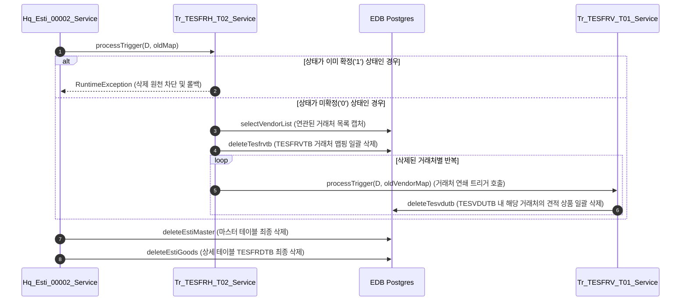

# DB Trigger Analysis: Hq_Esti_00002 견적서 양식관리
**작성일**: 2026-07-06  
**작성자**: AI QA Agent (Antigravity)  
**대상 화면**: [HQ] 견적관리 > 견적서 양식관리 (hq_esti_00002)  

---

## 1. 개요 및 관여 테이블 목록

`Hq_Esti_00002` 화면(견적서 양식관리)은 견적요청서 양식 마스터(`TESFRHTB`)와 상세 상품 정보(`TESFRDTB`)를 관리합니다.  
양식의 상태를 **확정(PROC_FG: '0' ➔ '1')**하거나 양식을 **삭제(DELETE)**할 때, 비즈니스 무결성 및 연쇄 적재를 위해 Java 기반의 데이터베이스 트리거 서비스가 발동됩니다.

### 1.1 관련 데이터베이스 테이블

| 테이블명 | 논리명 | 역할 |
|---|---|---|
| **TESFRHTB** | 견적서 양식 마스터 | 견적 양식 기본 정보(양식명, 유효기간, 확정 상태 `ESTIM_PROC_FG` 등) |
| **TESFRDTB** | 견적서 양식 상세 | 양식별 매핑된 상품 정보 및 표준 기준 수량 |
| **TESFRVTB** | 견적서 양식 거래처 | 해당 양식을 수신할 대상 거래처 매핑 정보 |
| **TESVDUTB** | 견적서 양식 거래처별 상품 | 거래처별 견적 수량, 단가 등이 최종 저장되는 최종 상품 매핑 테이블 |
| **TPRICETB** | 단가 마스터 | 거래처별 공급가 및 판매가 마스터 테이블 |
| **TESHISTB** | 견적 이력 | 단가 확정 시 이력 추적용 견적 히스토리 데이터 |

---

## 2. DB 트리거 및 서비스 연쇄 동작 분석

`TESFRHTB` 테이블의 변경 사항에 따라 2개의 전용 자바 트리거 서비스가 동작합니다.

### 2.1 [UPDATE] Tr_TESFRH_T01_Service (확정 처리 흐름)

견적 양식 정보가 업데이트될 때 호출되며, 특히 양식 상태 코드(`ESTIM_PROC_FG`)가 **`'0'`(미확정)에서 `'1'`(확정/승인)**으로 변경되는 시점에 연쇄 비즈니스 로직을 구동합니다.

#### 동작 과정 및 연쇄 영향 (Sequence Flow)


* **비정상 흐름 방지 제어**: 이미 확정 완료(`'1'`) 상태인 데이터의 상태값을 다시 미확정(`'0'`)으로 강제 변경하려 시도할 시 `Impossible Update` 예외를 발생시키고 전체 트랜잭션을 롤백합니다.

---

### 2.2 [DELETE] Tr_TESFRH_T02_Service (삭제 처리 흐름)

작성 중이던 견적 양식 마스터(`TESFRHTB`)를 삭제할 때 실행됩니다. **3단계 깊이(Depth 3)의 강력한 cascade-delete 구조**를 취하고 있습니다.

#### 동작 과정 및 연쇄 영향 (Sequence Flow)


#### Cascade Delete 연쇄도 (Depth 3)
```
[마스터 삭제 요청]
      │
      ▼
 1. TESFRHTB (양식 마스터 레코드 제거)
      │
      ├─► [Tr_TESFRH_T02] 트리거 동작
      │         │
      │         ▼
      │    2. TESFRVTB (양식 대상 거래처 매핑 강제 제거)
      │         │
      │         ├─► [Tr_TESFRV_T01] 트리거 연쇄 동작
      │         │         │
      │         │         ▼
      │         │    3. TESVDUTB (해당 거래처의 견적 상품 데이터 최종 자동 삭제)
      │         │
      ▼         ▼
 4. TESFRDTB (양식 세부 상품 내역 삭제)
```

* **보안 안전장치**: 이미 승인 및 확정(`'1'`) 상태가 완료된 양식을 사용자가 고의 혹은 실수로 지우려고 할 때, 트리거에서 사전에 감지하여 `Impossible Delete Confirm Data` 에러와 함께 삭제를 완전히 차단하고 원복(Rollback)시킵니다.

---

## 3. 검증 요약 및 결함 방어 포인트

1. **상태 변경 검증 (`save`)**:
   * 미확정 상태에서 정보를 수정할 때는 단순 정보만 변경되지만, 확정 체크 시점에 `TPRICETB` 단가 정보와 `TESHISTB` 이력 로그가 안전하게 분기되어 원본 소스로부터 복사 적재됨을 확인했습니다.
2. **트랜잭션 일관성 (`delete`)**:
   * 마스터 양식을 삭제할 때 별도의 개별 상품 삭제 API를 호출하지 않더라도, `Tr_TESFRH_T02` 및 `Tr_TESFRV_T01` 자바 서비스의 결합 구조를 통해 `TESFRVTB`와 `TESVDUTB` 2차/3차 연쇄 데이터가 완전 무결하게 정합성을 유지하며 지워집니다.
