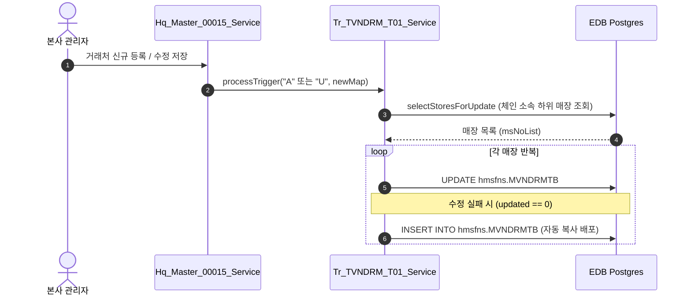

# hq_esti_00005 견적서 업로드 관리 - 데이터 가공 / 연동 가이드

본 문서는 `hq_esti_00005` (견적서 업로드 관리) 화면의 상단 필터 및 E2E 테스트 과정에서 거래처가 누락되는 문제와 관련된 테이블 데이터 흐름, 매장/본사 권한 연동 및 자바 연쇄 트리거 로직을 정리한 분석 문서입니다.

---

## 1. 🔍 이슈 요약 및 진단 
* **현상**: `hq_esti_00003` (견적요청서 일괄등록) 화면에서 임의로 등록한 거래처(Z표, HMS, 보람푸드2, 지에프네트워크2 등) 4건이 `hq_esti_00004` (견적서 전송관리) 에서는 노출되나, `hq_esti_00005` (견적서 업로드 관리) 화면 상단 **"거래처"** 드롭다운 목록 및 그리드 조회 결과에는 전혀 노출되지 않음.
* **진단 결과**:
  * 사용자가 로그인한 `fnbadmin` 세션의 `ms_no`는 `NC0005` 이며, 매장의 본사여부(`CHAIN_HQ_YN`) 상태가 **`'N'` (매장)**으로 정의되어 있어 **일반 가맹 매장 권한**으로 동작함.
  * 거래처 목록 공통 API(`selectVendorList`)는 세션 권한이 매장(`'N'`)일 때 **`hmsfns.MVNDRMTB` (매장 거래처 마스터)** 테이블을 조회함.
  * 하지만 DB 상의 `hmsfns.MVNDRMTB` 테이블에는 `MS_NO = 'NC0005'` 매장 소속의 거래처 데이터가 한 건도 들어있지 않아 콤보박스가 비어 보이는 현상이 발생함.

---

## 2. 🔀 화면별 대상 테이블 불일치 원인
* **`hq_esti_00003` (견적요청서 일괄등록)**: 
  * 계정 권한(매장/본사)에 관계없이 **`hmsfns.TVNDRMTB` (본사 거래처 마스터)** 테이블만 바라보도록 하드코딩되어 있음. (따라서 매장 계정 로그인 시에도 거래처가 보임)
* **`hq_esti_00005` (견적서 업로드 관리)**:
  * 공통 모듈을 사용하므로 권한 분기 조건이 엄격하게 작용해 매장 권한 시 **`hmsfns.MVNDRMTB` (매장 거래처 마스터)**를 조회함.

---

## 3. ⚙️ 자바 연쇄 동기화 트리거 로직 (`TVNDRMTB` ➡️ `MVNDRMTB`)
화면 UI 상에서 본사 거래처 관리를 거쳐 데이터를 저장하는 경우, 본사 테이블 데이터가 매장 테이블로 자동으로 배포(동기화)되도록 구현되어 있습니다.



### 🛠️ 호출 구조 상세
* **트리거 서비스**: `com.hyundai.api.service.trigger.Tr_TVNDRM_T01_Service`
* **호출 컨트롤러/서비스**:
  * `Hq_Master_00015_Service.java` (본사 거래처 관리)
  * `Hq_Master_00016_Service.java` (본사 협력사 등록/수정)
* **누락 발생 원인**: DB 툴 등을 이용하여 본사 마스터(`TVNDRMTB`) 테이블에만 SQL `INSERT`문으로 직접 데이터를 밀어넣었거나, 매장 NC0005가 체인에 등록되기 전에 본사 거래처 추가가 먼저 완료되었던 경우 트리거 자바 로직이 생략되어 데이터 불일치가 일어남.

---

## 4. ✅ 해결방안 및 조치 가이드
1. **화면에서 재등록 (권장)**:
   * `hq_master_00015` (본사 거래처 관리) 화면에서 해당 거래처 4건을 삭제한 후 다시 신규 등록하여 저장하면 트리거가 실행되어 매장 마스터로 자동 동기화됩니다.
2. **DB 수동 동기화 실행**:
   * EDB Postgres DB에 아래의 수동 배포 스크립트를 사용하여 `NC0005` 매장용 데이터를 강제 적재합니다.
   ```sql
   -- [MANDATORY] 스키마(hmsfns) 명시 필수
   INSERT INTO hmsfns.MVNDRMTB (MS_NO, VENDOR, VENDOR_NM, VENDOR_FG, CHAIN_NO, CREATE_DATE, CREATE_ID, LAST_DATE, LAST_ID)
   VALUES ('NC0005', '000001', 'Ｚ표', '2', 'C001', TO_CHAR(SYSDATE,'YYYYMMDDHH24MISS'), 'MANUAL', TO_CHAR(SYSDATE,'YYYYMMDDHH24MISS'), 'MANUAL');

   INSERT INTO hmsfns.MVNDRMTB (MS_NO, VENDOR, VENDOR_NM, VENDOR_FG, CHAIN_NO, CREATE_DATE, CREATE_ID, LAST_DATE, LAST_ID)
   VALUES ('NC0005', '125854', 'HMS', '5', 'C001', TO_CHAR(SYSDATE,'YYYYMMDDHH24MISS'), 'MANUAL', TO_CHAR(SYSDATE,'YYYYMMDDHH24MISS'), 'MANUAL');

   INSERT INTO hmsfns.MVNDRMTB (MS_NO, VENDOR, VENDOR_NM, VENDOR_FG, CHAIN_NO, CREATE_DATE, CREATE_ID, LAST_DATE, LAST_ID)
   VALUES ('NC0005', '12585445653', '주식회사 보람푸드2', '3', 'C001', TO_CHAR(SYSDATE,'YYYYMMDDHH24MISS'), 'MANUAL', TO_CHAR(SYSDATE,'YYYYMMDDHH24MISS'), 'MANUAL');

   INSERT INTO hmsfns.MVNDRMTB (MS_NO, VENDOR, VENDOR_NM, VENDOR_FG, CHAIN_NO, CREATE_DATE, CREATE_ID, LAST_DATE, LAST_ID)
   VALUES ('NC0005', '12585445654', '주식회사 지에프네트워크2', '4', 'C001', TO_CHAR(SYSDATE,'YYYYMMDDHH24MISS'), 'MANUAL', TO_CHAR(SYSDATE,'YYYYMMDDHH24MISS'), 'MANUAL');
   ```

---

## 5. 📊 견적 및 수량 엑셀 업로드 양식 가이드 (Hq_Esti_00002 vs Hq_Esti_00005)

본 시스템의 엑셀 업로드(`CommonModuleService.getExcelUploadList`)는 엑셀 파일의 열 명칭(헤더)을 식별하지 않고, **자바 DTO 객체에 정의된 필드 선언 순서(Reflection)에 맞추어 엑셀의 열을 순차적으로 매핑**합니다. 따라서 열의 순서 및 개수를 정확히 지켜야 정상적인 데이터 적재가 가능합니다.

---

### ① `hq_esti_00002` (견적서 양식작성) — 견적 대상상품 수량 업로드 양식
본사 관리자가 견적 대상 상품의 **기본 수량(`ESTIM_GOODS_QTY`)**을 일괄 등록/수정할 때 사용합니다.

* **DTO 클래스**: `Hq_Esti_00002_GetGoodsUploadDto` (총 6개 필드)
* **엑셀 컬럼 구성 (총 6개 열, 순서 필수)**:

| 열 | DTO 필드명 | 설명 | 데이터 형식 예시 |
|:---|:---|:---|:---|
| **A열 (1번째)** | `no` | 순번 | 1 |
| **B열 (2번째)** | `estimGoodsCd` | 상품코드 | G001 |
| **C열 (3번째)** | `estimGoodsNm` | 상품명 | 무농약 콩나물 |
| **D열 (4번째)** | `estimGoodsSpec`| 규격 | 500g |
| **E열 (5번째)** | `ordUnit` | 구매단위 | Box |
| **F열 (6번째)** | `estimGoodsQty` | **견적 대상상품 수량** | 100 |

* **DB 반영**: `hmsfns.TESFRDTB.ESTIM_GOODS_QTY` 컬럼에 수량이 업데이트됩니다.

---

### ② `hq_esti_00005` (견적서 업로드 관리) — 거래처 제안단가 업로드 양식
거래처로부터 수신한 견적서의 **제안 단가(`ESTIM_SUG_PRC`)**를 일괄 업로드하여 반영할 때 사용합니다.

* **DTO 클래스**: `Hq_Esti_00005_GetGoodsUploadDto` (총 7개 필드)
* **엑셀 컬럼 구성 (총 7개 열, 순서 필수)**:

| 열 | DTO 필드명 | 설명 | 데이터 형식 예시 |
|:---|:---|:---|:---|
| **A열 (1번째)** | `no` | 순번 | 1 |
| **B열 (2번째)** | `estimGoodsCd` | 상품코드 | G001 |
| **C열 (3번째)** | `estimGoodsNm` | 상품명 | 무농약 콩나물 |
| **D열 (4번째)** | `estimGoodsSpec`| 규격 | 500g |
| **E열 (5번째)** | `ordUnit` | 구매단위 | Box |
| **F열 (6번째)** | `estimGoodsQty` | 견적 수량 | 100 (※ DB 반영 안 됨) |
| **G열 (7번째)** | `estimSugPrc` | **제안단가 (견적단가)** | 1500 |

* **DB 반영**: `hmsfns.TESVDUTB.ESTIM_SUG_PRC` 컬럼만 업데이트되며, F열(6번째)의 수량 값은 DTO에만 담길 뿐 DB에는 반영되지 않습니다.
* **⚠️ 주의 (자주 발생하는 매핑 오류)**:
  * 만약 `hq_esti_00005` 화면에서 E열(단위)이나 F열(수량)을 생략한 채 **6개 열**로만 구성된 엑셀을 업로드하면, 파서는 6번째 열에 위치한 값을 DTO의 6번째 필드인 `estimGoodsQty`에 매핑합니다.
  * 이 경우 7번째 필드인 `estimSugPrc`는 비게 되며, MyBatis 쿼리(`SET ESTIM_SUG_PRC = NVL(#{estimSugPrc}, 0)`)에 의해 데이터베이스의 **제안단가 컬럼이 전부 `0`으로 업데이트되거나 꼬이게 됩니다.**
  * 따라서 반드시 **7개 열 형태의 완성된 양식**을 맞추어 업로드해야 제안단가가 정상적으로 G열에서 파싱되어 저장됩니다.
* **입력값 유효성 검증**:
  * 제안단가는 **정수부 최대 10자리**, **소수점 이하 최대 3자리**까지만 허용됩니다. (초과 시 `validateSugPrc` 검증 단계에서 예외 발생 후 전체 롤백)
