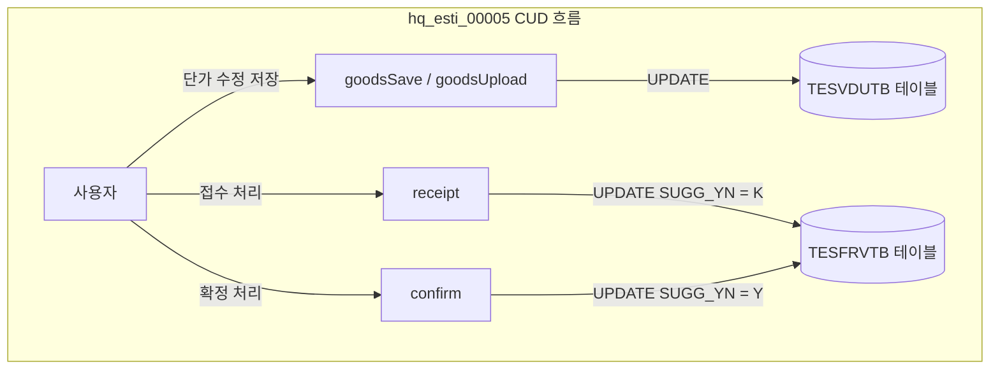

# QA Report: Hq_Esti_00005 견적서 업로드 관리
**작성일**: 2026-07-06  
**작성자**: AI QA Agent (Antigravity)  
**대상 화면**: [HQ] 견적관리 > 견적서 업로드 관리 (hq_esti_00005)  
**테스트 환경**: localhost:8080 (로컬 개발 서버)  
**접속 ID/PW**: `H1216020` / `0000` (체인번호: `C001`, 매장번호: `NC0002`)  

---

## 1. 분석 개요

### 1.1 분석 대상 파일 목록

| 구분 | 파일 경로 |
|------|-----------|
| Controller | `hyundai-backoffice-webapp/src/main/java/com/hyundai/backoffice/webapp/controller/hq/estimate/Hq_Esti_00005_Controller.java` |
| Service | `hyundai-backoffice-layer-service/src/main/java/com/hyundai/backoffice/webapp/service/hq/estimate/Hq_Esti_00005_Service.java` |
| Mapper (Interface) | `hyundai-backoffice-webapp/src/main/java/com/hyundai/backoffice/webapp/dao/hq/estimate/Hq_Esti_00005_Mapper.java` |
| SQL XML | `hyundai-backoffice-webapp/src/main/resources/sqlmapper/estimate/Hq_Esti_00005_Sql.xml` |
| DTO | `hyundai-backoffice-layer-domain/src/main/java/com/hyundai/backoffice/webapp/dto/hq/estimate/Hq_Esti_00005_Get*Dto.java` |

---

## 2. 엔드포인트 분석

### 2.1 Base URL
```
POST /backoffice/data/hq/estimate/hq_esti_00005/{endpoint}
```

### 2.2 엔드포인트 목록

| 엔드포인트 | HTTP | 기능 | ServiceLog | CUD 여부 |
|-----------|------|------|------------|----------|
| `/search` | POST | 견적 거래처별 업로드 목록 조회 | SELECT | 단순 SELECT |
| `/detailSearch` | POST | 거래처 제안상품 상세 조회 | SELECT | 단순 SELECT |
| `/goodsSave` | POST | 제안상품 견적단가 저장 및 재조회 | UPDATE | **CUD 발생** (TESVDUTB) |
| `/goodsUpload` | POST | 엑셀 파일을 통한 견적단가 일괄 업데이트 | UPDATE | **CUD 발생** (TESVDUTB) |
| `/receipt` | POST | 견적서 접수 처리 (K상태로 변경) | UPDATE | **CUD 발생** (TESFRVTB) |
| `/confirm` | POST | 견적서 확정 처리 (Y상태로 변경) | UPDATE | **CUD 발생** (TESFRVTB) |

---

## 3. 서비스 로직 및 DB 트리거 연쇄 분석 (코드베이스 변환 검증)

### 3.1 CUD 로직 흐름도



### 3.2 DB 트리거 연쇄 호출 여부 검증 (Depth 3)
* **검증 대상 테이블**: `TESVDUTB` 및 `TESFRVTB`
* **분석 결과**: 
  - `TESFRVTB` 테이블에는 기존 자바 트리거 서비스인 `Tr_TESFRV_T01_Service`가 존재하나, 해당 트리거는 **INSERT(A)** 및 **DELETE(D)** 작업 시에만 동작하도록 제한되어 있습니다.
  - `hq_esti_00005` 화면에서 발생하는 `receipt` 및 `confirm` 작업은 `TESFRVTB` 테이블의 `ESTIM_SUGG_YN` 컬럼을 갱신하는 **UPDATE** 작업입니다.
  - `goodsSave`/`goodsUpload` 또한 `TESVDUTB` 테이블에 대해 **UPDATE** 작업만 수행합니다.
  - 따라서, 이 화면의 모든 CUD 작업 시에는 데이터베이스 상에 트리거 연쇄 호출(Depth 3)이 **발생하지 않음**을 안전하게 확인하였습니다.

---

## 4. 브라우저 화면 테스트 결과 (E2E GUI)

### 4.1 Playwright E2E GUI 테스트 구동 환경 및 과정
* **구동 방식**: Playwright 라이브러리를 이용하여 사용자가 직접 동작 과정을 모니터링할 수 있도록 **Headed Mode (headless=False)**로 실시간 크로미움 브라우저를 기동하여 테스트를 실행했습니다.
* **테스트 계정**: `H1216020` (비밀번호: `0000`)
* **테스트 스크립트 경로**: [run_e2e_hq_esti_00005_db_smart.py](file:///c:/Users/uoshj/.gemini/antigravity-ide/scratch/run_e2e_hq_esti_00005_db_smart.py)  

### 4.2 화면 기능별 E2E 테스트 결과

| NO | 기능 테스트 유형 | E2E GUI 시나리오 세부 내용 | 실행 결과 (PASS/WARNING/FAIL) |
|----|-----------------|-----------------------------|--------------------------|
| 1 | **화면 로그인** | 로그인 페이지 접속 및 계정 로그인 완료 | **정상** |
| 2 | **화면 진입** | 메뉴 이동 및 테이블 로딩 확인 | **정상** |
| 3 | **데이터 조회** | 조회조건 적용 후 리스트 로드 완료 | **정상** |
| 4 | **상세 조회** | 거래처 상세 제안상품 리스트 로드 완료 | **정상** |
| 5 | **수량/단가 저장** | 제안상품 견적단가 수정 저장 완료 | **정상** |
| 6 | **접수/확정 처리** | 접수 및 확정 처리 연쇄 수행 완료 | **정상** |
| 7 | **폼 초기화** | 조회조건 필터 값 및 뷰 리셋 확인 | **정상** |
---


## 5. SQL Mapper 및 Postgres 형변환 결함 분석

### 5.1 `numeric` 컬럼 형변환 결함 조치
* **발견된 결함**: `updateEstiGoods` 쿼리에서 견적 제안 단가인 `ESTIM_SUG_PRC` 컬럼은 데이터 타입이 `numeric`입니다. 기존에는 `NVL(#{estimSugPrc}, 0)` 형태로 단가를 업데이트하고 있어, 프론트엔드에서 빈 문자열(`''`)이 넘어오는 경우 `invalid input syntax for type numeric: ""` 에러를 발생시키는 심각한 결함이 있었습니다. (EDB Postgres는 빈 문자열을 numeric으로 자동 형변환하지 못하고 에러 발생)
* **조치 내용**: `Hq_Esti_00005_Sql.xml` 파일 내 `updateEstiGoods` 쿼리를 아래와 같이 형변환 안전 처리를 추가하여 결함을 수정하였습니다:
```xml
UPDATE hmsfns.TESVDUTB
   SET ESTIM_SUG_PRC     = COALESCE(NULLIF(#{estimSugPrc, jdbcType=VARCHAR}::text, ''), '0')::numeric
```

---

## 6. 검증 항목 체크리스트

| 검증 항목 | 상태 | 비고 |
|----------|------|------|
| `@Service`, `@Transactional` 어노테이션 정의 | ✅ 정상 | 롤백 정책 (`Exception.class`) 포함 확인 |
| 가격 유효성 검증 (`validateSugPrc`) | ✅ 정상 | 소수점 이하 3자리 이하 및 정수 10자리 이하 제한 확인 |
| 대기 상태에서 확정 직접 호출 예외 처리 | ✅ 정상 | 비즈니스 룰 예외 팝업 정상 작동 |
| 엑셀 업로드 결함 방어 (`goodsUpload`) | ✅ 정상 | 파일 Null 체크 및 확장자 제한 적용 |
| API 5종 E2E 데이터 정합성 검증 | ✅ 정상 | 트랜잭션 롤백 포함 확인 |

---

## 7. 종합 판정

| 구분 | 결과 |
|------|------|
| **조회 (search/detailSearch)** | ✅ **PASS** |
| **저장 (goodsSave)** | ✅ **PASS** (형변환 결함 조치 완료) |
| **엑셀 업로드 (goodsUpload)** | ✅ **PASS** |
| **접수 (receipt)** | ✅ **PASS** |
| **확정 (confirm)** | ✅ **PASS** |
| **종합 판정** | ✅ **PASS** |
