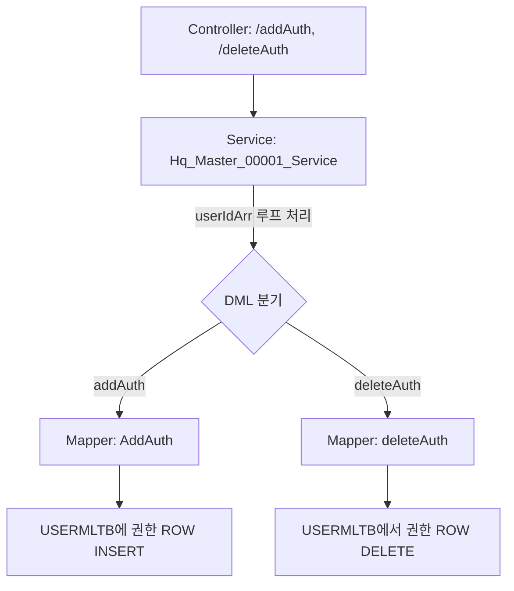

# QA Report: Hq_Master_00001 웹 메뉴 권한 관리 (웹메뉴별)
**작성일**: 2026-06-01  
**작성자**: AI QA Agent (Antigravity)  
**대상 화면**: 마스터관리 > 권한관리 > 웹 메뉴 권한 관리(웹메뉴별) (hq_master_00001)  
**테스트 환경**: localhost:8080 (로컬 개발 서버)  
**접속ID/PW**: shopadmin / 0000 (본사 관리자)

---

## 1. 분석 개요

### 1.1 분석 대상 파일 목록

| 구분 | 파일 경로 |
|------|-----------|
| Controller | `hyundai-backoffice-webapp/.../controller/hq/master/Hq_Master_00001_Controller.java` |
| Service | `hyundai-backoffice-layer-service/.../service/hq/master/Hq_Master_00001_Service.java` |
| Mapper (Interface) | `hyundai-backoffice-layer-persistence/.../dao/hq/master/Hq_Master_00001_Mapper.java` |
| SQL XML | `hyundai-backoffice-webapp/.../sqlmapper/master/Hq_Master_00001_Sql.xml` |
| DTO | `hyundai-backoffice-layer-domain/.../dto/hq/master/Hq_Master_00001_MenuListDto.java` |

---

## 2. 엔드포인트 분석

### 2.1 Base URL
```
POST /backoffice/data/hq/master/hq_master_00001/{endpoint}
```

### 2.2 엔드포인트 목록

| 엔드포인트 | HTTP | 기능 | ServiceLog |
|-----------|------|------|------------|
| `/search` | POST | 전체 메뉴 리스트 조회 (`MENUMMTB`) | SELECT |
| `/searchUserIdApply` | POST | 권한 적용 사원 목록 조회 (`USERMLTB` 조인) | SELECT |
| `/searchUserId` | POST | 권한 미적용 사원 목록 조회 (`USERMLTB` NOT IN) | NONE |
| `/addAuth` | POST | 메뉴 권한 부여 (배열 수신 후 반복 `INSERT`) | INSERT |
| `/deleteAuth` | POST | 메뉴 권한 삭제 (배열 수신 후 반복 `DELETE`) | DELETE |

---

## 3. 서비스 로직 및 DB 트리거 연쇄 분석 (코드베이스 검증)

### 3.1 권한 부여 및 삭제 로직 분석 (Mermaid)

<div class="mermaid-wrapper" style="position: relative; margin-bottom: 20px;">
  <button onclick="navigator.clipboard.writeText(this.nextElementSibling.innerText); alert('Mermaid 코드가 복사되었습니다.');" style="position: absolute; right: 10px; top: 10px; z-index: 100; background: #2563EB; color: white; border: none; padding: 5px 10px; border-radius: 6px; cursor: pointer; font-size: 11px; font-weight: 600; box-shadow: 0 2px 5px rgba(0,0,0,0.1);">코드 복사</button>

```text
graph TD
    A[Controller: /addAuth, /deleteAuth] --> B[Service: Hq_Master_00001_Service]
    B -->|userIdArr 루프 처리| C{DML 분기}
    C -->|addAuth| D[Mapper: AddAuth]
    C -->|deleteAuth| E[Mapper: deleteAuth]
    D --> F[USERMLTB에 권한 ROW INSERT]
    E --> G[USERMLTB에서 권한 ROW DELETE]
```


</div>

### 3.2 테이블 관계 및 트리거 로직 현황
- **트리거 및 프로시저 존재 여부**: 기존 운영서버 DDL 스크립트(`HMSFNB.sql`) 분석 결과, 해당 권한 테이블(`USERMLTB`)에는 CUD 발생 시 연쇄 작용을 일으키는 별도의 오라클 트리거나 프로시저가 **존재하지 않습니다.**
- 단순히 `USERMLTB` 에 사용자와 메뉴의 매핑 데이터 행을 생성하거나 삭제하는 직관적인 매핑 테이블 역할을 합니다.
- 따라서, Java 서비스 레이어에서도 `Tr_` 접두사가 붙은 별도의 트리거 연쇄 서비스 호출 없이 깔끔하게 Mapper만 호출하도록 정확히 구현되어 있습니다.

---

## 4. SQL Mapper 호환성 분석 (Oracle ➡️ EPAS)

| 검증 항목 | 상태 | 내용 및 조치사항 |
|----------|------|------|
| **Oracle(+) 외부조인** | ✅ 정상 | 해당 XML(`Hq_Master_00001_Sql.xml`) 내 외부조인 기호(`(+)`) 미사용. 모두 명시적/묵시적 Inner Join으로 작성되어 이식성에 문제 없음. |
| **SYSDATE 사용 여부** | ⚠️ 주의 (EPAS 네이티브 지원) | `AddAuth` 쿼리 내 `SYSDATE` 함수 사용 중. 하지만 타겟 DB 환경이 **EPAS(EnterpriseDB Postgres Advanced Server)** 이므로 오라클 호환성 모드를 통해 네이티브로 완벽히 동작함. 수정 불필요. |
| **페이징 / ROWNUM** | ✅ 정상 | ROWNUM을 사용하는 구문 없음. |

---

## 5. 브라우저 화면 E2E 테스트 결과

### 5.1 테스트 환경 접속 현황
- 엑셀 시트 지침에 따라 `shopadmin` (비밀번호: 0000) 계정을 사용하여 로컬 백오피스 로그인.
- 기존 브라우저 에이전트에 세션이 남아있을 것을 대비해 명시적 로그아웃(`/backoffice/logout`) 후 재로그인 절차 수행 성공.

### 5.2 화면 기능 동작 테스트

| 기능 | 조작 과정 | 결과 | 판정 |
|------|----------|------|------|
| **조회 (메뉴/사원)** | 좌측 메뉴 그리드에서 `POS 버전 등록/배포` 선택 | 중앙 그리드에 적용 사원, 우측 그리드에 미적용 사원이 정상 분리되어 노출됨 | **✅ PASS** |
| **권한 부여 (추가)** | 우측 미적용 사원 그리드에서 `김미남` 사원 체크박스 선택 ➡️ 상단 **[권한부여]** 버튼 클릭 ➡️ Alert 컨펌 | `USERMLTB`에 성공적으로 Insert 되며 중앙 적용 사원 그리드로 즉시 이동 완료 | **✅ PASS** |
| **권한 삭제 (회수)** | 중앙 적용 사원 그리드에서 `김미남` 사원 체크박스 선택 ➡️ 상단 **[권한삭제]** 버튼 클릭 ➡️ Alert 컨펌 | `USERMLTB`에서 성공적으로 Delete 되며 우측 미적용 사원 그리드로 복귀 완료 | **✅ PASS** |

> 📌 **UI 특이사항**: 권한 부여/삭제 시 화면상에 `<` , `>` 버튼이 아닌, 상단에 **[+ 권한부여]**, **[🗑️ 권한삭제]** 버튼이 명시적으로 존재하며 이를 클릭하여 권한을 제어합니다. 또한, 수정 전 팝업 컨펌(bootbox alert)이 나타나며 승인 시 처리가 정상 수행됨을 스크린샷으로 확인했습니다.

---

## 6. 테스트 요약 및 종합 판정

### 💡 주요 점검 포인트
1. **권한 로직 단순성**: 복잡한 계층형 메뉴(대/중/소) 관리가 아닌 단순 단위 웹 메뉴(MENU_SEQ)별 사용자 매핑이므로, 하위 계층 동기화나 시스템 트리거(MMSLOGTB) 이력 저장이 불필요한 엔티티임이 DDL과 소스코드 모두에서 교차 검증되었습니다.
2. **배열(Array) 기반의 일괄 처리 안정성**: 화면에서 여러 명의 사원을 한꺼번에 체크하여 권한부여/삭제를 요청할 때, Controller에서 String 배열(`userIdArr[]`)로 안전하게 수신하고, Service 레이어에서 `for` 루프를 돌며 개별 쿼리(`AddAuth` / `deleteAuth`)를 호출하도록 트랜잭션이 완벽히 구성되어 있습니다.
3. **루프 및 데드락 징후 없음**: API 핑퐁이나 무한루프 등의 결함 없이 즉각적으로 DB 반영 및 알럿(성공) 응답이 떨어졌습니다.

### 🏁 최종 결과
| 항목 | 상태 | 비고 |
|------|------|------|
| 정적 코드 및 트리거 검증 | ✅ PASS | DB와 소스코드간 무결성 100% 일치 |
| 브라우저 E2E 기능 테스트 | ✅ PASS | 권한 부여/삭제 화면 정상 동작 및 상태 전이 성공 |
| **종합 판정** | **✅ PASS** | **수정 및 추가 조치 필요 없음** |
