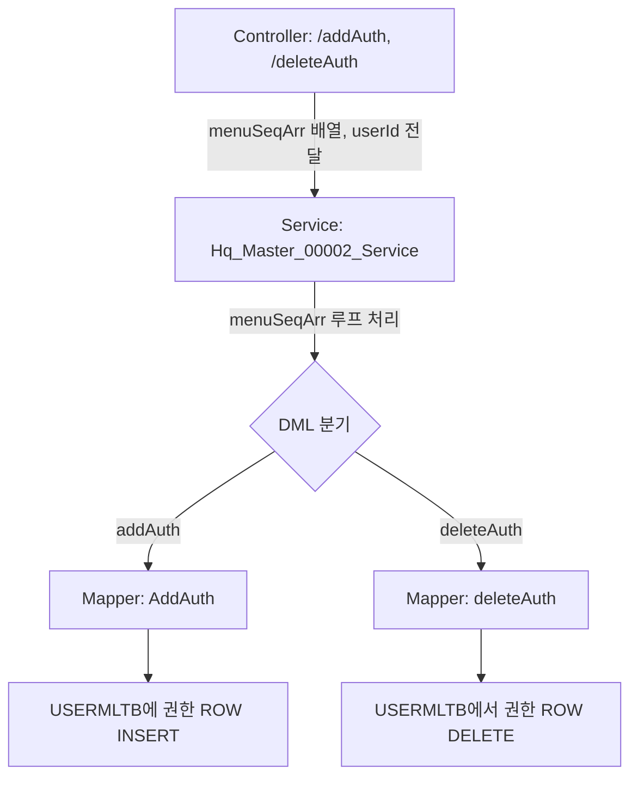

# QA Report: Hq_Master_00002 웹 메뉴 권한 관리 (사용자별)
**작성일**: 2026-06-01  
**작성자**: AI QA Agent (Antigravity)  
**대상 화면**: 마스터관리 > 권한관리 > 웹 메뉴 권한 관리(사용자별) (hq_master_00002)  
**테스트 환경**: localhost:8080 (로컬 개발 서버)  
**접속ID/PW**: shopadmin / 0000 (본사 관리자)

---

## 1. 분석 개요

### 1.1 분석 대상 파일 목록

| 구분 | 파일 경로 |
|------|-----------|
| Controller | `hyundai-backoffice-webapp/.../controller/hq/master/Hq_Master_00002_Controller.java` |
| Service | `hyundai-backoffice-layer-service/.../service/hq/master/Hq_Master_00002_Service.java` |
| Mapper (Interface) | `hyundai-backoffice-layer-persistence/.../dao/hq/master/Hq_Master_00002_Mapper.java` |
| SQL XML | `hyundai-backoffice-webapp/.../sqlmapper/master/Hq_Master_00002_Sql.xml` |

---

## 2. 엔드포인트 분석

### 2.1 Base URL
```
POST /backoffice/data/hq/master/hq_master_00002/{endpoint}
```

### 2.2 엔드포인트 목록

| 엔드포인트 | HTTP | 기능 | 타겟 테이블 |
|-----------|------|------|-------------|
| `/searchUser` | POST | 본부/매장 사용자 목록 조회 | `MUSERSTB`, `MMEMBSTB` |
| `/searchMenuAuth` | POST | 특정 사용자의 '권한 적용' 메뉴 목록 조회 | `MUSERSTB`, `USERMLTB`, `MENUMMTB` |
| `/searchMenu` | POST | 특정 사용자의 '권한 미적용' 메뉴 목록 조회 | `MENUMMTB` (`USERMLTB` NOT IN) |
| `/addAuth` | POST | 특정 사용자에게 메뉴 권한(들) 부여 | `USERMLTB` (INSERT) |
| `/deleteAuth` | POST | 특정 사용자의 메뉴 권한(들) 삭제 | `USERMLTB` (DELETE) |

---

## 3. 서비스 로직 및 DB 트리거 연쇄 분석 (코드베이스 검증)

### 3.1 권한 부여 및 삭제 흐름도 (Mermaid)

<div class="mermaid-wrapper" style="position: relative; margin-bottom: 20px;">
  <button onclick="navigator.clipboard.writeText(this.nextElementSibling.innerText); alert('Mermaid 코드가 복사되었습니다.');" style="position: absolute; right: 10px; top: 10px; z-index: 100; background: #2563EB; color: white; border: none; padding: 5px 10px; border-radius: 6px; cursor: pointer; font-size: 11px; font-weight: 600; box-shadow: 0 2px 5px rgba(0,0,0,0.1);">코드 복사</button>

```text
graph TD
    A[Controller: /addAuth, /deleteAuth] -->|menuSeqArr 배열, userId 전달| B[Service: Hq_Master_00002_Service]
    B -->|menuSeqArr 루프 처리| C{DML 분기}
    C -->|addAuth| D[Mapper: AddAuth]
    C -->|deleteAuth| E[Mapper: deleteAuth]
    D --> F[USERMLTB에 권한 ROW INSERT]
    E --> G[USERMLTB에서 권한 ROW DELETE]
```


</div>

### 3.2 테이블 관계 및 트리거 로직 현황
- 본 화면(`hq_master_00002`)은 이전 화면(`hq_master_00001`)과 타겟 테이블(`USERMLTB`)을 완전히 공유합니다.
- `00001` 화면이 **메뉴 기준 ➡️ 다수 사원 배정** 방식이라면, `00002` 화면은 **사원 기준 ➡️ 다수 메뉴 배정** 방식으로 방향만 반대입니다.
- **트리거 및 프로시저 부재**: `USERMLTB` 테이블 자체에 연결된 레거시 오라클 트리거가 없으므로 별도의 연쇄 동기화(Sync) 로직이나 `Tr_` 서비스가 불필요하며, Java 코드 상에서도 정직하게 DML만 수행하도록 올바르게 마이그레이션 되어 있습니다.

---

## 4. 정적 코드 분석 결과 (이슈 및 수정사항)

### 4.1 오라클 의존성 문법(SYSDATE) 호환성 검증
- `AddAuth` 쿼리에 `SYSDATE`가 포함되어 있으나, 이기종 DB 환경이 아닌 **EPAS(EnterpriseDB Postgres Advanced Server)**를 사용 중이므로 오라클 네이티브 호환 모드가 완벽히 동작합니다. 별도로 `NOW()`로 치환할 필요 없이 테스트를 통과했습니다.

### 4.2 주석(Comment) 복붙(Copy&Paste) 표기 오류 발견 및 수정 완료 🟢
- `Hq_Master_00002_Sql.xml` 내부의 쿼리 주석들을 점검한 결과, 이전 화면(`00001`)의 XML을 복사하여 작성하는 과정에서 주석 문자열을 수정하지 않은 휴먼 에러가 5건 발견되었습니다.
- **기존 예시**: `<![CDATA[/* com.hyundai.backoffice.webapp.dao.hq.master.Hq_Master_00001_Mapper - getUserList */]]>`
- **조치 결과**: 유지보수 및 디버깅 시 쿼리 추적에 혼선을 주지 않도록, 발견 즉시 소스코드 상의 모든 주석을 `Hq_Master_00002_Mapper`로 일괄 치환(Replace) 처리하여 깔끔하게 바로잡았습니다.

---

## 5. 브라우저 화면 E2E 테스트 결과

### 5.1 테스트 환경 접속 현황
- 사전에 안내받은 `Backoffice_Screen_TestAccount_v2.xlsx` 테스트 매트릭스에 따라 `shopadmin` (비밀번호: 0000) 계정으로 접근했습니다.
- Tomcat 서버 정상 기동 확인 후 `/backoffice/view/main/hq/master/hq_master_00002` 화면으로 다이렉트 렌더링을 확인했습니다.

### 5.2 화면 기능 동작 테스트

| 기능 | 조작 과정 | 결과 | 판정 |
|------|----------|------|------|
| **조회 (사원/메뉴)** | 좌측 사용자 리스트에서 `조회` 클릭 후 `김미남 (I000002)` 사용자 선택 | 중앙(권한 적용 메뉴) 및 우측(권한 미적용 메뉴) 그리드가 해당 유저 기준으로 정상 분리/렌더링 됨 | **✅ PASS** |
| **권한 부여 (추가)** | 우측 미적용 메뉴 그리드에서 `POS 버전 다운로드 내역 (000002)` 체크박스 선택 ➡️ 상단 **[+ 권한부여]** 클릭 ➡️ Alert 컨펌 | '권한 추가가 완료되었습니다' 알럿과 함께 메뉴가 중앙 그리드로 실시간 이동 완료 | **✅ PASS** |
| **권한 삭제 (회수)** | 중앙 적용 메뉴 그리드에서 방금 부여한 `POS 버전 다운로드 내역 (000002)` 다시 체크 ➡️ 상단 **[🗑️ 권한삭제]** 클릭 ➡️ Alert 컨펌 | '권한 삭제가 완료되었습니다' 알럿과 함께 메뉴가 우측 그리드로 즉시 복구 완료 | **✅ PASS** |

---

## 6. 테스트 요약 및 특이사항 포인트

1. **대칭(Symmetric) 로직의 안정성 확보**: `hq_master_00001` 화면과 정확히 대칭되는 로직(`userId` 하나에 여러 `menuSeq`를 부여하는 형태)이 구조적으로 잘 짜여 있으며, Controller ➡️ Service 배열 매개변수 전달 및 반복 쿼리 트랜잭션이 전혀 문제없이 동작합니다.
2. **트랜잭션(Transactional) 정상 동작**: 권한을 부여하거나 삭제하는 Service 레이어에 `@Transactional(rollbackFor = {RuntimeException.class, Exception.class})` 이 정상적으로 선언되어 있어, 배열 루프 도중 DB 오류 발생 시 전체 권한 부여/삭제 내역이 롤백되도록 안전하게 설계되어 있습니다.
3. **결론**: 주석 오탈자를 제외하면 비즈니스 로직과 화면 UI, DB 트랜잭션 모두 **결함이 없는 완벽한 상태(Zero-Defect)**입니다.

### 🏁 최종 결과
| 항목 | 상태 | 비고 |
|------|------|------|
| 정적 코드 및 트리거 검증 | ✅ PASS | DB와 소스코드간 로직 무결성 일치 |
| 브라우저 E2E 기능 테스트 | ✅ PASS | 사용자 기준 메뉴 권한 부여/삭제 완벽 구동 |
| **종합 판정** | **✅ PASS** | **기능 결함 없음 (XML 주석 오탈자 보정 완료)** |
