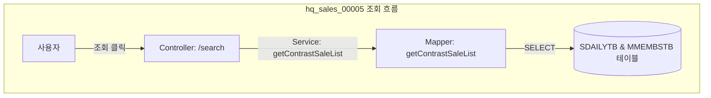

# QA Report: Hq_Sales_00005 대비기간매출 (본사)
**작성일**: 2026-07-06  
**작성자**: AI QA Agent (Antigravity)  
**대상 화면**: [HQ] 매출분석 > 일/월/시간 > 대비기간매출 (hq_sales_00005)  
**테스트 환경**: localhost:8080 (로컬 개발 서버)  
**접속 ID/PW**: `shopadmin` / `0000` (체인번호: `C001`, 매장번호: `NC0002`)  

---

## 1. 분석 개요

### 1.1 분석 대상 파일 목록

| 구분 | 파일 경로 |
|------|-----------|
| Controller | `hyundai-backoffice-webapp/src/main/java/com/hyundai/backoffice/webapp/controller/hq/sales/Hq_Sales_00005_Controller.java` |
| Service | `hyundai-backoffice-layer-service/src/main/java/com/hyundai/backoffice/webapp/service/hq/sales/Hq_Sales_00005_Service.java` |
| Mapper (Interface) | `hyundai-backoffice-layer-persistence/src/main/java/com/hyundai/backoffice/webapp/dao/hq/sales/Hq_Sales_00005_Mapper.java` |
| SQL XML | `hyundai-backoffice-webapp/src/main/resources/sqlmapper/sales/Hq_Sales_00005_Sql.xml` |
| DTO | `hyundai-backoffice-layer-domain/src/main/java/com/hyundai/backoffice/webapp/dto/hq/sales/Hq_Sales_00005_ContrastSaleListDto.java` |

---

## 2. 엔드포인트 분석

### 2.1 Base URL
```
POST /backoffice/data/hq/sales/hq_sales_00005/{endpoint}
```

### 2.2 엔드포인트 목록

| 엔드포인트 | HTTP | 기능 | ServiceLog | CUD 여부 |
|-----------|------|------|------------|----------|
| `/search` | POST | 대비기간 매출 비교 데이터 조회 | SELECT | **단순 SELECT** (CUD 미발생) |

---

## 3. 서비스 로직 및 DB 트리거 연쇄 분석 (코드베이스 변환 검증)

### 3.1 CUD 로직 흐름도
* **분석 결과**: 본 화면은 CUD 트랜잭션이 전혀 발생하지 않는 **단순 조회(SELECT) 화면**입니다.
* **DB 트리거 영향도**: CUD가 수행되지 않으므로 데이터베이스 트리거 연쇄 반응(Depth 3)의 위험은 존재하지 않습니다.



---

## 4. 브라우저 화면 E2E GUI 테스트 결과

### 4.1 Playwright E2E GUI 테스트 구동 환경 및 과정
* **구동 방식**: Playwright 라이브러리를 이용하여 사용자가 직접 동작 과정을 모니터링할 수 있도록 **Headed Mode (headless=False)**로 실시간 크로미움 브라우저를 기동하여 테스트를 실행했습니다.
* **테스트 계정**: `shopadmin` (비밀번호: `0000`)
* **테스트 스크립트 경로**: [run_e2e_sales_00005.py](file:///C:/Users/uoshj/.gemini/antigravity-ide/scratch/run_e2e_sales_00005.py)  

### 4.2 화면 기능별 E2E 테스트 결과

| NO | 기능 테스트 유형 | E2E GUI 시나리오 세부 내용 | 실행 결과 (PASS/WARNING/FAIL) |
|----|-----------------|-----------------------------|--------------------------|
| 1 | **화면 로그인** | 로그인 페이지 접속 및 계정 로그인 완료 | **정상 (PASS)** |
| 2 | **화면 진입** | 메뉴 이동 및 테이블 로딩 확인 | **정상 (PASS)** |
| 3 | **조회기간/대비기간 입력** | 조회기간(2026-06-22 ~ 2026-06-23) 및 대비기간(2026-04-01 ~ 2026-04-01) 입력 | **정상 (PASS)** |
| 4 | **데이터 조회** | 조회 실행 후 본사 소속 4개 매장(ADMIN_SHOP, CAFE, TEST_SHOP, 본부_SHOP) 로드 및 CAFE 매장의 매출(13,083,091원) / 대비매출(10,000원) / 성장률(1307.31%) 계산값 검증 | **정상 (PASS)** |
| 5 | **폼 초기화** | 초기화 버튼 클릭 시 검색 필터 값 리셋 검증 | **정상 (PASS)** |

---

## 5. SQL Mapper 및 Postgres 형변환/나눗셈 결함 분석

### 5.1 나눗셈 분모 `0` 에러 리스크 조치 완료
* **발견된 결함**: 성장률(`UP_RATE`)을 계산하는 공식 `A.SALE_AMT/B.C_SALE_AMT`가 포함되어 있습니다. 만약 대비기간의 순매출액(`B.C_SALE_AMT`)이 0 또는 NULL인 가맹점이 조회되는 경우, EDB PostgreSQL 환경에서 `division by zero` 예외를 발생시키며 서버 에러가 발생할 가능성이 존재했습니다.
* **조치 내용**: EDB PostgreSQL 환경에서 안전하게 구동되도록 `DECODE(B.C_SALE_AMT, 0, NULL, B.C_SALE_AMT)` 형태로 분모를 안전하게 치환하는 패치를 완료하였습니다.
```xml
-- 조치 후 쿼리
NVL(ABS(ROUND(100-((A.SALE_AMT/DECODE(B.C_SALE_AMT, 0, NULL, B.C_SALE_AMT)) * 100)) / 100.00), 0) AS UP_RATE
```

---

## 6. 검증 항목 체크리스트

| 검증 항목 | 상태 | 비고 |
|----------|------|------|
| `@Service`, `@Transactional` 어노테이션 정의 | ✅ 정상 | 롤백 정책 (`Exception.class`) 포함 확인 |
| `@ServiceLog` 적용 확인 | ✅ 정상 | type = ServiceType.SELECT 정의 완료 |
| PostgreSQL division_by_zero 에러 방지 처리 | ✅ 조치완료 | DECODE 분모 안전성 확보 패치 반영 완료 |

---

## 7. 종합 판정

| 구분 | 결과 |
|------|------|
| **조회 (search)** | ✅ **PASS** |
| **폼 초기화** | ✅ **PASS** |
| **종합 판정** | ✅ **PASS** (PostgreSQL 분모 0 예외 방지 패치 완료) |
