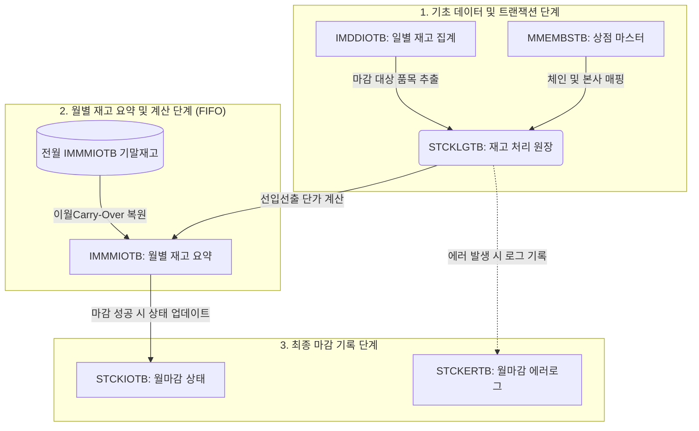

# FIFO 월마감 프로세스 데이터 흐름 및 정합성 조건 (Data Flow & Preconditions)

본 문서는 HQ 선입선출 월마감(FIFO Month Close) E2E 테스트 및 정상 동작을 위해 **어떤 데이터가 서로 매칭되고 존재해야 하는지**, 그리고 **각 테이블 간의 데이터 정밀도/제약 조건**이 무엇인지 상세히 설명합니다.

---

## 1. 선입선출 월마감 데이터 흐름 (Core Data Flow)

월마감 프로세스는 일별 입출고 집계 및 원장을 기초로 월별 재고 집계 테이블을 생성 및 업데이트하고, 최종 마감 상태를 상태 테이블에 반영하는 순서로 동작합니다.



---

## 2. 테이블 간 데이터 매핑 및 매칭 관계

테스트 구동 및 실제 마감 시 **반드시 서로 매칭되어야 하는 데이터**는 다음과 같습니다.

### ① 전월 이월 재고 (Carry Over) 매칭
* **대상 테이블**: `hmsfns.IMMMIOTB`
* **매칭 조건**: 당월(`202606`) 마감을 돌리기 위해서는, 전월(`202605`)의 기말 재고 및 단가(`end_qty`, `end_cost`)가 당월의 기초 재고(`start_qty`, `start_cost`)와 완전히 동일하게 `IMMMIOTB` 테이블에 생성되어 있어야 합니다.
* **불일치 시 발생 오류**: 기초 요약 정보가 없어 마감 후 기말 재고 단가 산출 시 `NO_DATA_FOUND` 예외가 발생합니다.

### ② 신규 거래 상품의 기초 요약 행 매칭
* **대상 테이블**: `hmsfns.IMDDIOTB` ↔ `hmsfns.IMMMIOTB`
* **매칭 조건**: 전월(`202605`)에는 재고가 아예 없었으나, 당월(`202606`) 일별 재고 집계(`IMDDIOTB`)에 신규 매출/입고 등 거래 기록이 발생한 상품이 있다면, 해당 상품은 기초 수량 `0`, 기초 단가 `0`인 상태로 당월 `IMMMIOTB`에 레코드가 사전 등록되어 있어야 합니다.
* **불일치 시 발생 오류**: 해당 상품의 일별 거래는 존재하지만 매칭되는 월별 요약 행(`IMMMIOTB`)이 없기 때문에 마감 배치 최종 처리 단계에서 `NO_DATA_FOUND` 예외가 발생합니다.

### ③ 상점 체인 및 본사 매칭
* **대상 테이블**: `hmsfns.MMEMBSTB` ↔ `hmsfns.IMMMIOTB`
* **매칭 조건**: 체인 내 개별 가맹점(`ms_no`)에 대응되는 체인 본사/센터 매장 번호(`chain_ms_no`)가 정확히 일치하여 매핑되어야 합니다.
* **매핑 방식**: 기존 이월 데이터가 없는 신규 상품의 경우, `COALESCE((SELECT chain_ms_no FROM hmsfns.IMMMIOTB WHERE ms_no = L.ms_no LIMIT 1), 'NC0002')` 방식으로 기존 상점의 본사 정보를 가져와 동적으로 일치시킵니다.

---

## 3. 필드 제약 조건 및 정밀도 (Constraints)

데이터 값 자체의 크기나 정밀도로 인해 발생할 수 있는 주요 제약 조건입니다.

| 테이블 | 컬럼명 | 데이터 타입 | 최대 입력 가능값 | 제약조건 설명 |
| :--- | :--- | :--- | :--- | :--- |
| **IMMMIOTB**<br>**IMDDIOTB**<br>**STCKLGTB** | `purch_cost`<br>`sale_cost`<br>`extra_cost` 등 | `numeric(14, 3)` | **99,999,999,999.999** (10^11 미만) | 정밀도 소수점 3자리 포함 총 14자리 제한. 정수 부분은 최대 11자리까지만 입력 가능합니다. |
| **OBSLPDTB**<br>(부대비용정산) | `extra_cost` 등 | `numeric(14, 3)` | **99,999,999,999.999** (10^11 미만) | 해당 정산 단가/비용이 1000억 원 이상(`10^11` 이상)으로 잘못 기입될 경우 원장에 마감 배치가 돌면서 복제될 때 **Numeric Field Overflow** 에러가 납니다. |

---

## 4. 데이터 초기화 및 복원 순서 (Test Setup Flow)

E2E 자동화 테스트를 시작할 때 데이터 무결성을 확보하기 위해 다음 3단계 청소 및 복원 쿼리가 순차적으로 실행되어야 합니다.

1. **클린 스타트**: 당월(`202606`)의 기존 마감 결과(`STCKIOTB`), 에러 기록(`STCKERTB`), 재고 요약(`IMMMIOTB`) 데이터를 삭제합니다.
   ```sql
   DELETE FROM hmsfns.STCKIOTB WHERE STOCK_MONTH = '202606';
   DELETE FROM hmsfns.STCKERTB WHERE STOCK_MONTH = '202606';
   DELETE FROM hmsfns.IMMMIOTB WHERE CREATE_MONTH = '202606';
   ```
2. **이월 데이터 복원**: 전월(`202605`) 기말 재고 데이터를 당월(`202606`) 기초 재고로 안전하게 복사하여 복원합니다.
   ```sql
   INSERT INTO hmsfns.IMMMIOTB (create_month, ms_no, goods_cd, chain_ms_no, start_qty, start_cost, end_qty, end_cost, ...)
   SELECT '202606', ms_no, goods_cd, chain_ms_no, end_qty, end_cost, end_qty, end_cost, ...
   FROM hmsfns.IMMMIOTB WHERE CREATE_MONTH = '202605';
   ```
3. **신규 거래 상품 행 생성**: 당월 거래(`IMDDIOTB`)는 존재하나 이월 데이터가 없는 신규 등록 상품에 대해 기초 재고 0을 기준으로 요약 행을 생성합니다.
   ```sql
   INSERT INTO hmsfns.IMMMIOTB (create_month, ms_no, goods_cd, chain_ms_no, start_qty, start_cost, ...)
   SELECT DISTINCT '202606', L.ms_no, L.goods_cd, COALESCE((SELECT chain_ms_no FROM hmsfns.IMMMIOTB WHERE ms_no = L.ms_no LIMIT 1), 'NC0002'), 0, 0, ...
   FROM hmsfns.IMDDIOTB L
   WHERE L.CREATE_DATE LIKE '202606%'
     AND NOT EXISTS (SELECT 1 FROM hmsfns.IMMMIOTB X WHERE X.CREATE_MONTH = '202606' AND X.MS_NO = L.MS_NO AND X.GOODS_CD = L.GOODS_CD);
   ```
