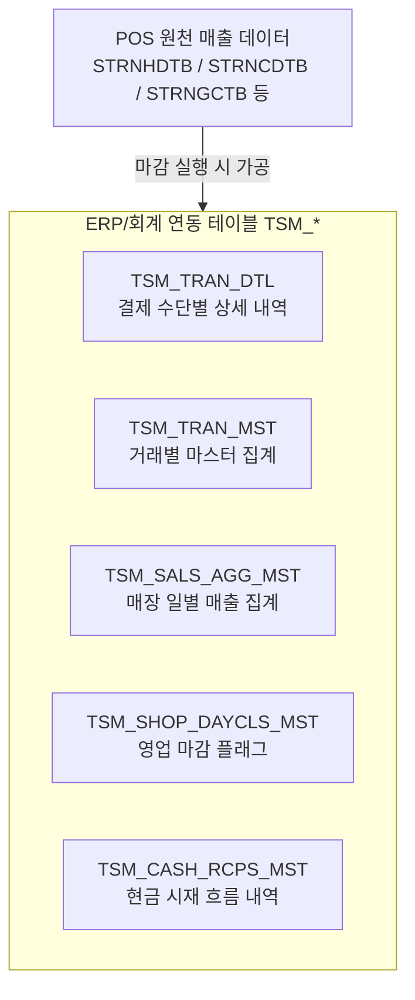

# hq_sysif_00001 일 마감 진행 조건 및 데이터 변화 가이드

본 문서는 백오피스 일 마감 관리 화면(`hq_sysif_00001`)에서 **현장마감**을 진행할 때 적용되는 사전 검증 조건과 마감 처리 시 발생하는 데이터베이스(DB) 상의 상태 변화, 그리고 대외 인터페이스(API) 연동 구조 및 마감 취소(원복) 방법을 정리한 문서입니다.

---

## 1. 일 마감 진행 조건 (Closing Conditions)

마감 버튼을 누르면 내부 서비스(`Hq_Sysif_00001_Service.closeRegi`)에서 다음의 사전 조건 검증을 거친 후 마감을 수행합니다. 검증 실패 시 마감 처리가 중단되고 에러 코드가 리턴됩니다.

| 검증 항목 | 대상 테이블 | 설명 및 에러 코드 |
| :--- | :--- | :--- |
| **매출-정산 건수 및 금액 일치 여부** | `STRNHDTB`<br>`SAREGITB` | POS에서 수집된 매출 영수증 건수/합계 금액과 정산 내역의 영수증 건수/합계 금액이 일치하는지 검증합니다.<br>📌 **불일치 시 에러 코드**: `billCntError` |
| **당일 포스 로그인(오픈) 여부** | `OPNPOSTB`<br>`SAREGITB` | 대상 영업일자에 실제로 포스 개설(오픈) 기록이 존재하고 정산 내역이 매칭되는지 확인합니다.<br>📌 **미오픈 시 에러 코드**: `LoginCntError` |
| **마감월 회계 마감 여부** | `MCLOSETB` | 마감하려는 대상 일자의 해당 월이 이미 회계적으로 월 마감(`CLS_YN = 'Y'`) 처리되었는지 검증합니다.<br>📌 **월 마감 상태일 시**: 마감 처리 불가 및 오류 발생 |

---

## 2. 마감 진행 시 데이터 상태 변화 (Data State Changes)

사전 검증 조건을 모두 통과하면 마감 트랜잭션이 수행되며, DB 테이블에 다음과 같은 상태 변화가 발생합니다.

### ① 마감 관리 상태 테이블 (`IFSLRETB`) 업데이트
해당 업장 및 영업일자의 마감 레코드에 현장 정산 시재 데이터가 확정 기록됩니다.
* **`MS_CLOSE_YN` (마감 여부)**:
  * 마감 요청 진입 시 `'N'`(미마감) -> 최종 인터페이스 연동 성공 시 **`'Y'`**(마감 성공)로 변경됩니다. (연동 실패 시 **`'E'`**로 변경)
* **시재 데이터 적재**:
  * `CL_DEPOSIT_AMT` (마감입금액)
  * `RE_RESERVE_AMT` (준비금반환액)
  * `SALE_CAHS_DEPOSIT_AMT` (현금순매출액)
  * `RETURN_RESERVE_AMT` (환불준비금액)
  * `NEXT_RESERVE_AMT` (익일준비금액)
  * `OVER_AMT` (현금과부족액)
  * `REMARK` (연동 로그메시지: e.g. `'Interface Success'`)

---

## 3. ERP/회계 연동 인터페이스 테이블 (`TSM_*`) 데이터 생성

마감 확정과 동시에 회계 연동 처리를 위해 기존 데이터(`POS_SEND_YN = 'N'`)를 삭제한 후, 당일 매출 데이터를 기반으로 연동 데이터를 새롭게 적재합니다.



### 1) `TSM_TRAN_DTL` (매출 상세)
당일 발생한 매출을 결제 수단별(현금, 신용카드, 쿠폰, 멤버십, 프로모션 등)로 매핑하고, 수수료 및 공급가/부가세를 계산하여 상세 데이터를 생성합니다.
* **수행**: `deleteTsmTranDtl` -> `insertTsmTranDtl`

### 2) `TSM_TRAN_MST` (매출 마스터)
`TSM_TRAN_DTL`에 적재된 상세 데이터를 기반으로 거래 영수증(지불 수단 합산) 단위로 전체 결제액, 할인액, 순매출액 등을 집계하여 마스터 정보를 적재합니다.
* **수행**: `deleteTsmTranMst` -> `insertTsmTranMst`

### 3) `TSM_SALS_AGG_MST` (일 매출 집계)
해당 일자 매장 전체의 일일 총 매출액, 취소액, 순매출액 및 비과세 매출금액과 당일 총 고객수(비매출 방문객 포함)를 집계하여 적재합니다.
* **수행**: `deleteTsmSalsAggMst` -> `insertTsmSalsAggMst`

### 4) `TSM_SHOP_DAYCLS_MST` (매장 일 마감)
해당 매장과 일자의 영업 마감 처리가 정상 완료되었음을 알리는 확정 레코드(마감 플래그)를 인서트합니다.
* **수행**: `deleteTsmShopDayclsMst` -> `insertTsmShopDayclsMst`

### 5) `TSM_CASH_RCPS_MST` (현금 시재)
현금 매출, 현금 과부족, 환불준비금, 준비금반환 등의 세부 현금 흐름을 시재 유형코드(`PRST_CLSF_CD`)별로 분류하여 적재합니다.
* **수행**: `deleteTsmCashRcpsMst` -> `insertTsmCashRcpsMst`

---

## 4. 실시간 API 연동 및 결과 반영 프로세스

사용자가 화면에서 **[현장마감]** 버튼을 클릭할 때, 내부적으로 DB 적재부터 대외 전송, 최종 결과 반영까지 실시간 동기식(Synchronous)으로 진행됩니다.

```
[사용자: 마감 버튼 클릭]
      │
      ▼
① 로컬 DB 임시 적재 (1단계)
   - 마감 프로시저(SUB_IF_HYDM_SEND_P)가 실행되어 POS 데이터를 가공한 후,
     로컬 EDB DB의 TSM_* 테이블에 적재합니다. (최초 상태: 'POS_SEND_YN = N')
      │
      ▼
② 본사 DB API 연동 및 데이터 송신 (2단계)
   - 웹 서버(WAS)가 로컬 DB에 임시 적재된 TSM_* 데이터를 조회합니다.
   - JDBC 및 MyBatis 연동 인터페이스를 사용해 본사 Tibero DB(HMSADM.TSM_*)에 데이터를 원격 Insert 합니다.
      │
      ▼
③ 연동 결과 최종 반영 (3단계)
   - [송신 성공 시]
     * 로컬 DB TSM_* 테이블의 POS_SEND_YN을 'Y'로 업데이트
     * 마감 관리 테이블(IFSLRETB)의 MS_CLOSE_YN을 'Y', REMARK를 'Interface Success'로 업데이트
   - [송신 실패 시] (예: 본사 DB 커넥션 단절, 쿼리 오류 등)
     * 로컬 DB TSM_* 테이블의 POS_SEND_YN을 'E'(Error)로 업데이트
     * 마감 관리 테이블(IFSLRETB)의 MS_CLOSE_YN을 'E', REMARK를 에러 로그(예: 'Tibero Inter Error')로 업데이트
      │
      ▼
[화면에 최종 결과 알림 표시]
```

---

## 5. 마감 취소/원복 시 수행해야 하는 DB 정리 작업

이미 완료된 마감을 취소하여 미마감 상태로 되돌리고자 할 때는 다음과 같이 **1) 마감 관리 정보 초기화**와 **2) 이미 생성된 연동용 임시/에러 데이터의 삭제 작업**을 수동으로 수행해야 합니다.

### ① 마감 관리 정보 원복 (`IFSLRETB` 테이블)
마감 여부를 미마감(`N`) 상태로 수정하고 연동 결과 메시지를 빈 값(`' '`)으로 초기화합니다.
```sql
UPDATE hmsfns.IFSLRETB
   SET MS_CLOSE_YN = 'N',
       REMARK      = ' '
 WHERE SALE_DATE   = '영업일자_YYYYMMDD'
   AND MS_NO       = '매장코드';
```

### ② 연동용 임시 적재 데이터 일괄 삭제 (`TSM_*` 테이블들)
마감 취소 대상을 식별하기 위해 전송되지 않은 대기 건(`POS_SEND_YN = 'N'`)이나 전송 실패한 에러 건(`POS_SEND_YN = 'E'`) 위주로 삭제 작업을 진행합니다.
```sql
-- 1. 매출 마스터 정보 삭제
DELETE FROM hmsfns.TSM_TRAN_MST 
 WHERE OCCU_DT = '영업일자_YYYYMMDD' AND SHOP_CD = '인터페이스매장코드' AND BIZ_CD = '법인코드' AND POS_SEND_YN IN ('N', 'E');

-- 2. 매출 상세 결제 수단 정보 삭제
DELETE FROM hmsfns.TSM_TRAN_DTL 
 WHERE OCCU_DT = '영업일자_YYYYMMDD' AND SHOP_CD = '인터페이스매장코드' AND BIZ_CD = '법인코드' AND POS_SEND_YN IN ('N', 'E');

-- 3. 일자별 총 매출 집계 정보 삭제
DELETE FROM hmsfns.TSM_SALS_AGG_MST 
 WHERE OCCU_DT = '영업일자_YYYYMMDD' AND SHOP_CD = '인터페이스매장코드' AND BIZ_CD = '법인코드' AND POS_SEND_YN IN ('N', 'E');

-- 4. 매장 영업 일마감 플래그 삭제
DELETE FROM hmsfns.TSM_SHOP_DAYCLS_MST 
 WHERE CLS_DT  = '영업일자_YYYYMMDD' AND SHOP_CD = '인터페이스매장코드' AND BIZ_CD = '법인코드' AND POS_SEND_YN IN ('N', 'E');

-- 5. 일일 현금 시재 정산 정보 삭제
DELETE FROM hmsfns.TSM_CASH_RCPS_MST 
 WHERE OCCU_DT = '영업일자_YYYYMMDD' AND SHOP_CD = '인터페이스매장코드' AND BIZ_CD = '법인코드' AND POS_SEND_YN IN ('N', 'E');
```
> ⚠️ **주의사항**: 이미 본사 ERP/회계 시스템으로 정상 전송되어 `POS_SEND_YN = 'Y'` 상태가 된 레코드들은 회계 장부 정합성을 위해 임의로 삭제해서는 안 되며 별도의 역분개 처리가 필요합니다.
> 
> * **만약 `POS_SEND_YN = 'Y'`인 레코드를 제외하고 로컬 DB만 임의로 정리/원복할 경우**:
>   * EDB 로컬 마감 여부(`MS_CLOSE_YN = 'N'`)를 원복하여 재마감을 시도하면, 로컬 프로시저가 작동하여 `TSM_*` 테이블에 새로운 데이터가 인서트되고 대외 전송(`POS_SEND_YN = 'N'`) 대기 상태가 됩니다.
>   * 하지만 본사 Tibero DB에는 이미 동일한 식별자(PK)를 가진 이전 마감 데이터가 들어있으므로, WAS에서 본사 전송 시 **기본키(PK) 중복 에러가 발생하여 마감 전송이 최종 실패(상태값 'E'로 변형)하게 됩니다.**
> * **환경별 대응 방법**:
>   * **개발/테스트 환경**: 본사 DB 정합성에 구애받지 않으므로 로컬 DB의 `'Y'` 데이터까지 강제 삭제한 뒤 원복해도 무방합니다.
>   * **실 운영 환경**: 반드시 본사 시스템 담당자를 통해 본사 DB(Tibero)의 데이터를 수동 삭제(또는 역분개)한 후, 로컬 DB의 원복 작업을 동시 진행해야 장애를 예방할 수 있습니다.
