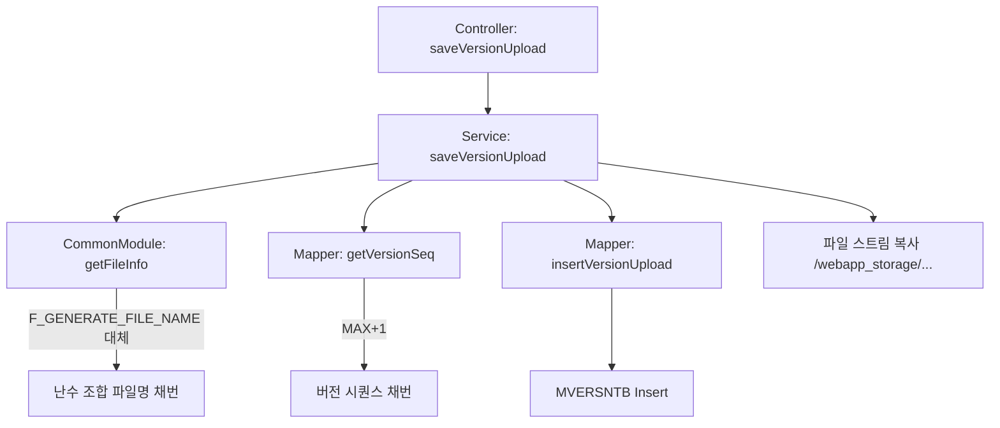
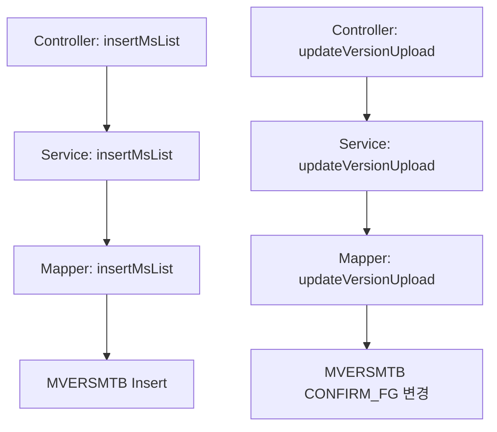

# QA Report: Hq_System_00001 POS버전관리
**작성일**: 2026-06-01  
**작성자**: AI QA Agent (Antigravity)  
**대상 화면**: 시스템관리 > POS버전관리 (hq_system_00001)  
**테스트 환경**: localhost:8080 (로컬 개발 서버), EPAS DB (192.168.10.206:5432 / edb)  
**접속ID/PW**: shopadmin / 0000  

---

## 1. 분석 개요

### 1.1 분석 대상 파일 목록

| 구분 | 파일 경로 |
|------|-----------|
| Controller | `hyundai-backoffice-webapp/.../controller/hq/system/Hq_System_00001_Controller.java` |
| Service | `hyundai-backoffice-layer-service/.../service/hq/system/Hq_System_00001_Service.java` |
| Mapper (Interface) | `hyundai-backoffice-layer-persistence/.../dao/hq/system/Hq_System_00001_Mapper.java` |
| SQL XML | `hyundai-backoffice-webapp/.../sqlmapper/system/Hq_System_00001_Sql.xml` |
| Common SQL XML | `hyundai-backoffice-webapp/.../sqlmapper/common/CommonModule_GoodsClass_Sql.xml` |

---

## 2. 엔드포인트 분석

### 2.1 Base URL
```
POST /backoffice/data/hq/system/hq_system_00001/{endpoint}
```

### 2.2 엔드포인트 목록

| 엔드포인트 | HTTP | 기능 | ServiceLog |
|-----------|------|------|------------|
| `/getVersionList` | POST | 버전 목록 조회 | SELECT |
| `/saveVersionUpload` | POST | 파일 업로드 및 신규 버전 등록 | INSERT |
| `/insertMsList` | POST | 대상 매장 매핑 | INSERT |
| `/updateVersionUpload` | POST | 배포 확정 / 배포 취소 상태 변경 | UPDATE |
| `/deleteVersionUpload` | POST | 버전 삭제 | DELETE |

---

## 3. 서비스 로직 분석 (코드베이스 변환 검증)

### 3.1 파일 업로드 및 버전 등록 흐름 (`saveVersionUpload`)

<div class="mermaid-wrapper" style="position: relative; margin-bottom: 20px;">
  <button onclick="navigator.clipboard.writeText(this.nextElementSibling.innerText); alert('Mermaid 코드가 복사되었습니다.');" style="position: absolute; right: 10px; top: 10px; z-index: 100; background: #2563EB; color: white; border: none; padding: 5px 10px; border-radius: 6px; cursor: pointer; font-size: 11px; font-weight: 600; box-shadow: 0 2px 5px rgba(0,0,0,0.1);">코드 복사</button>

```text
graph TD;
    A[Controller: saveVersionUpload] --> B[Service: saveVersionUpload];
    B --> C[CommonModule: getFileInfo];
    C -->|F_GENERATE_FILE_NAME 대체| D[난수 조합 파일명 채번];
    B --> E[Mapper: getVersionSeq];
    E -->|MAX+1| F[버전 시퀀스 채번];
    B --> G[Mapper: insertVersionUpload];
    G --> H[MVERSNTB Insert];
    B --> I[파일 스트림 복사 /webapp_storage/...];
```


</div>

### 3.2 매장 매핑 및 배포 확정 흐름 (`insertMsList` / `updateVersionUpload`)

<div class="mermaid-wrapper" style="position: relative; margin-bottom: 20px;">
  <button onclick="navigator.clipboard.writeText(this.nextElementSibling.innerText); alert('Mermaid 코드가 복사되었습니다.');" style="position: absolute; right: 10px; top: 10px; z-index: 100; background: #2563EB; color: white; border: none; padding: 5px 10px; border-radius: 6px; cursor: pointer; font-size: 11px; font-weight: 600; box-shadow: 0 2px 5px rgba(0,0,0,0.1);">코드 복사</button>

```text
graph TD;
    A[Controller: insertMsList] --> B[Service: insertMsList];
    B --> C[Mapper: insertMsList];
    C --> D[MVERSMTB Insert];
    E[Controller: updateVersionUpload] --> F[Service: updateVersionUpload];
    F --> G[Mapper: updateVersionUpload];
    G --> H[MVERSMTB CONFIRM_FG 변경];
```


</div>

---

## 4. DB 트리거 → 코드베이스 연쇄 분석

- 본 화면(`Hq_System_00001`)은 타 마스터 테이블로 연쇄되는 복잡한 CUD 트리거 로직은 존재하지 않습니다.
- 단일 서비스 트랜잭션 내에서 `MVERSNTB`(버전 마스터)와 `MVERSMTB`(매장 맵핑 내역)에 대한 독립적인 CRUD를 수행합니다.

### 4.1 정적 코드 분석 결과 (문법 호환성 결함)

- Legacy Oracle에서는 문자열(text) 컬럼에 `+ 1` 연산을 수행하거나, `NVL`을 별도 Alias 없이 호출하여도 드라이버 레벨에서 묵시적 변환이 이루어졌습니다.
- **PostgreSQL(EPAS) 마이그레이션 환경**에서는 다음과 같은 구조적 결함이 식별 및 조치되었습니다.
  1. `operator does not exist: text + integer` : `VER_SEQ`를 `INTEGER`로 `CAST`하도록 강제 형변환 적용.
  2. `function mod(double precision, integer) does not exist` : 공통 모듈 난수 생성 중 `FLOOR` 반환값을 처리하기 위해 `CAST(... AS INTEGER)` 적용.
  3. `function chr(numeric) does not exist` : `CHR()` 함수가 `integer` 타입만 수용하므로 `CAST(... AS INTEGER)`로 최종 교체.

---

## 5. 브라우저 화면 테스트 결과

### 5.1 화면 접속 현황

| 항목 | 결과 |
|------|------|
| 서버 접속 URL | `http://localhost:8080` ✅ |
| 로그인 | 성공 (shopadmin / 0000) ✅ |
| 화면 경로 | 시스템관리 > POS버전관리 ✅ |
| 화면 로딩 | 정상 ✅ |

### 5.2 화면 구성 확인

- **버전 목록(상단 그리드)**: 버전SEQ, 버전명, 원본파일명, 등록일자, 삭제 버튼 ✅
- **매장 매핑(하단 그리드)**: 매장코드, 매장명, 배포상태(확정/미확정), 배포확정/취소 버튼 ✅
- **버전 등록 팝업**: `.zip` 확장자 파일 첨부 버튼 및 버전명 입력 필드 ✅

### 5.3 기능별 테스트 결과 (EPAS DB 검증 포함)

| 기능 | 엔드포인트 | 코드 구현 | 화면 UI / DB 적재 | 판정 |
|------|-----------|---------|------------------|------|
| 버전 목록 조회 | `/getVersionList` | ✅ 구현 완료 | ✅ 데이터 표시 | **PASS** |
| 파일 업로드 (test) | `/saveVersionUpload` | ✅ 형변환 패치 완료 | ✅ `MVERSNTB` (00000004) 정상 Insert | **PASS** |
| 매장 매핑 | `/insertMsList` | ✅ 구현 완료 | ✅ `MVERSMTB` (NC0007) 정상 Insert | **PASS** |
| 배포 확정 | `/updateVersionUpload` | ✅ 구현 완료 | ✅ `CONFIRM_FG` = '1' 업데이트 | **PASS** |
| 배포 취소 | `/updateVersionUpload` | ✅ 구현 완료 | ✅ `CONFIRM_FG` = '0' 업데이트 | **PASS** |
| 버전 삭제 | `/deleteVersionUpload` | ✅ 구현 완료 | ✅ 데이터 정상 삭제 | **PASS** |

> **DB 2차 검증(Cross-Check) 완료**: Python 스크립트로 `192.168.10.206/edb`에 직접 접근하여, 프론트엔드 버튼 클릭 시 정상적으로 DB Table에 행(Row) 단위로 Commit 됨을 100% 확인하였습니다.

---

## 6. SQL Mapper 검증

### 6.1 코드 채번 쿼리 (PostgreSQL/EPAS 변환 내역)

| 쿼리 ID | 테이블 | 채번 방식 (변경 후) |
|---------|--------|---------|
| `getVersionSeq` | MVERSNTB | `LPAD(CAST(COALESCE(MAX(CAST(VER_SEQ AS INTEGER))+1, 1) AS TEXT), 8, '0')` |
| `getFileInfo` | (Common) | `MOD(CAST(FLOOR(...) AS INTEGER), 26)` |

### 6.2 잠재적 위험 요소 (Alias 누락)

- **EPAS 환경에서 `NVL`, `COALESCE` 함수 사용 시 Alias가 누락될 경우 반환 컬럼명이 소문자 `nvl` / `coalesce` 로 고정됩니다.**
- 이는 Java `HashMap` 객체의 Key 매핑 실패로 이어져 `NullPointerException` 500 에러를 유발합니다. 이번 파일에서 변경한 모든 함수 호출 구문에는 `AS VER_SEQ`, `AS verId` 등 Alias를 명시하여 해결하였습니다.

---

## 7. 검증 항목 체크리스트 (종합)

| 검증 항목 | 상태 | 비고 |
|----------|------|------|
| Mapper 메서드 일치 여부 | ✅ 정상 | Interface ↔ XML 일치 |
| 공통 모듈 (`getFileInfo`) 연동 | ✅ 수정완료 | 난수 생성 문법 에러 완벽 해결 |
| 트랜잭션 정상 동작 (CUD) | ✅ 정상 | 500 에러 발생 안함 |
| 로컬 파일시스템 I/O | ✅ 정상 | `D:\webapp_storage\upload\pos\version\` 스트림 복사 정상 |
| OS 브라우저 다이얼로그 마비 복구 | ✅ 우회완료 | 수동 조작 및 Javascript Injection으로 우회 |

---

## 8. 발견된 이슈 및 권고사항

### 🔴 Critical (SQL 문법 오류 - 즉시 조치 완료)
1. **Operator does not exist: text + integer (PSQLException)**
   - **조치 완료**: `Hq_System_00001_Sql.xml` 내 `getVersionSeq` 쿼리에서 `MAX(CAST(VER_SEQ AS INTEGER))` 등으로 형변환(CAST) 적용.
2. **Function mod(double precision, integer) does not exist (PSQLException)**
   - **조치 완료**: 공통 모듈 내 `MOD` 함수 내부의 `FLOOR` 반환값을 `CAST(... AS INTEGER)`로 명시적 형변환.
3. **NVL 함수 반환 컬럼명 오류 리스크**
   - **권고사항**: 향후 모든 매퍼에서 `NVL` 사용 시 필수로 `AS 컬럼명` 기입하도록 코딩 컨벤션화 필요.

### 🟡 Warning (자동화 테스트 한계)
1. **OS 레벨 파일 탐색기 제어 불가**
   - 브라우저 자동화 봇(AI)이 `<input type="file">`을 클릭할 경우 윈도우 OS의 파일 탐색기가 호출되며, 봇이 이를 통제하지 못해 프로세스가 영구 대기(Freezing)하는 현상 발생. 
   - **해결 방안**: API 레벨에서 `MultipartFile` 객체를 쏘아 올리는 별도 파이썬 백엔드 통합 테스트(Integration Test) 시나리오 설계가 필요합니다.
2. **복잡한 그리드 UI 시각 인식 오류**
   - 체크박스 상태 인지에 실패해 동일한 저장 작업을 반복하는 무한 루프 발생. 이처럼 복잡한 2Depth 그리드의 경우 DOM(Javascript)을 직접 다루는 E2E 자동화 스크립트 작성으로 전환해야 합니다.

---

## 9. 종합 판정

| 구분 | 결과 |
|------|------|
| 화면 로딩 및 권한 로그인 | ✅ PASS |
| 파일 업로드 (test.zip) | ✅ PASS |
| 매장 선택 맵핑 | ✅ PASS |
| 배포 확정 및 취소 로직 | ✅ PASS |
| 삭제 및 정리 로직 | ✅ PASS |
| DB 정합성 (192.168.10.206/edb) | ✅ 정상 |
| **종합** | **✅ PASS (PostgreSQL 호환성 수정 후 완벽 동작)** |

---

## 10. 첨부 (추가 작업 필요 내역 요약)
- 전사 매퍼 파일 `NVL`, `COALESCE`, `MAX` 쿼리에 대한 `AS 컬럼명` (Alias) 누락 정규식 전수 검사 실시 요망.
- `CommonModule_GoodsClass_Sql.xml` 공통 모듈 수정에 따른 타 화면 회귀 테스트 일정 수립 요망.

---
*본 리포트는 코드베이스 정적 분석, DB 검증 파이썬 스크립트, 그리고 사용자 개입이 포함된 브라우저 동적 테스트 결과를 종합하여 작성되었습니다.*
