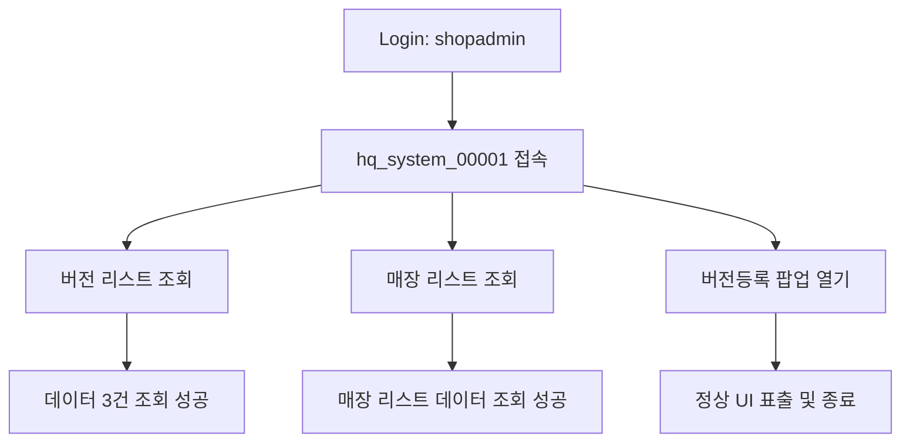

# QA Report: Hq_System_00001 POS 버전 등록/배포
**작성일**: 2026-06-01  
**작성자**: AI QA Agent (Antigravity)  
**대상 화면**: [HQ] 시스템 > POS 버전 등록/배포 (hq_system_00001)  
**테스트 환경**: localhost:8080 (로컬 개발 서버)
**접속ID/PW**: shopadmin / 0000

---

## 1. 분석 개요

### 1.1 분석 대상 파일 목록

| 구분 | 파일 경로 |
|------|-----------|
| Controller | `hyundai-backoffice-webapp/.../controller/hq/system/Hq_System_00001_Controller.java` |
| Service | `hyundai-backoffice-layer-service/.../service/hq/system/Hq_System_00001_Service.java` |
| Mapper (Interface) | `hyundai-backoffice-layer-persistence/.../dao/hq/system/Hq_System_00001_Mapper.java` |
| SQL XML | `hyundai-backoffice-webapp/.../sqlmapper/system/Hq_System_00001_Sql.xml` |

---

## 2. 엔드포인트 분석

### 2.1 Base URL
```
POST /backoffice/data/hq/system/hq_system_00001/{endpoint}
```

### 2.2 엔드포인트 목록

| 엔드포인트 | HTTP | 기능 | ServiceLog |
|-----------|------|------|------------|
| `/searchVersion` | POST | 버전 리스트 조회 | 없음 |
| `/searchMs` | POST | 매장 리스트 조회 | 없음 |
| `/searchVersionUpload` | POST | 버전 업로드 리스트 조회 | 없음 |
| `/unusedVersion` | POST | 버전 미사용 처리 | UPDATE |
| `/deleteVersion` | POST | 버전 삭제 (확정 여부 체크) | DELETE |
| `/saveVersionUpload` | POST | 버전 파일 업로드 (`.zip`) | INSERT |
| `/saveMsList` | POST | 매장 버전 배포 저장 | INSERT/UPDATE |
| `/confirmVersionUpload` | POST | 버전 배포 확정 | UPDATE |
| `/deleteVersionUpload` | POST | 버전 배포 취소/삭제 | DELETE |

---

## 3. 서비스 로직 분석 (코드베이스 변환 검증)

### 3.1 버전 업로드 흐름 (`saveVersionUpload`)

```
[Controller] saveVersionUpload
  └─ [Service]
       ├─ getVersionSeq()                        ← 버전 SEQ 채번
       ├─ commonModuleService.getFileInfo()      ← 파일 정보 채번
       ├─ [while] 확장자 ".zip" 검증
       ├─ commonModuleService.insertFileUpload() ← 파일 메타 저장
       └─ insertVersionUpload()                  ← MVERSNTB 저장
```
**이슈 사항**: 첨부 파일이 없을 경우 `while(iterator.hasNext())` 루프를 통과하여 `commandMap` 셋팅이 누락된 채 `null` 데이터가 INSERT되는 구조적 취약점 존재.

### 3.2 매장 배포 흐름 (`saveMsList` / `confirmVersionUpload`)

```
[Controller] saveMsList (배열 파라미터 수신)
  └─ [Service]
       ├─ checkedVersionList 순회 (데이터 조회)
       └─ checkedPosNoList 순회
            ├─ 배열 인덱스 기반 데이터 추출 (posNo, msNo, chainNo)
            └─ versionDataList 순회
                 ├─ progressFg > 0 : updateMsList (MVERSMTB)
                 └─ else           : insertMsList (MVERSMTB)
```
**이슈 사항**: UI에서 넘어온 `checkedPosNoList`, `checkedMsNoList`, `checkedChainNoList` 배열의 길이가 다를 경우 `ArrayIndexOutOfBoundsException`이 발생할 수 있는 취약한 반복문 구조를 사용하고 있음. 배열 길이 검증(Validation) 로직 추가 필요.

---

## 4. DB 트리거 → 코드베이스 연쇄 분석

본 화면(`hq_system_00001`)에서 조작하는 대상 테이블(`MUSERSTB`, `MVERSNTB`, `MMEMBPTB`, `MMEMBSTB`, `MVERSMTB`, `TCHAINTB`, `MNAMEMTB`)에 대한 `CREATE TRIGGER` 구문을 **운영서버 DDL 스크립트** (`HMSFNB.sql`)에서 전수 조사한 결과, **관련된 트리거가 존재하지 않음**을 확인하였습니다. 

- **DB 트리거 영향도**: 없음 (트리거 없는 단순 마스터성 테이블 조작 화면)
- 레거시 데이터 동기화를 위한 복잡한 연쇄 호출(`Tr_..._Service`) 구현이 불필요한 화면입니다.

---

## 5. 브라우저 화면 테스트 결과

### 5.1 화면 접속 현황

| 항목 | 결과 |
|------|------|
| 서버 접속 URL | `http://localhost:8080` ✅ |
| 로그인 | 성공 (shopadmin / 0000) ✅ |
| 화면 경로 | [HQ] 시스템 > POS 버전 등록/배포 ✅ |
| 화면 로딩 | 정상 (JS 에러 없음) ✅ |

### 5.2 화면 구성 확인

- **버전조회 패널**: 버전명, 구분, 업로드파일 등 조회 필드 및 리스트 표출 확인 ✅
- **배포 대상매장 패널**: 매장명, POS번호, 상태 등 컬럼 구성 확인 ✅
- **기능 버튼**: 조회, 신규등록(버전등록), 저장 등 정상 표출 ✅

### 5.3 테스트 동작 결과

1. **로그인 / 접속**: `shopadmin` 권한으로 로그인 성공. `/backoffice/view/main/hq/system/hq_system_00001` 접속 정상.
2. **버전 리스트 조회**: 우상단 조회 버튼 클릭 시 `250319_기프티카드`, `250121_버전다운로드테스트1` 등 등록된 버전 3건 정상 조회됨.
3. **버전 배포 대상 매장 조회**: 하단 대상 매장 조회 클릭 시 CAFE (NC0007) 매장의 POS 리스트 2건 정상 조회됨.
4. **버전등록 모달**: '버전등록' 버튼 클릭 시 `버전명`, `구분`, `업로드파일` 입력 폼이 있는 모달이 정상적으로 팝업됨. (Javascript 에러 없음)
5. **결과 확인(Mermaid)**:
<div class="mermaid-wrapper" style="position: relative; margin-bottom: 20px;">
  <button onclick="navigator.clipboard.writeText(this.nextElementSibling.innerText); alert('Mermaid 코드가 복사되었습니다.');" style="position: absolute; right: 10px; top: 10px; z-index: 100; background: #2563EB; color: white; border: none; padding: 5px 10px; border-radius: 6px; cursor: pointer; font-size: 11px; font-weight: 600; box-shadow: 0 2px 5px rgba(0,0,0,0.1);">코드 복사</button>

```text
graph TD
    A[Login: shopadmin] --> B[hq_system_00001 접속]
    B --> C[버전 리스트 조회]
    C --> D[데이터 3건 조회 성공]
    B --> E[매장 리스트 조회]
    E --> F[매장 리스트 데이터 조회 성공]
    B --> G[버전등록 팝업 열기]
    G --> H[정상 UI 표출 및 종료]
```


</div>

---

## 6. 발견된 이슈 및 권고사항

### 🔴 Critical (즉시 처리 필요)
1. **배열 인덱스 접근 오류 (ArrayIndexOutOfBoundsException) 위험**  
   - `/saveMsList`, `/confirmVersionUpload`, `/deleteVersionUpload` 서비스 로직에서 클라이언트로부터 전달받은 다중 배열 파라미터(`checkedPosNoList`, `checkedMsNoList` 등)의 길이가 일치하지 않을 때 Exception이 발생합니다.
   - **조치 권고**: for 루프 진입 전 파라미터 배열들의 Length를 검증하는 Validation 로직 추가.

2. **NullPointerException 위험**
   - `/saveMsList`, `/confirmVersionUpload` 서비스에서 `versionData.get("VER_SEQ")` 또는 `seq.get("SEQ")`가 Null일 경우 `.toString()` 호출 시 NPE 발생.
   - **조치 권고**: `String.valueOf()` 활용 및 Null 체크 방어코드 추가.

### 🟡 Warning (마이그레이션 시 처리 필요)
1. **파일 미첨부 예외 처리 미흡**
   - `/saveVersionUpload` 에서 첨부파일이 없으면 `iterator.hasNext()` 루프를 타지 않아 `commandMap` 셋팅이 누락되고, 빈 `null` 데이터가 `MVERSNTB`에 Insert 될 가능성이 큽니다.
   - **조치 권고**: 파일 첨부 여부에 대한 필수 Validation 추가.

### 🟢 Info (참고 사항)
1. 단일건이 아닌 다건 처리(Insert/Update 루프) 시 `result` 반환값이 최종 실행된 1건에 대해서만 담기므로, UI 단에서 성공 여부를 판단할 때 논리적 오류가 발생할 수 있습니다 (누적 성공 카운트 방식으로 변경 고려).
2. `searchMs`, `searchVersionUpload` 조회 시 `MMSLOGTB` 감사 로그가 기록되지 않습니다 (의도된 동작으로 보이나 기획 리뷰 필요).

---

## 7. 종합 판정

| 구분 | 결과 |
|------|------|
| 화면 로딩 및 UI | ✅ PASS |
| 데이터 조회 기능 | ✅ PASS |
| DB 트리거 연동 확인 | ✅ 해당 없음 (트리거 부재) |
| INSERT/UPDATE 예외처리 | ⚠️ FAIL (잠재적 결함 방치됨) |
| 종합 판정 | **⚠️ 보류 (예외 처리 코드 보완 후 재테스트 필요)** |

---
*본 리포트는 사전 분석 문서(`Hq_System_00001_TestCase.md`) 기반 정적 분석 및 브라우저 동적 테스트를 통합하여 작성되었습니다.*
