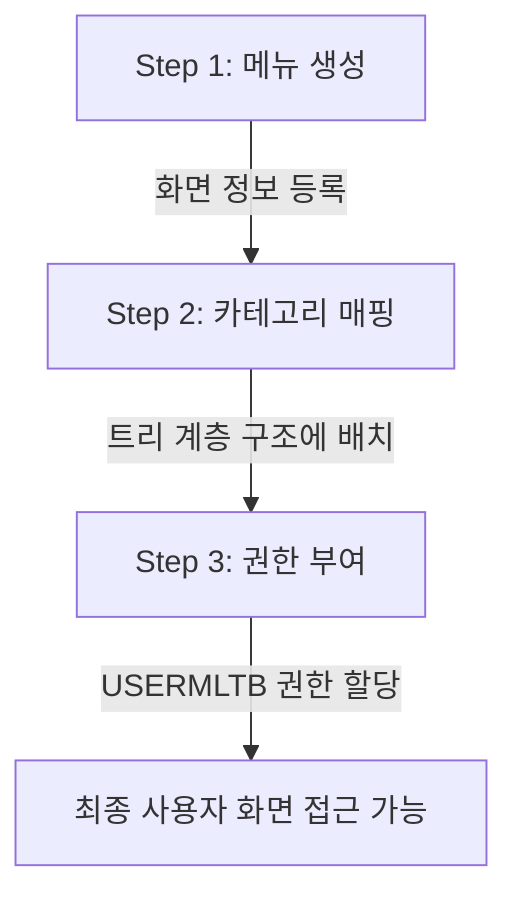

# 메뉴 등록 및 화면 접근 권한 설정 가이드 (Menu Registration & Access Permission Guide)

이 문서는 백오피스 시스템에서 신규 화면(프로그램)을 등록하고, 카테고리 트리에 매핑한 후, 로그인한 사용자에게 화면 접근 권한을 부여하는 전체 흐름과 데이터 입출력 규칙을 정리한 가이드입니다.

---

## 📌 전체 프로세스 요약

메뉴를 새로 추가하여 최종 사용자가 접속할 수 있도록 하려면 다음 **3단계 흐름**을 반드시 거쳐야 합니다.

<div class="mermaid-wrapper" style="position: relative; margin-bottom: 20px;">
  <button onclick="navigator.clipboard.writeText(this.nextElementSibling.innerText); alert('Mermaid 코드가 복사되었습니다.');" style="position: absolute; right: 10px; top: 10px; z-index: 100; background: #2563EB; color: white; border: none; padding: 5px 10px; border-radius: 6px; cursor: pointer; font-size: 11px; font-weight: 600; box-shadow: 0 2px 5px rgba(0,0,0,0.1);">코드 복사</button>

```text
graph TD
    A[Step 1: 메뉴 생성] -->|화면 정보 등록| B[Step 2: 카테고리 매핑]
    B -->|트리 계층 구조에 배치| C[Step 3: 권한 부여]
    C -->|USERMLTB 권한 할당| D[최종 사용자 화면 접근 가능]
```


</div>

---

## 1단계: 메뉴 생성 (화면 프로그램 등록)

신규 개발한 JSP 화면 및 URL 경로를 시스템 마스터 데이터에 등록하는 단계입니다.

* **UI 위치**: **[메뉴관리]** 화면 내 **[메뉴생성]** 탭
* **대상 데이터베이스 테이블**: `hmsfns.MENUMMTB` (메뉴 마스터 테이블)

### 📥 입력 항목 및 규칙
| 입력 항목 | DB 컬럼명 | 입력 값 예시 | 설명 및 제약 사항 |
| :--- | :--- | :--- | :--- |
| **메뉴 명** | `MENU_NM` | 로그인 이력 조회 | 화면 상단 및 탭에 노출될 한국어 메뉴명 |
| **메뉴 경로** | `VIEW_PATH` | `/backoffice/main/contents/admin/system` | 웹 애플리케이션 내 JSP 파일이 위치하는 논리 경로 |
| **파일명** | `VIEW_FILE` | `admin_system_00009` | 확장자(`.jsp`)를 제외한 실제 파일명 |
| **비고** | `REMARK` | 테스트 화면 등록 | 메뉴에 대한 설명글 |

### ⚠️ 중요 규칙 및 DB 특징
* **메뉴 코드 자동 생성**: 저장 시 데이터베이스에서 유일한 번호인 `MENU_SEQ` (예: `000292`)가 자동 시퀀스로 채택되어 생성됩니다.
* **메뉴 레벨 기본값**: 메뉴 생성 단계에서는 트리 상에 배치되지 않은 상태이기 때문에, `MENU_LEVEL` 컬럼은 DB 기본 제약 조건에 의해 **무조건 기본값 `1`**로 저장됩니다. (경로에 슬래시가 많아도 분석하지 않음)
* **파일명/경로 중복 가능**: 화면 파일명(`VIEW_FILE`)과 경로(`VIEW_PATH`)는 중복 등록이 가능합니다. 즉, 하나의 물리적인 JSP 화면을 다른 메뉴 코드(`MENU_SEQ`)로 여러 개 생성하여 각기 다른 카테고리에 중복 노출시킬 수 있습니다.

### 🚫 [주의] 404 Exception 발생 방지 가이드 (물리적 경로 일치 필수)
사용자에게 메뉴가 정상 노출된 후 메뉴 클릭 시 **`404 Page Not Found`** 예외로 리다이렉트되는 현상이 나타난다면, **`VIEW_PATH`와 실제 JSP 파일이 위치한 폴더의 불일치**가 원인입니다.

* **Spring MVC 뷰 매핑 구조**:
  시스템의 뷰 전환 컨트롤러(`WebPageTransition.java`의 `contentsTransition` 메서드)는 다음과 같이 뷰의 물리적 존재 여부를 확인합니다.
  > `existsView(req, "/WEB-INF/views/backoffice/main/contents/" + sSystemDir + "/" + sCategoryDir + "/" + sContentsPage)`
  * `sSystemDir`: `VIEW_PATH` 문자열 중 시스템 구분명 (예: `hq`, `st`, `admin`)
  * `sCategoryDir`: `VIEW_PATH` 문자열 중 카테고리 디렉토리명 (예: `system`, `vendor`, `master`)
  * `sContentsPage`: **`VIEW_FILE`에 입력한 파일명** (이 명칭과 동일한 폴더가 해당 경로 아래에 있어야 합니다.)
  
* **오류 발생 예시**:
  * `VIEW_PATH`에 `/backoffice/main/contents/hq/system` 입력
  * `VIEW_FILE`에 `admin_system_00007` 입력 (서로 시스템 디렉토리가 불일치함)
  * **원인**: 시스템은 `/WEB-INF/views/backoffice/main/contents/hq/system/admin_system_00007` 폴더를 탐색하지만, 실제 `admin_system_00007` 폴더는 `hq`가 아닌 `admin` 하위(`contents/admin/system/admin_system_00007`)에 존재하므로 **404 에러**가 리턴됩니다.
  
* **성공 매핑 예시 (정상 로드)**:
  * **본부(HQ) 웹 메뉴 관리 화면**:
    * `VIEW_PATH`: `/backoffice/main/contents/hq/system`
    * `VIEW_FILE`: `hq_system_00007`
    * **결과**: `/WEB-INF/views/backoffice/main/contents/hq/system/hq_system_00007/` 경로에 실제 파일이 존재하므로 정상적으로 화면이 로드됩니다.
  * **어드민(Admin) 웹 메뉴 관리 화면**:
    * `VIEW_PATH`: `/backoffice/main/contents/admin/system`
    * `VIEW_FILE`: `admin_system_00007`
    * **결과**: `/WEB-INF/views/backoffice/main/contents/admin/system/admin_system_00007/` 경로에 실제 파일이 존재하므로 정상적으로 화면이 로드됩니다.
  
* **해결 대책**:
  물리적인 JSP 폴더가 위치한 디렉토리와 `VIEW_PATH` 설정값을 정확하게 일치시켜야 합니다.


---

## 2단계: 카테고리 매핑 (트리 구조 배치)

생성된 화면 메뉴를 사용자가 볼 수 있는 메뉴 트리(대분류/중분류/소분류)의 특정 위치에 매핑하는 단계입니다.

* **UI 위치**: **[메뉴관리]** 화면 내 **[메뉴관리]** 탭 (트리뷰 및 매핑 모달)
* **대상 데이터베이스 테이블**: `hmsfns.MENUMMTB`, `hmsfns.MENULCTB`, `hmsfns.MENUMCTB`

### 🌳 트리 구조에 따른 메뉴 레벨 (`MENU_LEVEL`) 자동 결정 규칙
[메뉴관리] 탭에서 어떤 트리 노드를 선택하고 메뉴를 추가하느냐에 따라 백엔드 비즈니스 로직에 의해 `MENU_LEVEL` 값이 자동으로 결정되어 업데이트(`UPDATE`)됩니다.

```
대분류 (MENULCTB)
  ├── 1레벨 메뉴 (MENU_LEVEL = 1) : 대분류 바로 하위에 매핑된 화면
  └── 중분류 (MENUMCTB)
        ├── 2레벨 메뉴 (MENU_LEVEL = 2) : 중분류에 바로 매핑된 단일 화면
        └── 소분류 메뉴 (MENU_LEVEL = 3) : 중분류 아래 '하위 메뉴 등록'으로 배치된 화면들
```

1. **레벨 1 (`MENU_LEVEL = 1`)**:
   * **대분류 노드**에 화면 메뉴를 바로 등록(`menuMapping`)하는 경우.
2. **레벨 2 (`MENU_LEVEL = 2`)**:
   * **중분류 노드**에 단일 화면 메뉴를 바로 등록(`menuMapping`)하는 경우. (해당 중분류 노드가 바로 링크 역할을 함)
3. **레벨 3 (`MENU_LEVEL = 3`)**:
   * 중분류 노드에 여러 개의 화면을 배치하기 위해 **[하위 메뉴 등록]**(`menuMappingSeveral`)을 한 경우. (중분류는 폴더 형태가 되고, 배치된 화면들은 소분류 레벨이 됨)

---

## 3단계: 화면 접근 권한 부여 (USER-MENU 매핑)

메뉴 등록과 트리 매핑이 끝나도, **로그인한 유저에게 해당 메뉴에 접근할 수 있는 권한을 주지 않으면 화면이 보이지 않거나 접근 오류가 발생**합나다.

* **UI 위치**: **[사용자 권한 관리]** 또는 **[권한 관리]** 화면
* **대상 데이터베이스 테이블**: `hmsfns.USERMLTB` (사용자별 메뉴 매핑 테이블)

### 🔒 작동 원리
* **사이드바 노출**: 사용자가 로그인할 때 `selectMenuList` 쿼리가 작동하여 `USERMLTB`에 등록된 `MENU_SEQ` 목록만 사이드바에 표시합니다.
* **접근 보안 체크**: 사용자가 특정 화면 주소로 진입할 때 `accessViewChk` 쿼리가 실행되어 해당 사용자의 권한 리스트(`USERMLTB`)에 매핑된 화면 파일명이 있는지 대조하여 차단 여부를 결정합니다.

### 💻 DB 직접 반영 SQL (테스트용)
관리자 화면을 통하지 않고 데이터베이스 툴(DBeaver 등)을 통해 특정 사용자(예: 로그인 아이디 `admin`)에게 방금 생성한 메뉴(`000292`)에 대한 접근 권한을 즉시 부여하려면 아래 SQL을 실행합니다.

```sql
INSERT INTO hmsfns.USERMLTB (
    USER_ID, 
    MENU_SEQ, 
    FAVORITES_YN, 
    EVENT_ROLE, 
    CREATE_DTIME, 
    CREATE_ID, 
    LAST_DTIME, 
    LAST_ID
) VALUES (
    'admin',                                 -- 권한을 줄 사용자 ID 입력
    '000292',                                -- 등록 완료된 신규 MENU_SEQ 입력
    'N',                                     -- 즐겨찾기 여부 (기본 N)
    'Y',                                     -- 이벤트 권한 (기본 Y)
    TO_CHAR(SYSDATE, 'YYYYMMDDHH24MISS'),    -- 생성일시
    'Admin',                                 -- 생성자 ID
    TO_CHAR(SYSDATE, 'YYYYMMDDHH24MISS'),    -- 수정일시
    'Admin'                                  -- 수정자 ID
);
```

---

## 🗑️ 4. 대분류/중분류/메뉴 삭제 시 데이터 처리 흐름

트리 분류를 제거하거나 매핑을 끊을 때, 화면 데이터가 영구 유실되는지 여부는 수행하는 기능에 따라 다릅니다.

### 1) 분류 및 메뉴 매핑 해제 (단순 연결 끊기 - 화면 보존)
* **대상 기능**:
  * 분류관리 탭의 `[하위 분류/메뉴 삭제]`, `[하위 메뉴 삭제]` 버튼
  * 메뉴관리 탭 우측 패널의 `[삭제]` (매핑 해제) 버튼
* **DB 처리**: `DELETE`가 아닌 **`UPDATE`** 쿼리가 수행됩니다.
  * `MENUMMTB` 테이블에서 해당 메뉴의 부모 분류 ID(`MAPP_LCLASS_CD`, `MAPP_MCLASS_CD`)를 **`NULL`로 설정**하고, 레벨을 1로 초기화합니다.
* **결과**: 소분류(화면 프로그램) 자체는 DB에서 **삭제되지 않고 온전히 보존**되며, 연결만 해제됩니다. 매핑이 풀린 화면은 "메뉴생성" 목록에 그대로 유지되므로 다른 분류에 언제든 재매핑할 수 있습니다.

### 2) 분류 삭제 (카테고리 폴더만 삭제 - 화면 보존)
* **대상 기능**:
  * 분류관리 탭 대분류/중분류 목록의 `[삭제]` 버튼
* **DB 처리**:
  * **대분류 삭제 시**: 대분류 레코드(`MENULCTB` 테이블)와 그 하위의 모든 중분류 레코드(`MENUMCTB` 테이블)가 DB에서 **완전히 삭제(`DELETE`)**됩니다.
  * 이때 해당 분류들에 매핑되어 있던 하위 소분류 화면들은 `MENUMMTB`에서 부모 분류 컬럼이 **`NULL`로 자동 업데이트(연결 해제)**되어 안전하게 보관됩니다.

### 3) 메뉴 프로그램 삭제 (영구 삭제 - 주의)
* **대상 기능**:
  * **[메뉴생성]** 탭 상단의 `[삭제]` 버튼
* **DB 처리**: `MENUMMTB` 테이블에서 해당 메뉴 레코드를 날리는 진짜 **`DELETE`** 쿼리가 수행됩니다.
* **결과**: 화면 연결 정보가 **시스템에서 영구히 삭제**되므로 수행 시 주의가 필요합니다.

---

## ⚠️ 5. 입력 필드 길이 제한 및 예외 방지

백오피스 DB 컬럼 스키마의 크기 한계로 인해, 화면에서 너무 긴 텍스트를 입력하면 SQL Exception(오류)이 발생합니다. 각 입력 폼에 적절히 길이 제약(`maxlength`)이 지정되어 있는지 꼭 교차 검증해야 합니다.

### 1) 주요 DB 컬럼별 크기 제한
* **아이콘 (Font Awesome Class)**: `MENULCTB.MENU_ICON` -> **최대 30자** (`maxlength="30"` 제한)
* **대분류명/중분류명**: `MENU_LCLASS_NM` / `MENU_MCLASS_NM` -> **최대 120자** (UI/JS 상에서는 50바이트 검증 및 **`maxlength="40"`** 권장 적용)
* **메뉴 경로 / 파일명**: `MENUMMTB.VIEW_PATH` / `VIEW_FILE` -> **최대 60자** (`maxlength="60"` 제한)
* **비고 (REMARK)**: `REMARK` -> **최대 120자** (JS 100바이트 검증 및 **`maxlength="100"`** 적용)

### 🛠️ 이중 보안 장치 (HTML + JS Validation)
단순히 HTML `maxlength` 속성에만 의존할 경우 브라우저 자동완성(Autofill)이나 강제 값 주입으로 인해 DB 오류가 발생할 수 있습니다. 이를 예방하기 위해 다음과 같이 이중 방어막을 구축하였습니다.
1. **HTML `maxlength` 지정**: JSP 모달 파일(`M01` ~ `M05`) 내 모든 입력란에 DB 스키마 크기(아이콘 30자, 분류명 40자, 비고 100자)에 맞게 `maxlength` 속성을 하드코딩 적용.
2. **JavaScript 길이 검사**: `hq_system_00007.js` 및 `admin_system_00007.js` 스크립트 파일 내 `fnInsertLmenu`, `fnUpdateLmenu`, `fnInsertMmenu`, `fnUpdateMmenu` 함수가 실행(서브밋)될 때 각 데이터의 길이를 Javascript 레벨에서 다시 한 번 필터링하여 에러를 완벽 차단.
