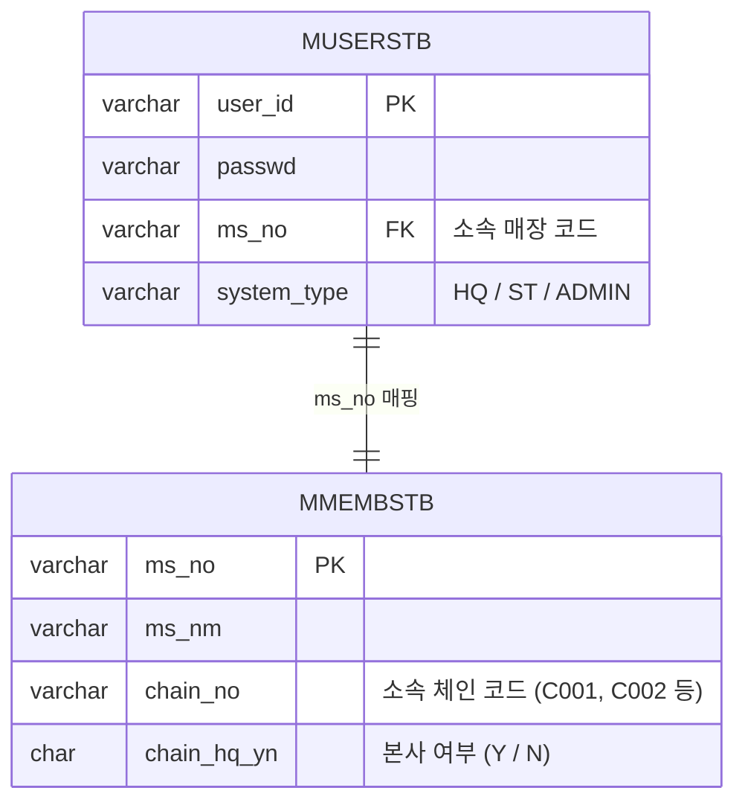

# 매장 마스터(MMEMBSTB)와 사용자 마스터(MUSERSTB) 연동 및 Cardinality 제약 가이드

본 문서에서는 로그인 세션 처리 및 메인 대시보드 로딩 시 빈번하게 발생할 수 있는 데이터 불정합 에러(500 Error, NullPointerException, PSQLException)의 원인과 데이터 정합성 규칙을 설명합니다.

---

## 1. 테이블 간 연동 관계 및 구조

시스템 사용자는 반드시 특정 가맹점(매장) 또는 본사에 소속되어 있어야 합니다. 이 관계는 `MUSERSTB`와 `MMEMBSTB` 테이블 간의 `ms_no` (매장 코드) 연결을 통해 매핑됩니다.



---

## 2. 로그인 세션 및 메인 페이지 전환 흐름

1. 사용자가 로그인하면 Spring Security는 사용자 계정 정보와 메뉴 권한을 로드하기 위해 `UserAuth_Sql.xml`의 `selectUserInfo` 쿼리를 실행합니다.
2. 이 쿼리 내부에서는 로그인한 사용자(`MUSERSTB`)의 `ms_no`를 기반으로 `MMEMBSTB` 테이블을 서브쿼리로 참조하여 체인 번호(`CHAIN_NO`), 체인 본사 매장 번호(`CHAIN_MS_NO`) 등을 추출하여 세션 객체(`CustomUserDetails`)에 저장합니다.
3. 로그인 성공 후 메인 페이지(`/backoffice/view/main`)로 리다이렉트되면, `WebPageTransition.pageTransition()`에서 세션 내 정보를 문자열로 변환해 대시보드 조회 파라미터로 사용합니다.

---

## 3. 대표적인 오류 발생 시나리오 및 해결 방안

### 🚨 시나리오 A: NullPointerException (500 Error)
* **원인**: 
  - 신규 테스트 ID(예: `admin2`, `H1216020`)를 등록하였으나, 해당 계정이 매핑된 매장 코드(`NC0000`, `NC0005`)가 매장 마스터 테이블(`MMEMBSTB`)에 존재하지 않는 경우 발생합니다.
  - 로그인 세션 구성 시 서브쿼리 조인이 실패하여 체인 코드(`chainNo`), 매장 코드(`msNo`) 등이 `null`로 세팅됩니다.
  - 이후 `WebPageTransition.java`에서 `securityUserInformation.getUserInfo("chainNo").toString()`을 호출하는 순간 `NullPointerException`이 발생하여 500 에러 페이지가 노출됩니다.
* **해결책**:
  - 신규 테스트 사용자를 등록할 때는 반드시 소속될 매장(`ms_no`)이 `MMEMBSTB` 테이블에 실제로 존재해야 합니다. 없을 경우, Not-Null 제약조건을 만족하는 더미 매장을 먼저 등록해야 합니다.

### 🚨 시나리오 B: PSQLException (Subquery Cardinality Violation)
* **원인**:
  - `selectUserInfo` 쿼리에는 동일 체인(`chain_no`) 내의 **최상위 본사 매장 코드**를 추출하는 다음 서브쿼리가 포함되어 있습니다.
    ```sql
    (SELECT X.MS_NO 
       FROM hmsfns.MMEMBSTB X 
      WHERE X.CHAIN_HQ_YN = 'Y' 
        AND X.CHAIN_NO = (SELECT CHAIN_NO FROM hmsfns.MMEMBSTB WHERE MS_NO = A.MS_NO)) AS CHAIN_MS_NO
    ```
  - 만약 동일 체인(`C001`) 내에 본사 여부 플래그(`CHAIN_HQ_YN`)가 `'Y'`인 매장이 2개 이상(예: 기존 `NC0002` 외에 신규 `NC0000`을 추가할 때 본사 플래그를 'Y'로 세팅한 경우) 존재하게 되면, 해당 서브쿼리가 **다중 행(Multiple Rows)을 반환**하게 됩니다.
  - 이로 인해 데이터베이스는 `more than one row returned by a subquery used as an expression` 예외를 발생시키고 로그인이 차단됩니다.
* **해결책**:
  - 하나의 브랜드 체인(`CHAIN_NO`) 당 본사 플래그(`CHAIN_HQ_YN = 'Y'`)는 **반드시 단 1개의 매장에만 지정**되어야 합니다.
  - 테스트 매장을 신규로 삽입할 때는 본사 플래그를 반드시 `'N'` (가맹점)으로 세팅해야 합니다.
