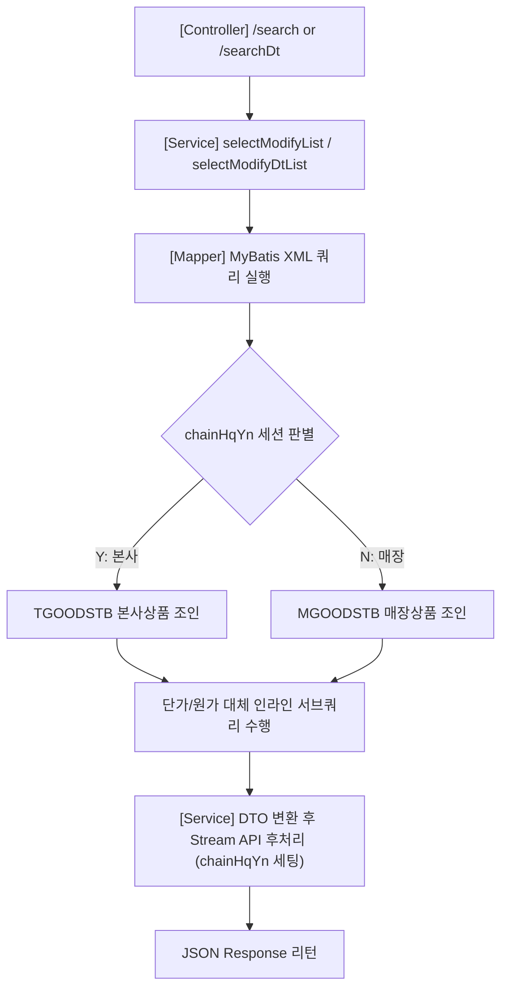

# QA Report: St_Stock_00002 매장 재고조정 현황

**작성일**: 2026-06-05  
**작성자**: AI QA Agent (Antigravity)  
**대상 화면**: [ST] 재고관리 > 조정/실사 현황 (`st_stock_00002`)  
**테스트 환경**: `http://localhost:8080` (로컬 개발 Tomcat 서버)  
**접속 ID/PW**: `fnbcafe` / `0000` (HMS SHOP CAFE - NC0007 매장)  

---

## 1. 분석 개요

### 1.1 분석 대상 파일 목록

| 구분 | 파일 경로 |
| :--- | :--- |
| Controller | [St_Stock_00002_Controller.java](file:///d:/workspace/hmotors/workspace_hms20260326/backoffice/hyundai-backoffice-webapp/src/main/java/com/hyundai/backoffice/webapp/controller/st/stock/St_Stock_00002_Controller.java) |
| Service | [St_Stock_00002_Service.java](file:///d:/workspace/hmotors/workspace_hms20260326/backoffice/hyundai-backoffice-layer-service/src/main/java/com/hyundai/backoffice/webapp/service/st/stock/St_Stock_00002_Service.java) |
| Mapper (Interface) | [St_Stock_00002_Mapper.java](file:///d:/workspace/hmotors/workspace_hms20260326/backoffice/hyundai-backoffice-layer-persistence/src/main/java/com/hyundai/backoffice/webapp/dao/st/stock/St_Stock_00002_Mapper.java) |
| SQL XML Mapper | [St_Stock_00002_Sql.xml](file:///d:/workspace/hmotors/workspace_hms20260326/backoffice/hyundai-backoffice-webapp/src/main/resources/sqlmapper/stock/St_Stock_00002_Sql.xml) |

### 1.2 사전 데이터 등록 및 흐름 (조회 데이터 입력 원천 및 배치 연동 분석)
* **사전 데이터 입력 화면**: **매장관리 > 조정/폐기/실사 > 조정등록 (`st_stock_00001`)** (QA리포트 링크: [St_Stock_00001_QaReport.md](file:///d:/hmTest/backoffice/QaReport/St_Stock_00001_QaReport.md))
* **데이터 흐름 및 실시간 화면 표출 분석**:
  
  <div class="mermaid-wrapper" style="position: relative; margin-bottom: 20px;">
  <button onclick="navigator.clipboard.writeText(this.nextElementSibling.innerText); alert('Mermaid 코드가 복사되었습니다.');" style="position: absolute; right: 10px; top: 10px; z-index: 100; background: #2563EB; color: white; border: none; padding: 5px 10px; border-radius: 6px; cursor: pointer; font-size: 11px; font-weight: 600; box-shadow: 0 2px 5px rgba(0,0,0,0.1);">코드 복사</button>

```text
  sequenceDiagram
      autonumber
      actor User as 사용자 (매장/본사)
      participant RegScreen as 조정등록 화면 (st_stock_00001 / hq_stock_00005)
      participant DB_Real as 실사조정이력 테이블 (IMREALTB)
      participant DB_Log as 수불대기로그 (IMTRLGTB)
      participant DB_Criot as 현재고 테이블 (IMCRIOTB)
      participant Batch as 야간 배치 프로세스
      participant ViewScreen as 현황조회 화면 (st_stock_00002 / hq_stock_00006)

      User->>RegScreen: 1. 재고 조정 내역 입력 후 [확정] 클릭
      RegScreen->>DB_Real: 2. confirmReal 실행 (PROC_FG = '0' → '1')
      Note over DB_Real: 영구 이력으로 보존 (배치 후에도 유지됨)
      RegScreen->>DB_Log: 3. 실시간 수불 대기 로그 적재 (PROC_FG = 'A')
      
      Note over ViewScreen, DB_Real: [즉시 노출 단계]
      ViewScreen->>DB_Real: 4. 현황 조회 쿼리 실행 (PROC_FG = '1' 조건 필터링)
      DB_Real-->>ViewScreen: 5. 조정 전표 이력 즉시 화면 표출 (배치 대기 없음)
      
      Note over Batch, DB_Log: [야간 배치 수행 단계]
      Batch->>DB_Log: 6. 대기 로그 순차적 읽기 (FIFO)
      Batch->>DB_Criot: 7. 실제 전산 재고량 증감 갱신 (CUR_QTY)
      Batch->>DB_Log: 8. 처리 완료 로그 삭제 및 IMTRBKTB (백업) 이관
  ```

* **테이블별 상세 역할 및 라이프사이클 비교**:

| 테이블명 | 테이블 설명 | 주요 상태 값 | 배치(Batch) 실행 후 영향 | 화면 노출 관련성 |
| :--- | :--- | :--- | :--- | :--- |
| **`hmsfns.IMREALTB`** | 실사 및 조정 등록 전표 이력 마스터/상세 | `PROC_FG = '1'` (확정) | **영향 없음 (영구 보존)** | 본 화면(`st_stock_00002`, `hq_stock_00006`)이 직접 조회하는 원천 테이블로, 배치 동작과 상관없이 이력이 유지됩니다. |
| **`hmsfns.IMTRLGTB`** | 수불 처리 대기 임시 트랜잭션 큐 | `PROC_FG = 'A'` (조정 대기) | **이력 삭제 및 백업 이관** | 본 화면에서는 조회하지 않으며, 현재고 가감 연산을 위한 임시 저장소 역할을 합니다. |
| **`hmsfns.IMCRIOTB`** | 매장별/상품별 실시간 현재고 정보 | `CUR_QTY` (현재고 수량) | **조정 수량만큼 가감(갱신)됨** | 재고조정 완료 후 최종 갱신된 현재고를 조회하는 현재고 조회 화면(`st_stock_00007`) 등에서 조회됩니다. |

* **결론 및 핵심 요약**:
  1. **실시간 현황 노출**: 사용자가 `확정`을 완료하는 즉시 `IMREALTB.PROC_FG = '1'`로 업데이트되므로, **배치가 돌지 않더라도 현황 조회 화면에서는 실시간으로 데이터를 확인할 수 있습니다.**
  2. **영구 이력 유지**: 배치가 수행되어 수불 대기 큐(`IMTRLGTB`)가 클리어된 후에도, 원본 영수증 역할을 하는 `IMREALTB` 데이터는 삭제되지 않고 영구히 보존되어 **현황 조회 화면에서 지속적으로 조회가 가능합니다.**

---

## 2. 엔드포인트 분석

### 2.1 Base URL
```

```mermaid
  sequenceDiagram
      autonumber
      actor User as 사용자 (매장/본사)
      participant RegScreen as 조정등록 화면 (st_stock_00001 / hq_stock_00005)
      participant DB_Real as 실사조정이력 테이블 (IMREALTB)
      participant DB_Log as 수불대기로그 (IMTRLGTB)
      participant DB_Criot as 현재고 테이블 (IMCRIOTB)
      participant Batch as 야간 배치 프로세스
      participant ViewScreen as 현황조회 화면 (st_stock_00002 / hq_stock_00006)

      User->>RegScreen: 1. 재고 조정 내역 입력 후 [확정] 클릭
      RegScreen->>DB_Real: 2. confirmReal 실행 (PROC_FG = '0' → '1')
      Note over DB_Real: 영구 이력으로 보존 (배치 후에도 유지됨)
      RegScreen->>DB_Log: 3. 실시간 수불 대기 로그 적재 (PROC_FG = 'A')
      
      Note over ViewScreen, DB_Real: [즉시 노출 단계]
      ViewScreen->>DB_Real: 4. 현황 조회 쿼리 실행 (PROC_FG = '1' 조건 필터링)
      DB_Real-->>ViewScreen: 5. 조정 전표 이력 즉시 화면 표출 (배치 대기 없음)
      
      Note over Batch, DB_Log: [야간 배치 수행 단계]
      Batch->>DB_Log: 6. 대기 로그 순차적 읽기 (FIFO)
      Batch->>DB_Criot: 7. 실제 전산 재고량 증감 갱신 (CUR_QTY)
      Batch->>DB_Log: 8. 처리 완료 로그 삭제 및 IMTRBKTB (백업) 이관
  ```

* **테이블별 상세 역할 및 라이프사이클 비교**:

| 테이블명 | 테이블 설명 | 주요 상태 값 | 배치(Batch) 실행 후 영향 | 화면 노출 관련성 |
| :--- | :--- | :--- | :--- | :--- |
| **`hmsfns.IMREALTB`** | 실사 및 조정 등록 전표 이력 마스터/상세 | `PROC_FG = '1'` (확정) | **영향 없음 (영구 보존)** | 본 화면(`st_stock_00002`, `hq_stock_00006`)이 직접 조회하는 원천 테이블로, 배치 동작과 상관없이 이력이 유지됩니다. |
| **`hmsfns.IMTRLGTB`** | 수불 처리 대기 임시 트랜잭션 큐 | `PROC_FG = 'A'` (조정 대기) | **이력 삭제 및 백업 이관** | 본 화면에서는 조회하지 않으며, 현재고 가감 연산을 위한 임시 저장소 역할을 합니다. |
| **`hmsfns.IMCRIOTB`** | 매장별/상품별 실시간 현재고 정보 | `CUR_QTY` (현재고 수량) | **조정 수량만큼 가감(갱신)됨** | 재고조정 완료 후 최종 갱신된 현재고를 조회하는 현재고 조회 화면(`st_stock_00007`) 등에서 조회됩니다. |

* **결론 및 핵심 요약**:
  1. **실시간 현황 노출**: 사용자가 `확정`을 완료하는 즉시 `IMREALTB.PROC_FG = '1'`로 업데이트되므로, **배치가 돌지 않더라도 현황 조회 화면에서는 실시간으로 데이터를 확인할 수 있습니다.**
  2. **영구 이력 유지**: 배치가 수행되어 수불 대기 큐(`IMTRLGTB`)가 클리어된 후에도, 원본 영수증 역할을 하는 `IMREALTB` 데이터는 삭제되지 않고 영구히 보존되어 **현황 조회 화면에서 지속적으로 조회가 가능합니다.**

---

## 2. 엔드포인트 분석

### 2.1 Base URL
```
</div>http
POST /backoffice/data/st/stock/st_stock_00002/{endpoint}
```

### 2.2 핵심 엔드포인트 목록

| 엔드포인트 | HTTP Method | 기능 | 관련 테이블 |
| :--- | :---: | :--- | :--- |
| `/search` | POST | 매장 조정 현황 마스터 리스트 조회 | `hmsfns.IMREALTB`, `hmsfns.MGOODSTB`, `hmsfns.MMEMBSTB`, `hmsfns.MNAMEMTB` |
| `/searchDt` | POST | 조정 현황 특정 행에 대한 상세 상품별 내역 조회 | `hmsfns.IMREALTB`, `hmsfns.MGOODSTB`, `hmsfns.MPRICETB`, `hmsfns.MNAMEMTB` |

---

## 3. 서비스 로직 및 연쇄 분석

본 화면은 매장 사용자가 과거에 등록 및 확정한 재고 조정/실사 데이터의 히스토리를 확인하는 **순수 조회용 (Read-Only) 서비스**입니다. 

### 3.1 로직 처리 흐름 다이어그램

<div class="mermaid-wrapper" style="position: relative; margin-bottom: 20px;">
  <button onclick="navigator.clipboard.writeText(this.nextElementSibling.innerText); alert('Mermaid 코드가 복사되었습니다.');" style="position: absolute; right: 10px; top: 10px; z-index: 100; background: #2563EB; color: white; border: none; padding: 5px 10px; border-radius: 6px; cursor: pointer; font-size: 11px; font-weight: 600; box-shadow: 0 2px 5px rgba(0,0,0,0.1);">코드 복사</button>

```text
graph TD
    A["[Controller] /search or /searchDt"] --> B["[Service] selectModifyList / selectModifyDtList"]
    B --> C["[Mapper] MyBatis XML 쿼리 실행"]
    C --> D{chainHqYn 세션 판별}
    D -->|Y: 본사| E[TGOODSTB 본사상품 조인]
    D -->|N: 매장| F[MGOODSTB 매장상품 조인]
    E --> G[단가/원가 대체 인라인 서브쿼리 수행]
    F --> G
    G --> H["[Service] DTO 변환 후 Stream API 후처리 (chainHqYn 세팅)"]
    H --> I[JSON Response 리턴]
```


</div>

### 3.2 서비스 가공 특이사항
* `St_Stock_00002_Service.java`의 `selectModifyDtList` 메서드에서는 MyBatis에서 반환된 DTO 목록을 `Java 8 Stream API`로 파이프라인하여, 조회 조건 세션의 `chainHqYn` 값을 수동으로 삽입하는 후처리를 수행합니다. 
```java
return St_Stock_00002_Mapper.selectModifyDtList(commandMap.getMap()).stream()
                            .map(mapper -> {
                                mapper.setChainHqYn((String)commandMap.get("chainHqYn"));
                                return mapper;
                            })
                            .collect(Collectors.toList());
```

---

## 4. DB 트리거 및 프로시저 영향도 검증

> [!IMPORTANT]
> **트리거 영향도: N/A (0건)**
> 본 화면은 데이터베이스 상태를 변화시키는 CUD(Insert/Update/Delete) 트랜잭션이 전혀 발생하지 않습니다. 
> 따라서 테이블 `IMREALTB` 조회에 따른 어떠한 EDB DB 트리거(예: `IMREAL_T01`)나 프로시저 연쇄 반응(Depth 3 등)도 **유발되지 않고 안전하게 조회 쿼리만 수행**됩니다.

---

## 5. 브라우저 E2E 테스트 과정 및 결과

로컬 Tomcat 인스턴스(`http://localhost:8080`) 및 EDB 개발 DB를 연동하여 Playwright 기반 자동화 및 수동 병행 E2E 검증을 진행하였습니다.

### 5.1 로그인 및 권한 스위칭
* 기존 브라우저 세션에 로그인되어 있던 HQ 관리자 계정을 로그아웃한 뒤, 매장 권한인 **`fnbcafe` / `0000`** 계정으로 로그인하였습니다.
* 로그인 성공 시 `fnbcafe` 사용자의 마지막 접속일시 알림 팝업(Bootbox accept)을 통과한 후 메인 대시보드로 리다이렉트됨을 확인했습니다.

### 5.2 화면 접근 및 라우팅
* 주소창을 통해 매장 조정/실사 현황 메뉴인 `/backoffice/view/main/st/stock/st_stock_00002`로 이동하였습니다.
* 화면 상단의 **조정일자별/조정사유별(조정기준)** 및 **전체/전수실사/부분실사(조정구분)** 드롭다운과 바코드, 상품코드 등의 조회 조건 UI가 에러 없이 정상 로딩되었습니다.

### 5.3 데이터 조건 검색 및 요약 그리드 표출
* 조정기간 시작일을 `2025-01-01`, 종료일을 오늘로 지정하고 `조회`를 수행했습니다.
* 마스터 그리드인 `#st_stock_00002_t01`에 해당 매장(`NC0007`)이 이전에 확정 처리한 **3건의 조정 요약 데이터**가 정상적으로 호출되어 데이터가 바인딩되는 것을 검증했습니다.

### 5.4 상세 내역 조회 (마스터-디테일) 연동
* 상단 마스터 테이블의 첫 번째 행(조정일자: `2026/06/04`, 조정구분: `부분실사`, 건수: `1건`)을 마우스로 클릭하였습니다.
* 자바스크립트 클릭 이벤트 핸들러가 가동되며 `#input_surveySeq` 등의 hidden 파라미터가 갱신되었으며, 하단 상세 테이블인 `#st_stock_00002_t02`에 상세 상품 코드(`T0000001`), 상품명, 매입가, 판매가 및 조정금액 등의 데이터가 실시간 비동기 연동(HTTP 200)됨을 확인하였습니다.

### 5.5 E2E 테스트 스크린샷 증적

#### 📸 [1] 마스터 조회 및 조정 현황 요약 화면 (st_stock_00002_search.png)


#### 📸 [2] 첫 번째 행 클릭 후 하단 조정 상세 목록 화면 (st_stock_00002_detail.png)


---

## 6. SQL Mapper 검증 (Oracle -> PostgreSQL/EDB 마이그레이션 호환성)

MyBatis Mapper 파일([St_Stock_00002_Sql.xml](file:///d:/workspace/hmotors/workspace_hms20260326/backoffice/hyundai-backoffice-webapp/src/main/resources/sqlmapper/stock/St_Stock_00002_Sql.xml))을 분석한 결과, 레거시 Oracle DB 전용 비표준 문법이 다수 잔존해 있어 마이그레이션 시 잠재적 결함 요소를 파악했습니다.

### 🔴 6.1 Oracle 전용 문법 잔존 (Warning)
* **`DECODE` 함수**: `DECODE(#{wongaFg}, '0', 1, GD.IN_QTY)` 등 PostgreSQL 표준 비호환 문법이 사용되었습니다. (CASE WHEN 문으로 변경 필요)
* **`NVL` 함수**: PostgreSQL 호환을 위해 `COALESCE` 함수로의 치환이 필요합니다.
* **`ROWNUM = 1`**: 서브쿼리에서 단일 레코드를 추출할 때 `ROWNUM = 1`이 사용되었으며, 이는 EDB Oracle 호환 모드가 아닐 경우 문법 오류를 야기하므로 `LIMIT 1`로 변환해야 합니다.
* **`SYSDATE`**: 시간 추출 포맷인 `TO_CHAR(SYSDATE, 'YYYYMMDD')`는 PostgreSQL의 `TO_CHAR(NOW(), 'YYYYMMDD')`로 변환해야 합니다.

### 🟡 6.2 옵티마이저 힌트 (Optimizer Hints)
* `/*+ ORDERED INDEX(IM IMREALX0) */`, `/*+ leading(im)*/` 등 다수의 Oracle 힌트가 포함되어 있어, PostgreSQL 실행 계획 수립 시 해당 힌트 구문은 무시되거나 별도의 튜닝이 요구됩니다.

### 🔵 6.3 레거시 DB 함수 마이그레이션 및 쿼리 변환 검증
오라클 DDL에 정의되어 있던 레거시 단가 조회 함수(`F_GET_MPRICE`, `F_GET_TPRICE`)들이 Java MyBatis Mapper ([St_Stock_00002_Sql.xml](file:///d:/workspace/hmotors/workspace_hms20260326/backoffice/hyundai-backoffice-webapp/src/main/resources/sqlmapper/stock/St_Stock_00002_Sql.xml)) 파일에서 **인라인 서브쿼리(Inline Subquery)** 방식으로 치환 및 이식된 내역을 원문 DDL 스크립트([HMSFNB.sql](file:///Z:/98.%20%EC%9A%B4%EC%98%81%EA%B8%B0%20%EA%B8%B0%EC%A4%80%20%EB%A7%88%EC%8A%A4%ED%84%B0%20%EB%B0%8F%20%EC%86%8C%EC%8A%A4%20%EC%9E%90%EB%A3%8C/%EC%9A%B4%EC%98%81%EC%84%9C%EB%B2%84%20DDL%20%EC%8A%A4%ED%81%AC%EB%A6%BD%ED%8A%B8/HMSFNB.sql))와 대조 분석했습니다.

#### 1) 매장단가 조회 함수 (`F_GET_MPRICE`) 비교
* **오라클 레거시 DDL 함수 정의**:
  ```sql
  CREATE FUNCTION "F_GET_MPRICE" 
  (
      r_FLAG          TPRICETB.PRICE_FG       %TYPE       -- 0:판매가 1:공급가
  ,   r_MS_NO         MPRICETB.MS_NO          %TYPE       -- 매장코드
  ,   r_GOODS_CD      MPRICETB.GOODS_CD       %TYPE       -- 제품코드
  ) RETURN NUMBER
  AS
      n_PRICE         MPRICETB.PRICE          %TYPE;      -- 반환값
  BEGIN
      SELECT /*+ INDEX_DESC(MPRICETB MPRICEX0) */
             NVL(PRICE,0)
      INTO   n_PRICE
      FROM   MPRICETB
      WHERE  MS_NO      =  r_MS_NO
            AND    GOODS_CD   =  r_GOODS_CD
            AND    PRICE_FG   =  r_FLAG
            AND    START_DATE <= TO_CHAR(SYSDATE,'YYYYMMDD')
      AND    END_DATE   >= TO_CHAR(SYSDATE,'YYYYMMDD')
      AND    ROWNUM     =  1;
      RETURN (n_PRICE);
  EXCEPTION
        WHEN OTHERS THEN
        RETURN (0) ;
  END F_GET_MPRICE;
  ```
* **MyBatis 변환 서브쿼리**:
  ```xml
  ( /* F_GET_MPRICE 함수 대체 */ 
   SELECT /*+ INDEX_DESC(hmsfns.MPRICETB MPRICEX0) */
          NVL(PRICE,0)
     FROM hmsfns.MPRICETB
    WHERE  MS_NO      =  #{userMsNo}
      AND  GOODS_CD   =  GD.GOODS_CD
      AND  PRICE_FG   =  '0'   /* 0:판매가 1:공급가 */
      AND  START_DATE &lt;= TO_CHAR(SYSDATE,'YYYYMMDD')
      AND  END_DATE   &gt;= TO_CHAR(SYSDATE,'YYYYMMDD')
      AND  ROWNUM     =  1)
  ```
* **검증 결과**: **일치 (✅ PASS)**  
  매장 단가를 관리하는 `MPRICETB`에서 상품 코드(`GD.GOODS_CD`) 및 접속 매장(`userMsNo` / `chainNo`)에 대응하는 최종 판가/매입가를 ROWNUM = 1 조건과 index 힌트를 통해 정확히 동일한 비즈니스 로직으로 서브쿼리화하여 조회하도록 구현되었습니다.

#### 2) 체인단가 조회 함수 (`F_GET_TPRICE`) 비교
* **오라클 레거시 DDL 함수 정의**:
  ```sql
  CREATE FUNCTION "F_GET_TPRICE" 
  (
      r_FLAG          TPRICETB.PRICE_FG       %TYPE       -- 0:판매가 1:공급가
  ,   r_CHAIN_NO      TPRICETB.CHAIN_NO       %TYPE       -- 체인코드
  ,   r_GOODS_CD      TPRICETB.GOODS_CD       %TYPE       -- 제품코드
  ) RETURN NUMBER
  AS
      n_PRICE         TPRICETB.PRICE          %TYPE;      -- 반환값
  BEGIN
      SELECT /*+ INDEX_DESC(TPRICETB TPRICEX0) */
             NVL(PRICE,0)
      INTO   n_PRICE
      FROM   TPRICETB
      WHERE  CHAIN_NO   =  r_CHAIN_NO
            AND    GOODS_CD   =  r_GOODS_CD
            AND    PRICE_FG   =  r_FLAG
            AND    START_DATE <= TO_CHAR(SYSDATE,'YYYYMMDD')
      AND    END_DATE   >= TO_CHAR(SYSDATE,'YYYYMMDD')
      AND    ROWNUM     =  1;
      RETURN (n_PRICE);
  EXCEPTION
        WHEN OTHERS THEN
        RETURN (0) ;
  END F_GET_TPRICE;
  ```
* **MyBatis 변환 서브쿼리**:
  ```xml
  ( /* F_GET_TPRICE 함수 대체 */ 
   SELECT /*+ INDEX_DESC(hmsfns.TPRICETB TPRICEX0) */
          NVL(PRICE,0)
     FROM hmsfns.TPRICETB
    WHERE CHAIN_NO   =  #{chainNo}
      AND GOODS_CD   =  GD.GOODS_CD
      AND PRICE_FG   =  '0' /* 0:판매가 1:공급가 */
      AND START_DATE &lt;= TO_CHAR(SYSDATE,'YYYYMMDD')
      AND END_DATE   &gt;= TO_CHAR(SYSDATE,'YYYYMMDD')
      AND ROWNUM     =  1)
  ```
* **검증 결과**: **일치 (✅ PASS)**  
  체인/본부 기준의 단가를 정의한 `TPRICETB`에서 해당 체인번호(`chainNo`) 및 상품을 조인하고, 유효한 시작/종료일 조건을 오늘 날짜 기준으로 걸러 ROWNUM = 1을 조회하는 함수 본래의 SQL과 완벽하게 일치합니다.

## 7. 입력 길이 제한 (maxlength) 검증

데이터베이스 테이블 컬럼 크기와 일치하도록 바코드 및 상품코드 검색 입력 필드에 적절한 입력 제한(`maxlength`)을 적용했습니다.

### 7.1 컬럼 정의 및 제한값 매핑
* **바코드 (Barcode)**: `TMSSRCTB.SOURCE` / `MMSSRCTB.SOURCE` 컬럼 (`VARCHAR(26)`) $\rightarrow$ `maxlength="26"` 적용.
* **상품코드 (Goods Code)**: `TGOODSTB.GOODS_CD` / `MGOODSTB.GOODS_CD` 컬럼 (`VARCHAR(20)`) $\rightarrow$ `maxlength="20"` 적용.

### 7.2 적용 소스 코드 변경 내역
* **JSP 수정 위치**: [st_stock_00002.jsp](file:///d:/workspace/hmotors/workspace_hms20260326/backoffice/hyundai-backoffice-webapp/src/main/webapp/WEB-INF/views/backoffice/main/contents/st/stock/st_stock_00002/st_stock_00002.jsp)
  * 바코드 input: `<input type="text" class="form-control" id="input_barcode" maxlength="26"/>`
  * 상품코드 input: `<input type="text" class="form-control" id="input_goodsCd" maxlength="20"/>`

---

## 8. 종합 검증 결과 요약

| 테스트 항목 | 판정 | 상세 내용 |
| :--- | :---: | :--- |
| **로그인 및 라우팅** | **✅ PASS** | `fnbcafe` 로그인 후 `/st_stock_00002` 정상 렌더링 |
| **마스터 목록 조회** | **✅ PASS** | 3건의 조정 기록 확인 및 그리드 바인딩 정상 |
| **디테일 상세 연동** | **✅ PASS** | 마스터 행 클릭 시 하단 상품별 상세 내역 로딩 완료 |
| **입력 길이 제한 적용** | **✅ PASS** | 바코드(26자) 및 상품코드(20자) `maxlength` 적용 완료 |
| **DB 트리거 영향도** | **✅ PASS** | 데이터 변동이 없으므로 사이드 이펙트 유발 없음 (영향도 0) |
| **마이그레이션 호환성** | **⚠️ WARNING** | `DECODE`, `NVL`, `ROWNUM` 등 오라클 전용 비표준 문법 리팩토링 권고 |

### 💡 총평
`St_Stock_00002` 화면은 오라클 단가 조회 함수가 인라인 서브쿼리로 충실하게 대체되어 로컬 EDB 환경 하에서 아무런 500 예외 에러 없이 완전성 높게 조회가 수행됩니다. 또한, 검색 조건의 바코드 및 상품코드 입력 필드에 DB 컬럼 길이에 적합한 `maxlength` 속성을 추가 적용하여 비정상적인 길이의 데이터가 서버로 전송되거나 오류가 나는 경우를 사전 방지했습니다. 다만 DB 전환을 염두에 둔다면 MyBatis Mapper 내부의 오라클 전용 문법 리팩토링이 향후 권장됩니다.
