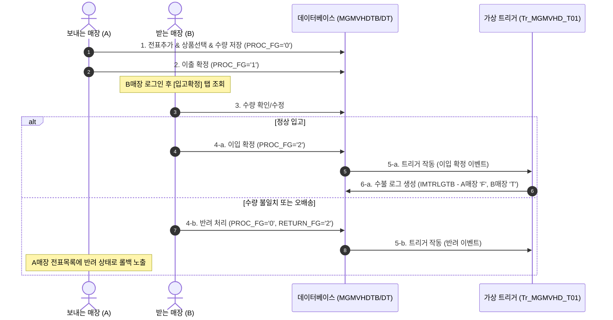

# 매장 점간이동 등록/확정 (`st_stock_00010`) 데이터 처리 및 화면 가이드

본 문서는 매장 간 상품을 이동하는 **점간이동 등록/확정 (`st_stock_00010`)** 화면의 UI 사용법, 백엔드 데이터 흐름(Data Flow), 자바 가상 트리거의 구동 메커니즘, 관련 데이터베이스 테이블 명세, 야간 배치의 반영 라이프사이클 및 로컬 테스트를 위한 시뮬레이션 SQL 가이드를 상세히 기술합니다.

---

## 1. 매장 점간이동 (`st_stock_00010`) UI 및 프로세스 가이드

점간이동은 동일한 체인(`CHAIN_NO`)에 속해 있는 두 매장 간의 재고 이동을 처리합니다.
- **보내는 매장 (이출 매장)**: 상품을 다른 매장으로 발송하는 등록 및 이출 확정 단계를 담당합니다. (예: `NC0007` - F&B 매니저 계정 `fnbcafe` / `0000`)
- **받는 매장 (이입 매장)**: 도착한 상품 수량을 검수하고 이입 확정 또는 반려 단계를 담당합니다. (예: `NC0003` - 브랜드숍 계정 `shopbrand` / `0000`)

### 📌 데이터 등록, 확정 및 반려 전체 프로세스

<div class="mermaid-wrapper" style="position: relative; margin-bottom: 20px;">
  <button onclick="navigator.clipboard.writeText(this.nextElementSibling.innerText); alert('Mermaid 코드가 복사되었습니다.');" style="position: absolute; right: 10px; top: 10px; z-index: 100; background: #2563EB; color: white; border: none; padding: 5px 10px; border-radius: 6px; cursor: pointer; font-size: 11px; font-weight: 600; box-shadow: 0 2px 5px rgba(0,0,0,0.1);">코드 복사</button>

```text
sequenceDiagram
    autonumber
    actor A_Store as 보내는 매장 (A)
    actor B_Store as 받는 매장 (B)
    participant DB as 데이터베이스 (MGMVHDTB/DT)
    participant TR as 가상 트리거 (Tr_MGMVHD_T01)

    A_Store->>DB: 1. 전표추가 & 상품선택 & 수량 저장 (PROC_FG='0')
    A_Store->>DB: 2. 이출 확정 (PROC_FG='1')
    Note over B_Store: B매장 로그인 후 [입고확정] 탭 조회
    B_Store->>DB: 3. 수량 확인/수정
    alt 정상 입고
        B_Store->>DB: 4-a. 이입 확정 (PROC_FG='2')
        DB->>TR: 5-a. 트리거 작동 (이입 확정 이벤트)
        TR->>DB: 6-a. 수불 로그 생성 (IMTRLGTB - A매장 'F', B매장 'T')
    else 수량 불일치 또는 오배송
        B_Store->>DB: 4-b. 반려 처리 (PROC_FG='0', RETURN_FG='2')
        DB->>TR: 5-b. 트리거 작동 (반려 이벤트)
        Note over A_Store: A매장 전표목록에 반려 상태로 롤백 노출
    end
```


</div>

#### ① [전표등록] 탭: 보내는 매장 (이출) 프로세스
1. **로그인 및 화면 이동**
   - 보내는 매장(A) 계정(예: `shopbrand` / `0000`)으로 로그인 후 **재고관리 > 점간이동 > 점간이동 등록/확정 (`st_stock_00010`)**으로 이동합니다.
2. **신규 점간이동 전표 생성 (모달 팝업)**
   - **[전표추가]** 버튼을 클릭하여 `점간이동 등록` 모달 팝업(`st_stock_00010_M01.jsp`)을 엽니다.
   - **받는 매장**을 선택하고, 추가할 상품을 검색/선택하여 메인 그리드에 추가합니다.
     > [!NOTE]
     > 팝업에서 상품명 선택 시 무한 로딩바가 돌던 문제는 Ajax 통신 성공/실패 시 모두 로더를 끄도록 `removePageLoader()` 처리가 보강되었으며, 존재하지 않는 상품 데이터인 경우 JS 예외를 방지하도록 안전 예외 처리가 완료되었습니다.
   - 보내는 **'이동 수량(낱개/박스)'**을 입력합니다. (그리드 변경 시 원가와 이출 금액이 자동으로 계산됩니다.)
3. **전표 저장 (임시 저장)**
   - 팝업 하단의 **[저장]** 버튼을 클릭하면 전표 데이터가 생성되며, 헤더(`MGMVHDTB`) 및 디테일(`MGMVDTTB`) 테이블에 상태값 **`PROC_FG = '0'` (등록)**, **`RETURN_FG = '0'`** 상태로 인서트됩니다.
4. **보내는 매장 확정 (이출 확정)**
   - 임시 저장된 전표를 선택하고 **[확정]** 버튼을 클릭합니다.
   - 확정이 완료되면 헤더 및 디테일 테이블의 상태값이 **`PROC_FG = '1'` (이출확정)**로 변경됩니다.
   - **주의**: 이출확정 시점에는 상태값만 변경될 뿐, 수불 거래 이력(`IMTRLGTB`)은 쌓이지 않고 재고 변동도 발생하지 않습니다.

#### ② [입고확정] 탭: 받는 매장 (이입) 프로세스
1. **로그인 및 전표 조회**
   - 받는 매장(B) 계정(예: `fnbcafe` / `0000`)으로 로그인하여 **[입고확정]** 탭으로 이동합니다.
   - 등록일자 범위를 지정하고 조회하면, A매장에서 이출 확정한 전표(`PROC_FG = '1'`) 목록이 나타납니다.
2. **수량 확인 및 수정**
   - 전표를 클릭하면 하단 상세 내역에 이출 수량이 표시됩니다.
   - 실제 배송되어 온 실물 수량이 다를 경우, 그리드 우측의 **[수정]** 버튼을 통해 최종 **'이입 수량'**을 직접 수정하고 저장할 수 있습니다. (`MOVE_CONFIRM_QTY` 업데이트)
3. **최종 확정 (이입 확정)**
   - 수량 검수가 끝나면 상단의 **[확정]** 버튼을 클릭하여 최종 이입 확정 처리를 합니다.
   - 확정 완료 시 헤더 및 디테일 테이블의 상태값이 **`PROC_FG = '2'` (이입확정)**로 업데이트되며, 백엔드 가상 트리거가 작동해 수불 데이터가 생성됩니다.
4. **반려 처리 (롤백)**
   - 오배송이나 취소 사유가 발생한 경우, 받는 매장에서 **[반려]** 버튼을 클릭할 수 있습니다.
   - 반려 시 헤더 상태값은 **`PROC_FG = '0'` (등록)**, **`RETURN_FG = '2'` (반려)**로 롤백되어 보내는 매장(A)에서 다시 수정 및 확정을 할 수 있는 대기 상태로 되돌아갑니다.

---

## 2. 점간이동 상품 조회 대상 및 매핑 조건

### 2.1 상품명 콤보 조회 조건 (`selectGoodsComboList` 쿼리)
점간이동 등록 시 상품 콤보박스에 노출되기 위한 데이터베이스 조건입니다.
- **체인코드 일치**: `TGOODSTB.CHAIN_NO = #{chainNo}`
- **공급여부**: `SUPPLY_YN = 'N'` (공급 불가 상품 제외)
- **사용여부**: `GOODS_USE_FG = '0'` (사용중인 상품만 조회)
- **세트 제외**: `SET_FG NOT IN ('3')` (세트 상품은 점간이동 대상에서 제외)
- **레시피 검증**: 레시피 상품(`SET_FG = '2'`)인 경우 반드시 하위 원자재 매핑 테이블(`TB_RECIPE`)에 레시피 코드(`RECIPE_CD`)가 매핑되어 있어야만 리스트에 등장합니다.

### 2.2 선택한 상품 정보 조회 (`selectGoodsInfo` 쿼리)
- 가맹점 현재고 테이블(`hmsfns.IMCRIOTB`)과 아우터 조인(`(+)`)되어 있어, 해당 매장에 **재고 데이터가 아예 생성되어 있지 않거나 현재고 수량이 0인 상품**도 정상적으로 조회하여 점간이동을 진행할 수 있습니다. (재고가 없는 경우 현재고는 0으로 표기됨)
- 조회 시 해당 매장의 입수량(`IN_QTY`)에 비례해 현재고 수량을 박스 단위(`CUR_BOX_QTY`)와 낱개 단위(`CUR_EA_QTY`)로 자동 분해하여 반환합니다.
  - 박스 수량 연산 공식: `FLOOR(CUR_QTY / IN_QTY)` (재고가 0 이하일 경우 0 또는 `CEIL`)
  - 낱개 수량 연산 공식: `MOD(CUR_QTY, IN_QTY)`
- **현재고 변동 타이밍 중요 요약**:
  > [!IMPORTANT]
  > 점간이동 등록 팝업에서 조회되는 **현재고(`CUR_QTY`) 수량**은 보내는 매장에서 전표 저장 및 이출 확정(`PROC_FG = '1'`)을 완료하더라도 **실제 재고 변동(차감)이 전혀 발생하지 않아 기존 수량이 그대로 유지**됩니다.
  > 최종적으로 **받는 매장에서 입고확정(`PROC_FG = '2'`)을 처리하고 야간 배치(또는 수동 시뮬레이션 SQL)가 구동되는 시점에 비로소 보내는 매장 재고가 차감되고 받는 매장 재고가 증가**하게 됩니다.


---

## 3. 점간이동 확정 시 가상 트리거 (`Tr_MGMVHD_T01_Service`) 연쇄 반응

점간이동 전표가 최종적으로 **이입확정(`PROC_FG = '2'`)** 되는 순간, 스프링 트랜잭션 내부에서 아래의 트리거 서비스가 작동합니다.

```
[이입확정 (PROC_FG: '1' -> '2')]
  │
  ├─ 1. selectMgmvdtList : 전표 내 디테일 상품 품목 및 확정수량(moveConfirmQty) 일괄 조회
  │
  ├─ 2. 상품 구분(SET_FG) 판별 및 수불 분해
  │      ├─ 일반 상품 (SET_FG='0')
  │      │    ├─ 보내는 매장 이출수불 기록 (Sp_SUB_IMTRLG_I 호출 - PROC_FG='F')
  │      │    └─ 받는 매장 이입수불 기록 (Sp_SUB_IMTRLG_I 호출 - PROC_FG='T')
  │      │
  │      ├─ 레시피 상품 (SET_FG='2')
  │      │    └─ Sp_SUB_RECIPE_IO_P 구동 : 레시피 원자재들로 분해하여 각 자재별로
  │      │         ├─ 보내는 매장 이출수불 기록 (PROC_FG='F')
  │      │         └─ 받는 매장 이입수불 기록 (PROC_FG='T')
  │      │
  │      └─ 세트 상품 (SET_FG='3')
  │           └─ Sp_SUB_SET_IO_P 구동 : 세트 구성품들로 수량 분해하여
  │                ├─ 보내는 매장 이출수불 기록 (PROC_FG='F')
  │                └─ 받는 매장 이입수불 기록 (PROC_FG='T')
  │
  └─ 3. 실시간 단가 연산 및 기말 이월 (Sp_SUB_TOT_AVG_SINGLE_P_Service 연동)
         ├─ mergeCostMoveIn (fg='T')  : 이입 매장의 TB_IMMMIO_COST(월수불 원가대장)에 누적
         ├─ mergeCostMoveOut (fg='F') : 이출 매장의 TB_IMMMIO_COST(월수불 원가대장)에 누적
         ├─ updateEndQty              : 양 매장의 당월 기말재고량 갱신
         ├─ updateTotAvgCost          : 당월 총평균단가 재계산 및 익월 기초이월 반영
         └─ updateFixAmt              : 오차 금액 보정 및 절사 처리
```

### 📌 수불 거래 이력 기록 (`Sp_SUB_IMTRLG_I_Service`)
- 최종 분해된 개별 상품 코드별로 수불 로그 테이블(`hmsfns.IMTRLGTB`)에 거래가 기록됩니다.
- **보내는 매장**: 수불 구분 **`'F'` (이출)**, 처리 상태 **`PROC_YN = 'N'`**으로 적재됩니다.
- **받는 매장**: 수불 구분 **`'T'` (이입)**, 처리 상태 **`PROC_YN = 'N'`**으로 적재됩니다.

---

## 4. 야간 배치 프로그램 (`DmIMTR01Service`) 연동 및 검증 가이드

`IMTRLGTB`에 적재된 대기 데이터(`PROC_YN = 'N'`)는 매일 새벽에 가동되는 야간 배치 프로그램(`DmIMTR01Service`)에 의해 아래와 같이 처리됩니다.

### 4.1 정상적인 배치 구동 라이프사이클
1. `IMTRLGTB` 테이블에서 `PROC_YN <> 'Y'` 데이터를 1,000건 단위로 조회합니다.
2. 각 행의 데이터를 기반으로 원장 테이블들을 업데이트합니다.
   - **현재고 (`hmsfns.IMCRIOTB`)**: `CUR_QTY` 및 `CUR_COST` 증감 누적
   - **일수불 (`hmsfns.IMDDIOTB`)**: 일수불 수량 및 금액 컬럼 누적
   - **월수불 (`hmsfns.IMMMIOTB`)**: 당월 월수불 수량 및 금액 누적 및 기말재고 연동
   - **차월 마감 반영**: 미래 월의 데이터가 존재할 경우, 기초(`START_QTY`/`START_COST`)와 기말 수량도 함께 업데이트
3. 처리가 완료된 행은 이력 보관을 위해 백업 테이블(`hmsfns.IMTRBKTB`)에 복사(INSERT)하고, 원본 `IMTRLGTB` 테이블에서는 삭제(DELETE) 처리하여 트랜잭션을 끝마칩니다.

---

### 4.2 코드 패치 및 수불코드 연동 완료 (이전 로직 모순 해결)
기존에는 배치(`DmIMTR01Service`) 내에서 점간이동 수불 구분을 대출/대입(`'X'`, `'E'`)으로만 처리하고 있어, 가상 트리거가 적재하는 실제 로그 구분인 **이출/이입(`'F'`, `'T'`)**과의 불일치가 발생하고 이출 매장 재고가 감산되지 않는 치명적 정합성 모순이 존재했습니다.

현재 이 문제가 해결되어 다음과 같이 정상 연동이 보장됩니다:
- **이출(`'F'`) 로그 연동**: 수불 원장 상의 `ddMoveOutQty` 및 `ddMoveOutCost` 컬럼에 정확하게 가산되며, 수량/원가 부호 반전 연산(`trlgQty *= -1`)에 `'F'` 조건이 추가되어 **이출 매장의 현재고가 올바르게 차감**됩니다.
- **이입(`'T'`) 로그 연동**: 수불 원장 상의 `ddMoveInQty` 및 `ddMoveInCost` 컬럼에 가산되어 **이입 매장의 현재고가 올바르게 합산**됩니다.

---

### 4.3 배치 작업 검증 진행 방식 (Verification Steps)
화면상의 입고 확정 후, 실제로 배치가 돌았을 때의 정합성을 수동으로 검증하기 위한 상세 가이드입니다.

1. **기초 재고 확인**: 점간이동 프로세스 시작 전, 양쪽 매장(`NC0007` 및 `NC0003`)의 해당 상품 현재고(`IMCRIOTB.CUR_QTY`) 수량을 확인하고 메모합니다.
2. **화면 확정 완료**: `st_stock_00010` 화면에서 이출확정 및 이입(입고)확정을 최종 완료합니다.
3. **수불 대기 로그 확인**: `hmsfns.IMTRLGTB` 테이블에 데이터가 적재되어 있는지 아래 쿼리로 조회합니다.
   ```sql
   SELECT * FROM hmsfns.imtrlgtb WHERE goods_cd = 'T0000033' AND proc_yn <> 'Y';
   ```
   * *기대결과*: `ms_no = 'NC0007'` (이출 `'F'`) 레코드와 `ms_no = 'NC0003'` (이입 `'T'`) 레코드가 각각 1건씩 총 2건 검색되어야 합니다.
4. **배치 구동**: 개발 환경에서 `LocalJobRunnerTest.java`를 실행하여 배치를 강제 수행합니다.
5. **대기 로그 삭제 및 백업 이관 검증**:
   - `imtrlgtb` 테이블에서 해당 레코드가 성공적으로 제거되었는지 확인합니다.
   - `imtrbktb`(수불로그 백업) 테이블에 `PROC_YN = 'Y'`로 정상 복사되었는지 확인합니다.
6. **최종 재고 및 수불 원장 변동 검증**:
   - **현재고 (`imcriotb`)**: `NC0007` 매장 수량이 전표 수량만큼 감소하고, `NC0003` 매장 수량이 전표 수량만큼 증가했는지 조회합니다.
   - **일수불 (`imddiotb`)**: `NC0007` 매장의 `MOVE_OUT_QTY` 및 `NC0003` 매장의 `MOVE_IN_QTY`에 전표 수량이 업데이트되었는지 조회합니다.
   - **현재고조회 화면 (`st_stock_00007`)**: 화면 상에 변동된 재고 수량이 정상적으로 조회 및 표출되는지 최종 확인합니다.

---

### 4.4 배치 검증 현재 진행 상태 및 미진행 영역 (E2E Progress)
E2E 테스트 진행 현황 및 누락(미진행)된 검증 범위입니다.

* **[진행 완료] 화면 및 가상 트리거 연동 단계**:
  - `NC0007` 매장에서의 이출 등록/확정 및 `NC0003` 매장에서의 이입 확정 화면 프로세스 테스트가 완료되었습니다.
  - 이입 확정 즉시 DB 가상 트리거를 통해 `imtrlgtb`에 점간이동 이출(`F`) 및 이입(`T`) 대기 로그가 정상적으로 적재되는 단계까지 성공적으로 검증되었습니다.
* **[미진행 / 진행 필요] 최종 배치 수행 및 화면 조회 단계**:
  - `LocalJobRunnerTest.java`를 통한 배치 구동 및 이로 인한 `IMCRIOTB`/`IMDDIOTB`/`IMMMIOTB` 원장 업데이트 결과 검증이 미진행 상태입니다.
  - 배치 연동 완료 후 `st_stock_00007` (현재고조회) 화면에서 최종 변경된 재고가 정상 표시되는지에 대한 화면 최종 매핑 확인이 필요합니다.

---

## 5. 관련 데이터베이스 테이블 명세

### 5.1 점간이동 전표 헤더 테이블 (`hmsfns.MGMVHDTB`)
점간이동 전표의 상위 정보를 관리합니다.

| 컬럼명 | 타입 | 설명 |
| :--- | :--- | :--- |
| `CHAIN_NO` | `character varying(10)` | 체인 번호 (PK, 예: `'C001'`) |
| `SEND_DATE` | `character(8)` | 이출 등록 일자 (PK, YYYYMMDD) |
| `SEND_MS_NO` | `character varying(15)` | 보내는 매장 코드 (PK) |
| `SLIP_NO` | `character varying(4)` | 전표 순번 (PK, 일자별 자동 채번) |
| `RECEIVE_MS_NO` | `character varying(15)` | 받는 매장 코드 |
| `PROC_FG` | `character(1)` | 진행 상태 (`0`: 등록/반려, `1`: 이출확정, `2`: 이입확정, `3`: 본사확정) |
| `RETURN_FG` | `character(1)` | 반려 구분 (`0`: 정상, `2`: 반려) |
| `REMARK` | `character varying(300)` | 적요 및 비고 |
| `MOVE_CONFIRM_DATE`| `character(8)` | 최종 이입 확정 일자 |
| `MOVE_CONFIRM_ID` | `character varying(20)` | 최종 이입 확정자 ID |

### 5.2 점간이동 전표 디테일 테이블 (`hmsfns.MGMVDTTB`)
전표별 이동 대상 상품 목록 및 단가 정보를 가집니다.

| 컬럼명 | 타입 | 설명 |
| :--- | :--- | :--- |
| `CHAIN_NO` | `character varying(10)` | 체인 번호 (PK) |
| `SEND_DATE` | `character(8)` | 이출 등록 일자 (PK) |
| `SEND_MS_NO` | `character varying(15)` | 보내는 매장 코드 (PK) |
| `SLIP_NO` | `character varying(4)` | 전표 순번 (PK) |
| `RECEIVE_MS_NO` | `character varying(15)` | 받는 매장 코드 (PK) |
| `GOODS_CD` | `character varying(20)` | 상품 코드 (PK) |
| `PROC_FG` | `character(1)` | 디테일 진행 상태 (헤더와 동일하게 연동) |
| `REGI_CONFIRM_QTY` | `numeric(18,3)` | 최초 이출 등록 수량 (낱개 기준) |
| `MOVE_CONFIRM_QTY` | `numeric(18,3)` | 최종 이입 확정 수량 (낱개 기준) |
| `UCOST` | `numeric(18,3)` | 상품 단가 (원가 기준) |
| `IN_QTY` | `numeric(18,3)` | 상품 입수량 |
| `REGI_CONFIRM_AMT` | `numeric(18,3)` | 이출 금액 (공급가/원가 기준 세금 제외 금액) |
| `REGI_CONFIRM_VAT` | `numeric(18,3)` | 이출 부가세 |
| `MOVE_CONFIRM_AMT` | `numeric(18,3)` | 이입 금액 |
| `MOVE_CONFIRM_VAT` | `numeric(18,3)` | 이입 부가세 |

---

## 6. 야간 배치 수동 시뮬레이션 및 데이터 보정 SQL 가이드

다음 SQL 가이드는 배치 서비스의 논리적 모순을 우회하여 **A매장에서 B매장으로 실제 재고가 정상 이동되고, 일/월수불 및 현재고가 정확히 차감/가산되는 완벽한 원장 반영 흐름**을 모사합니다.

### 📌 시뮬레이션 테스트 시나리오 가정
- **보내는 매장 (이출)**: `'NC0003'` (A 매장, 본사 HQ는 `'NC0002'`)
- **받는 매장 (이입)**: `'NC0007'` (B 매장, 본사 HQ는 `'NC0002'`)
- **이동 일자**: `20260608` (월 단위는 `'202606'`)
- **이동 상품**: `'T0000033'`
- **이동 수량**: `3` (EA)
- **이동 원가**: `12000` (원)

```sql
BEGIN;

-- ==========================================
-- 1단계: 보내는 매장(NC0003) 재고 차감 처리
-- ==========================================

-- 1-1. A매장 현재고 테이블(IMCRIOTB) 감산
UPDATE hmsfns.IMCRIOTB
   SET CUR_QTY  = CUR_QTY  - 3
     , CUR_COST = CUR_COST - 12000
 WHERE MS_NO    = 'NC0003'
   AND GOODS_CD = 'T0000033';

-- 1-2. A매장 일수불 테이블(IMDDIOTB)에 이출(TOUT) 수량 가산
INSERT INTO hmsfns.IMDDIOTB (
    CREATE_DATE, MS_NO, GOODS_CD, CHAIN_MS_NO, TOUT_QTY, TOUT_COST
) VALUES (
    '20260608', 'NC0003', 'T0000033', 'NC0002', 3, 12000
)
ON CONFLICT (CREATE_DATE, MS_NO, GOODS_CD) 
DO UPDATE
   SET TOUT_QTY  = IMDDIOTB.TOUT_QTY  + 3
     , TOUT_COST = IMDDIOTB.TOUT_COST + 12000;

-- 1-3. A매장 월수불 테이블(IMMMIOTB)에 이출(TOUT) 수량 가산 및 기말재고 감산
INSERT INTO hmsfns.IMMMIOTB (
    CREATE_MONTH, MS_NO, GOODS_CD, CHAIN_MS_NO, START_QTY, START_COST, TOUT_QTY, TOUT_COST, END_QTY, END_COST
) VALUES (
    '202606', 'NC0003', 'T0000033', 'NC0002', 0, 0, 3, 12000, -3, -12000
)
ON CONFLICT (CREATE_MONTH, MS_NO, GOODS_CD) 
DO UPDATE
   SET TOUT_QTY  = IMMMIOTB.TOUT_QTY  + 3
     , TOUT_COST = IMMMIOTB.TOUT_COST + 12000
     , END_QTY    = IMMMIOTB.END_QTY   - 3
     , END_COST   = IMMMIOTB.END_COST  - 12000;


-- ==========================================
-- 2단계: 받는 매장(NC0007) 재고 가산 처리
-- ==========================================

-- 2-1. B매장 현재고 테이블(IMCRIOTB) 가산
UPDATE hmsfns.IMCRIOTB
   SET CUR_QTY  = CUR_QTY  + 3
     , CUR_COST = CUR_COST + 12000
 WHERE MS_NO    = 'NC0007'
   AND GOODS_CD = 'T0000033';

-- (만약 B매장에 해당 상품 현재고 데이터가 아예 존재하지 않는 경우 신규 등록)
INSERT INTO hmsfns.IMCRIOTB (MS_NO, GOODS_CD, CHAIN_MS_NO, CUR_QTY, CUR_COST)
SELECT 'NC0007', 'T0000033', 'NC0002', 3, 12000
 WHERE NOT EXISTS (SELECT 1 FROM hmsfns.IMCRIOTB WHERE MS_NO = 'NC0007' AND GOODS_CD = 'T0000033');

-- 2-2. B매장 일수불 테이블(IMDDIOTB)에 이입(TIN) 수량 가산
INSERT INTO hmsfns.IMDDIOTB (
    CREATE_DATE, MS_NO, GOODS_CD, CHAIN_MS_NO, TIN_QTY, TIN_COST
) VALUES (
    '20260608', 'NC0007', 'T0000033', 'NC0002', 3, 12000
)
ON CONFLICT (CREATE_DATE, MS_NO, GOODS_CD) 
DO UPDATE
   SET TIN_QTY  = IMDDIOTB.TIN_QTY  + 3
     , TIN_COST = IMDDIOTB.TIN_COST + 12000;

-- 2-3. B매장 월수불 테이블(IMMMIOTB)에 이입(TIN) 수량 가산 및 기말재고 가산
INSERT INTO hmsfns.IMMMIOTB (
    CREATE_MONTH, MS_NO, GOODS_CD, CHAIN_MS_NO, START_QTY, START_COST, TIN_QTY, TIN_COST, END_QTY, END_COST
) VALUES (
    '202606', 'NC0007', 'T0000033', 'NC0002', 0, 0, 3, 12000, 3, 12000
)
ON CONFLICT (CREATE_MONTH, MS_NO, GOODS_CD) 
DO UPDATE
   SET TIN_QTY  = IMMMIOTB.TIN_QTY  + 3
     , TIN_COST = IMMMIOTB.TIN_COST + 12000
     , END_QTY    = IMMMIOTB.END_QTY   + 3
     , END_COST   = IMMMIOTB.END_COST  + 12000;


-- ==========================================
-- 3단계: 수불 로그 백업 및 대기 레코드 정리 (락 해제)
-- ==========================================

-- 3-1. 수불로그 백업 테이블(IMTRBKTB)로 이력 복사 (보내는 매장 F, 받는 매장 T 모두 복사)
INSERT INTO hmsfns.IMTRBKTB (
    TRBK_DTIME, MS_NO, PROC_FG, TRBK_SEQ, PROC_DATE, CHAIN_MS_NO, GOODS_CD, TRBK_QTY, TRBK_COST, PROC_YN
)
SELECT TRLG_DTIME, MS_NO, PROC_FG, TRLG_SEQ, PROC_DATE, CHAIN_MS_NO, GOODS_CD, TRLG_QTY, TRLG_COST, 'Y'
  FROM hmsfns.IMTRLGTB
 WHERE ( (MS_NO = 'NC0006' AND PROC_FG = 'F') OR (MS_NO = 'NC0007' AND PROC_FG = 'T') )
   AND PROC_DATE = '20260608'
   AND GOODS_CD  = 'T0000033';

-- 3-2. 실시간 트랜잭션 로그 테이블(IMTRLGTB)에서 원본 내역 삭제
DELETE FROM hmsfns.IMTRLGTB
 WHERE ( (MS_NO = 'NC0006' AND PROC_FG = 'F') OR (MS_NO = 'NC0007' AND PROC_FG = 'T') )
   AND PROC_DATE = '20260608'
   AND GOODS_CD  = 'T0000033';

COMMIT;
```

---

## 7. 로컬 개발 QA용 클린업 스크립트

개발 및 시나리오 테스트 진행 중, 수불 상태를 비워 새로운 점간이동 전표 추가나 이입 테스트를 무한정 반복할 수 있도록 관련 적재 데이터를 완전 초기화하는 파이썬 스크립트 가이드입니다.

```python
import psycopg2

def cleanup_transfer_test():
    try:
        conn = psycopg2.connect(
            host='192.168.10.206', 
            port='5432', 
            database='edb', 
            user='hmsfns_was', 
            password='astems3!'
        )
        cur = conn.cursor()
        
        # 1. 오늘 날짜로 등록된 점간이동 전표 데이터 삭제
        cur.execute("DELETE FROM hmsfns.mgmvdt_tb WHERE send_date = '20260608'")
        deleted_dt = cur.rowcount
        cur.execute("DELETE FROM hmsfns.mgmvhd_tb WHERE send_date = '20260608'")
        deleted_hd = cur.rowcount
        
        # 2. 미처리된 대기 수불로그 삭제 (점간이동 F/T 내역만 삭제)
        cur.execute("DELETE FROM hmsfns.imtrlgtb WHERE proc_date = '20260608' AND proc_fg IN ('F', 'T')")
        deleted_trlg = cur.rowcount
        
        conn.commit()
        print(f"Cleanup Successful:")
        print(f" - Deleted {deleted_hd} header rows and {deleted_dt} detail rows.")
        print(f" - Cleaned up {deleted_trlg} pending transaction logs in IMTRLGTB.")
        
        cur.close()
        conn.close()
    except Exception as e:
        print("Cleanup Error:", e)

if __name__ == "__main__":
    cleanup_transfer_test()
```
