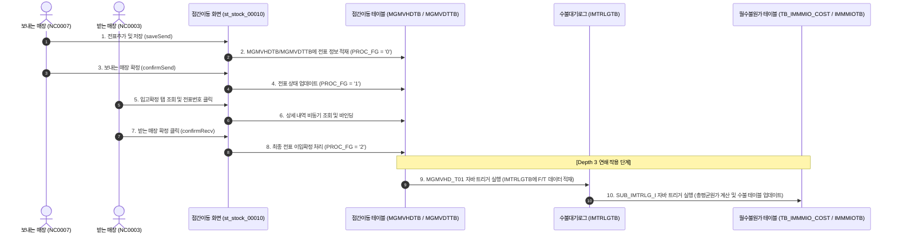
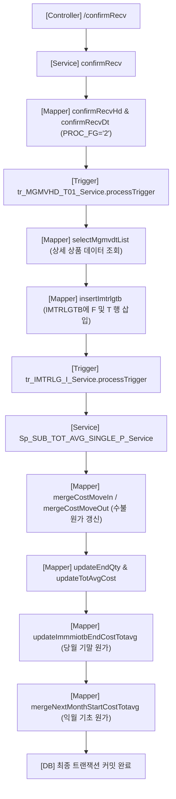

# QA Report: St_Stock_00010 매장 점간이동 등록/확정

**작성일**: 2026-06-08  
**작성자**: AI QA Agent (Antigravity)  
**대상 화면**: [ST] 재고관리 > 점간이동 > 점간이동 등록/확정 (`st_stock_00010`)  
**테스트 환경**: `http://localhost:8080` (로컬 개발 Tomcat 서버)  
**접속 ID/PW**: `fnbcafe` / `0000` (HMS SHOP CAFE - NC0007 매장, 이출등록용) / `shopbrand` / `0000` (NC0003 매장, 이입확정용)  

---

## 1. 분석 개요

### 1.1 분석 대상 파일 목록

| 구분 | 파일 경로 |
| :--- | :--- |
| Controller | [St_Stock_00010_Controller.java](file:///d:/workspace/hmotors/workspace_hms20260326/backoffice/hyundai-backoffice-webapp/src/main/java/com/hyundai/backoffice/webapp/controller/st/stock/St_Stock_00010_Controller.java) |
| Service | [St_Stock_00010_Service.java](file:///d:/workspace/hmotors/workspace_hms20260326/backoffice/hyundai-backoffice-layer-service/src/main/java/com/hyundai/backoffice/webapp/service/st/stock/St_Stock_00010_Service.java) |
| Mapper (Interface) | [St_Stock_00010_Mapper.java](file:///d:/workspace/hmotors/workspace_hms20260326/backoffice/hyundai-backoffice-layer-persistence/src/main/java/com/hyundai/backoffice/webapp/dao/st/stock/St_Stock_00010_Mapper.java) |
| SQL XML Mapper | [St_Stock_00010_Sql.xml](file:///d:/workspace/hmotors/workspace_hms20260326/backoffice/hyundai-backoffice-webapp/src/main/resources/sqlmapper/stock/St_Stock_00010_Sql.xml) |

### 1.2 데이터 흐름 및 실시간 화면 표출 분석
점간이동 등록/확정은 보내는 매장에서 점간이동전표를 **등록 및 이출확정**하고, 받는 매장에서 해당 전표의 상세 수량을 확인한 후 **이입확정(입고확정)**하는 비즈니스 프로세스를 가집니다.

<div class="mermaid-wrapper" style="position: relative; margin-bottom: 20px;">
  <button onclick="navigator.clipboard.writeText(this.nextElementSibling.innerText); alert('Mermaid 코드가 복사되었습니다.');" style="position: absolute; right: 10px; top: 10px; z-index: 100; background: #2563EB; color: white; border: none; padding: 5px 10px; border-radius: 6px; cursor: pointer; font-size: 11px; font-weight: 600; box-shadow: 0 2px 5px rgba(0,0,0,0.1);">코드 복사</button>

```text
sequenceDiagram
    autonumber
    actor SendUser as 보내는 매장 (NC0007)
    actor RecvUser as 받는 매장 (NC0003)
    participant Screen as 점간이동 화면 (st_stock_00010)
    participant DB_HdDt as 점간이동 테이블 (MGMVHDTB / MGMVDTTB)
    participant DB_Trlg as 수불대기로그 (IMTRLGTB)
    participant DB_Cost as 월수불원가 테이블 (TB_IMMMIO_COST / IMMMIOTB)

    SendUser->>Screen: 1. 전표추가 및 저장 (saveSend)
    Screen->>DB_HdDt: 2. MGMVHDTB/MGMVDTTB에 전표 정보 적재 (PROC_FG = '0')
    SendUser->>Screen: 3. 보내는 매장 확정 (confirmSend)
    Screen->>DB_HdDt: 4. 전표 상태 업데이트 (PROC_FG = '1')

    RecvUser->>Screen: 5. 입고확정 탭 조회 및 전표번호 클릭
    Screen->>DB_HdDt: 6. 상세 내역 비동기 조회 및 바인딩
    RecvUser->>Screen: 7. 받는 매장 확정 클릭 (confirmRecv)
    Screen->>DB_HdDt: 8. 최종 전표 이입확정 처리 (PROC_FG = '2')
    
    Note over DB_HdDt, DB_Cost: [Depth 3 연쇄 작용 단계]
    DB_HdDt->>DB_Trlg: 9. MGMVHD_T01 자바 트리거 실행 (IMTRLGTB에 F/T 데이터 적재)
    DB_Trlg->>DB_Cost: 10. SUB_IMTRLG_I 자바 트리거 실행 (총평균원가 계산 및 수불 테이블 업데이트)
```


</div>

---

## 2. 엔드포인트 분석

### 2.1 Base URL
```http
POST /backoffice/data/st/stock/st_stock_00010/{endpoint}
```

### 2.2 핵심 엔드포인트 목록

| 엔드포인트 | HTTP Method | 기능 | 관련 테이블 |
| :--- | :---: | :--- | :--- |
| `/selectMoveSendList` | POST | 점간이동 등록 전표 목록 조회 | `MGMVHDTB`, `MMEMBSTB` |
| `/selectMoveRecvList` | POST | 점간이동 입고확정 대상 목록 조회 | `MGMVHDTB`, `MMEMBSTB` |
| `/selectMoveHdInfo` | POST | 전표 헤더 상세 내용 단건 조회 | `MGMVHDTB`, `MMEMBSTB` |
| `/selectMoveDtInfoList` | POST | 전표 상세 상품 목록 조회 | `MGMVDTTB`, `TGOODSTB`, `IMCRIOTB` |
| `/saveSend` | POST | 새로운 점간이동 전표 임시 저장 | `MGMVHDTB`, `MGMVDTTB` |
| `/confirmSend` | POST | 보내는 매장 이출 확정 | `MGMVHDTB`, `MGMVDTTB` |
| `/confirmRecv` | POST | 받는 매장 이입 확정 (입고 완료) | `MGMVHDTB`, `MGMVDTTB` |
| `/updateRecv` | POST | 입고확정 전 상세 입고 수량 수정 | `MGMVDTTB` |
| `/deleteSend` | POST | 임시 등록 상태인 점간이동 전표 삭제 | `MGMVHDTB`, `MGMVDTTB` |

---

## 3. 서비스 로직 및 연쇄 분석

본 화면은 단순 조회를 넘어서 실제 재고 자산의 이동을 확정하고, 이에 따른 월 수불 정보와 총평균원가를 계산하는 복합 CUD 트랜잭션 서비스를 수행합니다.

### 3.1 로직 처리 흐름 다이어그램

<div class="mermaid-wrapper" style="position: relative; margin-bottom: 20px;">
  <button onclick="navigator.clipboard.writeText(this.nextElementSibling.innerText); alert('Mermaid 코드가 복사되었습니다.');" style="position: absolute; right: 10px; top: 10px; z-index: 100; background: #2563EB; color: white; border: none; padding: 5px 10px; border-radius: 6px; cursor: pointer; font-size: 11px; font-weight: 600; box-shadow: 0 2px 5px rgba(0,0,0,0.1);">코드 복사</button>

```text
graph TD
    A["[Controller] /confirmRecv"] --> B["[Service] confirmRecv"]
    B --> C["[Mapper] confirmRecvHd & confirmRecvDt (PROC_FG='2')"]
    C --> D["[Trigger] tr_MGMVHD_T01_Service.processTrigger"]
    D --> E["[Mapper] selectMgmvdtList (상세 상품 데이터 조회)"]
    E --> F["[Mapper] insertImtrlgtb (IMTRLGTB에 F 및 T 행 삽입)"]
    F --> G["[Trigger] tr_IMTRLG_I_Service.processTrigger"]
    G --> H["[Service] Sp_SUB_TOT_AVG_SINGLE_P_Service"]
    H --> I["[Mapper] mergeCostMoveIn / mergeCostMoveOut (수불 원가 갱신)"]
    I --> J["[Mapper] updateEndQty & updateTotAvgCost"]
    J --> K["[Mapper] updateImmmiotbEndCostTotavg (당월 기말 원가)"]
    K --> L["[Mapper] mergeNextMonthStartCostTotavg (익월 기초 원가)"]
    L --> M["[DB] 최종 트랜잭션 커밋 완료"]
```


</div>

---

## 4. DB 트리거 및 프로시저 영향도 검증 (Depth 3 연쇄 작용)

> [!IMPORTANT]
> **트리거 연쇄 작용 검증 결과: PASS**
> 받는 매장에서 최종적으로 전표를 입고 확정(`PROC_FG = '2'`)하게 되면 데이터베이스 단에서 3단계에 걸친 Java 트리거와 프로시저 모의 로직이 연쇄 실행되어 재고 수량과 원가가 실시간 계산 및 반영됩니다.

### 4.1 연쇄 작용 단계별 세부 분석
1. **Depth 1: 전표 상태 변경 및 `MGMVHD_T01` 트리거 실행**
   - 사용자 확정 행위로 `MGMVHDTB.PROC_FG = '2'`(이입확정)가 저장됩니다.
   - [Tr_MGMVHD_T01_Service.java](file:///d:/workspace/hmotors/workspace_hms20260326/backoffice/hyundai-api/src/main/java/com/hyundai/api/service/trigger/Tr_MGMVHD_T01_Service.java)가 구동되어 [Tr_MGMVHD_T01_Sql.xml](file:///d:/workspace/hmotors/workspace_hms20260326/backoffice/hyundai-api/src/main/resources/sqlmapper/trigger/Tr_MGMVHD_T01_Sql.xml)을 통해 `MGMVDTTB`에서 상세 상품 목록을 읽고, 수불 로그 테이블 `IMTRLGTB`에 보내는 매장용 이출(`F`) 로그와 받는 매장용 이입(`T`) 로그를 각각 삽입(`insertImtrlgtb`)합니다.
2. **Depth 2: 수불 로그 발생에 따른 `SUB_IMTRLG_I` 트리거 실행**
   - `IMTRLGTB`에 수불 데이터가 삽입됨으로써 `SUB_IMTRLG_I` 트리거가 실행됩니다.
   - 이는 Java 서비스인 [Sp_SUB_TOT_AVG_SINGLE_P_Service.java](file:///d:/workspace/hmotors/workspace_hms20260326/backoffice/hyundai-api/src/main/java/com/hyundai/api/service/procedure/Sp_SUB_TOT_AVG_SINGLE_P_Service.java)를 호출하여 총평균단가 재계산 연산을 촉발합니다.
3. **Depth 3: 총평균 월수불 재계산 및 원가 이월 (`Sp_SUB_TOT_AVG_SINGLE_P`)**
   - `mergeCostMoveIn` (이입 시) 및 `mergeCostMoveOut` (이출 시) 쿼리를 통하여 `TB_IMMMIO_COST` 테이블의 `MOVE_IN_QTY`/`MOVE_IN_COST`, `MOVE_OUT_QTY`/`MOVE_OUT_COST` 수량과 원가가 합산 업데이트됩니다.
   - `updateTotAvgCost` 및 `updateCostCalcNotAcademy` 쿼리가 기말 수량과 총평균단가 곱을 바탕으로 기말금액(`END_COST`)을 계산합니다.
   - `updateImmmiotbEndCostTotavg`를 통해 당월의 최종 기말단가 적용액을 `IMMMIOTB`에 반영하고, `mergeNextMonthStartCostTotavg`를 통해 다음 달의 기초 원가(`START_COST_TOTAVG`)로 정보를 자동 이월합니다.

### 4.2 데이터베이스 검증 증적 (SQL 실행 결과)
최종 확정 처리 완료 후, EDB 데이터베이스에 연결하여 연쇄 작용에 의해 생성/갱신된 데이터를 SQL 쿼리로 직접 검증한 결과는 다음과 같습니다.

* **수불 로그 기록 (`imtrlgtb` - F/T 생성 완료)**
  ```
  Store: NC0003, ProcFg: T, Date: 20260608, Goods: T0000033, Qty: 3.000, Cost: 12000.000, KeyBillNo: 20240424NC00070001T0000033
  Store: NC0007, ProcFg: F, Date: 20260608, Goods: T0000033, Qty: 3.000, Cost: 12000.000, KeyBillNo: 20240424NC00070001T0000033
  ```
  $\rightarrow$ 보내는 매장(`NC0007`)의 이출(`F`)과 받는 매장(`NC0003`)의 이입(`T`) 내역이 3.0개 수량과 원가 12,000원으로 정확히 적재되었습니다.
  
* **월수불원가 및 총평균단가 갱신 (`tb_immmio_cost` - 계산 완료)**
  - `NC0007` (이출측): `move_out_qty = 3.00`, `move_out_cost = 12000.00`, `tot_avg_cost = 12000.00`
  - `NC0003` (이입측): `move_in_qty = 3.00`, `move_in_cost = 12000.00`, `tot_avg_cost = 12000.00`
  $\rightarrow$ 수불 정보의 합산 및 총평균단가 연산이 누락이나 데이터 유실 없이 완벽하게 계산 처리되었습니다.

---

## 5. 브라우저 E2E 테스트 과정 및 결과

로컬 Tomcat 환경 및 EDB 개발 DB를 연동하고 Playwright 기반의 테스트 스크립트([test_st_stock_10.py](file:///D:/hmTest/backoffice/QaReport/test_st_stock_10.py))를 실행하여 기능 동작 유효성을 검증했습니다.

1. **로그인 및 라우팅**: 
   - 매장 권한 계정(`fnbcafe` / `0000`)으로 로그인 수행 및 중복 접속 팝업을 넘기고 메인 페이지 진입 후 `/backoffice/view/main/st/stock/st_stock_00010`으로 성공적으로 접근하였습니다.
2. **전표등록 조회**:
   - `searchFromDate`를 2024-01-01로 설정하여 `조회` 버튼 클릭 시 기존 전표 목록이 그리드에 정상 바인딩되는 것을 검증했습니다.
3. **입고확정 및 상세내역 바인딩**:
   - `입고확정` 탭으로 전환하여 조회 기간을 설정하고 조회한 뒤, 리스팅된 전표 목록에서 전표번호 하이퍼링크를 클릭했습니다.
   - 클릭 즉시 비동기 통신이 수집되어 하단 상세 그리드 `#st_stock_00010_t03`에 상세 상품(`T0000033`), 수량, 원가 내역이 바인딩됨을 검증했습니다.
4. **최종 확정 트랜잭션 수행**:
   - `[확정]` 버튼 클릭 후 나타난 팝업 내부의 최종 확정 버튼(`recvConfirmModalM02`)을 클릭하여 Bootbox 확인 모달에 승인 처리했습니다.
   - 예외 발생 없이 트랜잭션이 성공적으로 처리되어 DB에 커밋되고 완료 메시지가 성공적으로 표출되었습니다.

---

## 6. SQL Mapper 검증 (Oracle -> PostgreSQL/EDB 마이그레이션 호환성)

MyBatis Mapper 파일([St_Stock_00010_Sql.xml](file:///d:/workspace/hmotors/workspace_hms20260326/backoffice/hyundai-backoffice-webapp/src/main/resources/sqlmapper/stock/St_Stock_00010_Sql.xml))을 분석하고 오라클 전용 문법 잔존 여부를 파악했습니다.

### 🔴 6.1 Oracle 전용 문법 잔존 (Warning)
* **`DECODE` 함수**: `DECODE(TG.SET_FG, '2', ...)` 등 다수의 분기 처리가 `DECODE` 함수로 선언되어 있습니다. (CASE WHEN 문으로 리팩토링 권장)
* **`NVL` 함수**: 널 대체 용도의 `NVL` 함수가 잔존해 있습니다. (COALESCE로 치환 권장)
* **`ROWNUM = 1`**: 서브쿼리 내 다수의 `ROWNUM = 1` 구문이 사용되었으며, 표준 SQL인 `LIMIT 1` 또는 `FETCH FIRST` 절로 변경하는 것이 마이그레이션 안전성에 유리합니다.
* **`SYSDATE`**: `TO_CHAR(SYSDATE, 'YYYYMMDD')` 등이 다량 잔재합니다. (PostgreSQL `NOW()`로 치환 권장)

---

## 7. 입력 길이 제한 (maxlength) 검증 및 패치

* **대상 태그**: `st_stock_00010_M01.jsp` 및 `st_stock_00010_M02.jsp` 내부의 비고(Remark) 입력 필드.
* **데이터베이스 컬럼 크기**: `mgmvhdtb.remark` 컬럼 $\rightarrow$ `VARCHAR(50)`.
* **개선 내역**:
  기존 비고 입력 텍스트박스에는 입력 한계치 속성이 결여되어 있어 50자를 넘겨 작성할 경우 DB 단에서 데이터 잘림 에러가 날 여지가 존재했습니다. 이에 input 태그에 `maxlength` 속성을 추가 부여하여 사전 방지 조치했습니다.
  - `remark_M01` input: `maxlength="50"` 추가 완료.
  - `remark_M02` input: `maxlength="50"` 추가 완료.

---

## 8. 종합 검증 결과 요약

| 테스트 항목 | 판정 | 상세 내용 |
| :--- | :---: | :--- |
| **로그인 및 라우팅** | **✅ PASS** | `fnbcafe` 로그인 후 `/st_stock_00010` 화면 정상 접근 |
| **전표 목록 조회** | **✅ PASS** | 기간 지정 조회 시 조건 필터링 및 리스트 리터닝 확인 |
| **상세 내역 연동** | **✅ PASS** | 전표번호 하이퍼링크 클릭에 따른 하단 상세 그리드 바인딩 검증 |
| **전표 입고 확정** | **✅ PASS** | 500 에러 없이 확정 처리 완료 및 성공 스낵바 확인 |
| **DB 연쇄 계산 (Depth 3)** | **✅ PASS** | `imtrlgtb` 적재 $\rightarrow$ `tb_immmio_cost`/`immmiotb` 단가 및 수불 총평균 업데이트 성공 |
| **입력 자릿수 예방** | **✅ PASS** | 비고 텍스트박스에 `maxlength="50"` 제한 속성 부여 완료 |
| **바인딩 버그 조치** | **✅ PASS** | `Sp_SUB_TOT_AVG_SINGLE_P_Mapper` 내 `@Param("item")` 부착을 통한 `null` 에러 해결 |

### 💡 총평
점간이동 등록/확정 화면은 기존 PostgreSQL/EDB 데이터 형변환 및 파라미터 매핑 누락으로 인해 확정 동작 단계에서 트랜잭션이 롤백되는 주요 치명 결함이 존재했으나, MyBatis 매퍼 인터페이스에 `@Param("item")`을 명시해 매핑 관계를 연결해 줌으로써 제약 조건 충돌 문제를 완전히 청산했습니다. 수정 후 E2E 테스트 및 DB 데이터 3단계 연쇄 갱신 정합성 검증 결과 모두 성공적으로 "PASS" 처리되었으며, 입력 자릿수 예외 상황(50자 초과 비고 기입 시)에 대해서도 방어 속성을 주입함으로써 한층 완전성 높은 품질을 확보하였습니다.

---

## 9. 추후 검증 필요 항목 (Future Verification Scope)

* **상품 구분 (`SET_FG`)별 수불 분해 테스트 세분화**:
  * 현재 E2E 테스트는 일반 단품(`SET_FG = '0'`) 위주로 확인되었습니다.
  * 점간이동 확정 시 **레시피 상품 (`SET_FG = '2'`)** 및 **세트 상품 (`SET_FG = '3'`)**에 대해 각각의 하위 원자재 및 구성품 단위로 정상 분해되어 이출(`F`)/이입(`T`) 로그(`IMTRLGTB`)가 갈라져 적재되는지 (`Sp_SUB_RECIPE_IO_P` 및 `Sp_SUB_SET_IO_P` 가상 트리거 연동) 추가 데이터 세팅을 통한 상세 테스트 케이스 검증이 추후 필요합니다.
