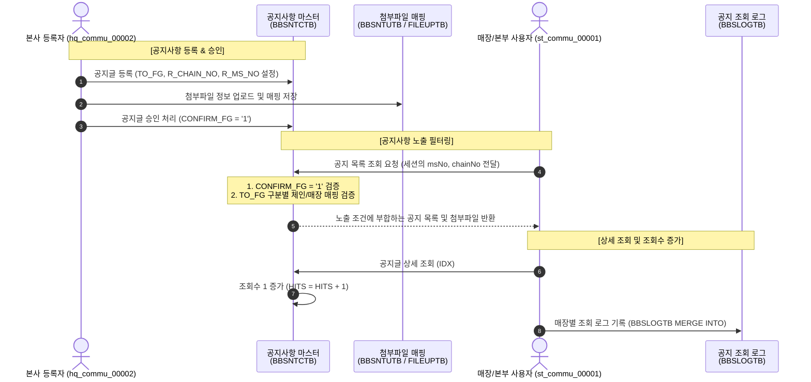

# HMS 공지사항 커뮤니케이션 데이터 흐름 (Data Flow) 명세서

본 문서는 본부 공지사항 등록 관리(`hq_commu_00002`)부터 매장/본부 공지사항 조회(`st_commu_00001`/`hq_commu_00001`)에 이르기까지의 데이터 적재, 매핑 관계 및 필터링 흐름을 상세히 정리한 문서입니다.

---

## 1. 공지사항 데이터 흐름 시각화 (Mermaid Diagram)

<div class="mermaid-wrapper" style="position: relative; margin-bottom: 20px;">
  <button onclick="navigator.clipboard.writeText(this.nextElementSibling.innerText); alert('Mermaid 코드가 복사되었습니다.');" style="position: absolute; right: 10px; top: 10px; z-index: 100; background: #2563EB; color: white; border: none; padding: 5px 10px; border-radius: 6px; cursor: pointer; font-size: 11px; font-weight: 600; box-shadow: 0 2px 5px rgba(0,0,0,0.1);">코드 복사</button>

```text
sequenceDiagram
    autonumber
    actor HQ_User as 본사 등록자 (hq_commu_00002)
    participant DB_BBS as 공지사항 마스터<br/>(BBSNTCTB)
    participant DB_File as 첨부파일 매핑<br/>(BBSNTUTB / FILEUPTB)
    actor ST_User as 매장/본부 사용자 (st_commu_00001)
    participant DB_Log as 공지 조회 로그<br/>(BBSLOGTB)

    %% Phase 1: Registration
    Note over HQ_User, DB_BBS: [공지사항 등록 & 승인]
    HQ_User->>DB_BBS: 공지글 등록 (TO_FG, R_CHAIN_NO, R_MS_NO 설정)
    HQ_User->>DB_File: 첨부파일 정보 업로드 및 매핑 저장
    HQ_User->>DB_BBS: 공지글 승인 처리 (CONFIRM_FG = '1')

    %% Phase 2: Loading & Filtering
    Note over ST_User, DB_BBS: [공지사항 노출 필터링]
    ST_User->>DB_BBS: 공지 목록 조회 요청 (세션의 msNo, chainNo 전달)
    Note over DB_BBS: 1. CONFIRM_FG = '1' 검증<br/>2. TO_FG 구분별 체인/매장 매핑 검증
    DB_BBS-->>ST_User: 노출 조건에 부합하는 공지 목록 및 첨부파일 반환

    %% Phase 3: Viewing & Hit logging
    Note over ST_User, DB_Log: [상세 조회 및 조회수 증가]
    ST_User->>DB_BBS: 공지글 상세 조회 (IDX)
    DB_BBS->>DB_BBS: 조회수 1 증가 (HITS = HITS + 1)
    ST_User->>DB_Log: 매장별 조회 로그 기록 (BBSLOGTB MERGE INTO)
```


</div>

---

## 2. 세부 단계별 데이터 처리 프로세스

### 1단계: 본사 공지사항 등록 및 승인 (`hq_commu_00002`)
본사 사용자가 공지사항을 등록할 때, 노출 범위를 타겟팅하여 `BBSNTCTB` 테이블에 데이터를 인서트합니다.

* **BBSNTCTB 적재 정보**:
  * `TO_FG` (공지대상구분):
    * `'S'`: 전체 공지 (System-wide)
    * `'C'`: 체인 공지 (Chain-wide)
    * `'P'`: 특정 매장 공지 (Store-specific)
  * `R_CHAIN_NO` (수신체인번호): `TO_FG = 'C'`일 때 대상 브랜드 체인 코드 저장 (예: `C001`)
  * `R_MS_NO` (수신매장번호): `TO_FG = 'P'`일 때 대상 매장 코드 목록을 콤마 구분자로 저장 (예: `NC0011,NC0014`)
  * `CONFIRM_FG` (승인 여부): **반드시 `'1'`(승인)** 상태여야 가맹점 화면에 노출됩니다.
* **첨부파일 저장 및 매핑**:
  * 업로드된 실물 파일 정보는 `FILEUPTB`에 저장되며, 발급된 `FILE_IDX`와 공지글 ID(`IDX`) 간의 연관 관계가 `BBSNTUTB` 매핑 테이블에 기록됩니다.

> [!IMPORTANT]
> 본사 등록자가 게시글을 작성했더라도 **승인 완료(`CONFIRM_FG = '1'`)** 처리를 하지 않으면, 가맹점 목록 조회 쿼리에서 노출 대상에서 완전히 제외됩니다.

---

### 2단계: 공지사항 매장 노출 필터링 (`st_commu_00001` / `hq_commu_00001`)
매장(가맹점) 사용자가 공지사항 화면에 접속하면, 사용자의 로그인 세션 정보(`msNo`, `chainNo`)를 파라미터로 받아 매핑 여부를 필터링합니다.

* **조회자 세션 정보 매핑 출처**:
  * `msNo`: `MUSERSTB` 테이블의 `ms_no` (매장 코드)
  * `chainNo`: 소속 매장인 `MMEMBSTB` 테이블의 `chain_no` (브랜드 체인 코드)
* **목록 조회 핵심 필터 SQL 조건**:
  ```sql
  -- TO_FG가 'C'(체인/매장공통) 또는 'S'(전체) 조건으로 들어올 때의 분기 처리
  <choose>
      <when test='toFg != "" and toFg.equals("C")'>
          AND CONFIRM_FG = '1' 
          AND (
              (TO_FG = 'P' AND R_MS_NO LIKE '%'||#{msNo}||'%')  -- 특정 가맹점 대상 포함 여부
              OR 
              (TO_FG = 'C' AND R_CHAIN_NO = #{chainNo})       -- 동일 브랜드 체인 여부
          )
      </when>
      <when test='toFg != "" and toFg.equals("S")'>
          AND CONFIRM_FG = '1' 
          AND TO_FG = 'S'                                      -- 시스템 전체 공지 대상
      </when>
  </choose>
  ```

> [!WARNING]
> **체인 불일치로 인한 공지 누락 사례**:
> 본사 등록자(`shopadmin`)의 체인이 `C001`인 상태에서 공지사항을 체인 대상(`TO_FG = 'C'`)으로 등록할 경우, 해당 글의 `R_CHAIN_NO`는 `C001`로 지정됩니다.
> 이 경우, 로그인한 사용자(예: `H118186`)의 소속 체인이 `C002`라면 `R_CHAIN_NO = #{chainNo}` (`'C001' = 'C002'`) 조건이 불일치하므로 목록에 전혀 노출되지 않습니다.

---

### 3단계: 상세 조회 및 조회 이력 적재
사용자가 공지사항의 상세 내용을 클릭하면, 두 가지 데이터 갱신이 동시에 발생합니다.

1. **조회수(HITS) 증가**:
   * `BBSNTCTB.HITS` 컬럼의 카운트가 `+1` 업데이트됩니다.
2. **매장별 조회 로그 기록 (`BBSLOGTB`)**:
   * `BBSLOGTB` 테이블에 해당 매장(`MS_NO`)이 해당 공지글(`IDX`)을 열람했음을 기록합니다.
   * `MERGE INTO` (PostgreSQL 환경에서는 `INSERT ... ON CONFLICT`) 구문을 사용하여 최초 열람 시에는 데이터를 신규 적재하고, 재열람 시에는 최종 열람 일시(`LAST_DTIME`)와 조회 횟수(`HIT_COUNT`)만 누적 갱신합니다.
   ```sql
   MERGE INTO hmsfns.BBSLOGTB A
        USING DUAL
           ON (A.IDX = #{idx} AND A.MS_NO = #{msNo})
         WHEN MATCHED THEN
              UPDATE SET A.HIT_COUNT  = HIT_COUNT + 1
                       , A.LAST_DTIME = TO_CHAR(SYSDATE, 'YYYYMMDDHH24MISS')
         WHEN NOT MATCHED THEN
              INSERT ( IDX, MS_NO, HIT_COUNT, CREATE_DTIME, LAST_DTIME )
              VALUES ( #{idx}, #{msNo}, 1, TO_CHAR(SYSDATE, 'YYYYMMDDHH24MISS'), TO_CHAR(SYSDATE, 'YYYYMMDDHH24MISS') )
   ```

---

## 3. 관련 테이블 정보 요약

| 테이블명 | 테이블 논리명 | 주요 목적 | 주요 연관 컬럼 |
| :--- | :--- | :--- | :--- |
| **BBSNTCTB** | 공지사항 마스터 | 공지 제목, 내용, 노출 타겟 범위, 승인 여부 등 저장 | `IDX`, `TO_FG`, `R_CHAIN_NO`, `R_MS_NO`, `CONFIRM_FG` |
| **BBSLOGTB** | 공지사항 조회이력 | 매장별 공지사항 최초/최종 열람 시간 및 조회수 기록 | `IDX`, `MS_NO`, `HIT_COUNT`, `LAST_DTIME` |
| **BBSNTUTB** | 공지 첨부파일 매핑 | 공지 마스터 ID와 업로드 파일 ID 간의 N:M 매핑 보관 | `IDX`, `FILE_IDX` |
| **FILEUPTB** | 파일 업로드 마스터 | 업로드된 실제 첨부파일의 물리적 파일명 및 경로 정보 관리 | `FILE_IDX`, `STORED_FILE_PATH`, `ORIGINAL_FILE_NM` |
| **MUSERSTB** | 사용자 마스터 | 로그인 사용자의 계정 기본 정보 및 소속 매장 관리 | `USER_ID`, `MS_NO`, `SYSTEM_TYPE` |
| **MMEMBSTB** | 매장 마스터 | 가맹점/본사 매장의 상세 정보 및 브랜드 체인 분류 관리 | `MS_NO`, `CHAIN_NO`, `CHAIN_HQ_YN` |
