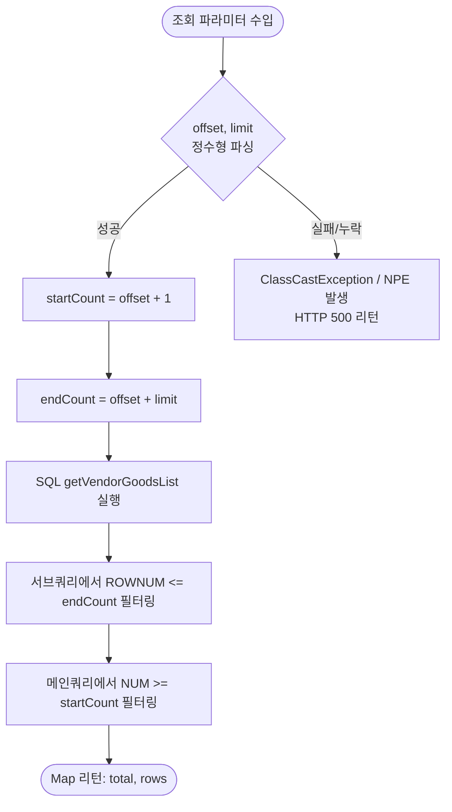
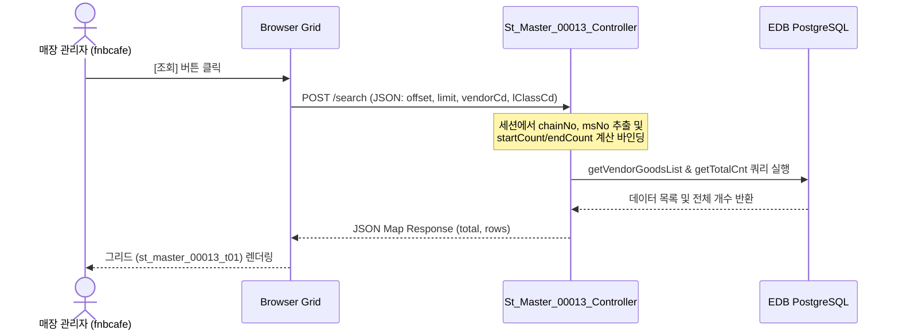

# St_Master_00013 — 거래처별 취급상품 조회 단위 테스트케이스 (v2)

> **대상 화면**: [ST] 마스터관리 > 거래처 > 거래처별 취급상품 조회 (`st_master_00013`)  
> **API Base URL**: `POST /backoffice/data/st/master/st_master_00013`  
> **트랜잭션 설정**: `@Transactional(rollbackFor = {RuntimeException.class, Exception.class})` (SELECT 전용)  
> **데이터 수신 방식**: `CommandMap` 및 `@RequestBody Map<String, Object> reqMap` 혼용  
> **DB 영향도**: 단순 데이터 조회 화면으로 CUD/트리거 연쇄 영향 없음 (Depth 3 Side Effect 없음)

---

## 1. 테스트 선행 및 세션 조건

| 세션 변수명 | 필요성 | 데이터 예시 | 비고 |
| :--- | :--- | :--- | :--- |
| `chainNo` | **필수** | `C001` (HMS F&B 체인) | 권한별 조회 필터의 기준 (Mapper 바인딩) |
| `msNo` | **필수** | `NC0007` (CAFE 매장) | 매장별 취급상품 및 현재 재고 조회 기준 |

---

## 2. 엔드포인트 명세 및 쿼리 매핑

| # | URL 엔드포인트 | HTTP Method | 기능 요약 | 데이터 반환 | 연관 테이블 |
| :--- | :--- | :---: | :--- | :--- | :--- |
| 1 | `/search` | POST | 거래처별 취급상품 목록 조회 | `Map<String, Object>` (total, rows) | `MVNDRMTB`, `MVNDRGTB`, `TGOODSTB`, `TMLCLSTB`, `TMMCLSTB`, `TMSCLSTB`, `IMCRIOTB`, `MNAMEMTB` |

---

## 3. 로직 및 데이터 흐름 구조 (흐름도)

### 3.1 페이징 파라미터(offset, limit) 파싱 및 SQL 조회 범위 계산 흐름
컨트롤러 조회(`/search`) 호출 시 유입되는 `offset`과 `limit` 정보를 활용하여 MyBatis 쿼리 내부의 페이징 시작 번호(`startCount`) 및 끝 번호(`endCount`)를 연산하는 로직 흐름입니다.



### 3.2 화면 데이터 조회 연동 시퀀스


---

## 4. 소스코드 정적 분석 기반 핵심 결함 포인트

### 🔴 4.1 `offset` 및 `limit` 누락에 의한 NullPointerException 및 ClassCastException
*   **발생 위치**: `St_Master_00013_Controller.java` (L76, L77)
*   **원인**: 컨트롤러에서 페이징을 위해 `offset` 과 `limit` 파라미터를 강제 형변환하여 처리하고 있으나, 이 값들이 누락되거나 다른 타입(예: 문자열)으로 유입될 경우 캐스팅 오류 또는 NPE가 발생해 서버가 즉사합니다.
    ```java
    // 형변환 에러 유발 지점
    commandMap.put("startCount"    , (int)reqMap.get("offset") + 1        );
    commandMap.put("endCount"      , (int)reqMap.get("offset") + (int)reqMap.get("limit") );
    ```
*   **해결책**: `reqMap.get("offset")` 등의 존재 여부 및 타입을 사전에 검증하고 기본값(Default Value)을 세팅하는 안전 조치가 필요합니다.

### 🔴 4.2 MyBatis SQL Mapper 내 OGNL 대입 연산자 오기재 버그
*   **발생 위치**: `St_Master_00013_Sql.xml` (L67, L118)
*   **원인**: 소분류 코드(`sClassCd`) 조건 체크 시 비교 연산자(`==`)가 아닌 대입 연산자(`=`)가 오기재되어 조건이 올바르게 평가되지 않거나 구문 분석 결함을 초래할 위험이 큽니다.
    ```xml
    <!-- 버그 코드 -->
    <if test="sClassCd = ''">
        AND TRIM(CS.SCLASS_CD) = #{sClassCd}
    </if>
    ```
*   **해결책**: `<if test="sClassCd != null and sClassCd != ''">` 형태로 정밀 수정해야 합니다.

---

## 5. 상세 테스트케이스 (Unit & E2E)

### 5.1 `/search` — 거래처별 취급상품 조회

| TC ID | 테스트 시나리오 | 입력 데이터 (JSON Body) | 세션 조건 | 기대 결과 | 판정 기준 |
| :--- | :--- | :--- | :--- | :--- | :---: |
| **TC-101** | 정상 취급상품 데이터 조회 | `{"offset":0,"limit":100,"vendorCd":"","lClassCd":""}` | `chainNo="C001"`, `msNo="NC0007"` | HTTP 200, 취급상품 목록 및 전체 카운트 반환 | `rows.size() > 0` |
| **TC-102** | 특정 거래처 필터 조회 (정상) | `{"offset":0,"limit":100,"vendorCd":"000001","lClassCd":""}` | `chainNo="C001"`, `msNo="NC0007"` | 지정한 거래처 `000001`에 매핑된 상품 정보만 필터링 | `vendorCd` 바인딩 |
| **TC-103** | **`offset` 누락 시 결함 검증** | `{"limit":100,"vendorCd":"","lClassCd":""}` | `chainNo="C001"`, `msNo="NC0007"` | **HTTP 500 (Internal Server Error)** 발생 | **`NullPointerException`** |
| **TC-104** | 소분류 필터링 테스트 시 OGNL 검증 | `{"offset":0,"limit":100,"vendorCd":"","lClassCd":"01","mClassCd":"01","sClassCd":"01"}` | `chainNo="C001"`, `msNo="NC0007"` | 소분류 조건 바인딩 오작동 또는 SQL 에러 유도 | OGNL 에러 유발 여부 |

---

## 6. SQL 마이그레이션 호환성 체크리스트 (Warning 요소)

본 화면의 MyBatis Mapper [St_Master_00013_Sql.xml](file:///d:/workspace/hmotors/workspace_hms20260326/backoffice/hyundai-backoffice-webapp/src/main/resources/sqlmapper/master/St_Master_00013_Sql.xml) 쿼리 내 오라클 전용 문법 검사항목입니다.

- [ ] **Oracle (+) 아우터 조인 대량 식별 (L41-43, L54-55)**: `VG.GOODS_CD (+) = GD.GOODS_CD` 등 $\rightarrow$ ANSI 표준인 `LEFT OUTER JOIN` 구문으로 리팩토링 필요.
- [ ] **Oracle ROWNUM 페이징 식별 (L10, L74-75)**: `ROWNUM` 활용 구문 $\rightarrow$ PostgreSQL 표준 `LIMIT` 및 `OFFSET`으로 완전 재작성 필요.
- [ ] **Oracle DECODE, TRUNC, NVL 함수 잔존**: `DECODE`, `TRUNC`, `NVL` $\rightarrow$ `CASE WHEN`, `TRUNC`, `COALESCE` 로 변환 필요.
