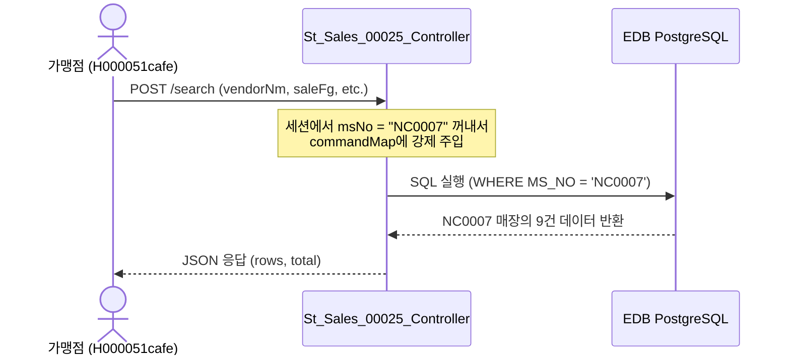

# St_Sales_00025 — 매장 외상 매출 및 입금내역조회 단위 테스트케이스

> **대상 화면**: 매장 매출분석 > 결제관리 > 외상 매출 및 입금내역조회 (`st_sales_00025`)  
> **API Base URL**: `POST /backoffice/data/st/sales/st_sales_00025`  
> **트랜잭션 설정**: 단순 조회전용으로 `@Transactional` 없음  
> **데이터 수신 방식**: `@RequestBody Map<String, Object> map`  
> **DB 영향도**: 단순 SELECT 전용. 관련 CUD 테이블 및 DB 트리거/프로시저 없음.

---

## 1. 테스트 선행 및 세션 조건

- **로그인 ID**: `H000051cafe` (비밀번호: `0000`)
- **권한 유형**: 가맹점 사용자 (SYSTEM_TYPE = Store)
- **세션 정보**: `chainNo = C001`, `msNo = NC0007` (로그인 정보에 기반하여 강제 바인딩)
- **조회 대상 테이블**: 
  * `hmsfns.STRNWETB` (외상 매출 내역 테이블)
  * `hmsfns.WEASDTTB` (외상 입금 상세 테이블)
  * `hmsfns.MMEMBSTB` (가맹점 마스터 테이블)
  * `hmsfns.MVNDRMTB` (거래처 마스터 테이블)
  * `hmsfns.MUSERSTB` (사용자 마스터 테이블)

---

## 2. 엔드포인트 명세 및 쿼리 매핑

| # | URL 엔드포인트 | HTTP Method | 기능 요약 | 데이터 반환 | 연관 테이블 / 쿼리 ID |
| :--- | :--- | :---: | :--- | :--- | :--- |
| 1 | `/search` | POST | 매장별 외상 매출 및 입금 내역 목록 조회 | `Map<String, Object>` | `getTotalCnt`, `searchWeasList` |

---

## 3. 데이터 흐름 및 보안 제약 사항

매장 화면은 본사 화면과 달리, **다른 매장의 외상 내역을 열람할 수 없도록 강제 제약**이 적용되어 있습니다. 
* 세션의 `msNo` 값(`NC0007`)이 Controller에서 하드 바인딩되어 MyBatis 파라미터로 제공됩니다.
* 클라이언트가 요청 바디에 임의의 `msNo`를 변조하여 전송하더라도, 웹 백엔드 세션 값에 의해 최종 덮어씌워지므로 교차 사이트 데이터 노출이 원천 차단됩니다.

---

## 4. 상세 테스트 시나리오 (E2E)

| TC ID | 테스트 시나리오 | 입력 데이터 (JSON Body) | 기대 결과 | 판정 기준 |
| :--- | :--- | :--- | :--- | :---: |
| **TC-201** | 가맹점 권한 전체 기간 조회 및 페이징 | `{"offset":0, "limit":10, "searchFromDate":"20230101", "searchToDate":"20261231", "vendorNm":"", "saleFg":"", "procFg":""}` | HTTP 200, 로그인된 매장 NC0007 소속 전체 9건 데이터 셋 및 total=9 반환 | `total == 9` |
| **TC-202** | 타 매장 데이터 탈취 검증 (msNo 변조 시도) | `{"offset":0, "limit":10, "searchFromDate":"20230101", "searchToDate":"20261231", "msNo":"NC0015", "vendorNm":"", "saleFg":"", "procFg":""}` | HTTP 200, 요청의 msNo인 NC0015는 무시되고 본인 매장인 NC0007 데이터(total=9)가 반환됨 | `rows.every(r => r.msNo == 'NC0007')` |
| **TC-203** | 가맹점 내 거래처명(vendorNm) 조회 | `{"offset":0, "limit":10, "searchFromDate":"20230101", "searchToDate":"20261231", "vendorNm":"외상", "saleFg":"", "procFg":""}` | HTTP 200, 거래처명에 '외상'이 포함된 NC0007의 데이터만 반환 | `rows.every(r => r.vendorNm.includes('외상'))` |
| **TC-204** | 매출구분(saleFg) 필터링 조회 | `{"offset":0, "limit":10, "searchFromDate":"20230101", "searchToDate":"20261231", "vendorNm":"", "saleFg":"1", "procFg":""}` | HTTP 200, 매출구분이 '1'(정상매출)인 해당 매장 데이터 반환 | `rows.every(r => r.saleFg == '1')` |
