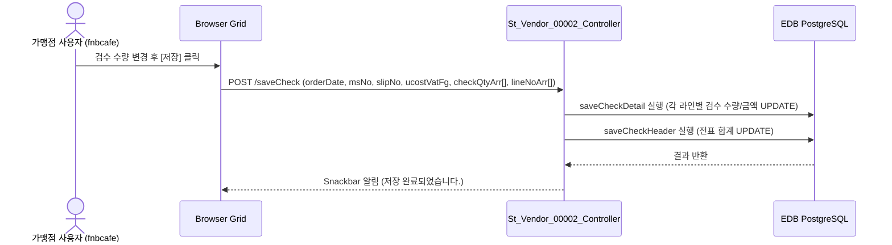
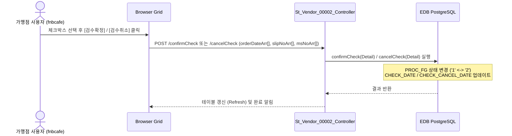

# St_Vendor_00002 — 검수관리 단위 테스트케이스 (v2)

> **대상 화면**: [ST] 매입발주 > 매입관리 > 검수관리 (`st_vendor_00002`)  
> **API Base URL**: `POST /backoffice/data/st/vendor/st_vendor_00002`  
> **트랜잭션 설정**: `@Transactional(rollbackFor = {RuntimeException.class, Exception.class})`  
> **데이터 수신 방식**: `@RequestBody Map<String, Object> commandMap` (전 엔드포인트 공통)  
> **DB 영향도**: `OBSLPHTB`, `OBSLPDTB` 데이터 수정 및 `Tr_OBSLPD_T01_Service`, `Tr_OBSLPD_T02_Service` 연쇄 (Depth 3)

---

## 1. 테스트 선행 및 세션 조건

| 세션 변수명 | 필요성 | 데이터 예시 | 비고 |
| :--- | :--- | :--- | :--- |
| `chainNo` | **필수** | `C001` (HMS F&B 체인) | 권한별 조회 필터의 기준 (Mapper 바인딩) |
| `msNo` | **필수** | `NC0007` (NC백화점 강서점) | 로그인 사용자의 가맹점 번호 (자동 바인딩) |

---

## 2. 엔드포인트 명세 및 쿼리 매핑

| # | URL 엔드포인트 | HTTP Method | 기능 요약 | 데이터 반환 | 연관 테이블 |
| :--- | :--- | :---: | :--- | :--- | :--- |
| 1 | `/getCheckHeaderList` | POST | 발주 내역 조회 | `Map<String, Object>` (total, rows) | `OBSLPHTB`, `MMEMBSTB`, `TVNDRMTB` |
| 2 | `/getCheckDetailList` | POST | 발주 내역 상세 조회 | `List<St_Vendor_00002_CheckDetailListDto>` | `OBSLPHTB`, `OBSLPDTB`, `MGOODSTB`, `MNAMEMTB` |
| 3 | `/saveCheck` | POST | 검수내역 저장 | `void` (저장 완료) | `OBSLPDTB` (Detail), `OBSLPHTB` (Header) |
| 4 | `/confirmCheck` | POST | 검수 확정 | `void` (PROC_FG: '1' -> '2') | `OBSLPHTB`, `OBSLPDTB` |
| 5 | `/cancelCheck` | POST | 검수 취소 | `void` (PROC_FG: '2' -> '1') | `OBSLPHTB`, `OBSLPDTB` |

---

## 3. 로직 및 데이터 흐름 구조 (흐름도)

### 3.1 검수 저장 및 연쇄 흐름


### 3.2 검수 확정 / 취소 흐름


---

## 4. 소스코드 정적 분석 기반 핵심 결함 포인트

### 🔴 4.1 빈 문자열 수신 시 숫자 형변환 에러 (NumberFormatException) - 해결됨
*   **발생 위치**: `St_Vendor_00002_Sql.xml` (`saveCheckDetail`)
*   **원인**: 화면 그리드 내 `checkQty` 또는 `unitPrice`가 공백/빈 문자열(`""`)로 전송될 때, PostgreSQL의 강한 타입 체크 기법에 의해 숫자형 변환 중 오류가 발생합니다.
*   **해결책**: MyBatis XML 쿼리에 Null-Safety 보호 구문을 적용하여 빈 값 수입 시 기본값 `'0'`으로 변환 후 캐스팅되도록 조치하였습니다.
    ```xml
    CHECK_QTY = COALESCE(NULLIF(#{checkQty, jdbcType=VARCHAR}::text, ''), '0')::numeric
    ```

---

## 5. 상세 테스트케이스 (Unit & E2E)

### 5.1 `/getCheckHeaderList` — 발주 내역 조회

| TC ID | 테스트 시나리오 | 입력 데이터 (JSON Body) | 세션 조건 | 기대 결과 | 판정 기준 |
| :--- | :--- | :--- | :--- | :--- | :---: |
| **TC-101** | 정상 조건 조회 (날짜 범위) | `{"vendor":"","searchFromDate":"20240201","searchEndDate":"20240201","offset":0,"limit":10}` | `chainNo="C001"`, `msNo="NC0007"` | HTTP 200, 해당 매장의 전표 헤더 리스트 3건 반환 | `rows.length == 3` |
| **TC-102** | 매장 코드 입력 제한 초과 검증 | `{"searchPurchReqNo":"1234567890123"}` | `chainNo="C001"`, `msNo="NC0007"` | JSP 화면 input에서 maxlength에 의해 12자 초과 입력 차단 | 화면 입력 차단 확인 |

### 5.2 `/saveCheck` — 검수내역 저장

| TC ID | 테스트 시나리오 | 입력 데이터 (JSON Body) | 세션 조건 | 기대 결과 | 판정 기준 |
| :--- | :--- | :--- | :--- | :--- | :---: |
| **TC-201** | 정상 검수수량 변경 저장 | `{"orderDate":"20240201","msNo":"NC0007","slipNo":"0001","ucostVatFg":"1","lineNoArr":[1],"checkQtyArr":["2"],"unitPriceArr":["22000"],"taxFgArr":["1"],"checkAmtArr":["44000"],"checkVatArr":["4400"],"checkFicAmtArr":["0"],"checkFicVatArr":["0"]}` | `chainNo="C001"` | HTTP 200, 저장 후 DB `obslpdtb` 내 `check_qty`가 2로 정상 갱신 | DB `check_qty` = 2 |
| **TC-202** | 빈 문자열 수량 캐스팅 예방 테스트 | `{"orderDate":"20240201","msNo":"NC0007","slipNo":"0001","ucostVatFg":"1","lineNoArr":[1],"checkQtyArr":[""],"unitPriceArr":["22000"],"taxFgArr":["1"],"checkAmtArr":[""],"checkVatArr":[""]}` | `chainNo="C001"` | HTTP 200, `COALESCE/NULLIF`가 동작하여 DB에 0으로 안전하게 저장 | DB `check_qty` = 0 |

### 5.3 `/confirmCheck` & `/cancelCheck` — 검수 확정 및 취소

| TC ID | 테스트 시나리오 | 입력 데이터 (JSON Body) | 세션 조건 | 기대 결과 | 판정 기준 |
| :--- | :--- | :--- | :--- | :--- | :---: |
| **TC-301** | 정상 검수 확정 | `{"orderDateArr":["20240201"],"slipNoArr":["0001"],"msNoArr":["NC0007"]}` | `chainNo="C001"` | HTTP 200, DB `obslphtb`/`obslpdtb`의 `proc_fg`가 `'2'`로 갱신 | DB `proc_fg` = '2' |
| **TC-302** | 정상 검수 취소 | `{"orderDateArr":["20240201"],"slipNoArr":["0001"],"msNoArr":["NC0007"]}` | `chainNo="C001"` | HTTP 200, DB `obslphtb`/`obslpdtb`의 `proc_fg`가 `'1'`로 롤백 | DB `proc_fg` = '1' |

---

## 6. SQL 마이그레이션 호환성 체크리스트 (Warning 요소)

본 화면의 MyBatis Mapper [St_Vendor_00002_Sql.xml](file:///d:/workspace/hmotors/workspace_hms20260326/backoffice/hyundai-backoffice-webapp/src/main/resources/sqlmapper/vendor/St_Vendor_00002_Sql.xml) 쿼리 내 오라클 전용 문법 검사항목입니다.

- [ ] **Oracle ROWNUM 잔존 (L13)**: `ROWNUM RNUM` $\rightarrow$ PostgreSQL 표준 `LIMIT`/`OFFSET` 또는 `ROW_NUMBER()` 윈도우 함수로 치환 권장.
- [ ] **Oracle DECODE 함수 잔존 (L32, L90)**: `DECODE(HD.PROC_FG, '0', '등록', ...)` $\rightarrow$ ANSI 표준 문법인 `CASE WHEN` 구문으로 리팩토링 권장.
- [ ] **Oracle (+) 아우터 조인 잔존 (L163)**: `TG.ORD_UNIT = NM.NM_CD(+)` $\rightarrow$ ANSI 표준 문법인 `LEFT OUTER JOIN` 구문으로 리팩토링 권장.
