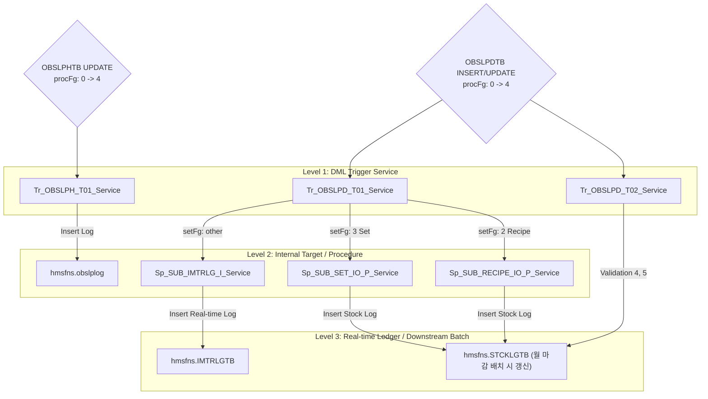

# St_Vendor_00005 — 반품등록 단위 테스트케이스

> **화면**: [Store] 거래처 > 반품등록  
> **URL Prefix**: `POST /backoffice/data/st/vendor/st_vendor_00005`  
> **@Transactional**: rollbackFor = {RuntimeException.class, Exception.class} (CUD 트랜잭션 보장 및 롤백 설정)  
> **요청 방식**: `@RequestBody` 및 `@RequestParam` 혼용
> **DB 트리거 영향도**: 있음 (OBSLPHTB, OBSLPDTB CUD에 따른 재고/수불 연쇄 처리 및 로그 인서트 발생)

---

## 세션 공통 선행 조건

| 세션 키 | 값 예시 | 사용 엔드포인트 |
|---------|---------|---------------|
| `chainNo` | `C004` | 전 엔드포인트 |
| `msNo` | `NC0007` | getVatFg, selectVendorOrderList, selectVendorGoodsList, saveVendorOrder, updateVendorOrder |
| `ID` | `fnbcafe` | saveVendorOrder, updateVendorOrder, confirmVendorOrder |

---

## 엔드포인트 목록 (10개)

| # | URL | 기능 | 반환 | Type | 관련 테이블 |
|---|---|---|---|---|---|
| 1 | `/getVatFg` | 부가세 포함 여부 조회 | `String` | SELECT | MMEMBSTB |
| 2 | `/selectVendorOrderList` | 반품전표 목록 조회 | `List` | SELECT | OBSLPHTB |
| 3 | `/selectVendorOrderDetailList` | 반품전표 상세내역 조회 | `List` | SELECT | OBSLPDTB, MGOODSTB |
| 4 | `/selectVendorGoodsList` | 반품대상 상품 조회 | `List` | SELECT | MGOODSTB |
| 5 | `/saveVendorOrder` | 반품전표 신규 등록 | `String` | INSERT | OBSLPHTB, OBSLPDTB |
| 6 | `/updateVendorOrder` | 기존 전표에 상품 추가 | `String` | INSERT | OBSLPDTB |
| 7 | `/confirmVendorOrder` | 반품전표 확정 (재고 연쇄 반영) | `String` | UPDATE | OBSLPHTB, OBSLPDTB |
| 8 | `/deleteVendorOrder` | 반품전표 삭제 | `String` | DELETE | OBSLPHTB, OBSLPDTB |
| 9 | `/updateRemark` | 반품요청 비고 저장 | `String` | UPDATE | OBSLPHTB |
| 10| `/saveVendorOrderGoods` | 전표 상품 수량 수정 / 일부 삭제 | `String` | UPDATE/DELETE | OBSLPDTB, OBSLPHTB |

---

## DB 트리거 및 프로시저 연쇄 반응 구조 (Depth 3)

가맹점 반품전표 확정(`confirmVendorOrder`) 시 `hmsfns.OBSLPHTB`(Header) 및 `hmsfns.OBSLPDTB`(Detail)의 데이터 상태가 변경되면서 실시간 수불 로그 적재 및 마감 마스터 갱신 준비가 진행됩니다.



---

## 1. `/getVatFg` — 부가세 포함 여부 조회

| No | Request | 예상값 |
|----|---------|-------|
| 1-1| `{}` | 가맹점(`NC0007`)의 부가세 사용 여부 코드 반환 (`"0"` 또는 `"1"`) |

---

## 2. `/selectVendorOrderList` — 반품전표 목록 조회

| No | RequestBody | 예상값 |
|----|-------------|-------|
| 2-1| `{"searchFromDate":"20260616","searchEndDate":"20260616"}` | 가맹점 로그인 사용자의 매장코드(`msNo = 'NC0007'`)에 부합하는 금일 반품 전표 목록 반환 |
| 2-2| `{"searchFromDate":"","searchEndDate":""}` | 날짜 조건 누락 시 해당 가맹점의 전체 반품 목록 혹은 빈 List 반환 |

---

## 3. `/selectVendorOrderDetailList` — 반품전표 상세내역 조회

| No | RequestBody | 예상값 |
|----|-------------|-------|
| 3-1| `{"orderDate":"20260616","slipNo":"9001","msNo":"NC0007"}` | 가맹점 해당 전표의 상세 반품 품목 및 수량 리스트 반환 |

---

## 4. `/selectVendorGoodsList` — 반품대상 상품 조회

| No | RequestBody | 예상값 |
|----|-------------|-------|
| 4-1| `{"vendor":"000001","goodsClass":""}` | 가맹점에 식자재/부자재를 공급하는 지정 거래처의 반품 가능 상품 목록 반환 |

---

## 5. `/saveVendorOrder` — 반품전표 신규 등록

**특이사항**: `@RequestParam` 기반 바인딩이므로, Key-Value Form-Data 형식으로 호출해야 합니다.

| No | Parameters | 예상값 |
|----|------------|-------|
| 5-1| `orderDate=20260616&deliveryDate=20260616&vendor=000001&vatFg=0&goodsCd[]=G001&inQty[]=10&orderQty[]=10&orderEaQty[]=0&usuprice[]=1000&orderVat[]=1000&orderAmt[]=10000` | 가맹점 신규 전표 채번 및 저장. `Tr_OBSLPD_T02` (수정/추가 적합성), `Tr_OBSLPD_T01` (A) 정상 동작 완료 후 `"registerVendorOrder"` 반환. |
| 5-2| `goodsExtraCostYn != 'N'` 인 상품 저장 시 | `Tr_OBSLPD_T02` 검증 3에 의해 **`RuntimeException` 발생 (500 에러)** |

---

## 6. `/updateVendorOrder` — 기존 전표에 상품 추가

| No | Parameters | 예상값 |
|----|------------|-------|
| 6-1| `orderDate=20260616&slipNo=9001&goodsCd[]=G002&inQty[]=5&orderQty[]=5&orderEaQty[]=0&usuprice[]=2000&orderVat[]=1000&orderAmt[]=10000` | 가맹점 해당 전표(9001)에 신규 라인을 추가하고 합계 금액 재산정 후 `"addGoodsList"` 반환. |

---

## 7. `/confirmVendorOrder` — 반품전표 확정 (재고 연쇄 반영)

| No | RequestBody | 예상값 |
|----|-------------|-------|
| 7-1| `[{"orderDate":"20260616","slipNo":"9001","msNo":"NC0007"}]` | `procFg`가 `"4"` (확정)로 변경되며, 실시간 수불 로그 `IMTRLGTB` 및 `obslplog`에 데이터가 적재된 후 `"success"` 반환. |

---

## 8. `/deleteVendorOrder` — 반품전표 삭제

| No | RequestBody | 예상값 |
|----|-------------|-------|
| 8-1| `[{"orderDate":"20260616","slipNo":"9001","msNo":"NC0007"}]` | 미확정 상태인 반품 전표 삭제 성공 및 `"success"` 반환. |
| 8-2| `procFg == '4'` (이미 확정된 가맹점 전표) 삭제 시 | `Tr_OBSLPD_T02` 검증 2에 의해 **`RuntimeException: PURCH PROC_FG ERROR!!` 발생 (500 에러)** |

---

## 9. `/updateRemark` — 반품요청 비고 저장

| No | RequestBody | 예상값 |
|----|-------------|-------|
| 9-1| `{"orderDate":"20260616","slipNo":"9001","msNo":"NC0007","deliveryRemark":"가맹점 반품 사유 입력"}` | Header의 비고(`deliveryRemark`) 필드 업데이트 완료 후 `"success"` 반환. |

---

## 10. `/saveVendorOrderGoods` — 전표 상품 수량 수정 / 일부 삭제

| No | RequestBody | 예상값 |
|----|-------------|-------|
| 10-1| `[{"orderDate":"20260616","msNo":"NC0007","slipNo":"9001","lineNo":"0001","goodsCd":"G001","purchQty":5,"purchUcost":1000,"purchAmt":5000,"purchVat":500,"inQty":5}]` | 반품 수량 수정 반영 및 헤더 금액 갱신 완료 후 `"success"` 반환. |
| 10-2| `purchQty = 0`으로 행 수정 요청 | 가맹점 해당 라인 품목만 전표에서 개별 삭제 처리 후 `"success"` 반환. |
| 10-3| 전표의 모든 라인 품목 수량을 `0`으로 송신 | Detail 데이터 삭제와 함께 Header 전표 자체가 완전히 삭제 처리됨. |

---

## 주요 검증 포인트
```
□ fnbcafe (가맹점) 로그인 상태에서 반품 등록 시, form-urlencoded 파라미터 매핑이 에러 없이 작동하는지 확인
□ confirmVendorOrder 시 Tr_OBSLPH_T01, Tr_OBSLPD_T01 트리거가 기동되어 실시간 수불 로그(IMTRLGTB)가 정확하게 적재되는지 검증
□ 이미 확정된 전표('4')를 강제 삭제 시도했을 때, Tr_OBSLPD_T02(D)에 의한 500 에러 발생 및 DB 트랜잭션 전체 롤백 정상 수행 여부
□ 상세 그리드 수량 수정 및 수량 0 지정을 통한 행 삭제/전표 자동 삭제 흐름의 비즈니스 정합성 검증
```
