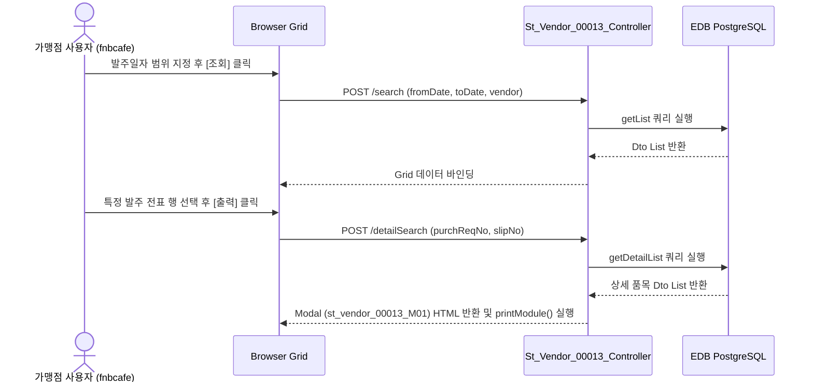

# St_Vendor_00013 — 검수서 출력 단위 테스트케이스

> **대상 화면**: [ST] 매입발주 > 매입현황 > 검수서 출력 (`st_vendor_00013`)  
> **API Base URL**: `POST /backoffice/data/st/vendor/st_vendor_00013`  
> **트랜잭션 설정**: `@Transactional(rollbackFor = {RuntimeException.class, Exception.class})` (조회성이나 기본 설정 적용)  
> **데이터 수신 방식**: `@RequestBody Map<String, Object> commandMap` (전 엔드포인트 공통)  
> **DB 영향도**: **단순 조회(SELECT)만 수행**하며, CUD(등록/수정/삭제) 작업이 발생하지 않음. 관련 프로시저 및 트리거 연쇄 없음.

---

## 1. 테스트 선행 및 세션 조건

| 세션 변수명 | 필요성 | 데이터 예시 | 비고 |
| :--- | :--- | :--- | :--- |
| `chainNo` | **필수** | `C001` (HMS F&B 체인) | 로그인 사용자의 소속 체인 번호 (Controller 자동 바인딩) |
| `msNo` | **필수** | `NC0007` (CAFE 매장) | 로그인 사용자의 가맹점 번호 (Controller 자동 바인딩) |

---

## 2. 엔드포인트 명세 및 쿼리 매핑

| # | URL 엔드포인트 | HTTP Method | 기능 요약 | 데이터 반환 | 연관 테이블 |
| :--- | :--- | :---: | :--- | :--- | :--- |
| 1 | `/search` | POST | 검수서 출력 목록 조회 | `List<St_Vendor_00013_GetCheckPrintDto>` | `OBSLPHTB`, `OBSLPDTB`, `OBREQHTB`, `MVNDRMTB`, `MMEMBSTB` |
| 2 | `/detailSearch` | POST | 검수서 상세 출력 내용 조회 (JSP Modal 렌더링) | `ModelAndView` (st_vendor_00013_M01) | `OBSLPHTB`, `OBSLPDTB`, `OBREQHTB`, `OBREQDTB`, `MGOODSTB`, `MVNDRMTB`, `MMEMBSTB`, `TCHAINTB`, `MNAMEMTB` |

---

## 3. 로직 및 데이터 흐름 구조 (흐름도)

### 3.1 검수서 출력 목록 조회 및 상세 출력 흐름

---

## 4. 소스코드 정적 분석 기반 핵심 포인트

### 🟢 4.1 CUD 및 프로시저/트리거 연쇄 여부
*   **분석 결과**: 본 화면은 발주 및 검수가 완료된 매입 전표(`OBSLPHTB`, `OBSLPDTB`) 내역을 확인하고 인쇄하기 위한 **단순 조회(Select-Only) 화면**입니다.
*   가맹점 마스터(`MVNDRMTB`, `MGOODSTB` 등)에 영향을 주는 Insert, Update, Delete 및 DB 프로시저, 트리거 로직은 본 화면 소스코드 내에서 **호출되거나 발생하지 않음**을 확인했습니다.

### 🟡 4.2 SQL Mapper 내 Oracle 전용 구문 현황
PostgreSQL 마이그레이션 대상 쿼리 중 일부 레거시 문법 요소가 식별되었습니다.
*   **`SUBSTR` 문자열 연산**: `SUBSTR(HD.ORDER_DATE, 0, 4)` 형태로 사용 중 (PostgreSQL 표준인 `SUBSTRING` 혹은 데이트 포맷팅으로 변환 권장).
*   **`NVL` 함수 사용**: `NVL(DT.ORDER_QTY, 0)` 등 (PostgreSQL의 표준 `COALESCE` 함수 등으로 변환되어 사용 중).
*   **`DECODE` 함수 사용**: `DECODE(HD.FICTITIOUS_VAT, 0, '-', '의제')` 등 (PostgreSQL 표준 `CASE WHEN`으로 변환 권장).
*   **`TO_CHAR(SYSDATE, ...)`**: `detailSearch` 쿼리 내 시스템 날짜 함수 호출 `SYSDATE` (PostgreSQL 표준 `CURRENT_TIMESTAMP` 또는 `NOW()` 변환 필요).

---

## 5. 상세 테스트케이스 (Unit & E2E)

### 5.1 `/search` — 검수서 출력 목록 조회

| TC ID | 테스트 시나리오 | 입력 데이터 (JSON Body) | 세션 조건 | 기대 결과 | 판정 기준 |
| :--- | :--- | :--- | :--- | :--- | :---: |
| **TC-101** | 정상 기간 데이터 조회 | `{"fromDate":"20240201","toDate":"20240201","vendor":""}` | `chainNo="C001"`, `msNo="NC0007"` | HTTP 200, 해당 일자 매장 발주 전표 3건 반환 | `List.length == 3` |
| **TC-102** | 거래처 필터 지정 조회 | `{"fromDate":"20240201","toDate":"20240201","vendor":"000001"}` | `chainNo="C001"`, `msNo="NC0007"` | HTTP 200, 삼성웰스토리 거래처 데이터만 정상 조회 | `List[0].vendorNm == '삼성웰스토리'` |
| **TC-103** | 데이터가 없는 범위 조회 | `{"fromDate":"20200101","toDate":"20200101","vendor":""}` | `chainNo="C001"`, `msNo="NC0007"` | HTTP 200, 조회 결과 없음 반환 | `List.length == 0` |

### 5.2 `/detailSearch` — 검수서 상세 팝업 출력

| TC ID | 테스트 시나리오 | 입력 데이터 (JSON Body) | 세션 조건 | 기대 결과 | 판정 기준 |
| :--- | :--- | :--- | :--- | :--- | :---: |
| **TC-201** | 정상 전표 상세 출력 | `{"purchReqNo":"240201000701","slipNo":"0001"}` | `chainNo="C001"`, `msNo="NC0007"` | HTTP 200, 렌더링된 modal HTML 반환, 발주 품목 상세 노출 | HTML 내 `T0000011` 품목 포함 |
| **TC-202** | 전표 체크 없이 출력 시도 | `getSelections()` empty 상태 | `chainNo="C001"` | 화면 상에서 "출력할 발주건을 체크하여 주십시오." 경고 노출 | Bootbox Alert 경고창 확인 |
